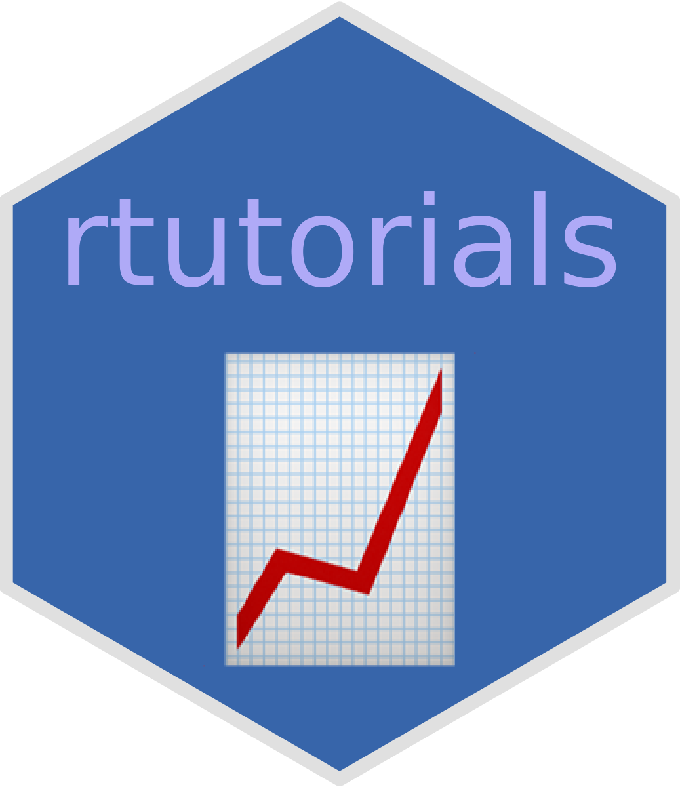
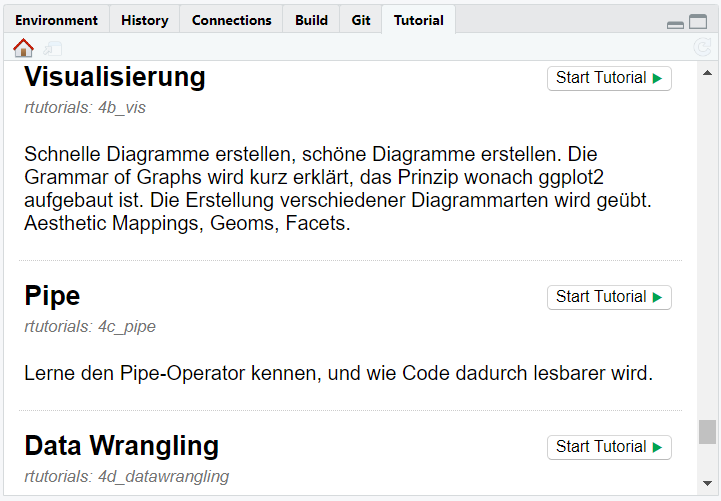

<!-- README.md is generated from README.Rmd. Please edit that file -->

# rtutorials <a href="https://github.com/statisti-lehre/rtutorials"></a>

<!-- badges: start -->

[](https://github.com/statistik-lehre/rtutorials/actions/workflows/R-CMD-check.yaml)

[](https://github.com/statistik-lehre/rtutorials/actions/workflows/tutorial_rendertest.yaml)

<!-- badges: end -->

By installing this package, you add 17 handcrafted lessons to your
RStudio Tutorials Pane. Get to know basic statistics and R interactively
and self paced.

- **Language**: German

- **Audience**: Written for statistic newbies, in our case 3rd semester
  bachelor students of environmental and civil engineering

### Quick Start / Installation

**Prerequisites**: R + RStudio installed

Copy the following code into your RStudio [console
pane](https://cengel.github.io/R-intro/backgroud.html#rstudio-console-and-command-prompt)
and hit Enter.

``` r
install.packages(c("devtools", "learnr"))
devtools::install_github("statistik-lehre/rtutorials")
```

<details>
<summary style="cursor:pointer;">
Installation Error Help
</summary>

**Error**: If R reports an error like

    Error in
    utils::download.file(url, path, method = method, quiet = quiet, :
    Herunterladen von
    ‘<https://api.github.com/repos/statistik-lehre/rtutorials/tarball/HEAD>’
    fehlgeschlagen

this could be due to the large size of the package in relation to your
download speed. `install_github()` has a default timeout of 60 seconds.
Set a longer timeout with the command below and retry the installation.

``` r
options(timeout = 9999999)
devtools::install_github("statistik-lehre/rtutorials")
```

**Error**: Another error, although more uncommon looks like this:

    Timeout was reached: [api.github.com] Resolving timed out after 10000 milliseconds

Solution: Try to connect to the internet. If you are connected, wait a
few minutes and try again. Likely, this error occurs because you hit the
download rate limit of the GitHub API, e.g. installed too many large
packages from GitHub in a short period of time.

</details>

## Contents

All tutorials are in German. Here are the titles translated to English
for the convenience of the English readers.

Note that tutorials are being written and published step by step, the
list below includes planned tutorials as well. Look at `inst/tutorials`
in the main branch, it is the most up to date way of finding out what is
published at the moment.

| Tutorial Subject                  | Tutorial name        |
|-----------------------------------|----------------------|
| Introduction                      | `1a_intro`           |
| Exploring Functions and Arguments | `1b_funktionen`      |
| Scientific Process                | `1c_prozess`         |
| Vectors                           | `2a_vektoren`        |
| Indexing                          | `2b_indizierung`     |
| Data Frames                       | `2c_dataframes`      |
| Data Import                       | `3a_import`          |
| Scales and Factors                | `3b_skalen`          |
| Measures of Central Tendency      | `3c_zentraletendenz` |
| Measures of Spread                | `4a_dispersion`      |
| Visualization using `ggplot2`     | `4b_vis`             |
| The Pipe Operator                 | `4c_pipe`            |
| Data Wrangling                    | `4d_datawrangling`   |
| Sampling                          | `5a_sampling`        |
| t-tests                           | `5b_ttest`           |
| Correlations                      | `6a_korrelationen`   |
| Simple Linear Regression          | `6b_regression`      |

## Accessing the tutorials

**The graphical way**

In RStudio, you will see a tutorials tab in the top right. Click it to
select from different tutorials and start them. You will see all
tutorials of all different packages, including example tutorials from
the `learnr` package.

It might require an RStudio restart until the tutorials of the
`rtutorials` package appear.

Click “Start Tutorial” to learn interactively. That’s it!



Below is some code which achieves the same thing without a navigating a
click- and scrollable menu surface.

**The command way**

To list all available tutorials from `rtutorials`:
<!--Note that devtools::build_readme falsely includes the template tutorial, so just use the Knit buttton to build this and have the most recent official rtutorials package version installed on your machine. -->

``` r
learnr::available_tutorials(package = "rtutorials")
#> Available tutorials:
#> * rtutorials
#>   - 1a_intro           : "Einführung"
#>   - 1b_funktionen      : "Funktionen erkunden"
#>   - 1c_prozess         : "Wissenschaftlicher Prozess"
#>   - 2a_vektoren        : "Vektoren"
#>   - 2b_indizierung     : "Indizierung bei Vektoren"
#>   - 2c_dataframes      : "Arbeit mit Tabellen"
#>   - 3a_import          : "Datenimport"
#>   - 3b_skalen          : "Skalenniveaus"
#>   - 3c_zentraletendenz : "Maße der zentralen Tendenz"
#>   - 4a_dispersion      : "Dispersionsmaße"
#>   - 4b_vis             : "Visualisierung"
#>   - 4c_pipe            : "Pipe"
#>   - 4d_datawrangling   : "Data Wrangling"
#>   - 5a_sampling        : "Stichprobenkennwerteverteilung"
#>   - 5b_ttest           : "t-Tests"
#>   - 6a_korrelationen   : "Korrelationen"
#>   - 6b_regression      : "Regression"
```

And to run the individual tutorials, run:

``` r
learnr::run_tutorial("name", package = "rtutorials")
```

For example:

``` r
learnr::run_tutorial("1a_intro", package = "rtutorials")
```

## Contributing

Feedback and contributions are welcome!

If you spot a typo, some incorrect content or see just a better way to
do it, you are welcome to collaborate. Either report it as an issue or
even better, fix it yourself!

Fork the repo, contribute and please submit your changes with a pull
request.

The tutorial source code is found at `inst/tutorials/…/….Rmd`.

A **template tutorial** for the stylings we use is found at
`inst/tutorials/template`, but not included in the built package.

For more in depth guidelines on `learnr` tutorials, check out the
[`learnr`](https://rstudio.github.io/learnr/) documentation.

Also, we try to maintain a set of `good first issues` that helps you get
started with contributing to this project.

## License

We would be happy to hear from you if you want to modify or redistribute
the contents of this course.

This software comes to you with an OpenSource license, because we are
fond believers in the strength of commons.

However, the use is restricted to noncommercial purposes and only
applies to the contents of this repository. Other course materials that
you may get as one of our students are subject to copyright.

## Authorship

The tutorials are written by Lukas Bruelheide, Gesa Graf and Marie
Klosterkamp, who is also leading the project.

## Funding

Kassel University, HessenHub, 2022 - 2024
