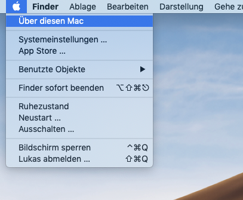
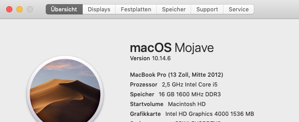
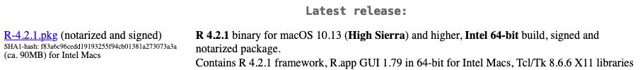
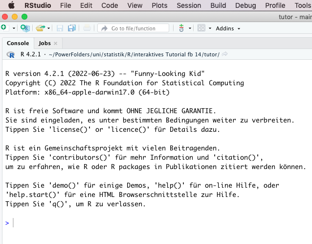

```{r setup, include=FALSE}
library(learnr)
knitr::opts_chunk$set(echo = FALSE)
```

## Willkommen

Liebe Studierende, herzlich willkommen zur R-Übung der Statistik-Vorlesung.\
Ich freue mich, dass Sie den Weg hierher gefunden haben.

Wir haben uns für dieses Format des interaktiven Tutorials entschieden, da es einige der Vorteile von Online-Lehre beibehält.

::: vorteile
-   eigenes Lerntempo
-   Material immer wieder ansehen können
-   praktisches Lernen mit interaktiven Codeblöcken
:::

\
Nichtsdestotrotz ist es mir ein Anliegen, Sie bei allen Schritten persönlich unterstützen zu können.\
Es gibt ein Tutorium, wo wir gemeinsam mit R experimentieren können. Ich lade Sie herzlich ein, daran teilzunehmen.\
Zudem bin ich für alle Fragen über meine Email-Adresse erreichbar:\
[lukas.bruelheide\@student.uni-kassel.de](mailto:lukas.bruelheide@student.uni-kassel.de){.email}

### Codeblöcke

Innerhalb der Tutorials wird es interaktive Code-Blöcke geben. So könnt ihr mit neu gelernten Konzepten direkt experimentieren.

Hier ein kleines Beispiel:\
Probieren Sie, den Computer ein paar Rechenaufgaben lösen zu lassen!\
Schreiben Sie in das Codefeld und führen Sie den Code aus mit `▶ Code ausführen`.\
Es gibt zu jeder Aufgabe auch Tipps. Klicken Sie dafür auf den Button 💡`Tipp`

::: {#first-hint}
**Tip**\
Die Programmiersprache R kann wie ein Taschenrechner benutzt werden.

-   `*` Multiplikation
-   `/` Division
-   `+` Addition
-   `-` Subtraktion

**Syntax**\
Als Dezimaltrennzeichen akzeptiert R nur den Punkt `.`\
Das Komma `,` ist für Aufzählungen reserviert, dazu kommen wir im nächsten Tutorial.
:::

```{r first-solution}
5 * 5   # Multiplikation
1 / 0.5 # Division
1 + 1   # Addition
2 - 2   # Subtraktion
```

```{r first, exercise = TRUE}
1 / 0.5
```

::: infobox
**Guter Stil**\
Es gilt als guter Stil:

-   Operatoren wie `+`, `-`, `=` auf beiden Seiten mit Leerzeichen zu umgeben.

    -   z.B. `5 + 5`
:::

### Voraussetzungen und Ziele

::: grau-nb
+-----------------------------------------+-----------------------------------------------+
| Voraussetzungen                         | Ziele                                         |
+=========================================+===============================================+
| Grundkenntnisse im Umgang mit Computern | • Wozu Datenanalyse und Programmiersprachen?\ |
|                                         | • R installieren                              |
+-----------------------------------------+-----------------------------------------------+
:::

## Datenanalyse und Programmiersprachen

## Warum R?

Hier sind einige Gründe, die dafür sprechen R zu lernen:

##### Vorteile

::: vorteile
-   open-source (das heißt, der Quellcode ist frei verfügbar)

    -   kostenfrei
    -   wird kollektiv gepflegt und weiterentwickelt von enthusiastischen Menschen
    -   modular erweiterbar mit Paketen aus der Community
    -   alle können mitwirken
    -   sehr viel gut strukturiertes frei verfügbares Wissen in Dokumentationen, Foren und Büchern\

-   übertragbare Fähigkeiten:

    -   Kenntnisse in R erleichtern es, andere Programmiersprachen zu lernen
    -   nicht-proprietäre Software kann auch nach der Uni genutzt werden
    -   ist mehr Menschen zugänglich\
        (eine SPSS-Lizenz für Privatpersonen kostet zur Zeit 1200€ im Jahr)
    -   Standard in Wissenschaft und Wirtschaft\
        (z.B. Google und AirBnB nutzen R für Datenanalyse)
:::

##### Nachteile

::: rot
-   Benutzeroberfläche: Das Erlernen von Code kann abschreckend wirken für Menschen, die bisher noch keine Erfahrung damit haben.\
    R-Studio bietet aber eine gute visuelle Oberfläche an, was diesen Punkt etwas mildert.
:::

## Installation

Um R auf eurem Computer zu benutzen, braucht es zwei Komponenten.

::: grau-nb
|  |  |
|------------------------------|--------------------------------------------|
| Kernprogramm                 | visuelle Oberfläche                        |
| Maschine                     | Steuerung                                  |
| Basic                        | Komfort                                    |
:::

In Wahrheit funktioniert R auch ohne R-Studio. Aber das ist etwas unkomfortabel.

Stellen Sie sich R als einen Airbus vor, und R-Studio als das Cockpit.\
Aus dem Cockpit kann das Flugzeug komfortabel gesteuert werden, mit vielen hilfreichen Features wie Autopilot und GPS.\
R ist die Maschine, die Turbinen, das Innere, und R Studio ist eine visuelle Umgebung, für die Kommunikation mit Menschen konzipiert, von wo aus wir R ansteuern können.

<p align="center">

         

</p>

<!-- {width="50%"}  {width="50%"} -->

::: infobox
<p>

Wichtig ist, dass zuerst **R** installiert wird, und danach **R-Studio**.

</p>
:::

------------------------------------------------------------------------

### 1.  {.tabset .tabset-fade}

Wir können R beim "Comprehensive R Archive Network" herunterladen, kurz **CRAN**.

1.  <https://cran.rstudio.com/> besuchen\
2.  Betriebssystem auswählen

#### Windows

3.  [Install R for the first time](https://ftp.gwdg.de/pub/misc/cran/bin/windows/base/) anklicken\
4.  [Installer herunterladen](https://ftp.gwdg.de/pub/misc/cran/bin/windows/base/R-4.2.1-win.exe) und ausführen.\
5.  Bei der Installation bitte die Standardeinstellungen beibehalten und nicht in benutzerdefinierte Verzeichnisse installieren.

------------------------------------------------------------------------

#### Mac

3.  Die eigene MacOS-Version und den Typ des Prozessors herausfinden:

    

    Version und Prozessortyp ablesen (in meinem Fall macOS 10.14 und Intel-Prozessor)

    

    (Die allermeisten Macs haben einen Intel-Prozessor. Modelle ab 2020 können einen AppleSilicon-Prozessor haben.)

4.  Im Abschnitt `Latest release` die passende Version finden.

    In meinem Fall wäre das die oberste Version für Intel-Prozessoren.\
    Mein macOS 10.14 wird gerade so noch unterstützt.\
    Für ältere Macs werden aber auch frühere R-Versionen zur Verfügung gestellt.\
    

5.  Die [.pkg](https://ftp.gwdg.de/pub/misc/cran/bin/macosx/base/R-4.2.1.pkg)-Datei herunterladen und ausführen.\

6.  Während der Installation alle Standardeinstellungen beibehalten. Bitte keine benutzerdefinierten Verzeichnisse angeben.

7.  Fertig, jetzt nur noch R-Studio installieren, siehe nächster Abschnitt.

------------------------------------------------------------------------

#### Linux

-   Linux-Distribution auswählen und den gut dokumentierten Installationsanweisungen folgen

------------------------------------------------------------------------

### 2. 

1.  <https://www.rstudio.com/products/rstudio/download/#download> besuchen.\
    Die richtige Version sollte automatisch vorgeschlagen werden.
2.  Laden Sie den Installer herunter und folgen Sie den Installationsanweisungen.

<details>

<summary>

Für alle mit alten PCs: hier klicken

</summary>

[R-Studio für ältere Betriebssysteme](https://www.rstudio.com/products/rstudio/older-versions/#rstudio-desktop)

| Version                                                                | Windows | MacOS  | Ubuntu  | RedHat | Architektur |
|------------------------------------------------------------------------|---------|--------|---------|--------|-------------|
| 0.98                                                                   | XP+     | 10.6+  | 10 - 14 | 6+     | x86, x64    |
| 0.99                                                                   | 7+      | 10.6+  | 12 - 14 | 6+     | x86, x64    |
| 1.0                                                                    | 7+      | 10.6+  | 12 - 14 | 7+     | x86, x64    |
| 1.1                                                                    | 7+      | 10.6+  | 12+     | 7+     | x86, x64    |
| 1.2                                                                    | 7+      | 10.11+ | 14+     | 7+     | x64         |
| [1.4](https://www.rstudio.com/products/rstudio/older-versions/#141743) | 7+      | 10.12+ | 14 - 20 | 7+     | x64         |
| [2021.09.2](https://dailies.rstudio.com/version/2021.09.2+382.pro1/)   | 10+     | 10.13+ | 18 - 20 | 7+     | x64         |

</details>

------------------------------------------------------------------------

### Tablets

Für alle, die z. B. mit einem Tablet teilnehmen, keinen Computer haben, oder auf deren Computer sich kein R installieren lässt, gibt es auch eine web-basierte Anwendung, die sich im Browser öffnen lässt.

1.  <https://rstudio.cloud/plans/free> aufrufen
2.  **Sign up** anklicken
3.  Account erstellen
4.  ein neues Projekt erstellen

## R-Studio testen

### Hat bei der Installation alles geklappt?

Öfnen Sie R-Studio.\
Vielleicht fühlt es sich jetzt wirklich an, als seien Sie im Cockpit eines Airbus. Viele Knöpfe unbekannter Funktion, Panels, Menüs und Symbole.

Hat R-Studio die Installation von R erkannt? Besser gesagt, gibt es auch wirklich einen Airbus hinter Ihrem Cockpit?\
Wenn ja, erkennt R-Studio dass eine R-Version installiert ist. Das sollte es in etwas so aussehen:\
\
Probieren Sie ein paar Rechenaufgaben, um zu testen ob alles klappt!

Sollte R nicht erkannt werden oder eine sonstige Fehlermeldung erscheinen, bin ich gerne behilflich bei der Lösung. Machen Sie dafür bitte einen Screenshot und wenden sich an mich per [Email](mailto:lukas.bruelheide@student.uni-kassel.de){.email}.

### Vorbereitung nächstes Thema

Im nächsten Tutorial geht es in R-Studio weiter.

```{r, eval=FALSE}
install.packages("remotes")
remotes::install_github("statistik-lehre/tutor")
library(tutor)
```

### Literaturverzeichnis
