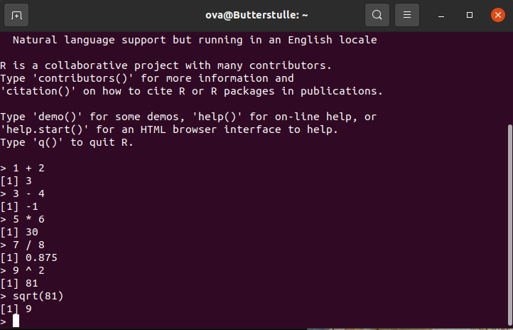
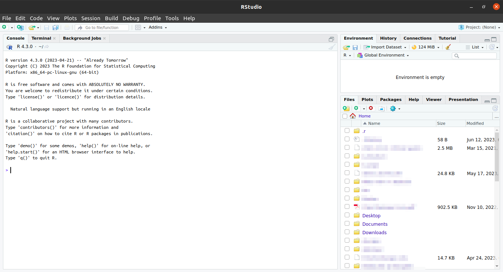
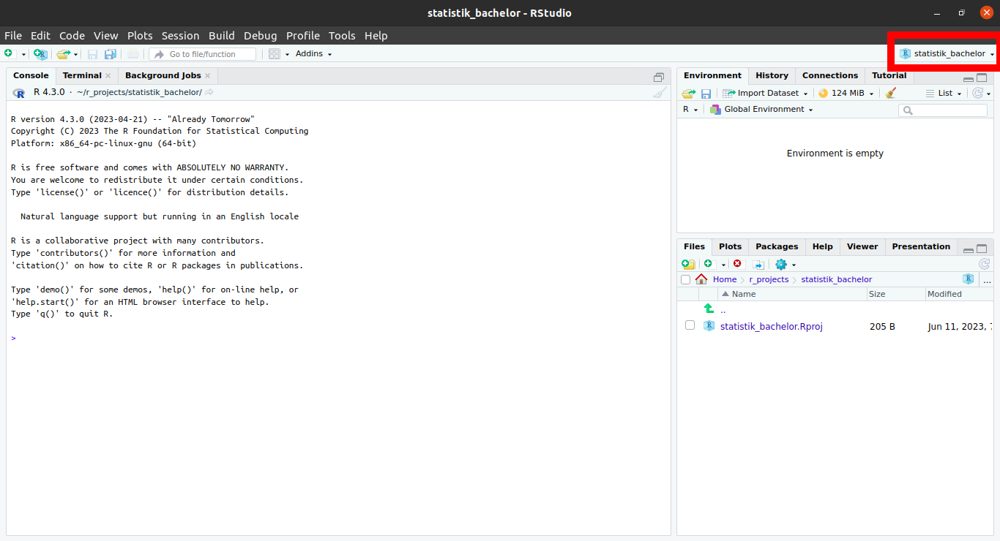
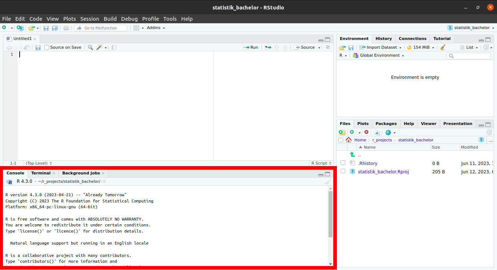
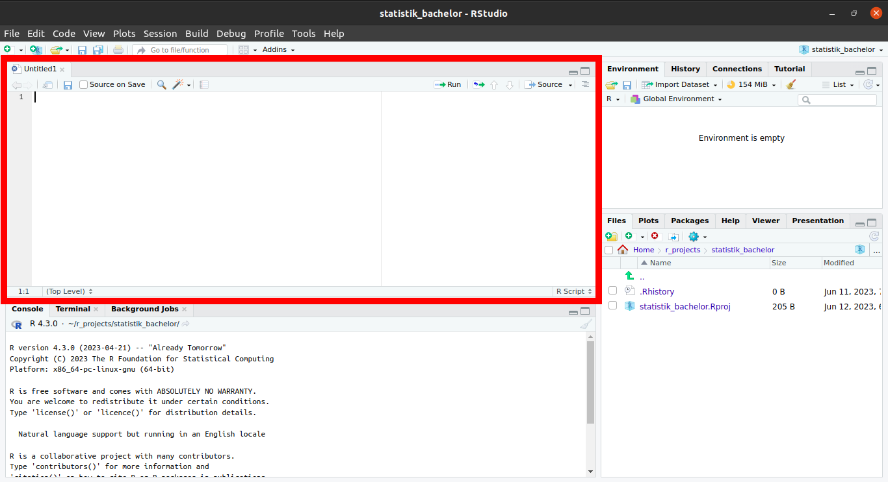
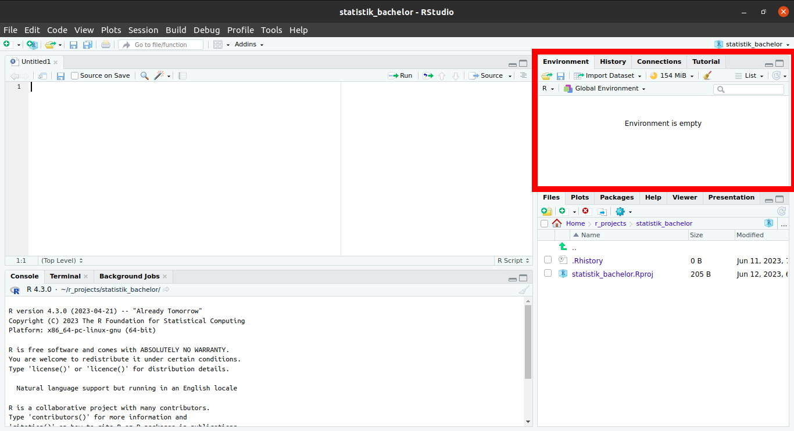
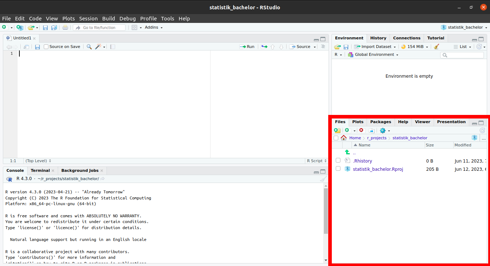

```{r setup, include=FALSE}
library(learnr)
knitr::opts_chunk$set(echo = FALSE)
```

## Lernziele

-   <input type="checkbox" unchecked> Bereits geleistetes feiern </input>
-   <input type="checkbox" unchecked> Überblick über den Aufbau dieses Kurses bekommen </input>
-   <input type="checkbox" unchecked> Überblick über R Tutorials bekommen </input>
-   <input type="checkbox" unchecked> Überblick über R und R Studio bekommen </input>
-   <input type="checkbox" unchecked> Projekt `Statistik-bachelor-bachelor` erstellen </input>
-   <input type="checkbox" unchecked> Skript `01_einfuehrung` erstellen und kompilieren </input>


## Herzlich Willkommen

Moin!

Wunderbar, dass Du hierher gefunden hast! Das bedeutet, dass Du die Anfangsschwierigkeiten bereits hervorragend gemeistert hast:

-   <input type="checkbox" checked> R installieren </input>
-   <input type="checkbox" checked> R Studio installieren </input>
-   <input type="checkbox" checked> R Studio öffnen </input>
-   <input type="checkbox" checked> wichtige Pakete installieren </input>
-   <input type="checkbox" checked> dieses Tutorial finden UND öffnen </input>

{width=80%}

### Über den Kurs

Wir freuen uns total, euch R und Statistik in diesem Format beibringen zu können, da wir es für einen übersichtlichen und eleganten Weg halten. Ihr könnt in eurem Tempo lernen und die Tutorials auch auf eurem weiteren Weg immer als Nachschlagewerk verwenden. 

Diese Tutorials sind frei verfügbar, da der Quellcode auf der Plattform [GitHub](https://github.com/statistik-lehre/rtutorials.git) veröffentlicht ist. 

#### Feedback

Sollte etwas nicht funktionieren, fehlt etwas, sollten Tippfehler auftauchen oder andere Probleme, möchten wir als Autor*innen darum bitten, uns das mitzuteilen. Auch Verbesserungsvorschläge nehmen wir gerne entgegen.

Der beste Weg dafür ist, über diesen [Link Issues direkt auf GitHub zu erstellen](https://github.com/statistik-lehre/rtutorials/issues/new/choose), wo der Quellcode liegt, was allerdings einen Account benötigt bei GitHub. Ist das zu umständlich, einfach eine [Email](mailto:lukas.bruelheide@student.uni-kassel.de) senden.

#### Autor*innen

Die Entwicklung wurde 2022 - 2023 im Rahmen eines Förderprojekts für digitale Lehre von HessenHub und der Universität Kassel finanziert.

An der Entwicklung haben Lukas Bruelheide und Gesa Graf mitgewirkt und Marie Klosterkamp hat die Tutorials inhaltlich überprüft. 

### Aufbau

Die Tutorials sind alle gleich aufgebaut:

-   **Lernziele**: Damit ihr wisst, worauf ihr beim Bearbeiten dieses Tutorials besonders achten könnt
-   **Inhalte**: Die eigentlichen Inhalte
-   **Abschlussquiz**: Was von dem, was wir wichtig finden ist hängen geblieben?
-   **Learnings**: Knappe Zusammenfassung des Kapitels

### interaktive Codeblöcke

Der Grund, warum wir diese Tutorials interaktiv nennen: Sie enthalten ausführbare Code-Blöcke, deren Inhalt Sie bearbeiten können.

Schreib Deinen Code hinein und führe ihn aus mit `Strg + Enter` oder dem Knopf `▶ Code ausführen`.\
Es gibt zu jeder Aufgabe auch Tipps oder Lösungen. Klicke dafür auf den Button 💡`Tipp` oder `Lösung`.

::: aufgabe
**Aufgabe:**\
Ändere die Rechnung in 2 + 3
:::

```{r template, exercise = TRUE}
1 + 1
```

```{r template-solution}
2 + 3
```

Die meisten Aufgaben in diesem Kurs sind direkt im jeweiligen Tutorial in den entsprechenden Code-Chunks zu lösen. Du findest sie in den **<span style="color: #957dad;">fliederfarbenen Kästen</span>** (s.o.).

Es wird auch einige wenige Aufgaben geben, für die Du bitte in R wechselst. Diese Aufgaben findest Du in den **<span style="color: #95AD7D;">hellgrünen Kästen</span>** (s.u.).

Nun kommen wir zur Magie:

{width=50%}

## R Demo

Bevor wir weiter etwas über R erzählen, möchten wir euch einfach zeigen was alles möglich ist. Eine klassische Aufgabe ist das Sortieren, Zusammenfassen und Visualisieren von großen Datenmengen. 

### R Demo 1: Visualisierung von Mobilitätsdaten

Angenommen, wir sind interessiert an den Auswirkungen des Corona-Virus auf die Fahrgastzahlen. Unsere Forschungshypothese ist, dass die Fahrgastzahlen während der Pandemie zurückgegangen sind (*obviously*).
Wir nehmen Sie nun mit durch einen stark verkürzten Analyseprozess. Führen Sie die jeweiligen Codeblöcke aus

Wir nutzen zur Überprüfung frei verfügbare Daten vom statistischen Bundesamt, welche die Nutzung verschiedener Arten des Personennahverkehrs in Deutschland von 2004 bis 2022 beschreibt. Der Datensatz kann mit `publictr` aufgerufen werden.  

### Überblick über die Daten
Lassen wir uns zunächst den Datensatz anzeigen, um einen Überblick zu bekommen. 

```{r data, exercise = T}
as_tibble(publictr) |> print(n = 25)

```
Wir sehen sehr viele Datenpunkte in einem langen Format. Die Daten sind für Menschen schlecht lesbar, für den Computer allerdings ideal arrangiert. Das bedeutet, jede Zeile steht für genau eine Beobachtung, und jede Spalte repräsentiert eine Variable (auch Merkmal genannt), welche verschiedene Ausprägungen haben kann.


### Auswahl der Daten
Da wir uns für den ÖPNV insgesamt interessieren, und weniger für einzelne Verkehrsmittel, können wir den Datendschungel etwas lichten. 

Wir möchten alle Daten behalten, wo die Variable *Typ* die Ausprägung *Liniennahverkehr insgesamt* aufweist.

Dafür benutzen wir `filter()` aus dem Paket `dplyr`, welches im tidyverse enthalten ist.
`dplyr` steht für "data plyers", was so viel bedeutet wie "Datenzange". Ein Werkzeug, um bestimmte Daten herauszuziehen.

```{r filter, exercise = TRUE}
x <- filter(publictr, Typ == "Liniennahverkehr insgesamt")
x
```
Nun sind wir dem Ziel näher. Um nur die Jahre 2018 bis 2022 anzuzeigen, nutzen wir
ebenfalls `filter()`. Dieses Mal aber bezogen auf die Variable _Jahr_. Der Operator
`%in%` ist dem `==` Gleichheitszeichen ähnlich, und ist hier nötig, da `2018:2019`
mehr als einen Wert enthält. `==` kann nur einen einzigen Wert gegen einen anderen prüfen,
während `%in%` mit mehreren Werten auf beiden Seiten umgehen kann.

```{r filter2-setup, echo = FALSE}
x <- filter(publictr, Typ == "Liniennahverkehr insgesamt")
```

```{r filter2, exercise = TRUE}
x <- filter(x, Jahr %in% 2018:2021)
x
```
Sehr gut! 

Nun können wir eine Grafik erstellen, um die Zahlen zu veranschaulichen.
Dazu nutzen wir `ggplot2`.

```{r visual-setup}
x <- publictr %>%
  filter( Typ == "Liniennahverkehr insgesamt") %>%
  filter(Jahr %in% 2018:2021)

```

```{r visual, exercise = TRUE}
ggplot(x, aes(x = Quartal, y = Personen), ) +
  geom_bar(stat = "identity", fill ="blue", alpha = 0.5) +
  labs(title = "Personennahverkehr in Deutschland", x = "", y = "Fahrgastzahlen") +
  theme(axis.text.x = element_text(angle = 45, hjust = 1))

```
Wie hier zu erkennen ist, spiegelt sich der erste Lockdown Anfang 2020 auch in der
Beförderungsleistung des ÖPNV wieder. 

### R

R ist im Grunde ein sehr potenter Taschenrechner, der große Mengen an Daten verarbeiten und simulieren kann, schöne Grafiken und sogar diese Tutorials erstellen kann. Über das, was Dein Schultaschenrechner kann (selbst wenn es einer von denen mit grafischer Funktion ist), kann R also nur müde lächeln. Und hier, im echten Leben, haben wir es eben mit großen Datenmengen zu tun.

Das Problem: R ist von Nerds für Nerds geschrieben, läuft ganz unauffällig ohne eine grafische Benutzeroberfläche in der Konsole und sieht in seiner Roh-Fassung ungefähr so aus:

{width=100%}

Und das wird, spätestens wenn der Bildschirm voll ist, unübersichtlich. 

Und hier kommt R Studio ins Spiel. R Studio ist für die Menschen, die gerne die Power von R nutzen möchten und für ihre Programme gerne eine grafische Oberfläche nutzen. Wir werden nur in R Studio arbeiten.

### R Studio

Wenn Du R-Studio öffnest sieht das ungefähr so aus:

{width=100}

Das sieht erstmal viel und unübersichtlich aus. Aber wir brauchen (erstmal) nur einen ganz kleinen Teil davon. Und den erkläre ich dir jetzt Schritt für Schritt.


#### Einmalig am Anfang: Projekte

In RStudio gibt es die Möglichkeit, „Projekte“ zu erstellen. Das ist dann (wie) ein Ordner, in dem Du alles, was Du für dieses Projekt benötigst (Daten, Skripte, Plots, Tabellen, Bilder etc. [unten mehr dazu]) speichern und sammeln kannst.

Im Unialltag empfinde ich es als sehr hilfreich, für jedes entsprechende Modul ein eigenes Projekt anzulegen (also: statistik-bachelor im Bachelor, statistik-master im Master, etc.). Solltest Du in die Forschung gehen wollen oder bereits Forschungsprojekte im Studium umsetzen empfiehlt es sich, auch hierfür jeweils eigene Projekte anzulegen. Wichtig ist dann, dass du schaust, immer im richtigen Projekt zu arbeiten.

Ein Projekt erstellst du: Project: (None) > New Project... > New Directory > New Project > *Directory name:* > Create Project

{width=100%}

::: aufgaberstudio
**Aufgabe:**\
Erstelle in R Studio ein Projekt mit dem Namen `Statistik-bachelor`! 

Dabei wirst du zunächst gewarnt, dass noch ein Job im Hintergrund ausgeführt wird, nämlich dieses Tutorial. Klick auf "Terminate", das Tutorial wird dadurch beendet. Ruf das Tutorial wieder auf, wenn du das Projekt erstellt hast. 

(Die Aufgabe gilt nicht für diejenigen, die RStudio in der Cloud nutzen: diese Personen mussten bereits ein Projekt erstellen um überhaupt RStudios Benutzeroberfläche zu sehen.)
:::

Wenn du erfolgreich warst steht nun ganz oben rechts Dein Projektname:

{width=100%}


#### (Fast) immer am Anfang: Skripte

Glückwunsch, du hast nun ein Projekt eingerichtet. (Sicherheitscheck: steht oben rechts `Statistik-bachelor`?)

Jetzt brauchen wir nur noch ein `Skript`.

Das öffnest Du: oben, ganz links (New File) > R Skript


Skripte sind wie einzelne Blätter/ Unterlagen in einer Sammelmappe (= "Projekt").

So, jetzt ist alles da, was wir für die nächsten Schritte brauchen. 

Und nun schauen wir erstmal, was du da im Einzelnen zu sehen ist. (Wir beschränken uns dabei auf die Aspekte, die Du in nächster Zeit brauchen wirst.)

#### Konsole

**Unten links** findest Du die `Konsole`:



Dieses Fenster entspricht der Konsole / Terminal beim Rechner (so.). Dies ist der "Taschenrechner", hier findet das *Rechnen* statt.

::: aufgaberstudio
**Aufgabe:**\
Gib in deiner Konsole verschiedene Rechnungen ein (Addition, Subtraktion etc.) und drücke auf `Enter`. Mache dich auf diese Art mit der Funktionsweise und Optik der Konsole vertraut.
:::

</br>

::: infobox
**Syntax-basics:**\

-   Das Dezimaltrennzeichen ist ein Punkt `.`
-   Für Aufzählungen (von Argumenten, anderes Tutorial) wird ein Komma `,` genutzt

:::

#### Skripteditor

**Oben links** findest du ein multifunktionales Fenster, was sich nur öffnet wenn ein Skript geladen ist oder eine Tabelle angezeigt wird. 



Mit Code in einem Skript passiert erst mal gar nichts.
Erst wenn Du auf `Strg + Enter` drückst wird die betreffende Zeile für dich in die Konsole kopiert, hier ausgeführt und das Ergebnis angezeigt.

Diese Aufteilung ist total sinnvoll, da sie es ermöglicht, in der Textdatei oben die Übersicht zu behalten. Du kannst hier auch Kommentare einfügen. So kannst Du auch später noch nachvollziehen, was Du wann in welchem Schritt gemacht hast. Zeitgleich können unten in der Konsole die Berechnungen stattfinden. Im Gegensatz zur reinen Konsole lässt sich die Textdatei speichern und es bleibt nachvollziehbar und für weitere Arbeitsschritte nutzbar.

::: aufgaberstudio
**Aufgabe:**\
gib die gleichen Rechenoperationen wie in der Konsole oben in dem Skript ein. Drücke in jeder Zeile `Strg` + `Enter`. Schau dann unten in die Konsole. Mach dich mit den Gleichheiten und Unterschiedlichkeiten vertraut, die Skript und Konsole haben.
:::

Da du das Skript speicherst, es also später wieder öfnnen und weiternutzen und daran sogar mit anderen teilen / co-worken kannst, empfiehlt es sich sehr (**!!!**), auf einen *guten Stil* (s.u.) zu achten und deine Arbeitsschritte zu *kommentieren*.

::: infobox
**Guter Stil**\
Es gilt als guter Stil:

-   Operatoren wie `+`, `-`, `=` auf beiden Seiten mit Leerzeichen zu umgeben odereswirdanstrengendzulesen.
    -   z.B. `5 + 5`
    
-   Kommata haben gerne, (wie in der gewohnten Schriftsprache) ein Leerzeichen hinter sich
-   Kommentare: Für die inhaltliche Verständlichkeit ist es hilfreich, den geschriebenen Code zu kommentieren. Dies geschieht mit einem `#`
    -   z.B.: 
        -   `5 + 5     # Addition`
    -   oder:
        -   ` # Addition`
        -   ` 5 + 5`
:::

</br>


::: aufgaberstudio
**Aufgaben:**\

1.    Gib deinem Dokument einen Titel (`#### Titel ####`)
2.    Kommentiere deine Rechenoperationen (`#`)
3.    Speichere Dein Skript (`Strg` + `s`) und nenne es: `01_einfuehrung`
4.    Kompiliere dein Skript als `.docx`
:::

Und ein letztes zu den Skripten und warum sie wunderbar sind: Sie lassen sich inkl. Ergebnisse in `Reports` bringen: Hier sind die Einzelnen Befehle, Kommentare UND Ergebnisse (inkl. Plots) zusammengefasst. Das macht es schön und übersichtlich. Meine Empfehlung ist, wenn ein Skript fertig ist, immer auch einen Report zu kreiern. Da schaust du später lieber rein. Trust me in that.

**ganz oben, ganz links** > File > compile_Report... (> File Name: )> Report output format *MS Word*

::: aufgaberstudio
**Aufgabe:**\
Kompiliere dein Skript.
:::

Das sind dann auch schon die Formate, in denen wir gerne die Studienleistung wollen: Ein Analyseskript `.R` und das gleiche nochmal in kommentiert und kompiliert als `.pdf` oder `.docx`. Das Analyseskript soll durchlaufen. Da geht es um den technischen Aspekt. Wenn es durchläuft schauen wir uns die kommentierte Version an und bewerten den inhaltlichen Aspekt, in dem ihr teilw. Interpretationen vornehmt.\
Extrapunkte gibt es für einen guten Stil in den Skripten und wenn der Code übersichtlich und verständlich kommentiert ist.

#### Skript, Konsole ud diese Tutorials

Dieses Zusammenspiel von Textdatei und Kosole imitieren wir in den oben bereits erwähnten Code-Blöcken:\
Du schreibst etwas in den Block, drückst `Strg` + `Enter` und weiter unten spuckt R dir ein Ergebnis aus. Probier es doch gleich mal aus:

Nutze den `Tipp`-Knopf für Informationen und achte dabei auch auf guten Stil.

::: aufgabe
**Aufgabe:**\
Schreibe / berechne und kommentiere jew. eine:

-   Addition
-   Subtraktion
-   Multiplikation
-   Division
-   Potentierung
-   Quadratwurzel
:::

::: {#first-hint}
**Tipp**\
Die Programmiersprache R kann wie ein Taschenrechner benutzt werden.

-   `*` Multiplikation
-   `/` Division
-   `+` Addition
-   `-` Subtraktion
-   `^` Potention
-   `sqrt()` Quadratwurzel

(... und es gibt noch mehr)

**Kommentare**\
machst Du mit einem `#`. Dann weiß R, das alles dahinterstehende Menschensprache ist

**Syntax**\
Als Dezimaltrennzeichen akzeptiert R nur den Punkt `.`\
:::

```{r first, exercise = TRUE}

```

#### Environment

**Oben rechts** findest Du Deine `Umwelt` bzw. `Environment` und in ihr deine `Objekte`.



Unter dem Reiter **Environment** siehst Du Deine gespeicherten Objekte: Datensätze und Vektoren. Als im Grunde das womit wir arbeiten. Zu Datensätzen gibt es ein eigenes Tutorial.

Den Zusammenhang des bereits vorgestellten kannst Du dir in etwa so vorstellen:

-   **Oben links** (`Skripte`) bestimmst Du eine *Choreografie*. Die steht erstmal nur so auf einem Blatt Papier. Um sie auszuführen brauchst Du:

-   *Tänzer\*innen*: Leute, die das, was Du dir so ausdenkst auch wirklich ausführen. Das sind die `Daten` ("`Objekte`") **oben rechts**. Diese wiederum brauchen zum tanzen einen

-   *Tanzboden*. Diesen Part übernimmt die `Konsole` **unten links**

Der zweite spannende Reiter in diesem Fenster ist **Tutorial**. Hier findest Du unsere und andere Tutorials - auch dieses hier.

#### Viewer

Fehlt nur noch das Fenster **unten rechts**. Ich präsentiere feierlich: Alles was wichtig ist!



Hier sind ziemlich wichtige und hilfreiche Funktionen zusammengefasst, die bisher noch kein anderes zu Hause gefunden haben:

-   Im Reiter `Files` kannst Du nach verschiedenen Dateien suchen und öffnen. Das werden vor allem andere `Skripte` sein. Diese öffnen sich dann im Fenster **oben links**
-   Im Reiter `Plots` werden dir die Grafiken ("`Plots`") angezeigt (späteres Tutorial). Du kannst zwischen den in dieser Sitzung generierten Plots über die Pfeiltasten navigieren
-   Im Reiter `Packages` werden dir Deine installierten Pakete (s.u.) angezeigt. Hier gibt es auch die Möglichkeit, neue zu installieren oder vorhandene zu updaten.
-   Unter `Help` findest Du Erklärungen und Hilfestellungen zu eigentlich jeder Funktion, die Du in R benutzt. Wenn Du zu einer bestimmten Funktion eine Hilfestellung benötigst tippe einfach `?funktion` in die Konsole und drücke `Enter`, schon wird dir die entsprechende Hilfeseite im Viewer angezeigt
-   Im `Viewer`werden bei manchen Funktionen schöne Tabellen und Übersichten ausgegeben.

::: aufgaberstudio
**Aufgabe:**\
Gib in deiner Konsole `?mean` ein und mache dich mit der Hilfe Seite zu dieser Funktion vertraut.
:::

## Abschlussquiz

```{r abschlussquiz_01}
question_checkbox("Ein Komma (,) wird von R verstanden als ein ...",
         answer("... Dezimaltrennzeichen"),
         answer("... Zeichen, um Argumente oder Objekte einer Aufzählung voneinander zu trennen", correct = T), 
         allow_retry = TRUE
         )
```

```{r abschlussquiz_02}
question_checkbox("Als guter Stil gilt:",
         answer("Operatoren mit Leerzeichen zu umgeben", correct = T),
         answer("Möglichst keine Leerzeilen zu lassen, um möglichst viel Code auf einmal zu sehen"),
         answer("Leerzeichen nach einem Komma für bessere Lesbarkeit", correct = T),
         answer("Das Vorgehen möglichst Kleinschrittig kommentieren", correct = T),
         answer("Möglichst wenig Kommentare schreiben, um den Code nicht unnötig lang werden zu lassen"),
         allow_retry = TRUE
         )
```


## Learnings

-   <input type="checkbox" unchecked> Ich habe R Studio geöffnet  </input>
-   <input type="checkbox" unchecked> Ich weiß, was und wo die Konsole in R Studio ist </input>
-   <input type="checkbox" unchecked>  Ich weiß was und wo ein Skript in R Studio ist und wie ich eines erstelle </input>
-   <input type="checkbox" unchecked> Ich weiß, was ein Projekt in R Studio ist und wie ich eines erstelle </input>
-   <input type="checkbox" unchecked> Ich weiß, mit welcher Funktion ich die Dokumentation einzelner Funktionen aufrufen kann, um Informationen über diese zu bekommen </input>
-   <input type="checkbox" unchecked> Ich weiß, was ein guter Stil in R ist </input>
-   <input type="checkbox" unchecked> Ich habe das Projekt `Statistik-bachelor` erstellt </input>
-   <input type="checkbox" unchecked> In diesem Projekt liegt ein Skript namens `01_einfuehrung.R` </input>
-   <input type="checkbox" unchecked> Ebenfalls in diesem Projekt liegt ein kompiliertes Skript namens `01_einfuehrung.docx` </input>
