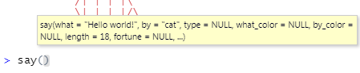
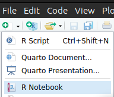
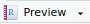

```{r setup, include=FALSE}
library(learnr)
library(ggplot2)
knitr::opts_chunk$set(echo = FALSE)
```

## Was du in diesem Tutorial lernst:

-   Pakete installieren und in die aktive Sitzung laden

-   Der typische Aufbau von Funktionen und Argumenten in R

-   Die Benutzung der Hilfe-Seiten

-   Was sind Skripte? Erstellen und speichern.

-   Code und Outputs zusammen als R Notebooks abspeichern.

## Pakete

Was R so mächtig macht, sind die von der Community veröffentlichten und gepflegten Erweiterungen drum herum. Stand 2023 gibt es knapp 20.000 offiziell veröffentlichte Pakete auf CRAN.
Dieses Akronym steht für *Comprehensive R Archive Network* und ist die offizielle Adresse für geprüfte Erweiterungen. Es sei aber erwähnt, dass es auch noch andere Orte gibt, wo Pakete veröffentlicht werden können, zum Beispiel Bioconductor, GitHub und andere. Deswegen ist die Gesamtzahl aktiv gepflegter Pakete wohl noch höher als 20.000.

Pakete von CRAN reichen für unsere Anwendungszwecke vollkommen aus und können über den einfachen Befehl `install.packages("Paketname")` installiert werden - das ist unkompliziert, du musst keine Internetseiten besuchen, keine Dateien irgendwo hinschieben oder ausführen, das wird alles intern von dieser Funktion erledigt.

```{r cran_packages_reading}
# Für den Fall keiner Internetverbindung
tbl <- rtutorials::cranpacks

# Im Fall einer Internetverbindung die aktuellen Daten holen
# Verlängert die Tutorial-Ladezeit um einige Sekunden!

try({tbl <- rvest::read_html("https://cran.r-project.org/web/packages/available_packages_by_date.html") |>
    rvest::html_table() |>
    purrr::pluck(1) |>
    dplyr::arrange(Date) |>
    dplyr::mutate(id = dplyr::row_number(),
                  date = lubridate::as_date(Date)) |>
    dplyr::select(id, date)},
    silent = TRUE)


current_date <- max(tbl$date) |> format("%d.%m.%Y")
current_message <- paste0("Stand ", current_date, ": ", 
                          prettyNum(nrow(tbl), big.mark = " "), " Pakete")

ggplot(tbl, aes(x = date, y = id)) +
  geom_line() +
  geom_area(fill = "steelblue") +
  theme_bw() +
  #scale_y_log10() +
  labs(title = "Verfügbare Pakete auf CRAN",
       y = "Anzahl",
       x = "Veröffentlichungsdatum",
       subtitle = current_message)
```


### Woraus bestehen Pakete?

Üblicherweise enthalten Pakete neue Funktionen, die das Leben von R-Nutzenden irgendwo erleichtern sollen. Manchmal werden Pakete auch genutzt, um Datensätze bereitzustellen, oder andere, außergewöhnlichere Sachen wie z.B. die interaktiven Tutorials, die du im Moment betrachtst - diese stammen auch aus einem Paket, was wir für dich geschrieben und auf GitHub veröffentlicht haben. 

#### Ein Paket installieren

Wir installieren und nutzen heute ein Paket, um spielerisch den typischen Umgang mit Funktionen in R zu erlernen. 

Es heißt `cowsay` und stellt eine einzige neue Funktion namens `say()` bereit, mit der wir lustige Tiere lustige Dinge sagen lassen können.

Hier im Tutorial musst du das Paket nicht mehr installieren - vermutlich wurdest du gefragt beim Start des Tutorials, ob fehlende Pakete installiert werden sollen. Das solltest du bejahen, und dann erledigt RStudio das automatisch für dich.

Aber solltest du mal eigenständig ein Paket installieren wollen, ist wichtig zu wissen wie es geht:

Der Befehl zum Installieren lautet:

``` r
install.packages("cowsay")
```

Ersetze `cowsay` durch den Namen des gewünschten Pakets.

::: gelb

**Häufige Fehler beim Installieren von Paketen**

1. Achte auf die Anführungszeichen um den Paketnamen!
  
  Eine der häufigsten Fehlerquellen beim Installieren von Paketen sind vergessene Anführungszeichen.

2. `installed.packages()` ist etwas anderes als `install.packages()`!
  
  Ersteres gibt dir eine Liste aller auf dem Gerät installierten Pakete, zweiteres ist das was du brauchst um Pakete zu installieren.
  
3. Du brauchst eine funktionierende Internetverbindung.

:::

<br>

::: grau-nb
Tipp: Dass ein länger dauernder Befehl in der Konsole fertig ausgeführt ist, wie z.B. die Installation eines Pakets, erkennst du daran, dass das rote Stoppzeichen  oben rechts in der Konsole erlischt.
:::

### Das Paket nutzen

Jetzt hast du also ein Paket installiert, nämlich `cowsay`, welches wir in diesem Tutorial nutzen möchten. Nun liegt es mit allen anderen installierten Paketen in einer Art „Bibliothek“ auf deinem Rechner. Um es tatsächlich nutzen zu können, muss der gewünschte Inhalt aus der Bibliothek geholt werden und in die aktive Sitzung geladen werden.

Es gibt zwei Wege, an den Inhalt eines bereits installierten Pakets zu gelangen:

1. Du lädst alles aus dem gesamten Paket in die aktive Sitzung mit `library(Paketname)`.
1. Du addressierst nur bestimmte Inhalte aus dem Paket mit `Paketname::Inhalt`.

Beide Varianten werden dir begegnen. Wobei die erste (`library()`) häufiger ist, weswegen wir uns erst mal diese anschauen.

::: aufgabe

**Aufgabe**

Lade das gesamte Paket `cowsay` in die aktive Sitzung, um im nächsten Schritt Funktionen daraus benutzen zu können!

Verwende dafür die Funktion `library()`.
:::

<br>
```{r lib, exercise = TRUE}

```

```{r lib-solution}
library(cowsay)
```

::: gelb
**Achtung**

`library()` funktioniert im Gegensatz zu `install.packages()` ohne Anführungszeichen um den Paketnamen. 

Wenn du willst, kannst du dir das erklären lassen- ansonsten nimm es einfach hin. Hier ist meine persönliche Erklärung, die das für mich logisch macht:

Text ohne Anführungszeichen wird von R als Aufruf eines Objekts verstanden. Das funktioniert nur, wenn das Objekt bereits erstellt ist und "aufrufbar" ist. Die Pakete in der Bibliothek sind bereits vorhanden, existieren also als "Objekte" für R und warten nur noch darauf, aus dem Regal geholt (aufgerufen) zu werden.

Hingegen wird Text mit Anführungszeichen von R dann tatsächlich als Text interpretiert. Das ist zum Beispiel bei `install.packages()` nötig, weil es das Paket noch nicht als existierendes Objekt im Regal gibt.
:::

<br>

Von außen ist nicht erkennbar, ob etwas passiert ist, aber die Abwesenheit einer Fehlermeldung ist ein gutes Zeichen dafür, dass das Paket nun in die aktive Sitzung geladen ist. Prima!

<br>

::: infobox
**Gut zu wissen:**

R lädt zu Beginn einer neuen Sitzung nur eine handvoll essentieller Pakete. Diese automatisch geladenen Pakete werden unter dem Namen "base R" zusammengefasst und enthalten die notwendige Grundsubstanz, damit R funktioniert, und ein paar Erweiterungen. Alle anderen Pakete bauen auf diesen Grundsteinen auf.
:::

<br>

Dann können wir nun endlich zum Hauptteil dieses Tutorials übergehen - jetzt wurde von Paketen gesprochen, die Funktionen bereitstellen sollen; nun wird es Zeit, dass du mal eine Funktion in Aktion siehst.

## Funktionen und Argumente

```{r say, message=FALSE, warning=FALSE}
library(cowsay)
```

Hier siehst Du, was das Paket `cowsay` kann:\
Es stellt die Funktion `say()` zur Verfügung, mit der wir kleine Text-Tiere Sätze sagen lassen können.\
Lass das Huhn einen anderen Satz sagen, in dem du einen anderen Text beim Argument `what` eingibst!

```{r func, exercise = TRUE, exercise.eval = TRUE, exercise.setup = "say"}
say(what = "R is fun!", by = "chicken")
```

#### Was ist ein Argument?

Eine Funktion folgt typischerweise der Form

``` grau-nb
funktion(Argument1 = Wert, Argument2 = Wert, …)

say(what = "R is fun!", by = "chicken")
```

Die Argumente einer Funktion stehen in den Klammern.

Sie spezifizieren, was die Funktion genau tun wird.\
Das erste Argument ist gewöhnlicherweise der Datensatz, mit dem die Funktion etwas tun soll.\
In unserem Fall erwartet es Text als Daten.\
Dass es sich um Text handelt, wird mit den Anführungszeichen `"` signalisiert.\

::: blau-nb
##### Guter Stil

Achte darauf, die `=` mit Leerzeichen zu umgeben, und nach den trennenden Kommata ebenfalls Leerzeichen zu verwenden!
:::

## Die Hilfefunktion

Die brennende Frage im Moment ist: Was gibt es denn noch alles für Tiere außer `chicken`?\
Das erfahren wir über die Hilfeseite der Funktion `say()`.

Alle Funktionen in öffentlichen Paketen müssen auf einer Hilfeseite dokumentiert sein.\
Auf der Hilfeseite werden alle möglichen Argumente aufgelistet, die eine Funktion entgegennehmen kann, und die möglichen Werte dieser Argumente. Also auch das Argument `by` und alle Tiere, die zur Verfügung stehen - und das ist ja die Information, die wir selektiv suchen!

::: blau-nb
Um in RStudio die Hilfe aufzurufen, geh mit dem Cursor in den Namen der Funktion (z.B. `say`) und drück F1. Das funktioniert aber nicht im Tutorial.
\
Eine andere Option ist, `?say`, oder `help(say)`.\
\

**Tipp für das Lesen der Hilfe:**\
Die Hilfeseiten sind oft eher an Vollständigkeit als Anfängerfreundlichkeit orientiert und versuchen, auf alle Spezialfälle einzugehen, die überhaupt vorkommen können. Deswegen wirkt die Hilfe anfangs unübersichtlich und technisch.

Versuche zu lernen, aktiv auszublenden, was du nicht verstehst, und krame dir nur die Informationen heraus, die für dich Sinn ergeben.

Hilfeseiten sind immer gleich aufgebaut:\

-   Description\
-   Usage\
-   Arguments\
-   Details\
-   Examples
:::

<br>

::: aufgabe
Nutze `?`, um die Hilfeseite für die Funktion`say()` aufzurufen!
Schauen selektiv nach der Information, welche Tiere alle beim Argument `by` möglich sind. 

Blende Unverständliches und schlechte Formatierung möglichst aus (weil wir uns im Tutorial befinden werden die Überschriften komisch dargestellt).
:::

<br>

```{r help_say, exercise = TRUE, exercise.setup = "say", exercise.cap = "Rufe die Hilfe auf!" }
?say

```


```{r rms, exercise = TRUE, exercise.setup = "say", exercise.cap = "Probiere andere Tiere aus!" }
say(what = "R is fun!", by = "stegosaurus")
```

```{r rms-hint}
say(what = "catfact", by = "cat")
say(what = "fortune", by = "rms")
```

(Nach dem Lesen der Dokumentation fragst du dich vielleicht: wer oder was ist ein `rms`? Antwort [hier](https://de.wikipedia.org/wiki/Richard_Stallman "Richard Matthew Stallman"))

### Default-Werte

```{r default, exercise = TRUE, exercise.setup = "say", exercise.eval = TRUE, exercise.cap = "Default"}
say()
```

`say()` gibt auch ohne jegliche Argumente etwas aus. Das hat mit Default-Werten zu tun.

Die meisten Funktionen haben Default-Werte für alle Argumente. Das heißt, Argumente, die nicht spezifiziert werden, nehmen ihren Standardwert an.\
Diese Default-Werte findst du in den Hilfeseiten unter dem Abschnitt **Usage**, und sie werden dir in RStudio angezeigt in einem kleinen gelben Kästchen, sobald du die Klammer hinter dem Funktionsnamen antippst.



## Reihenfolge der Argumente

``` {.r .grau-nb}
say("Hello!", "chicken")
```

gibt genau das gleiche aus wie

``` {.r .grau-nb}
say(what = "Hello!", by = "chicken")
```

Die Argumentnamen können weggelassen werden, wenn die Argumente in genau der Standardabfolge eingegeben werden, wie sie auch in den Hilfeseiten angegeben ist. Auf Englisch wird das *positional arguments* gennant.

Eine übliche Konvention ist, das Datenargument (das erste) nicht zu bennenen, weil es einfach so häufig ist, und die anderen Argumente dann zu bennennen.

``` {.r .grau-nb}
say("Hello!", by = "chicken")
```

Verkehrte Reihenfolgen wie

``` {.r .grau-nb}
say(by = "chicken", what = "hello")
```

würden ebenfalls funktionieren, aber nur so lange die Argumente benannt sind. Guter Stil ist es allerdings nicht, da es das Lesen von Code anstrengender macht, wenn eine gewohnte Reihenfolge auf einmal durcheinander gebracht wird.

::: blau-nb

Wo wir gerade beim Stil sind: Wenn es ca. mehr als drei benannte Argumente gibt, und es unübersichtlich würde, ist es angebracht jedes bennante Argument auf eine eigene, eingerückte Zeile zu setzen. Zum Beispiel so:

:::


```{r newline, exercise = TRUE, exercise.setup = "say", exercise.cap = "Benannte Argumente auf eigener Zeile"}
say("Ordnung ist das halbe Leben...",
    by = "longcat",
    length = 10,
    type = "message")
```

Das erleichtert anderen, die den Code mal lesen müssen (z.B. deinem zukünftigen Ich), schneller zu erfassen worum es geht. 

## Skripte: Eine Geschichte erzählen

Wir möchten einen Dialog erzählen mit verschiedenen Charakteren. Beispielsweise so hier:

```{r dialog, echo=TRUE, eval=FALSE}
say("Hi", by = "egret")
say("Na wie gehts?", by = "chicken")
say("Ganz gut, und dir?", by = "egret")
```

```         
 ----- 
Hi 
 ------ 
    \   
     \  
      \
       \   _,
      -==<' `
          ) /
         / (_.
        |  ,-,`\
         \\   \ \
          `\,  \ \
           ||\  \`|,
 jgs      _|| `=`-'
         ~~`~`


 ----- 
Na wie gehts? 
 ------ 
    \   
     \
         _
       _/ }
      `>' \
      `|   \
       |   /'-.     .-.
        \'     ';`--' .'
         \'.    `'-./
          '.`-..-;`
            `;-..'
            _| _|
            /` /` [nosig]
  

 ----- 
Ganz gut, und dir? 
 ------ 
    \   
     \  
      \
       \   _,
      -==<' `
          ) /
         / (_.
        |  ,-,`\
         \\   \ \
          `\,  \ \
           ||\  \`|,
 jgs      _|| `=`-'
         ~~`~`
```

Deine Geschichte weist vielleicht mehr Kreativität auf, aber die Idee ist klar und die Möglichkeiten sehr vielfältig.

Dir wird auffallen, dass es sehr unpraktisch ist, drei oder mehr `say()`-Befehle hintereinander in der Konsole einzugeben. Vielleicht merken wir nach dem Ausführen, dass wir nur einen der drei Befehle veränden wollen, damit die Geschichte anders verläuft. Trotzdem müssten wir noch mal die ganze Geschichte neu eingeben.\
\
Die Konsole ist zum Ausführen einzelner Anweisungen gut, aber um eine zusammenhängende Geschichte zu erzählen und auch speichern zu können, eignet sich das **Skript** viel besser.\
Genau wie beim Theater oder Film ist ein Skript ein Drehbuch für R-Code. Es enthält eine Abfolge von Anweisungen, die von oben nach unten gelesen wird.\
Technisch gesehen ist es einfach ein Textdokument mit Befehlen.\
Der einzige Unterschied ist, dass es auf die Endung `.R` endet und nicht auf `.txt`.\
Das signalisiert, dass es sich beim Inhalt um ausführbaren R Code handelt.

### Ein neues Skript anlegen

::: aufgaberstudio
**Aufgabe**

Gehen in RStudio.

Lege ein neues Skript an, um Deine eigene Geschichte zu schreiben!

`Ctr + Shift + N` erzeugt ein neues R-Skript.\
Alternativ gehst du auf das kleine Symbol  ganz oben links und wählst "R-Skript" aus.

Ein viertes Fenster, der Editor, öffnet sich.
:::

### Replizierbarkeit

Das Gute an Skripten ist, dass wir sie immer wieder ausführen können, und so den Output auch immer wieder replizieren können. Unser Ziel ist Replizierbarkeit.

Deine Rechnungen sollten immer für alle anderen nachvollziehbar sein, um die Ergebnisse überprüfbar zu machen, und bei Bedarf auch die Rechnungen zu wiederholen.

::: blau-nb
\
Es ist ein grundsätzliches Prinzip beim Programmieren, dass Ergebnisse immer wieder neu generiert werden können, solange der Quellcode vollständig und verfügbar ist.
:::

\
Das heißt, wir speichern in unserem Skript beispielsweise nur die `say()`-Befehle, und nicht den generierten Output. Output lässt sich aus dem Quellcode jederzeit mühelos neu erzeugen, der Code lässt sich aber nur schwer aus dem Output rekonstruieren.

#### Das Skript beginnen

Um die Nachvollziehbarkeit zu erhöhen, beginnst du deshalb dein Skript immer mit dem Laden aller Pakete, die benötigen werden.\
(Wie ging das nochmal? mit `library()`)

#### Workflow

Wenn du einen Befehl im Skript ausführen möchtst, kannst du `Strg + Enter` benutzen.\
Wie du sieht, wird der Befehl über die Konsole an R gesendet, und Output erscheint auch nur in der Konsole, niemals im Skript.

Beim Arbeiten im Skript wird durch Enter lediglich eine neue Zeile erzeugt, und nichts weiter passiert.\
Beim Arbeiten in der Konsole hingegen sendet `Enter` direkt eine Eingabe ab.\
\
Um das gesamte Skript auf einmal an die Konsole zu senden, benutzen sie `Strg + Shift + Enter`.

Skripte werden immer von oben nach unten ausgeführt, eine Zeile nach der anderen.

Deine Hausaufgabe wird sein, deiner Fantasie freien Lauf zu lassen und im Skript eine Geschichte mit `say()`-Befehlen zu erzählen. In den folgenden Abschnitten findst du noch einige wichtige Hinweise.

### Kommentare

Nun möchtest du deiner Geschichte vielleicht eine Überschrift verleihen, oder sonstige Bemerkungen einfügen, die nicht als Befehl ausgeführt werden sollen, sonden lediglich der Orientierung im Skript dienen. Für Menschen erhöht das die Lesbarkeit eines Skripts. R hingegen kann Überschriften oder Bemerkungen nicht als solche erkennen und gibt Fehlermeldungen aus, beim Versuch sie zu interpretieren - deswegen müssen wir sie kennzeichnen.

Mit der Raute `#` signalisieren wir R, dass der nachfolgende Text nicht ausgeführt werden muss, sondern ein Kommentar ist.\
Die Raute wirkt lediglich für eine Zeile. Möchtst du mehrere Zeilen auskommentieren, gibt es die Tastenkombination `Strg + Shift + C` (C wie Comment).

```{r eval=FALSE, echo=TRUE}
#Eine Begegnung
say("Hi", "egret")
say("Na wie gehts?", "chicken")
say("Ganz gut, und dir?", "egret") #auch hier lässt es sich kommentieren

#---
```

### Speichern

Ordnung ist wichtig, gerade wenn sich über Jahre viele verschiedene Skripte ansammeln, wäre es gut, wenn sie sich am selben Ort befinden.\

Ein hervorragender Weg Ordnung zu halten auf dem PC sind *Projekte*.

Falls du noch kein Projekt erstellt hast, solltest du das tun - gehe dafür zurück zum letzten Tutorial, wo das erklärt wird.

::: aufgaberstudio
**Aufgabe 1**

Speichere dein Skript einfach in den Projektordner! Nutze dafür `Strg + S` oder das grafische Menü unter "File" und dann auf "Save" klicken.

**Aufgabe 2**

Schreibe im Skript eine kleine Geschichte mithilfe des Pakets `cowsay`.\
Lasse verschiedene Protagonisten sprechen. Der Umfang liegt in deinem Ermessen.\
Speichere alles.\
Achte dabei auf Lesbarkeit und korrekte Syntax.\

(du darfst dich gerne auch von bereits existierenden Geschichten inspirieren lassen oder diese nachstellen.)
:::

### Lesbarkeits-Kriterien

-   Leerzeichen nach Kommata

-   Leerzeichen links und rechts von `=`

-   Kommentare zur Beschreibung nutzen

### Syntax-Learnings

-   Text wird von `"` umgeben.

-   Die Argumente einer Funktion sind durch Kommata getrennt

-   Die Argumente stehen in Klammern nach dem Namen der Funktion

### Tipps zum Formatieren

#### Zeilenumbrüche

Um einen Zeilenumbruch in der Sprechblase einzufügen, kannst du nicht `Enter` verwenden, da das von R nicht interpretiert wird.\
Tippe stattdessen `\n` (n wie "newline").

Beispiel aus den Hilfeseiten:

```{r shark, exercise = TRUE, exercise.setup = "say"}
# Shark
say('Q: What do you call a solitary shark\nA: A lone shark', by = 'shark')
```

#### Advanced: verschachtelte Befehle

Beachte diesen Abschnitt nur, wenn du nach dem Tutorial noch weitere Herausforderungen suchst.\
\
du kannst ein Tier von einem anderen Tier erzählen lassen, indem du beim Argument `what` eine neue `say()`-Funktion eröffnest. Dieser Kniff wird "Verschachtelung" genannt.\
Damit das funktioniert, müssen die inneren `say()`-Funktionen aber zusätzlich das Argument `type = "string"` enthalten, damit sie von der äußeren Funktion richtig ausgewertet werden können.

```{r schachtel, exercise = TRUE, exercise.setup = "say", exercise.cap = "Verschachtelung"}
  say(
    say("Hi", by = "cow", type = "string"),
    by = "cat"
    )
```

## R Notebooks

Bei  lassen sich zahlreiche andere Formate außer dem klassischen R-Skript auswählen. Eins davon möchte ich hier genauer vorstellen: R Notebooks.\
Zentrales Kriterium beim wissenschaftlichen Programmieren ist Nachvollziehbarkeit und damit Überprüfbarkeit. Ein Skript ist, selbst wenn es gut kommentiert ist, immer noch schwer genug zu lesen.

[R Notebooks](https://garrettgman.github.io/rmarkdown/r_notebooks#overview) ermöglichen, Code-Schnipsel gemeinsam mit ihren Outputs in ein schön formatiertes Textdokument einzubetten und so eine bessere Lesbarkeit herzustellen.\
\
Auch für Dich kann ein R Notebook eine sinnvolle Idee sein, im Sinne eines Notizheftes, wo du gelernte Konzepte gemeinsam mit dem Code in einer visuell ansprechenden Form notieren kannst.\

::: aufgaberstudio

**Aufgabe 1**

Erstelle ein neues R Notebook über  und dann wähle "R Notebook" aus. Speichere es in deinem Projekt.

{width=20%}
:::

<br>

Es erscheint ein neues Dokument, welches ein paar Beispiele enthält. 

::: aufgaberstudio
**Aufgabe 2**

Speichere das Dokument zunächst in deinen Projektordner.

Nutze dann den -Knopf, um dir eine Vorschau des fertigen Dokuments erstellen zu lassen.

Vergleiche die „Rohform“ mit der „gerenderten“ Form. 

Welche Muster in der Rohform bewirken welche Erscheinung im gerenderten Zustand?
:::

<br>

Um zu verstehen, was genau du siehst, solltest du zunächst etwas über `Markdown` lernen.

### Markup Languages

R Notebooks verwenden `Markdown`. Das ist eine Sprache, um Formatierungen des Texts zu kennzeichnen. 

Zum Beispiel ist ein später \*\***fettgeschriebenes Wort**\*\* mit doppelten Sternchen umgeben.\

Derartige Sprachen heißen **markup languages** (Auszeichnungssprachen). 

- Die wohl  bekannteste ist `HTML` (Hypertext Markup Language). 

- Eine andere nicht nur unter Mathematikern beliebte Auszeichnungssprache, deren Stärke ist, Formeln schön darzustellen, heißt $\LaTeX$ (sprich "Latech"). Alle Formeln in diesen Tutorials sind damit geschrieben worden.

- Auch Textprogramme wie Word verwenden intern eine markup language, um Formatierungen zu speichern, diese ist allerdings etwas komplexer als Markdown.

Markdown ist sehr unkompliziert. Du musst es allerdings nicht lernen, um R Notebooks zu benutzen, sondern kannst einfach den Visual Editor verwenden.\

### Visual Editor

Um sich im R Notebook einfach zurechtzufinden, kannst du den [Visual Editor](https://rstudio.github.io/visual-markdown-editing/) einschalten. Das geht mit `Strg + Shift + F4` oder der Schaltfläche unten links in der Leiste des Editors.

Der Visual Editor zeigt den Text an ähnlich wie in normalen Textprogrammen, mit einer Benutzeroberfläche mit Formatierungsoptionen wie z.B. bei Word. 

### Eine Geschichte im R Notebook schreiben

Das coole am R Notebook ist, dass der Output zusammen mit dem Code abgespeichert wird.

Wenn du jemandem ein Skript gibst, wo nur der Code enthalten ist, müsste die Person erst mal R starten, das Skript öffnen, die nötigen Pakete installieren, und das Skript ausführen, um irgendwelche Ergebnisse zu sehen. Natürlich macht das niemand. 

Die andere Option, nur den Output ohne Quellcode weiterzugeben, wird oft praktiziert - du erstellst eine Grafik mit R, speicherst diese, und gibst sie an eine Kollegin weiter. Die Kollegin möchte aber vielleicht verstehen wie diese Grafik entstanden ist, oder einen Fehler korrigieren, kann die Grafik aber nicht reproduzieren, weil sie nicht deinen Code hat sondern nur den Output.

Der Königsweg ist also, Code und Output zusammen übersichtlich darzustellen.
Wenn du jetzt also eine Geschichte schreibst, möchte ich dich ermuntern, diese in einem R Notebook zu speichern. So können andere viel schneller sehen, welche schönen Tiere du dir ausgesucht hast, und es ist viel aussagekräftiger als ein bloßes Skript.

Ein R Notebook ist, als würdest du Drehbuch und Film nebeneinanderlegen. 

::: aufgaberstudio
**Aufgabe 3**

1. Kopiere deine Geschichte aus dem Skript in das R Notebook! Füge den Code innerhalb des Codeblocks ein.

2. Führe den Codeblock aus.

3. Lasse dir ein  anzeigen.

4. Passe den "normalen" Text außerhalb des Codeblocks an deine Geschichte an.

5. Speichere das R Notebook mit `Strg + S` oder über das Menü.
:::

<br>

### Codeblöcke

Während in einem Skript jeglicher Text als Code interpretiert wird, also prinzipiell dafür gedacht ist, von R ausgeführt zu werden, ist das in einem R Notebook anders. Hier ist normaler Text dazu gedacht, Text zu sein der mit Markdown formatiert werden kann, und R Code muss in speziell dafür ausgewiesenen Abschnitte platziert werden, die sich *Codeblöcke* nennen. 

Du kannst einen Codeblock erstellen mit `Ctrl + Shift + i`. Falls du dich im Visual Mode befindest, geht es auch über das "Insert"-Menü. 

### Dateiendungen 

R Notebooks werden auf die Endung `.Rmd` gespeichert, was für R Markdown steht.

Sie erscheinen in deinem System aber automatisch ein zweites Mal unter der Endung `.nb.html` in fertig gerenderter Form und können mit jedem Webbrowser angezeigt werden, auch ohne RStudio.

::: blau-nb
Was sind eigentlich Dateiendungen?

Die Endung einer Datei kennzeichnet die Art der Datei. Dein Betriebssystem kann anhand der Endungen bestimmen, welches Programm geeignet ist, um die Datei zu öffnen.\
So sind z.B. `.R` und `.Rmd` mit RStudio assoziiert, während `.html` vom Webbrowser geöffnet wird.\
Manche Computer zeigen standardmäßig gar keine Endungen an. Innerhalb des Dateibrowsers von RStudio werden aber Endungen gezeigt.
:::

## Abschlussquiz

```{r quiz}
learnr::quiz(caption = "Teste dein Verständnis",
             learnr::question_radio("Welches Zeichen wird verwendet, um Kommentare für R von ausführbarem Code zu unterscheiden?",
               random_answer_order = TRUE,
               answer("`*\`"),
               answer("`//`"),
               answer("`<>`"),
               answer("`#`", correct = TRUE),
               allow_retry = TRUE
             ),
             learnr::question_radio("Wofür steht das ‚ML‘ in „HTML“?",
                                    answer("Machine Learning"),
                                    answer("Markup Language", correct = TRUE),
                                    answer("Milliliter"),
                                    answer("Multi-Lateral"),
                                    allow_retry = TRUE,
                                    random_answer_order = TRUE),
             learnr::question_text("Welche Funktion verwendst Du, um den gesamten Inhalt eines Pakets in die aktive Sitzung zu laden?",
                                   answer("library()", correct = TRUE),
                                   answer("library", correct = TRUE),
                                   allow_retry = TRUE
                                   ),
             learnr::question_radio("Braucht es Anführungszeichen um den Paketnamen, wenn du ein Paket mit `install.packages()` installieren möchtest?",
                                   answer("Ja", correct = TRUE),
                                   allow_retry = TRUE,
                                   random_answer_order = TRUE,
                                   answer("Nein")),
             learnr::question_radio("Wenn du ein Skript schreibst, wo im Skript lädst du alle benötigten Pakete?",
                                    answer("Jeweils dort, wo sie gebraucht werden, damit der Zusammenhang klar ist."),
                                    answer("Ganz oben, damit sofort ersichtlich ist, was vielleicht noch installiert werden muss um das ganze Skript auszuführen.", correct = TRUE), 
                                    allow_retry = TRUE,
                                    random_answer_order = TRUE),
             question_radio("Wie markierst du für R, dass es sich bei deiner Eingabe um Text handelt?",
                            answer("mit genau diesen Anführungszeichen: `\" \"` ", correct = TRUE),
                            answer("mit genau diesen Anführungszeichen: `„ “`"),
                            answer("mit genau diesen Anführungszeichen: `« »`"),
                            answer("mit Backticks: `` ` ` ``"),
                            allow_retry = TRUE,
                            random_answer_order = TRUE),
             question_radio("Welche der folgenden Funktionsaufrufe folgt gutem Stil?",
                            answer("`say(\"Hi\",\"longcat\")`",
                                   message = "Kommas mögen gerne, von einem Leerzeichen gefolgt zu werden."),
                            answer("`say(\"Hi\", by = \"longcat\")`", 
                                   correct = TRUE,
                                   message = "Dem Komma folgt ein Leerzeichen. Das erste Argument ist nicht benannt, weil klar ist, dass es das „Datenargument“ ist. Alle weiteren Argumente werden benannt."),
                            answer("`say(by = \"longcat\", what = \"Hi\")`",
                                   message = "Die Argumente sind in der falschen Reihenfolge. Das ändert nichts an der Funktion, weil sie benannt sind, aber es könnte verwirrend sein."),
                            answer("`say(\"Hi\", by=\"longcat\")`", 
                                   correct = TRUE,
                                   message = "Leider ist das `=` nicht von Leerzeichen umgeben."),
                            allow_retry = TRUE,
                            random_answer_order = TRUE
                            ),
             question_checkbox("Wähle alle möglichen Wege aus, die Hilfe zur Funktion `say()` aufzurufen",
                            answer("`?say`", correct = TRUE),
                            answer("`help(say)`", correct = TRUE),
                            answer("Den Cursor in die Funktion bewegen und F1 drücken", correct = TRUE, message = "Das mit F1 funktioniert nicht innerhalb der interaktiven Tutorials, aber wenn du in RStudio etwas im Skript oder der Konsole schreibst."),
                            allow_retry = TRUE,
                            random_answer_order = TRUE),
             question_checkbox("Was können Pakete alles enthalten?",
                               answer("Daten", correct = TRUE),
                               answer("Funktionen", correct = TRUE),
                               answer("interaktive Tutorials", correct = TRUE),
                               allow_retry = TRUE,
                               random_answer_order = TRUE),
             question_text("Wofür steht das Akronym CRAN?",
                           answer("comprehensive r archive network", correct = TRUE),
                           answer("Comprehensive R Archive Network", correct = TRUE),
                           allow_retry = TRUE),
             question_radio("Was ist der Standardprozess, um ein Paket von CRAN zu installieren?",
                           answer("Die Webseite von CRAN aufrufen und von dort das Paket herunterladen, entpacken, dann an den Ort deiner Bibliothek legen und installieren, in dem du den Befehl `install.packages()` verwendest.", 
                                  message = "Das ist zwar eine mögliche Art, aber sehr umständlich und eigentlich auch nur nötig, wenn du keine Internetverbindung hast. Ohne Internet ist es praktisch, Pakete an einem Gerät mit Internet herunterzuladen, dann über USB oder ähnliches auf das Gerät ohne Internet schieben zu können und dann installieren. Das ist aber eher selten und nicht die Standardprozedur."),
                           answer("Es reicht aus, den Befehl `install.packages()` zu verwenden.", correct = TRUE))
             )
```

## Learnings

Heute hast du gelernt, dass das R Ökosystem unter anderem aus 20 000 Paketen besteht, die von Mitgliedern der Community entwickelt und gepflegt werden. 
Pakete stellen meistens Funktionen oder auch Daten bereit. Funktionen haben Argumente, die bestimmte Werte annehmen können. Welche Argumente eine Funktion entgegennimmt, steht im zugehörigen Hilfe-Artikel, der über `?funktion` oder F1 + Cursor in der Funktion aufgerufen werden kann. Darin stehen auch im Abschnitt `Usage` die Default-Werte der Argumente, auf die zurückgegriffen wird, wenn nichts angegeben wird.
Argumente können auch ohne den Namen des Arguments angegeben werden, dann werden sie nach einer Standard-Reihenfolge ausgewertet. Das ist prinzipiell eine schlechte Idee, weil es den Code unverständlicher macht. Bei vielen Funktionen ist das erste Argument eine Ausnahme davon, weil es oft dazu dient, die „Daten“ zu übergeben, mit denen gearbeitet werden soll. Es gibt eine stille Vereinbarung, dieses „Datenargument“ üblicherweise nicht zu bennenen, und alle folgenden Argumente dann zu bennennen. 
Wenn du einem Argument Text übergeben möchtest, muss dieser von `"` umschlossen sein, um auch als solcher erkannt zu werden. Alles, was nicht so gekennzeichnet ist, wird von R als Aufruf eines bereits vorhandenen Objekts interpretiert. Beispielsweise als eine Funktion oder eine Variable.\
Um Inhalte eines Paketes zu nutzen, muss das Paket in die aktive Sitzung geladen werden. Das funktioniert mit `library(Paket)`. Alternativ, wenn nur einzelne Inhalte aus dem Paket gebraucht werden, kann man mit `Paket::Inhalt` angeben, wo in der „Bibliothek“ R danach schauen soll.\
Skripte sind wie ein Drehbuch, was Code enthält. Ein Grundprinzip ist, dass der Quellcode ausreicht, um die Ergebnisse zu replizieren, aber von Ergebnissen auf Quellcode zu schließen, wesentlich mühsamer ist. Deswegen speichern wir die „Regieanweisungen“ als Skript innerhalb unseres Projektordners ab. Technisch gesehen ist ein Skript eine reine Textdatei mit Anweisungen, die dazu gedacht sind von R ausgewertet zu werden.\
Um Analyseergebnisse zusammen mit dem Quellcode weiterzugeben, eignet sich das Format “R Notebook“ gut. Das ist sinnvoll, um Code und Output beieinander zu behalten. R Notebooks verwenden die Auszeichnungssprache Markdown, um Text zu formatieren, und enthalten ausführbaren R-Code innerhalb von Codeblöcken. Diese Tutorials sind auch mit Markdown geschrieben. R Notebooks werden gespeichert als ein HTML-Dokument, was mit jedem Webbrowser angezeigt werden kann. Der Quellcode wird in einer `.Rmd`-Datei gespeichert, was *R Markdown* bedeutet. Das HTML-Dokument wird als `.nb.html`-Datei gespeichert und enthält eingebettet aber auch den Quellcode, ist also ein super Weg, um Forschungsergebnisse und Analyseprozesse replizierbar weiterzugeben.
Dateiendungen wie `.R` oder `.Rmd` sagen dem Betriebssystem, dass die Datei besser mit RStudio geöffnet werden sollte, während `.html` dazu führt, dass automatisch ein Webbrowser zum Öffnen der Datei verwendet wird.


