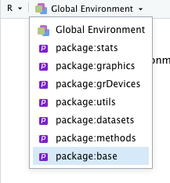

```{r setup, include=FALSE}
library(learnr)
library(modeest)
knitr::opts_chunk$set(echo = FALSE)
```

## Was Sie in diesem Tutorial lernen:

Im letzten Tutorial haben Sie sich spielerisch mit der allgemeinen Syntax von Funktionen in R beschäftigt. Darauf bauen wir hier auf:

-   Wie erstelle ich ein Objekt in R? (Assignment)

-   Was ist das Environment?

-   Wozu brauchen wir Vektoren?

-   Wie kann ich auf einzelne Elemente eines Vektors zugreifen? (Indizierung)

Außerdem geht es um deskriptivstatistische Kennwerte:

-   arithmetisches Mittel, Median, Modus

-   Abweichungen vom Mittelwert

-   Quadratsummen

-   Maße der Streuung: Varianz und Standardabweichung

## kurze Wiederholung

```{r q1, echo=FALSE}
question("Wie kennzeichnen Sie einen Kommentar in R?",
  answer("`#` mit der Raute", correct = TRUE ),
  answer("`;` mit einem Semikolon "),
  answer("`>` mit dem Größer-als-Zeichen"),
  answer(" `“` mit Anführungszeichen")
)
```

Außerdem:

-   Text wird durch Anführungszeichen `"` gekennzeichnet.

-   Argumente werden durch Kommata getrennt.

-   Laden von Paketen mit `library()`

-   Installieren von Paketen mit `install.packages()`

-   Hilfe wird über F1 / `?Funktionsname` / `help()` aufgerufen

-   R Skript = Drehbuch für Code

-   R Notebook = gut lesbare Mischung aus Code, Erläuterungen und Ergebnissen

## Ein Objekt erstellen

Wir beginnen damit, dass Sie ihr erstes eigenes Objekt erstellen. Mithilfe einer speziellen Funktion, dem *assignment operator* `<-`, weisen Sie einem Namen einen Wert zu.

``` r
x <- 5
# Name <- Wert
```

Der obige Befehl erstellt ein Objekt namens x mit dem Wert 5.

Hier sind einige Möglichkeiten, wie der Pfeil ausgesprochen werden kann:

Lesen Sie in Ihrem Kopf:

-   `x` *wird definiert als* `5`

-   `x` *bekommt den Wert* `5`

-   etc...

Das Objekt `x` erscheint im Environment, nachdem es erstellt wurde:


### Der *assignment operator* `<-`

Assignment bedeutet Zuweisung. Hier noch mal einige Erklärungen um zu verstehen, was auf welcher Seite des Pfeils steht:

Dem Wert wird ein Name zugewiesen oder anders gesagt:\
Der Wert bekommt einen Namen.\
Deswegen zeigt der Pfeil **immer vom Wert zum Namen.**

Eine lautsprachliche Eselsbrücke könnte vielleicht sein:\
Lin**ks** = **x**

**Tipp**: Nutzen Sie die Tastenkombination `Alt` + `-`\
Das hat den Vorteil, dass der Pfeil automatisch von Leerzeichen umgeben wird und Sie sich nicht vertippen können.

##### Achtung mit Leerzeichen:

`x < -5` hat eine sehr andere Bedeutung als `x <- 5`.

Ersteres heißt: "Ist `x` kleiner als `-5`?", letzteres bedeutet: "Definiere `x` als `5`".

::: grau-nb
Übrigens:

Der Pfeil funktioniert auch in umgedrehter Form: `5 -> x`, das ist aber unkonventionell.
:::

### Objekte aufrufen

Das Ziel der Benennung ist, auf den Wert später wieder zugreifen zu können. Das geschieht über den Namen.

Um sich ein Objekt ausgeben zu lassen, rufen Sie es einfach beim Namen.

Das heißt konkret: Geben Sie den Namen des Objekts ein, und führen Sie die Eingabe aus.

Definieren Sie `x` als 5 und lassen sich `x` ausgeben!

```{r x-solution}
x <- 5
x
```

```{r x, exercise = TRUE, exercise.caption = "Objekt aufrufen"}

```

### unbenannte Werte

Alles, was nicht benannt wird ist "*printed and lost*".\
Das heißt, der Wert wird lediglich in der Konsole ausgegeben und steht nicht als Variable für weitere Berechnungen zur Verfügung.

```{r printed, echo=TRUE}
5 + 5       # Ergebnis ist "printed and lost"
x <- 5 + 5  # Ergebnis speichern
x           # Ergebnis ausgeben
```

### Überschreibung

Bereits existierende Variablen werden ohne Warnung überschrieben, wenn sie neu definiert werden:

```{r, echo=TRUE}
z <- 1
z
z <- 5
z
```

### Gute Namen

-   R akzeptiert keine Leerzeichen in Objektnamen.

-   Außerdem dürfen Namen nicht mit einer Zahl beginnen.

-   Zusätzlich sind Namen in R case-sensitive, das heißt, Groß- und Kleinschreibung spielt eine Rolle. (x ≠ X)

Innerhalb dieser gesetzten Grenzen ist aber noch genug Spielraum, um unleserliches Chaos zu produzieren, deswegen hier noch einige Konventionen:

Gute Namen:

-   **sind leicht zu tippen** (das ist für mich das wichtigste Kriterium, weswegen `x` zu meinen Favoriten gehört)

-   sind konsistent und eindeutig

    -   verwenden konsistent `_` oder `.` oder `-` als Leerzeichen

    -   sind konsequent lowercase (kleingeschrieben)

-   sind nicht zu verwechseln mit internen Funktionen

    -   T und F sind die schlechtesten Namen die es gibt

    -   Stehen intern für TRUE und FALSE

#### Beispiele guter Namen

``` r
a
alter
alter_gruppe_1
alter-gruppe-1
alter.gruppe.1
```

#### Beispiele schlechter Namen

``` r
aLteR
ALTER
Alter_gruppe.1
```

## Environment


Environment bedeutet Umgebung. Hier erscheinen alle erstellten Objekte, und alles was sich in der Umgebung befindet, kann von R verwendet werden.

Sie können natürlich nur Objekte aufrufen, die auch vorher definiert wurden und deswegen in der Umgebung verfügbar sind. Ansonsten bekommen Sie folgenden Fehler:

```{r def, message=TRUE, warning=TRUE, exercise=TRUE, exercise.caption="Fehlermeldung"}
y           # nicht vorher definiert, deswegen Fehler
```

::: grau-nb
Auch `library()` lädt Objekte in die Umgebung, so dass sie verwendet werden können, nur dass diese nicht einfach so sichtbar sind. Um zu sehen, was für Objekte in einem geladenen Paket alles so enthalten sind, nutzen Sie das Dropdown-Menü bei "Global Environment".


:::

### wichtige Einstellung


Setzen Sie bitte Ihre RStudio-Einstellungen unter Tools / Global Options auf diese Werte! Dadurch wird das Environment mit dem Beenden von RStudio automatisch gelöscht und nicht zwischen Sitzungen gespeichert.

Das soll Sie dazu animieren, alle Objekte die Sie benutzen, auch tatsächlich im Skript zu definieren.

Das dient der Replizierbarkeit - Stellen Sie sich vor, Sie haben `x` gar nicht definiert, Ihre Berechnungen werden aber trotzdem ohne Warnung ausgeführt, weil noch ein anderes `x` aus der letzten Sitzung zwischengespeichert ist. Dann bekommen Sie falsche Ergebnisse und merken es eventuell nicht.

## Vektoren

Vektoren sind eine Kategorie von Objekten in R, die sehr häufig gebraucht wird. Andere Objekttypen werden im nächsten Tutorial vorkommen und bauen darauf auf.

#### Was ist ein Vektor?

Prinzipiell ist das Nützliche an einem Vektor, dass er mehrere Werte enthalten kann.\
Beispielsweise werden Kräfte in der Physik mit Vektoren dargestellt, um die Richtung und gleichzeitig die Größe einer Kraft nennen zu können.

Wir brauchen Vektoren vor allem, um die Ausprägungen einer Variablen zu speichern.

Beispielsweise die Ausprägungen des Merkmals "Alter" bei einer Befragung von 4 Personen:

```{r, echo=TRUE}
alter <- c(20, 23, 50, 11)
alter
```

Übrigens:

auch `x <- 5` erstellt einen Vektor, nur enthält er lediglich einen Wert.

### neue Funktion: `c()`

Um Vektoren zu erstellen, die mehr als einen Wert enthalten, brauchen Sie die Funktion `c()`.

-   *c* wie *combine*

-   kombiniert mehrere Werte zu einem Vektor

-   Argumente (Werte) durch Kommata getrennt

-   Das Dezimalzeichen in R ist der Punkt!

```{r, echo=TRUE}
c(1.5, 2.7, 5.8)
```

### Textvektoren

Vektoren können nicht nur Zahlen enthalten, sondern unter anderem auch Text.

```{r, echo=TRUE}
c("cat", "cow", "dog")
```

Achtung! Sobald ein einziges Element eines Vektors Text ist, wird der ganze Vektor zu einem Textvektor und die Zahlen stehen nicht mehr für Berechnungen zur Verfügung.

```{r, echo=TRUE}
c(1, 2, 3, 4)
c(1, 2, 3, "vier")  # Die ausgegebenen Zahlen stehen in Anführungszeichen
```

### Zahlenreihen

Um eine Zahlenreihe zu erstellen, verwenden Sie den *colon operator* `:`

```{r, echo=TRUE}
1:10
```

Der *colon operator* erzeugt als Ergebnis einen Vektor, der eine ganzzahlige Zahlenreihe enthält.\
Wir könnten das selbe Ziel auch mit `c()` erreichen, was aber sehr umständlich wäre:

```{r, echo=TRUE}
c(1, 2, 3, 4, 5, 6, 7, 8, 9, 10)
```

#### Anwendung

Erstellen Sie einen Vektor namens `z`, der eine Zahlenreihe von 1 bis 1000 enthält! Lassen Sie sich `z` ausgeben.

```{r colon, exercise=TRUE, exercise.caption="colon operator"}

```

```{r colon-solution}
z <- 1:1000
z
```

## Indizierung

"){width="50%"}

###### Foto: Wilferd Duckitt (CC BY 2.0)

Der *Honeyguide* hat seinen lateinischen Namen *indicator indicator* nicht ohne Grund: Er ist ein Indikator, d.h. **Anzeiger** für den Ort von Bienennestern.

Er kennt sehr viele dieser Nester, und führt aktiv Menschen dorthin, damit diese den Honig herausholen und er dabei auch etwas abbekommt. ([Hier mehr dazu](https://en.wikipedia.org/wiki/Greater_honeyguide))

### *index operator* `[]`

Um gezielt auf einzelne Werte innerhalb eines Vektors zuzugreifen, können wir mit `[]` die Stellen angeben, an denen die Werte stehen.

`[]` zeigt also auch einen bestimmten Ort an.

```{r, echo=TRUE}
animals <- c("cat", "cow", "dog")
animals
animals[2]      # Lies: "An der Stelle 2"
animals[2:3]    # Lies: "An der Stelle 2 bis 3"
```

Um eine bestimmte Stelle einer Zahlenreihe anzugeben, sind Klammern nötig:

```{r, echo=TRUE}
(5:10)[5]       # "Gib die 5. Zahl der Zahlenreihe aus" 
```

Die Konsole nutzt auch die Index-Schreibweise, um langen Output zu strukturieren: Zu Beginn jeder neuen Zeile ist die Nummer des ersten Elements der Zeile in eckigen Klammern angegeben.

```{r, echo=TRUE}
1:100 
```

### Anwendungsaufgaben

1.  Erstellen Sie eine absteigende Zahlenreihe von 100 bis 1. Geben Sie der Reihe den Namen x.

2.  Addieren Sie das dritte und siebte Element des Vektors x! Benennen Sie das Ergebnis mit y.

3.  Lassen Sie sich y ausgeben.

```{r anw-hint}
# Zahlenreihen rückwärts: die höhere Zahl nach vorne stellen.
# Addieren ganz simpel mit + 
```

```{r anw-solution}
x <- 100:1
y <- x[3] + x[7]
y
```

```{r anw, exercise = TRUE, exercise.caption = "Indizierung"}

```

::: grau-nb
Hinweis: Dass beim Wert von `y` ein `L` dahinter steht, ist völlig normal. Das `L` steht für *Long* und bezeichnet einen Datentyp.
:::

## Länge eines Vektors

Um $n$ zu ermitteln, gibt es die Funktion `length()`. Sie gibt die Anzahl der Elemente eines Vektors aus.

### Anwendung

Auf meinem letzten Spaziergang habe ich alle Tiere aufgeschrieben, die mir begegnet sind. Ermitteln Sie (ohne selbst zu zählen), wie viele Tierbeobachtungen der Vektor `animals` insgesamt enthält!

```{r n-solution}
length(animals)
```

```{r n, exercise=TRUE, exercise.caption="Länge eines Vektors"}
animals <- c("cat", "dog", "cow", "eagle", "frog", "worm", "bear", "snake", "fish", "kangaroo", "honey badger", "wolf", "mouse", "sheep", "goat", "squirrel", "fish", "frog", "woodpecker", "mouse", "elephant", "dog", "human", "fly", "mole", "honeyguide", "duck", "goat", "goose", "hen", "horse", "pig", "bull", "rooster", "bat", "reindeer", "deer", "fox", "bunny", "lynx", "otter", "weasel", "wild boar", "blackbird", "blackbird", "falcon", "owl", "sparrow", "sparrow", "sparrow", "swan", "swallow", "trout", "lizard", "viper", "salamander", "ant", "bee", "beetle", "dragonfly", "sparrow", "blackbird", "fly", "flea", "glow worm")
```

## Anzahl von Kategorien

Würden Sie anstattdessen wissen wollen, wie viele **verschiedene** Tiere ich insgesamt beobachtet habe, müssen wir zunächst alle Dopplungen ausschließen.

Das geht über den Befehl `unique()`. Als Ergebnis erhalten wir einen Vektor, der alle vorkommenden Kategorien enthält.

### Anwendung

1.  Erstellen Sie einen neuen Vektor `categories`, welcher alle vorkommenden Kategorien ein Mal enthält.

2.  Ermitteln Sie dann die Anzahl der verschiedenen Kategorien!

```{r categ-solution}
categories <- unique(animals)
length(categories)
```

```{r categ, exercise=TRUE, exercise.setup="n", exercise.caption="Anzahl an Kategorien"}

```

### Quizfragen Skalenniveau

```{r quiz, echo=FALSE}
question("Welches Skalenniveau hat die Tierbeobachtung?",
         answer("Nominal", correct = TRUE),
         answer("Ordinal"),
         answer("Intervall"),
         answer("Verhältnis"),
         answer("Absolut")
         )
```

```{r quiz2}
question("Was trifft noch auf `animals` zu? (Mehrere Antworten möglich)",
         answer("metrisch"),
         answer("kardinal"),
         answer("kategorial", correct = TRUE),
         answer("qualitativ", correct = TRUE),
         answer("stetig"),
         answer("diskret", correct = TRUE),
         answer("quantitativ")
         )
```

## Modus

Der Modus lässt sich bereits ab der Nominalskala berechnen. Um herauszufinden, welches Tier mir am häufigsten begegnet ist, ziehen wir den Modus heran.

Dafür gibt es keine direkte eingebaute Funktion. Allerdings gibt es eine Funktion, mit welcher Häufigkeitstabellen erstellt werden: `table()`.

Erstellen Sie eine Häufigkeitstabelle des Vektors `animals` und nennen Sie die Tabelle `tbl`!

```{r tblsetup}
animals <- c("cat", "dog", "cow", "eagle", "frog", "worm", "bear", "snake", "fish", "kangaroo", "honey badger", "wolf", "mouse", "sheep", "goat", "squirrel", "fish", "frog", "woodpecker", "mouse", "elephant", "dog", "human", "fly", "mole", "honeyguide", "duck", "goat", "goose", "hen", "horse", "pig", "bull", "rooster", "bat", "reindeer", "deer", "fox", "bunny", "lynx", "otter", "weasel", "wild boar", "blackbird", "blackbird", "falcon", "owl", "sparrow", "sparrow", "sparrow", "swan", "swallow", "trout", "lizard", "viper", "salamander", "ant", "bee", "beetle", "dragonfly", "sparrow", "blackbird", "fly", "flea", "glow worm")
```

```{r tbl-solution}
tbl <- table(animals)
tbl
```

```{r tbl, exercise=TRUE, exercise.setup="tblsetup"}

```

### Sortieren mit `sort()`

Die Häufigkeitstabelle ist unübersichtlich, so dass der häufigste Wert nicht direkt ins Auge springt. Wir können sie aber umsortieren mit dem Befehl `sort()`.

Um eine absteigende Sortierung zu erhalten, und zu erreichen, dass der häufigste Wert ganz vorne steht, spezifizieren Sie in der Funktion `sort()` das Argument `decreasing = TRUE`.

```{r sortsetup}
animals <- c("cat", "dog", "cow", "eagle", "frog", "worm", "bear", "snake", "fish", "kangaroo", "honey badger", "wolf", "mouse", "sheep", "goat", "squirrel", "fish", "frog", "woodpecker", "mouse", "elephant", "dog", "human", "fly", "mole", "honeyguide", "duck", "goat", "goose", "hen", "horse", "pig", "bull", "rooster", "bat", "reindeer", "deer", "fox", "bunny", "lynx", "otter", "weasel", "wild boar", "blackbird", "blackbird", "falcon", "owl", "sparrow", "sparrow", "sparrow", "swan", "swallow", "trout", "lizard", "viper", "salamander", "ant", "bee", "beetle", "dragonfly", "sparrow", "blackbird", "fly", "flea", "glow worm")
tbl <- table(animals)
```

```{r sort-solution}
sort(tbl, decreasing = TRUE)
```

```{r sort, exercise=TRUE, exercise.setup="sortsetup"}

```

### Modus mit externem Paket berechnen

Am einfachsten ist die Verwendung des Pakets `modeest` (mode estimation).

Die Funktion `mfv()` (most frequent value) gibt die häufigsten Werte zurück.

```{r modesetup}
animals <- c("cat", "dog", "cow", "eagle", "frog", "worm", "bear", "snake", "fish", "kangaroo", "honey badger", "wolf", "mouse", "sheep", "goat", "squirrel", "fish", "frog", "woodpecker", "mouse", "elephant", "dog", "human", "fly", "mole", "honeyguide", "duck", "goat", "goose", "hen", "horse", "pig", "bull", "rooster", "bat", "reindeer", "deer", "fox", "bunny", "lynx", "otter", "weasel", "wild boar", "blackbird", "blackbird", "falcon", "owl", "sparrow", "sparrow", "sparrow", "swan", "swallow", "trout", "lizard", "viper", "salamander", "ant", "bee", "beetle", "dragonfly", "sparrow", "blackbird", "fly", "flea", "glow worm")
```

```{r, echo=TRUE}
modeest::mfv(animals)
```

::: grau-nb
Rückblick:\
Die Schreibweise `Paket::Funktion()` erlaubt, Funktionen aus Paketen zu verwenden, die aktuell nicht über `library()` ins Environment geladen sind.

Zwischen den Doppelpunkten darf kein Leerzeichen sein.
:::

## Median

```{r medi, echo=FALSE}
question("Ab welchem Skalenniveau ist die Berechnung des Medians sinnvoll?",
         answer("Nominal"),
         answer("Ordinal", correct = TRUE),
         answer("Intervall"),
         answer("Verhältnis"),
         answer("Absolut")
         )
```

Zur Erinnerung: Der Median ist der Wert, vor dem 50% der Werte liegen und nach dem die anderen 50% der Werte kommen. Es geht nicht um die Werte selbst, sondern lediglich um ihre Position auf einer geordneten Liste.

In R wird der Median mit `median()` berechnet.

Berechnen Sie den Median von `m`!

```{r medex-solution}
median(m)
```

```{r medex, exercise=TRUE}
m <- c(6, 3, 5, 2, 1)
```

## Summen bilden

Eine essentielle Funktion bei der Berechnung statistischer Kennwerte ist die Summe $\sum$.

Um die Summe aller Elemente eines Vektors zu bestimmen, gibt es die Funktion `sum()`.

```{r, echo=TRUE}
x <- c(1, 2, 3, 4, 5)
sum(x)
```

### Anwendung

$$
{\large \sum_{i=1}^{100}i= 5050}
$$

Setzen Sie die obige mathematische Formel in R-Code um!

```{r sum-hint}
# oben auf dem Summenzeichen steht die obere Grenze der Summierung, unten steht der Startwert. 
```

```{r sum-solution}
sum(1:100)
```

```{r sum, exercise=TRUE, exercise.caption="Summe"}

```

## Das arithmetische Mittel

$$
{\large \bar{x} = \frac{\sum_{i=1}^{n}{x_i}}{n}}
$$

### Selber nachdenken

Wenden Sie die eben erlernten Funktionen an, um den Mittelwert des Vektors `x` zu berechnen! Orientieren Sie sich an der mathematischen Formel und überlegen, wie Sie die einzelnen Bestandteile in R umsetzen können.

```{r mit-hint-1}
# Division mit /
```

```{r mit-hint-2}
# n = length(x)
# Summenzeichen = sum()
# x_i = Vektor x
```

```{r mit-solution}
sum(x) / length(x)
```

```{r mit, exercise=TRUE, exercise.caption = "eigene Formel"}
x <- c(1, 1, 9, 3, 6)
```

### eingebaute Funktion

Für den Mittelwert (engl. *mean*) gibt es bereits die Funktion `mean()`, damit Sie nicht jedes Mal die gesamte Formel tippen müssen.

Das erste Argument ist ein Vektor, der die Zahlen enthält, deren Mittelwert ausgerechnet werden soll. Probieren Sie es aus!

```{r mean-solution}
mean(x)
```

```{r mean, exercise = TRUE, exercise.caption="mean"}
x <- c(1, 1, 9, 3, 6)

```

### Skalenniveau

```{r scalelevel}
question("Ab welchem Skalenniveau kann das arithmetische Mittel sinnvoll ausgerechnet werden?",
         answer("Nominal"),
         answer("Ordinal"),
         answer("Intervall", correct = TRUE),
         answer("Verhältnis"),
         answer("Absolut")
)
```

## Bedingungsprüfung

### Gleichheitsprüfung mit `==`

Um die Ergebnisse Ihrer eigene Formel mit denen der eingebauten Formel `mean()` zu vergleichen, können Sie den `==`-Operator verwenden.

```{r, echo=TRUE}
sum(x) / length(x) == mean(x)
```

Lesen Sie den Code in Ihrem Kopf folgendermaßen:\
"Ist das Ergebnis von `sum(x) / length(x)` identisch mit dem Ergebnis von `mean(x)`?"

Da es sich um eine Ja / Nein - Frage handelt, gibt R entweder `TRUE` oder `FALSE` aus. Ein weiteres mögliches Ergebnis ist `NA`, welches wir am Ende des Tutorials genauer ansehen.

Achtung! `==` gibt `FALSE` aus, wenn auch nur die kleinste Unterschiedlichkeit vorhanden ist.

## Fehlende Werte `NA`

`NA` bedeutet *not available* und signalisiert R, dass der betreffende Wert fehlt. Alle fehlenden Werte sollten so und nicht anders codiert werden, damit R adäquat damit umgehen kann.

Das Ergebnis von Berechnungen, die `NA`s enthalten, ist eigentlich immer `NA`.

```{r echo=TRUE}
alter <- c(20, 22, NA)
mean(alter)
```

Das hat auch einen guten Grund: Wenn ein Wert in Wirklichkeit alles mögliche sein könnte, kann auch das Ergebnis alles mögliche sein.

Um trotzdem zu einem Ergebnis zu kommen, können Sie bei vielen Funktionen das Argument `na.rm = TRUE` spezifizieren. Das steht für *NA Remove*.

```{r echo=TRUE}
mean(alter, na.rm = TRUE)
```

## Abweichungen vom Mittelwert

Die Abweichungen vom Mittelwert liegen der Berechnung von Streuungen zugrunde. Das zugrunde liegende (geniale) Konzept, Streuung durch die Abweichungen von einem Zentrum darzustellen ist das Fundament für Varianz, Standardabweichung, und alle darauf basierenden Verfahren wie Korrelation und Regression. Deswegen gehen wir im Folgenden Schritt für Schritt durch die Berechnung der Abweichungen vom Mittelwert in R.

{width="50%"}

Wir können postulieren, dass die Summe der Abweichungen vom Mittelwert immer 0 beträgt.

$$
{\large \sum_{i=1}^{n}{(x_i - \bar{x})}=0}
$$

Konkret gerechnet für die obenstehende Verteilung:

+-----------------+----------+----------+----------+----------+----------+
| $x_i$           | 1        | 1        | 3        | 6        | 9        |
+=================+=========:+=========:+=========:+=========:+=========:+
| $\bar{x}$       | 4        | 4        | 4        | 4        | 4        |
+-----------------+----------+----------+----------+----------+----------+
| $x_i - \bar{x}$ | -3       | -3       | -1       | 2        | 5        |
+-----------------+----------+----------+----------+----------+----------+

: Abweichungen vom Mittelwert

Die Werte in der letzten Zeile stellen die Abweichungen vom Mittelwert dar. Wenn alle Werte der letzten Zeile addiert werden, kommt tatsächlich 0 heraus.

Das liegt an der Definition des Mittelwertes: Er liegt immer so, dass die negativen und die positiven Abweichungen sich gegenseitig aufheben.

Wie sähe eine mögliche Prüfung dieser Hypothese in R aus?

Um die Abweichung eines Vektors vom Mittelwert zu berechnen, benötigen wir zunächst noch etwas mehr Kenntnisse über das Rechnen mit Vektoren.

## Rechnen mit Vektoren

### Vektor + Konstante

```{r echo=TRUE}
v <- c(1, 2, 3)
v + 1
```

Die Rechenoperation wird mit jedem einzelnen Wert des Vektors durchgeführt!

Als Ergebnis steht ein neuer Vektor der die Ergebnisse der einzelnen Berechnungen enthält.

`+` ist eine *vektorisierte* Funktion. Vektorisierung bedeutet grob gesagt, dass Rechenoperationen nicht nacheinander, sondern gleichzeitig durchgeführt werden, und ist eine Quelle der Mächtigkeit von R.

### Vektor + Vektor

```{r echo=TRUE}
v <- c(1, 2, 3)
z <- c(4, 3, 2)
v + z
```

Wenn zwei Vektoren verrechnet werden, wird die Rechenoperation jeweils zwischen den Elementen durchgeführt, die an der gleichen Stelle stehen.

### Vektoren unterschiedlicher Länge

```{r echo=TRUE}
v <- c(1, 2, 3, 4, 5, 6)
z <- c(1, 2)
v + z
```

Wenn zwei Vektoren unterschiedlicher Länge verrechnet werden, wird der kürzere Vektor automatisch so lange wiederholt, bis die Länge des anderen Vektors erreicht ist. Dieses Konzept heißt auch **Recycling**.

Letztlich geschieht dieser Mechanismus auch beim Rechnen mit Vektor + Konstante im Hintergrund.

### Fehlermeldung

Entsteht beim Recycling ein "Überstand", weil die beiden Vektoren keine Vielfachen voneinander sind, wird die Berechnung trotzdem durchgeführt, allerdings mit einer Warnung:

```{r warn, echo=TRUE, warning=TRUE, exercise.caption="Warnmeldung"}
v <- c(1, 2, 3, 4, 5, 6)
z <- c(1, 2, 3, 4, 5)
v + z
```

## Umsetzung

Um die Abweichungen vom Mittelwert ( $x_i - \bar{x}$ ) zu berechnen, wird der Mittelwert `mean(x)` von jedem einzelnen Wert des Vektors `x` abgezogen. Das entspricht dem Konzept Vektor und Konstante.

Als Ergebnis entsteht ein neuer Vektor mit den Abweichungen vom Mittelwert.

```{r deviation-setup}
x <- c(1, 1, 9, 3, 6)
```

```{r, echo=TRUE}
x - mean(x)
```

### Anwendung

Jetzt sind Sie selber gefragt! Prüfen Sie die Hypothese, dass die Summe aller Abweichungen vom Mittelwert 0 beträgt.

Übersetzen Sie dazu die Formel $\sum{(x_i - \bar{x})}=0$ in R Code!

```{r deviation-solution}
sum(x - mean(x)) == 0
```

```{r deviation-hint}
# Verwenden Sie sum() für die Formel und für die Überprüfung == 0 
```

```{r deviation, exercise=TRUE, exercise.setup = "deviation-setup", exercise.caption = "Abweichungen vom Mittelwert"}

```

## Quadratsummen

Da die Abweichungen vom Mittelwert summiert immer 0 ergeben, geht ihr Informationsgehalt über die Streuung leider verloren. Um ein Maß für die Streuung (auch Dispersion genannt) zu erhalten, müssen noch zwei weitere Schritte geschehen:

Um zu verhindern, dass sich positive und negative Abweichungen aufheben, werden die einzelnen Abweichungen von Mittelwert quadriert. Das bringt den Vorteil mit sich, dass am Ende eine substantielle Kennzahl für die Streuung steht, aber auch den Nachteil, dass Extremwerte durch die Quadrierung sehr stark ins Gewicht fallen.\
Die Summe der quadrierten Abweichungen vom Mittelwert heißt Quadratsumme.

$$
{\large QS=\sum{(x_i-\bar{x})^2}}
$$

{width="50%"}

+---------------------+----------:+----------:+----------:+----------:+----------:+
| $x_i - \bar{x}$     | -3        | -3        | 5         | -1        | 2         |
+---------------------+-----------+-----------+-----------+-----------+-----------+
| $(x_i - \bar{x})^2$ | 9         | 9         | 25        | 1         | 4         |
+---------------------+-----------+-----------+-----------+-----------+-----------+

: Quadrierte Abweichungen vom Mittelwert

$QS = 9 + 9+25+1+4=48$

Die Quadratsumme in unserem Beispiel beträgt 48. Mehr als die Hälfte dieses Werts (25) wurde durch einen einzigen Ausreißer verursacht.

Um daraus tatsächlich ein Maß der Streuung zu machen, müssen wir noch durch $n$ (die Anzahl der Elemente im Vektor) teilen, um den Einfluss der Stichprobengröße herauszurechnen. Es hat sich gezeigt, dass das Teilen durch $n - 1$ akkuratere Schätzungen liefert - eine genaue Erklärung dazu führt hier aber zu weit.

Damit haben wir die Formel der Varianz:

$$
{\large s^2 = {\frac{\sum{(x_i-\bar{x})^2}}{n-1}} }
$$

Die Formel für die Varianz des Beispiels würde so aussehen:

$$
{\large s^2 = {\frac{48}{4}}=12 }
$$

### Standardabweichung

Die Standardabweichung $s$ ist die Quadratwurzel der Varianz $s^2$.

$$
{\large s = \sqrt{s^2}}
$$

Die Standardabweichung ist lediglich eine andere Maßeinheit für die Streuung, aber das zugrundeliegende Messinstrument ist das selbe. Deswegen wird auch die Empfindlichkeit gegenüber Ausreißern, die der Quadratsumme eingeschrieben ist, wird durch das Ziehen der Wurzel nicht rückgängig gemacht, auch wenn es vielleicht auf den ersten Blick so scheint.

## Hausaufgabe

Ihre Hausaufgabe ist es, die Formeln der Varianz und Standabweichung als R Code umzusetzen. Vergleichen Sie Ihre Ergebnisse mit den Ergebnissen der eingebauten Funktionen `var()` und `sd()`. Nutzen Sie dafür die Gleichheitsbedingung `==`.

Speichern Sie die fertigen Formeln als Skript und laden Sie dieses als Abgabe auf Moodle hoch.

::: grau-nb
**Tipps**:

-   Die Quadratwurzel wird mit `sqrt()` (*square root*) gebildet.

-   Quadrieren mit `^2`

-   Auf die Klammersetzung achten: tendenziell verlangt R mehr Klammern als die normale mathematische Notation
:::

## Überblick deskriptivstatistische Kennwerte

Die Berechnung vieler statistischer Kennwerte ist in R ziemlich straight forward: Es gibt dafür oft eingebaute Funktionen, und wenn nicht, gibt es Pakete, die Funktionen enthalten. Immerhin wurde R entworfen mit dem Ziel, statistische Berechnungen zu ermöglichen.

Sie kennen nun bereits einige statistische Kennwerte. Es gibt noch viele mehr, und es geht nicht darum, sich alles zu merken, sondern zu wissen, wo Sie die passende Funktion für das gewünschte Maß finden. Oft reicht dafür eine kurze Suche im Internet.\
\
Alle diese Funktionen sind sich ähnlich: Sie nehmen als erstes Argument einen Vektor, der die Werte enthält, mit denen gerechnet werden soll. Deswegen haben Sie im ersten Teil gelernt, wie Sie Vektoren erstellen und speichern.

Hier nochmal eine Übersicht über deskriptivstatistische Kennwerte mit ihren eingebauten Funktionen:

+-----------------------+---------------------------+----------------+
| Name                  | Code                      | Skalenniveau   |
+=======================+===========================+================+
| arithmetisches Mittel | `mean()`                  | Intervall      |
+-----------------------+---------------------------+----------------+
| Median                | `median()`                | Ordinal        |
+-----------------------+---------------------------+----------------+
| Modus                 | `table()`\                | Nominal        |
|                       | oder mit externem Paket:\ |                |
|                       | `modeest::mfv()`          |                |
+-----------------------+---------------------------+----------------+
| Minimum und Maximum   | `range()`                 | Ordinal        |
+-----------------------+---------------------------+----------------+
| Spannweite            | `diff(range())`           | Intervall      |
+-----------------------+---------------------------+----------------+
| Quantile              | `quantile()`              | Ordinal        |
+-----------------------+---------------------------+----------------+
| Interquartilsabstand  | `IQR()`                   | Intervall      |
+-----------------------+---------------------------+----------------+
| Varianz               | `var()`                   | Intervall      |
+-----------------------+---------------------------+----------------+
| Standardabweichung    | `sd()`                    | Intervall      |
+-----------------------+---------------------------+----------------+

: Übersicht: Maße der zentralen Tendenz und Maße der Streuung in R

Hilfreich ist auch der Befehl `summary()`, der automatisch eine Zusammenfassung der wichtigen deskriptivstatistischen Kennwerte erstellt.

```{r test, exercise=TRUE, exercise.caption="Zum Ausprobieren"}

```

## Learnings heute

### neue Konzepte

-   Assignment `<-`

-   Environment

-   Vektoren

-   Recycling und Vektorisierung

-   Fehlende Werte

-   Zahlenreihen mit `:`

-   Indizierung mit `[]`

-   nötige Skalenniveaus für Modus, Median und Mittelwert

-   Sinn von Abweichungen vom Mittelwert und Quadratsummen

-   Die Formel für die Varianz

### neue Funktionen

| Code               | Beschreibung                    |
|--------------------|---------------------------------|
| `c()`              | combine                         |
| `<-`               | assignment operator             |
| `[]`               | index operator                  |
| `==`               | Gleichheitsprüfung              |
| `:`                | colon operator                  |
| `length()`         | Länge eines Vektors             |
| `sum()`            | Summe eines Vektors             |
| `unique()`         | Entfernen von Duplikaten        |
| `length(unique())` | Anzahl der versch. Ausprägungen |
| `table()`          | Häufigkeitstabelle              |
| `sort()`           | Sortieren                       |
| `modeest::mfv()`   | most frequent value (Modus)     |
| `median()`         | Median                          |
| `mean()`           | arithmetisches Mittel           |
| `var()`            | variance                        |
| `sd()`             | standard deviation              |
