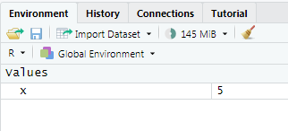
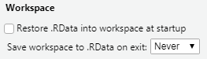
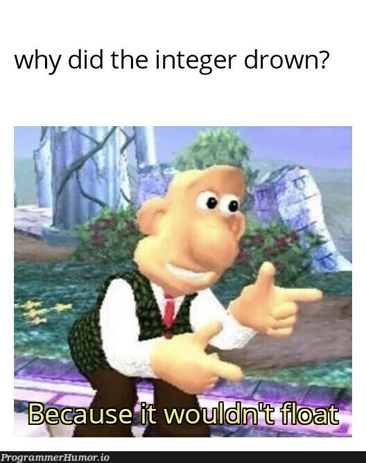
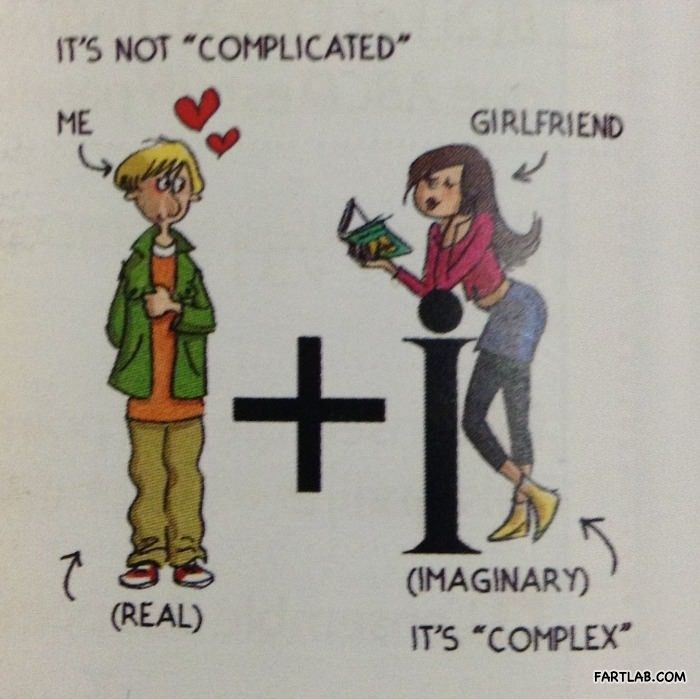

```{r setup, include=FALSE}
library(learnr)
library(modeest)
knitr::opts_chunk$set(echo = FALSE)
```

## Was Sie in diesem Tutorial lernen:

Im letzten Tutorial hast du dich spielerisch mit der allgemeinen
Syntax von Funktionen in R beschäftigt. Dieses Tutorial baut darauf auf:

-   Wie erstelle ich ein Objekt in R? (Assignment)

-   Was ist das Environment?

-   Wozu werden Vektoren benötigt?

-   Wie kann ich auf einzelne Elemente eines Vektors zugreifen?
    (Indizierung)

## kurze Wiederholung

```{r q1, echo=FALSE}
question("Wie kennzeichnen Sie einen Kommentar in R?",
  answer("`#` mit der Raute", correct = TRUE),
  answer("`;` mit einem Semikolon "),
  answer("`>` mit dem Größer-als-Zeichen"),
  answer(" `“` mit Anführungszeichen"),
  allow_retry = TRUE
)
```

Außerdem:

-   Text wird durch Anführungszeichen `"` gekennzeichnet. Auch einfache Anführungszeichen `'` sind möglich.

-   Argumente werden durch Kommata getrennt (Argument1 `,` Argument2)

-   Laden von Paketen mit `library()`

-   Installieren von Paketen mit `install.packages()`

-   Hilfe wird über F1 / `?`Funktionsname / `help()` aufgerufen

-   R Skript = Drehbuch/ Choreografie für Code 

-   R Notebook = gut lesbare Mischung aus Code, Erläuterungen und
    Ergebnissen

## R als Taschenrechner

:::{.aufgabe}
Fangen wir einfach an:

Berechne 2 + 3 im Codeblock!
:::

```{r rechner, exercise = TRUE}

```

```{r rechner-solution}
2 + 3
```

Das Ergebnis wird nicht gespeichert, sondern einfach nur ausgegeben - es
ist *printed and lost*.

Aber wie lässt sich das Ergebnis speichern, um damit im weiteren Verlauf
zu arbeiten?

Das funktioniert folgendermaßen:

```{r assignment_x, exercise = TRUE}
x <- 2 + 3
```

Hier wird beim Ausführen des Codes nichts ausgegeben. Das
liegt daran, dass der Wert von `2 + 3` in der Variable `x` gespeichert
wurde. 

:::{.aufgabe}
Um zu sehen, was die Variable `x` nun enthält, tippe einfach `x`:
:::

```{r x, echo = FALSE}
x <- 2 + 3
```

```{r x_print, exercise = TRUE, exercise.setup = "x"}

```

```{r x_print-solution}
x
```

Sehr gut! Im nächsten Abschnitt erfährst du mehr über die Zuweisung mit
`<-`.

## Assignment

Mithilfe des *assignment operators* `<-` bekommt ein Name einen Wert
zugewiesen. So können Variablen erstellt werden.

``` r
x <- 2 + 3
# Variablenname <- Wert
```

::: grau
#### Verbalisierung

Oft ist es hilfreich, Code zu verbalisieren. Hier sind einige
Möglichkeiten, wie der Pfeil ausgesprochen werden kann:

Lesen Sie in Ihrem Kopf:

-   `x` *bekommt den Wert von* `2 + 3`

-   und von rechts nach links, in der Pfeilrichtung:

    `2 + 3` *wird auf* `x` *geschrieben*.
:::
<br>

::: aufgabe
Multipliziere nun `x` mit 2!
:::

```{r y_creation, exercise = TRUE, exercise.setup = "x"}

```
<br>
```{r y_creation-solution}
x * 2
```
<br>

::: aufgabe
Speichere nun `x * 2` in einem neuen Objekt `y`!
:::

```{r y_saving, exercise = TRUE, exercise.setup = "x"}

```

```{r y_saving-solution}
y <- x * 2
```

::: blau-nb
**Tipp**: Nutze die Tastenkombination `Alt` + `-`, um den
*assignment operator* `<-` zu erzeugen!

Das hat den Vorteil, dass der Pfeil automatisch von Leerzeichen umgeben
wird.
:::
<br>

::: gelb

**Achtung mit Leerzeichen:**

`x < -2 + 3` hat eine sehr andere Bedeutung als   `x <- 2 + 3`.

Ersteres heißt: "Ist `x` kleiner als `-2 + 3`?", letzteres bedeutet:
"Definiere `x` als `2 + 3`".
:::
<br>

::: aufgabe
Lasse dir nun `y` ausgeben!
:::
```{r y_print, exercise = TRUE, setup.chunk = "y_saving-solution"}

```

```{r y_print-setup}
y
```

::: grau-nb
Übrigens:

Der Pfeil funktioniert auch in umgedrehter Form: `5 -> x`, das ist aber
unkonventionell und wird schnell unübersichtlich.
:::

### printed and lost

Wie bereis erwähnt ist alles, was nicht benannt wird, "*printed and
lost*".\
Das heißt, die Rechenaufgabe wird ausgewertet und das Ergebnis
ausgegeben, aber nirgends gespeichert.

```{r printed, echo=TRUE}
5 + 5       # Ergebnis ist "printed and lost"
x <- 5 + 5  # Ergebnis speichern
x           # Ergebnis ausgeben
```

### Überschreibung

Bereits existierende Variablen werden ohne Warnung überschrieben, wenn
sie neu definiert werden:

```{r overwrite, exercise = TRUE, eval=TRUE}
z <- 1
z
z <- 5
z
```

### Hinweise zu Objektnamen

#### formale Kriterien

-   R akzeptiert keine Leerzeichen in Objektnamen.

-   Namen dürfen nicht mit einer Zahl beginnen.

-   Namen sind *case-sensitive*, das heißt, Groß- und Kleinschreibung
    spielt eine Rolle. (x ≠ X)

#### stilistische Kriterien

Gute Namen:

-   **sind leicht zu tippen**

-   verwenden **konsistent** `_` oder `.` oder `-` als Leerzeichen

-   sind **konsequent** kleingeschrieben (hilft Verwechslungen zu vermeiden)

-   sind nicht identisch mit internen Objekten

    -   `T` und `F` sind z.B. schlechte Namen (stehen intern für TRUE
        und FALSE)

::: vorteile
##### Beispiele guter Namen

``` r
a
alter
alter_gruppe_1
alter-gruppe-1
alter.gruppe.1
```
:::

::: nachteile
##### Beispiele schlechter Namen

``` r
aLteR
ALTER
Alter_gruppe.1
```
:::

## Environment

Environment bedeutet Umgebung. Hier erscheinen alle definierten Objekte,
und alles was sich in der Umgebung befindet, kann von R verwendet
werden.



Es können natürlich nur Objekte aufgerufen werden, die auch vorher definiert
`<-` wurden und deswegen in der Umgebung verfügbar sind. Ansonsten
bekommst du folgenden Fehler:

```{r def, message=TRUE, warning=TRUE, exercise=TRUE, exercise.caption="Fehlermeldung"}
obj           # nicht vorher definiert, deswegen Fehler
```

Das lässt sich dadurch lösen, dass du das Objekt vorher definierst:

```{r def2, exercise = TRUE}
obj <- 100
obj
```

### wichtige Einstellung



::: aufgaberstudio

Setze bitte die RStudio-Einstellungen unter Tools / Global Options
auf diese Werte! Dadurch wird das Environment mit dem Beenden von
RStudio automatisch gelöscht und nicht zwischen Sitzungen gespeichert.
:::
<br>
Das soll dazu animieren, alle Objekte die benutzen werden auch
tatsächlich selbst zu definieren.

Das dient der Replizierbarkeit - Stell dir vor, du hast `x` gar
nicht definiert, die Berechnungen werden aber trotzdem ohne Warnung
ausgeführt, weil noch ein anderes `x` aus der letzten Sitzung
zwischengespeichert ist. Dann bekommst du falsche Ergebnisse und merkst
es eventuell nicht.


## Vektoren

Es ging bereits die ganze Zeit um Vektoren. Zum Beispiel
ist `obj` ein Vektor mit der Länge 1 - enthält also nur **eine** Zahl.

```{r, echo=TRUE}
obj <- 100
obj
```

Vektoren sind die elementarste Kategorie von Objekten in R und werden
sehr häufig gebraucht. Andere Objekttypen werden in einem eigenen
Tutorial vorkommen und bauen darauf auf.

Das Nützliche an einem Vektor ist, dass er mehrere Werte enthalten kann.

Beispielsweise die Ausprägungen des Merkmals "Alter" bei einer Befragung
von 4 Personen:

```{r, echo=TRUE}
alter <- c(20, 23, 50, 11)
alter
```

### neue Funktion: `c()`

Um Vektoren zu erstellen, die mehr als einen Wert enthalten, brauchen
Sie die Funktion `c()`.

-   *c* wie *combine* oder *concatenate* (verketten)

-   kombiniert mehrere Werte zu einem Vektor

-   wie in jeder Funktion sind die Argumente (Werte) durch Kommata
    getrennt

-   das Dezimalzeichen in R ist der Punkt!

::: aufgabe
**1.** Verkette 1.5, 2.5 und 3 mithilfe von `c()`!
:::

```{r concatenate, exercise = TRUE}
c()
```

```{r concatenate-solution}
c(1.5, 2.5, 3)
```

::: aufgabe
**2.** Mit `c()` lassen sich auch mehrere Vektoren aneinander binden. Kombiniere `x`, `y` und `z` zu einem neuen Vektor!
:::

```{r vectorc, exercise = TRUE}
# x, y und z definieren
x <- 5     
y <- 2 * x
z <- y / x

# x, y und z zu einem neuen Vektor verketten
c()

```

```{r vectorc-solution}
c(x, y, z)
```

Sehr gut! Als nächstes wird es daraum gehen, wie das Rechnen mit Vektoren
funktioniert.

## Rechnen mit Vektoren

Betrachte das folgende Beispiel. Welchen Schluss kann daraus
über das Rechnen mit Vektoren gezogen werden?

```{r vecmath, exercise = TRUE}
vec <- c(1, 2, 3) 
vec 
vec + 1
```

Die Rechenoperation wird mit jedem einzelnen Element des Vektors
durchgeführt!

Als Ergebnis steht ein neuer Vektor der die Ergebnisse der einzelnen
Berechnungen enthält. `vec` wird dadurch nicht verändert.

Dass Funktionen (wie z.B. `+`) auf jedes Element eines Vektors
angewendet werden, ist eine fundamentale Erkenntnis, die Sie noch sehr
häufig benötigen werden. Das Konzept dahinter heißt **Vektorisierung**
und ist ein Bestandteil der Mächtigkeit von R.

```         
vec + 10
```

```{r vecq}
question( "Was erwartest du als Ergebnis dieser Berechnung?",
  answer("Einen Vektor der Länge 1 mit dem Wert 15"),
  answer("Einen Vektor der Länge von `vec`, wo jedes Element mit 10 addiert 
   wurde", correct = TRUE),
  answer("Einen leeren Vektor"),
  answer("Einen Vektor mit 13 Elementen: 3 aus dem ursprünglichen plus 10 dazugefügte"),
  allow_retry = TRUE,
  random_answer_order = TRUE
)
```

Im folgenden ein paar weitere Beispiele.

### Vektor + Vektor

Was passiert, wenn zwei Vektoren gleicher Länge addiert werden?

```{r vecvec-setup}
vec <- c(1, 2, 3)
```

```{r vecvec, exercise = TRUE}
vec + vec
```

::: infobox
Die Rechenoperation wird jeweils zwischen den Elementen durchgeführt,
die an der gleichen Position stehen. 

(1 + 1, 2 + 2, 3 + 3)

(erstes Element + erstes Element, zweites + zweites Element, drittes + drittes ... )
:::

### Vektoren unterschiedlicher Länge

```{r recycl, exercise = TRUE}
v <- c(1, 2, 3, 4, 5, 6)
z <- c(1, 2)
v + z
```

::: infobox
Wenn zwei Vektoren unterschiedlicher Länge verrechnet werden, wird der
kürzere Vektor automatisch so lange wiederholt, bis die Länge des
anderen Vektors erreicht ist. Dieses Konzept heißt auch **Recycling**.
:::
<br>

Letztlich geschieht dieser Mechanismus auch bei unserem ersten Beispiel
von Rechnen mit Vektor + Zahl (`vec + 1`), weil die Zahl eigentlich auch
nur ein Vektor der Länge 1 ist.

### Fehlermeldung

Entsteht beim Recycling ein "Überstand", weil die beiden Vektoren keine
Vielfachen voneinander sind, wird die Berechnung trotzdem durchgeführt,
allerdings mit einer Warnung:

```{r warn, exercise = TRUE, warning=TRUE, exercise.caption="Warnmeldung"}
v <- c(1, 2, 3, 4, 5, 6)
z <- c(1, 2, 3, 4, 5)
v + z
```

Sehr gut! du hast jetzt bereits die wichtigsten fundamentalen
Bestandteile der Programmiersprache R in Aktion kennengelernt.


## Zahlenreihen

Um eine Zahlenreihe zu erstellen, verwenden Sie den *colon operator* `:`

```{r, echo=TRUE}
1:10
```

Der *colon operator* erzeugt als Ergebnis einen Vektor, der eine
ganzzahlige Zahlenreihe enthält.\
Wir könnten das selbe Ziel auch mit `c()` erreichen, was aber sehr
umständlich wäre:

```{r, echo=TRUE}
c(1, 2, 3, 4, 5, 6, 7, 8, 9, 10)
```
<br>

:::aufgabe
**Anwendung**

Erstelle einen Vektor namens `z`, der eine Zahlenreihe von 1 bis
1000 enthält! 

Lass dir daraufhin `z` ausgeben.
:::

```{r colon, exercise=TRUE, exercise.caption="colon operator"}

```

```{r colon-solution}
z <- 1:1000
z
```

## Textvektoren

Vektoren können nicht nur Zahlen enthalten, sondern unter anderem auch
Text.

Texteingabe wird für durch `"Anführungszeichen"` gekennzeichnet. 
Achtung! Es sollten genau diese Anführungszeichen sein `" "`, die normalerweise bei QWERTZ-Tastaturen mit `Shift` + `2` erreichbar sind. Es darf kein `„ “` oder `» «` sein, da das nicht erkannt wird. 

::: aufgabe
Das ist schon das vierte Tutorial, und du hast noch kein "Hello World"-Programm geschrieben... Das wird jetzt nachgeholt. 

Schreibe ein Programm, das den Text `Hello World!` als Ergebnis ausgibt! 
:::

```{r charvec, exercise = TRUE, exercise.cap = "Hello World!"}

```

```{r charvec-solution}
"Hello World!"
# Erstaunlich einfach, oder?

# Es geht natürlich auch umständlicher mit Zwischenspeichern:
text <- "Hello World!"
text
```

"Hello World" ist ein Textvektor der Länge 1, das heißt, dass er nur ein Element enthält. Sollen mehrere Texte in einem Vektor kombiniert werden, wird wieder `c()` benötigt. 

::: aufgabe
Kombiniere die Texte:

- "Hund"
- "Katze"
- "Maus"

zu einem Vektor namens `tiere`. 

Lasse dir den Vektor dann anzeigen.
:::

```{r char_animals, exercise = TRUE, exercise.cap = "Textvektor erstellen"}

```

```{r char_animals-solution}
tiere <- c("Hund", "Katze", "Maus")
tiere
```

### Länge bestimmen

```{r lengthquiz}
question_numeric("Welche Länge hat der Vektor `tiere`? Anders gesagt, wie viele Elemente enthält er?",
                 answer(3, correct = TRUE),
                 allow_retry = TRUE)
```

Die Länge eines Vektors kann mit der Funktion `length()` bestimmt werden. Jetzt konntest du die Anzahl der Elemente noch selbst zählen, aber die meisten Daten mit denen im Alltag gearbeitet wird, sind dafür zu groß. 

::: aufgabe
Ermitteln Sie nun noch mal auf programmatischem Weg die Länge Ihres eben erstellten Vektors `tiere`! Nutzen Sie die Funktion `length()`!
:::

```{r tiere}
tiere <- c("Hund", "Katze", "Maus")
tiere
```

```{r lengthex, exercise.setup = "tiere", exercise = TRUE, exercise.cap = "Länge eines Vektors bestimmen"}

```

```{r lengthex-solution}
length(tiere)
```

### Fehlermeldung: Mathe mit Textvektoren

Solltest du irgendwann mal versuchen, eine numerische Rechnung mit einem Textvektor durchzuführen, gibt R eine Fehlermeldung aus. 

:::aufgabe
Mach dich mit der Fehlermeldung vertraut! 
:::

```{r matherror, exercise = TRUE, exercise.cap = "Fehlermeldung", exercise.setup = "tiere"}
tiere + 1
```

> "non-numeric argument to binary operator"

bedeutet so viel wie: Keine Zahl eingegeben, wo eigentlich eine Zahl für erwartet wurde. Der „binary operator“ ist hier das `+`.

Perfekt! Jetzt bist du gewappnet, falls es dir diese Meldung in Zukunft unterkommen sollte. 


## atomic vectors

Nun zu einer elementaren Eigenschaft von Vektoren:

Betrachte dazu dieses Beispiel:

```{r coercion, exercise = TRUE}
c(1, 2, 3, 4)
c(1, 2, 3, "vier")  # Die ausgegebenen Zahlen stehen in Anführungszeichen
```

::: infobox
Achtung! Vektoren können immer nur Daten des gleichen Typs enthalten! Also entweder Text oder Zahlen. Dazu wird auf Englisch gesagt, es sind *atomic vectors*. 

Sobald auch nur ein einziges Element eines Zahlen-Vektors Text ist, wird der
ganze Vektor zu einem Textvektor umgewandelt und die Zahlen stehen nicht mehr für
Berechnungen zur Verfügung. Diese automatische Umwandlung heißt *coercion*.
:::
<br>

Der im letzten Abschnitt vorgestellte Fehler
`non-numeric argument to binary operator` entsteht oft, wenn numerische Vektoren irgendwo automatisch in Textvektoren umgewandelt werden. 

::: aufgabe
Führe den Code aus. Die Zahlen in `id` werden in Text *coerced* und die Berechnung schlägt fehl. 

Ändere den Code, so dass die Berechnung fehlerfrei ausgeführt werden kann!
:::

```{r coercion_error, exercise = TRUE, exercise.cap = "Fehler durch Mathe mit Textvektor"}
id <- c(1, 2, 3, "4")
id + 1
```

```{r coercion_error-solution}
id <- c(1, 2, 3, 4)
id + 1

# ohne die Anführungszeichen kann der Text als Zahl erkannt werden.
```

## Typen und Klassen

Als nächstes schauen wir und die Typen und Klasse von Daten etwas genauer an.

{width="40%"}

Wie es im Fantasy RPG (Role Play Game) deiner Wahl in der Regel die Auswahl aus verschiedenen Klassen (Ritter\*in, Heiler\*in, Zauber\*in etc.) und Rassen (Mensch, Elfe, Zwerg etc.) gibt haben auch in der Informatik verschiedene Klassen und Typen. **Achtung: zwar gibt es auch in anderen Programmiersprachen Klassen und Typen, doch unterscheiden diese sich ggf. von denen in R.** Das Bild von Klasse und Rasse ist rein methaphorisch für eine grundlegende Idee der Zusammenhänge zu verstehen.

Die *Datentypen* sind sowas wie die "Rasse". Also wie sieht ein Chracter aus (Zwerg, Elfe, Mensch) bzw. ein Dateneintrag: Zahlenart, Buchstabe, binär etc. Die *Objektklassen* entsprechen grob den "Rassen" in RPGs. Also wie sind die Charaktere organisiert: in Heiler\*innengilden, Ritter\*innenorden, Hofzauber*in etc. bzw. in Objekten: numerisch, Liste, Fakto etc.

Auf dem Level, auf dem wir R nutzen ist die ganz genaue Unterscheidung zwischen Typen und Klassen nicht wichtig. Nur gut, es einfach schonal gehört zu haben, da hier manchmal Probleme auftauchen die sich dann einfacher lösen lassen. 


### Typen


Es gibt *atomic vectors* in insgesamt sechs Datentypen, von denen wir aber nur vier wirklich verwenden. Aber damit du es einmal gesehen hast, werden der Vollständigkeit halber einmal alle gezeigt. 

1. numeric: Typ **integer**
2. numeric: Typ **double**
3. **character**
4. **logical**
5. (complex)
6. (raw)

R sagt dir, mit welchem Datentyp es zu tun hast wenn du `typeof(x)` eingibst (s.u.).

#### Zahlen: Unterschied `double` und `integer`

Sowohl `double` als auch `integer` beinhalten Zahlen. Wo ist nun der Unterschied und warum gibt es ihn?


**Double** sind Fließkommazahlen bzw. Dezimalzahlen, auch *floating point numbers*.

**Integer** sind ganze Zahlen. 


Das ist wichtig zu erwähnen, denn das ist krass: Computer merken sich Zahlen anders als wir Menschen. Menschen denken *dezimal* (also in Zehnerschritten) und Computer *binär* (die klassischen 1 und 0). Für den Menschen sieht eine `0.1` so aus: 0.1 bzw. $$\frac{1}{10}$$ Für einen Rechner sieht eine `0.1` so aus: $$0.0 \overline{0011}$$. Rechner können je nach Hardware pro Zahl nur [23](https://de.wikipedia.org/wiki/Einfache_Genauigkeit) bzw. [52](https://de.wikipedia.org/wiki/Doppelte_Genauigkeit) binäre Nachkommastellen speichern. Das entspricht ca 8 bzw. 16 dezimalen Nachkommastellen. (*Siehe dazu auch dieses wunderbare [Video](https://www.youtube.com/watch?v=PZRI1IfStY0)). Danach wird die Zahl einfach abgeschnitten - mit fatalen Folgen.

<details>
<summary><a>▼ \* Rumgenerde bzgl. des Datentyps double.
</a></summary>

Ob 23 oder 52 binäre Nachkommastellen hat mit dem Arbeitsspeicher des Rechners und der heruntergeladenen Version von R zu tun. Du wurdest beim Runterladen gefragt, ob du eine 32 oder 64 bit möchtest und du wirst 64 gewählt haben. Falls du das gegenchecken möchtest, tippe `sessionInfo()` in deine Konsole. In der zweiten Reihe steht hinter `Platform:` dein Betriebssystem sowie die Zahl der Bits, für die du dich entschieden hast. Das ist im übrigen auch gemeint, wenn du Technik kaufst und da 64 bit steht. Das hat dann was mit der Genauigkeit zu tun, die das Gerät überhaupt rechnen kann.

Das Format von Zahlen, die mit 32 Bit gespeichert sind heißt auch *"Single-precision floating-point format"*. Das wird dir in der freien Wilbahn eher nicht begegnen. Das Format von mit 64 Bit gespeicherte Daten heißt *"Double-precision floating-point format"*. Hier schließt sich der Kreis, dennn exakt das sagt der Datentyp **double`**.

Für den Alltag reicht zu merken: **double** bedeutet Kommazahl.

</details>

Während für den Menschen die Dezimalzahl $$0.1$$ eben so aussieht: $$0.1$$ sieht sie für den Rechner so aus: $$0.000110011001100110011001100110011001100110$$ was umgerechnet wiederum $$0.09999999999990905053$$. Genauer kann dein PC 0.1 nicht abbilden. Punkt. 

Im Alltag rundet R das ganz freundlich, ist also häufig echt egal:

```{r double, exercise = T}
0.1 + 0.2
```

Ist doch alles so wie ich das auch per Hand rechnen würde!

Ja, stimmt. R hat gut gerundet. Was passiert allerdings, wenn du R fragst: "Ist 0.1 + 0.2 ganz genau gleich 0.3?"(damit R es versteht, bitte so formulieren: `0.1 + 0.2 == .3`)?

```{r double2, exercise = T}
0.1 + 0.2 == 0.3
```

HUCH?

und weiter: 

```{r double3, exercise = T}
(0.1 + 0.2) - 0.3

```

Das ist eine absurd kleine Zahl, aber sie ist eben unterschiedlich von Null, was sie genau genommen nicht sein dürfte.

Bei den Rechenoperationen, die wir durchführen reicht diese Genauigkeit aus. Wenn es genauer sein soll, auch bei kleineren Zahlen (im Bankenwesen würden große Verluste zustande kommen, wenn so ungenau gerundet wird), gibt es `integer` Zahlen. Die heißen so, weil sie eben integer sind. Ganze Zahlen eben. Grundsätzlich geht R von Fließkommazahlen aus. Wenn du eine integer Zahl möchtest, musst du das R ganz konkret sagen. Das machst du mit einem großen `L` an der Zahl ohne Leerzeichen dazwischen.

```{r typen_num, exercise = T}
vec_dou <- c(1, 2, 3)
vec_int <- c(1L, 2L, 3L)

# Gib der Vollständigkeit halber folgende Zeile einmal ohne Hashtag in deine Konsole ein:
# vec_schmu <- c(1 L, 2 L, 3 L) 
# hier wird ein Fehler geworfen werden. Dieser Vektor dient zum verdeutlichen, dass das L direkt an die Zahl anschließen MUSS

# Nun schauen wir uns die Datentypen an:
typeof(vec_dou)
typeof(vec_int)
```

Okay, also Zusammenfassend lässt sich sagen: Es gibt zwei Typen von Zahlen. Ganze Zahlen bzw. `integer` und Fließkommazahlen bzw `double`. So weit so einfach.

Sollte, warum auch immer, der Fall eintreten, das du den einen Typen in den anderen umwandeln möchtest, ist das natürlich auch möglich: `as.integer()` bzw. `as.double()` sind hier deine Friends.

```{r typen_num2, exercise = T, setup.chunk = "typen_num"}
typeof(as.integer(vec_dou))
typeof(as.double(vec_int))
```

So weit so gut. Was passiert nun aber, wenn im double Vektor auch tatsächlich Kommazahlen gespeichert sind?

```{r typen_num3, exercise = T, setup.chunk = "typen_num"}
# zuerst vec_dou neu definieren
vec_dou <- c(1, 2.4, 3.5, 4.5, 5.6, 6.9, 7)
typeof(vec_dou)
as.integer(vec_dou)
typeof(as.integer(vec_dou))
```

Zuerst fällt auf: Die Umwandlung hat trotzdem funktioniert und alle Zahlen wurden auf eine ganze Zahl gerundet.

Dann fällt auf: Puh! Alle nach unten gerundet! Gut beobachtet. So verwandelt R doubles in integers. Isso.

Puh! Die Zahlentypen sind geschafft! Das war das komplizierteste (und spannedste). Jetzt solltest du folgendes Meme verstehen:

{width="50%"}

#### Buchstaben: `charakter`

Dieser Datentyp sind literally Zeichenfolgen. Du sagst R, dass es das als character behandeln soll, indem du Inhalte in Anführungszeichen setzt. Dann ist es R auch egal, WAS du darein schreibst.

```{r character, exercise = T}
vec_cha <- c("Hund", "Katze", "Maus")
# probiere auch einmal, was passiert, wenn du den Vektor versuchst ohne Anführungszeichen zu speichern, also:
# vec_schmu <- c(Hund, Katze, Maus)

# Typ herausfinden:
typeof(vec_cha)
```

Juhuu, soweit so logisch. Aber wie ist das mit Zahlen?

:::aufgabe
Finde den Typen der Vektoren heraus und konvertiere den double und charakter Vektor in das jeweilige andere (neu: `as.character()`). Betrachte auch explizit den vierten Eintrag des 1. Vektors.
:::

```{r character2, exercise = T}
vec_cha <- c("1", "2", "3", "vier")
vec_num <- c(5, 6, 7)

```

```{r character2-solution}
vec_cha <- c("1", "2", "3")
vec_num <- c(4, 5)

typeof(vec_cha)
typeof(vec_num)

as.double(vec_cha)
as.character(vec_num)
```

Also: Zahlen, die wirklich nur Zahlen sind und als charakter gespeichert sind lassen sich problemlos numerisch verwenden. Ist allerdings ein geschriebenes Wort dazwischen wird es in ein `NA`, also `Not Available` verändert.

#### Logische Werte: `logical`

R kennt zwei logische Werte: Wahr und Falsch, bzw. `TRUE` und `FALSE` oder `T` und `F` oder auch `1` und `0`. Die sind meist vor allem interessant, wenn Werte gefiltert werden. Dazu gibt es im letzten Block nochmal ein ausführlicheres Tutorial.

Für jetzt:

```{r logical, exercise = TRUE}
vec_log <- c(T, T, F) 
# Achtung: Wenn du die Buchstaben in Anführungszeichen steckst, kommt ein charakter Vektor raus
vec_cha <- c("T", "T", "F")
vec_log_num <- c(1, 1, 0)

typeof(vec_log)
typeof(vec_cha)
typeof(vec_log_num)

# Auch hier lässt sich fröhlich transformieren
as.character(vec_log)
as.double(vec_log)

as.logical(vec_cha)
as.double(vec_cha)
# kannst du erklären, warum das nicht klappt? und wie könnte es klappen?

as.logical(vec_log_num)
as.character(vec_log_num)
```

#### Ferner liefen: `complex` und `raw`

{width="50%"}

Daten des Typen `complex` sind, wie der Name schon sagt: [Komplex](https://de.wikipedia.org/wiki/Komplexe_Zahl). Das bedeutet: [Reelle](https://de.wikipedia.org/wiki/Reelle_Zahl) plus [imaginäre](https://de.wikipedia.org/wiki/Imagin%C3%A4re_Zahl) Zahlen (also solche, die sich nicht durch ganzzahlige Brühe darstellen lassen).

Daten des Typen `raw` zeigen binäre Zahlen umgerechnet als hexadezimalzahlen an.

Wenn du, warum auch immer, das mal brauchen solltest: natürlich funktionieren auch hier die Funktionen `as.complex()` bzw. `as.raw()`.

Beide Typen sind mir in meiner kompletten R Laufbahn noch nie in der Praxis über den Weg gelaufen. Solltest du ihnen begegnen, kannst du es jetzt aber einordnen.

#### Zusammenfassung Typen

Nochmal zusammengefasst: Es gibt 6 Datentypen (2 numerische: `double` (mit Komma), `integer` (ohne Komma), Buchstaben (`character`), logische Werte (`logical`), Zahlen, die genau genommen keine richtigen Zahlen sind (`complex`) und irgendwie komisch dargestellte binärcodes (`raw`)). Welchen Typ die Daten habe kann mit der Funktio `typeof()` in Erfahrung gebracht werden und unter bestimmten Voraussetzungen lassen sich die Typen auch ineinander übersetzen `as.neuertyp()`. Ob ein bestimmter Typ vorliegt findest du mit `is.datentyp()` heraus.

### Klassen

Nun sind die Typen der der Daten ("Rasse" im RPG) dir bereits ein Begriff. Fehlt noch die Klasse.

Hier fängt das Beispiel mit den RPGs an, etwas zu hinken. Den nicht *Daten* haben eine Klasse sondern *Objekte*. Daten sind allerdings **in** Objekte gespeichert.

Es gibt sehr viele Klassen in R und manche Funktionen funktionieren oder funktionieren nicht oder werfen andere Ergebnisse aus, abhängig davon, in welcher Klasse von Objekt die Daten stecken. Häufig werden Klassen explizit festgelegt. Wenn das nicht der Fall ist, haben die Objekte ein implizites Klassenattribut und manchmal einfach den Datentyp.

Klingt kompliziert? Ist es auch. Und das ist total okay. Wir bringen gemeinsam Schritt für Schritt etwas Licht ins Dunkel.

In einem Objekt können mehrere Daten gespeichert werden. Die Klasse sagt nun etwas darüber aus, wie das Objekt intern organisiert ist. 

```{r}
vec <- as.double(1:10)


vec


typeof(vec)

class(vec)
```


## Abschlussquiz

```{r abschlussquiz}
quiz(caption = "Teste dein Wissen!",
     question_checkbox("Warum sollte die Option, das Environment auch zwischen
                       den Sitzungen zu speichern, deaktiviert werden?",
                    answer("Um uns das Leben nicht unnötig leicht zu machen.",
                           message = "Alles in R ist mit dem Ziel entstanden, 
                           das Leben von Forschenden etwas leichter zu machen,
                           auch wenn es manchmal nicht so scheint."),
                    answer("Um Replizierbarkeit zu fördern.", 
                           correct = TRUE,
                           message = "Wenn alle Objekte (z.B. Variablen), die 
                           für ein Skript nötig sind, immer im Skript definiert
                           werden, kann es nicht zu Verwechslungen kommen und 
                           auch andere, die das Skript bekommen, können es
                           ausführen, ohne zu wissen was alles vorher in deinem
                           Environment war."),
                    answer("Um nicht ausversehen mit alten Werten aus der 
                           letzten Sitzung zu rechnen.", 
                           correct = TRUE, 
                           message = "Wenn du in einer vorherigen Sitzung `x`
                           definiert hast, und in der neuen Sitzung an einem
                           anderen Skript arbeitest, wo es auch eine Variable
                           namens `x` gibt, könntest du ausversehen mit den
                           falschen Werten arbeiten, wenn `x` 
                           zwischengespeichert wird."),
                    answer("Um Arbeitsspeicher zu sparen und Abstürze zu
                           verhindern.", 
                           message = "Diese Option blockiert keinen
                           Arbeitsspeicher, wenn sie aktiviert sind"),
                    answer("Um nicht immer wieder das ganze Skript ausführen zu
                           müssen, um an meine Berechnungsergebnisse 
                           zu kommen.", 
                           message = "Selbst wenn das ganze Skript sehr
                           rechenintensiv ist, meinetwegen 3 Tage auf einem
                           Super-Computer laufen muss um die Ergebnisse zu
                           erhalten, würdest du diese nicht im Environment
                           speichern wollen, sondern dann lieber am Ende des
                           Skripts mit einem Befehl in eine Datei auf der
                           Festplatte schreiben."),
                    random_answer_order = TRUE),
     question_text("Wie heißt dieser Operator `<-` auf Englisch?",
                   answer("assignment operator", correct = TRUE),
                   answer("Assignment Operator", correct = TRUE)),
     question_radio("Worauf könnte dieser Fehler hinweisen? \n`non-numeric argument to binary operator`",
                    answer("Dass einer Funktion wie z.B. `+` oder `-`, die Zahlen zum Rechnen braucht, Text als Input gegeben wurde.", correct = TRUE),
                    answer("Dass einer Funktion die Text erwartet, fälschlicherweise Zahlen als Input gegeben wurden"),
                    answer("Dass der PC so kaputt ist, dass nicht einmal mehr die Grundrechenarten funktionieren."))
     
# Noch mehr Fragen erstellen

     )
```

## Learnings heute

```{r context="server"}
# Shiny App um die Anzahl richtig beantworteter Fragen anzuzeigen. 
# Funktioniert in jedem Tutorial

shiny::observeEvent(
  input$get_score, 
  {
    objs2 = learnr:::get_tutorial_state()
    
    # Number of correct questions
    
    n_correct <- 
      # Access the $correct sublist item in each list item
        lapply(objs2, purrr::pluck, "correct") |>
           # make it a vector containing: TRUE and FALSE and NAs
           # NA is appearing for list items which don't have
           # a $correct subitem
                unlist() |> 
           # Taking the sum of a logical Vector returns the number of TRUEs
                sum(na.rm=TRUE)
    
    # Number of total questions
    
    total_questions <- 
      # 1. Access $type in each list item and make it a vector of types
      lapply(objs2, purrr::pluck, "type") |> unlist()
    
    # 2. Count the number of "question" in that vector
    total_questions <- total_questions[total_questions == "question"] |> 
      length()
      
      
    output$score = shiny::renderText(
      paste0(n_correct, " von ", total_questions,
        " im gesamten Tutorial beantworteten Fragen waren richtig.")
)
    invisible()
  }
)
```

```{r score, echo=FALSE}
shiny::br()
shiny::actionButton("get_score", "Auswertung!")
shiny::br()
shiny::br()
shiny::textOutput("score")
shiny::br()
```

### Zusammenfassung

Du hast gelernt, wie du Variablen Daten zuweisen kannst.

Variablen sind in R repräsentiert als Vektoren. Vektoren sind der fundamentale Objekttyp in R, auf dem alle anderen Objekte wie z.B. Tabellen aufbauen. Ihr Vorteil ist, dass sie viele Elemente enthalten können.

Beim Rechnen mit Vektoren hast du das Konzept "Recycling" kennengelernt,und erahnst ungefähr, was "Vektorisierung" ist - dass vektorisierte Funktionen wie `+` auf jedes Element eines Vektors einzeln angewendet werden, und als Ergebnis auch wieder ein Vektor steht.

Beim Assigment hast du gelernt, Leerzeichen zu verwenden um den Assignment Operator `<-`. 

Das Dezimaltrennzeichen in R ist der Punkt.
Kommata werden verwendet, um Werte in Aufzählungen voneinander zu trennen.

Gute Objektnamen sind konsistent und kleingeschrieben und dürfen keine 
Leerzeichen enthalten oder mit einer Zahl beginnen.

Im Environment werden die erstellten Objekte der laufenden Sitzung angezeigt. Bei Beenden von RStudio werden sie gelöscht, was die empfohlene Einstellung ist. So wird Replizierbarkeit trainiert: Nicht die erstellten Variablen werden aufbewahrt, sondern das Rezept um sie zu erstellen - in Form eines Skripts.

### Diese neuen Konzepte kennen Sie nun:

-   Assignment `<-`

-   Environment

-   Vektoren

-   Recycling und Vektorisierung

-   Zahlenreihen mit `:`

### neue Funktionen

| Code  | Beschreibung         |
|-------|----------------------|
| `c()` | combine, Vektor erstellen |
| `<-`  | assignment operator: Objekte speichern |
| `:`   | colon operator: Zahlenreihen erstellen |
| `typeof()` | Datentyp bestimmen |
| `length()` | Länge eines Vektors |
| `as.numeric()` | Umwandlung in Zahlenvektor |
