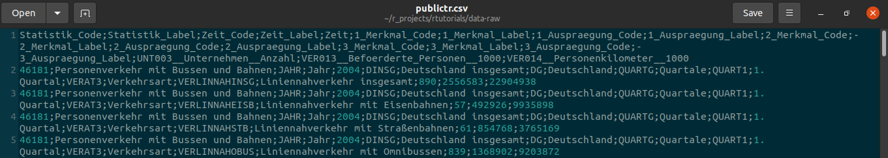
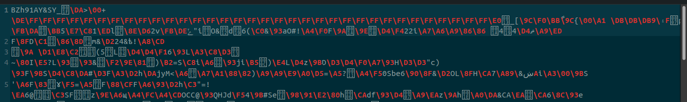
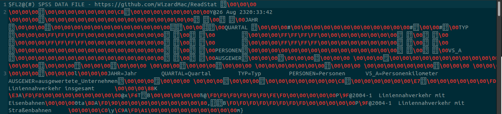
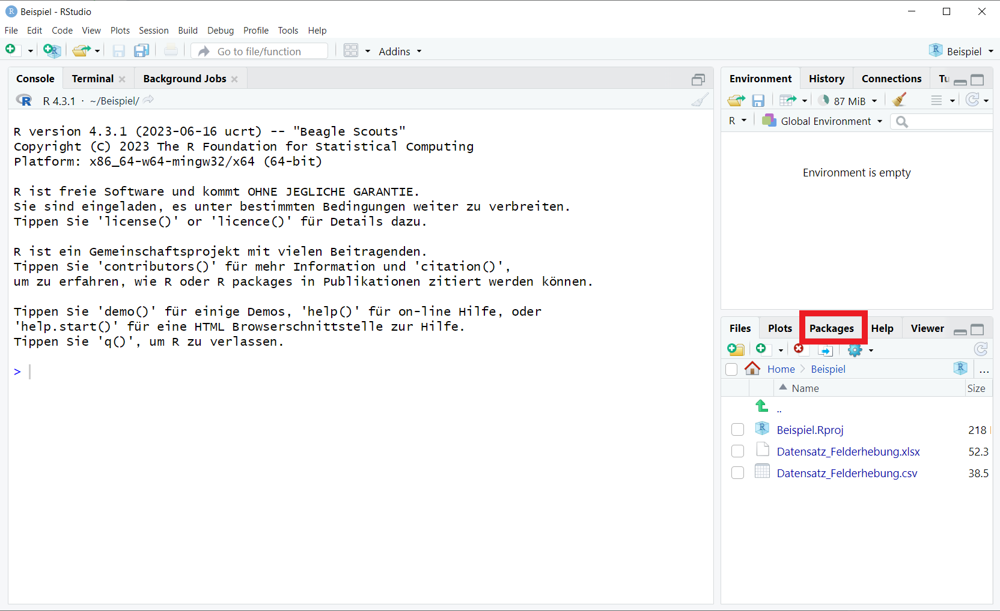
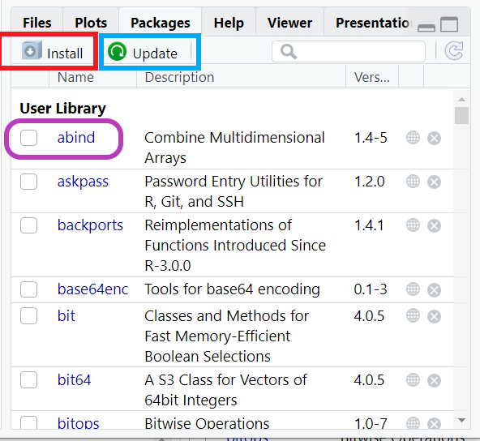
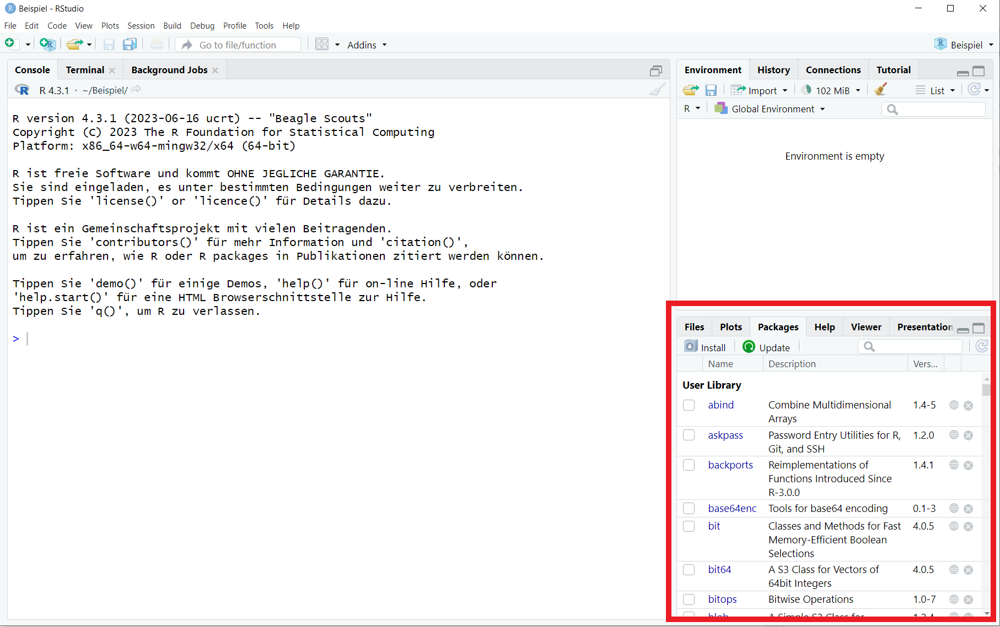
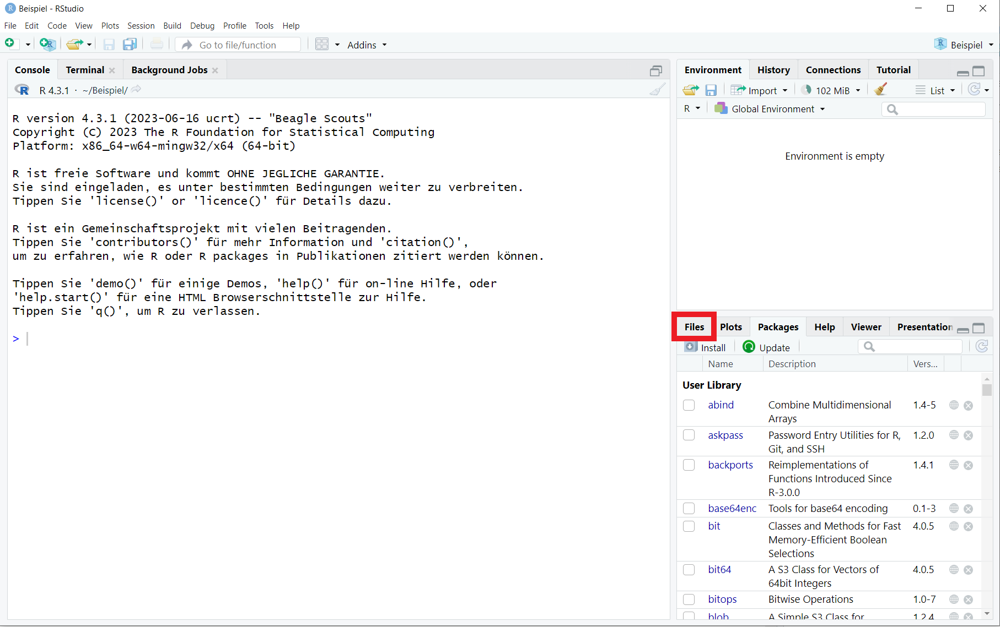
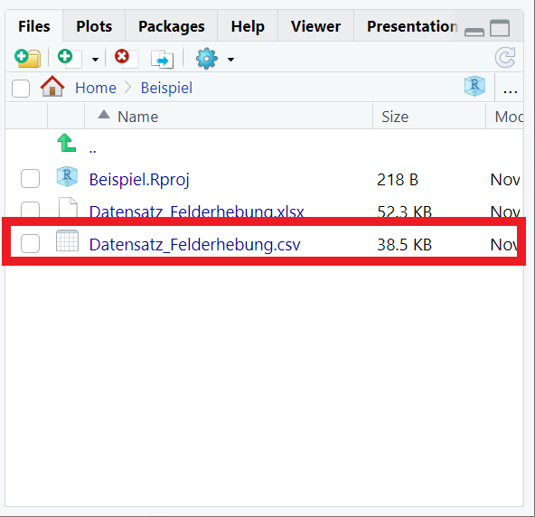
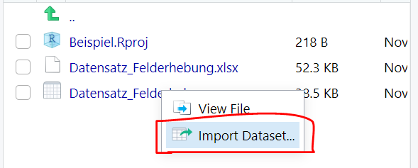
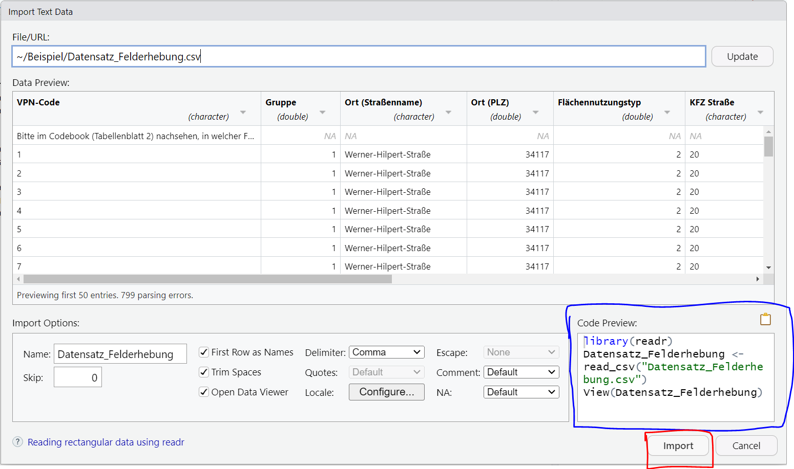

```{r setup, include=FALSE}
library(learnr)
library(tidyverse)
knitr::opts_chunk$set(echo = FALSE)
```


## Import von Daten

Willkommen im Tutorial zum Importieren von Daten in R! In diesem Abschnitt lernst du, wie du deine Daten in R lädst, um sie für deine Analysen und Visualisierungen zu verwenden. Der Fokus liegt dabei unter anderem auf dem Import von CSV- und Excel-Dateien, zwei der gängigsten Formate für den Datenaustausch.

Schauen wir noch kurz auf unsere Roadmap, um zu verstehen wo wir gerade stehen:
{width="100%"}
Der Datenimport (III) erfolgt, nachdem die Vorarbeit (I) geleistet wurde und wir bereits unsere Daten gemessen bzw. generiert (II) haben. Jetzt fängt also der Teil an, in dem wir R für unsere eigenen Daten nutzen können. Yippie! 

::: gelb
Beachte, dass der Code in den Übungsblöcken in diesem Tutorial nicht ausführbar ist!
Dieser dient lediglich als Beispiel für dein eigenes Skript und deine eigenen Dateien, denn schließlich sollst du am Ende des Tutorials in der Lage sein, mit deinen eigenen Daten zu arbeiten.   
:::

## Lernziele

In diesem Tutorial wirst du folgendes lernen:

-   <input type="checkbox" unchecked> Einlesen von `csv` Dateien </input>
-   <input type="checkbox" unchecked> Einlesen von `excel` Dateien </input>
-   <input type="checkbox" unchecked> Einlesen von `rda` Dateien </input>
-   <input type="checkbox" unchecked> Die grafische Oberfläche von R Studio zu nutzen </input>
-   <input type="checkbox" unchecked> Was ein `working directory` ist und wie es geändert wird </input>


## Welche Datenformate gibt es?

Dafür ist es zunächst hilfreich zu verstehen, wie Daten für R
aussehen:

Eine CSV Datei:
{width="95%" style="display:block; margin:auto;"}
</br>
Eine RDA Datei:
{width="95%" style="display:block; margin:auto;"}
</br>
Eine SPSS (kommerzielle Statistik-Software) Datei:
{width="95%" style="display:block; margin:auto;"}

Oben siehst du ein und denselben Datensatz in drei verschiedenen Formaten
und wie er aussieht, wenn er nicht in R eingelesen ist.

1.  **CSV (Excel)**: Ergibt einigermaßen Sinn für unser menschliches
    Auge.
2.  **RDA (R)**: Viele nicht lesbare Zeichen. Ist binär und enthält
    spezifische Informationen für R.
3.  **SAV (SPSS)**: Hier wirds richtig crazy für uns: Das ist eine
    Mischung aus binär-Code und Metainformationen, die nur SPSS
    entschlüsseln kann.

Zum Glück müssen wir uns damit nicht weiter auseinander setzen. Es
reicht, dass du es einmal gesehen hast.

::: blau-nb
Wenn ein und der selbe Code je nach Sprache schon für uns Menschen
unterschiedlich aussieht, geht es auch R so. Um verschiedene Datentypen in R einzulesen,
brauchen wir deshalb verschiedene Befehle. Quasi um R zu sagen, welche
Übersetzungsprozesse R machen muss, um die Daten lesen zu können.
:::
</br>

## Der Import

Alle Datensätze, die wir in dieser gesamten Veranstaltung verwenden, hat
Lukas netterweise direkt ins Paket eingebunden, das heißt, du musst für
die Tutorials meist gar nichts tun, da die Daten bereits eingelesen sind. 

Um R mittzuteilen, welchen Datensatz du
verwenden willst, tippt du einfach folgendes: `rtutorials::datensatz`

```{r tutorial, exercise=TRUE}
# neuer Name der Daten `<-`  aus dem Paket `rtutorials` nutze(::) den datensatz `einkaufen` als Data Frame (`data.frame()`)
data <-  data.frame(rtutorials::einkaufen)
# zeige die ersten Zeilen des Data Frames (`head()`)
head(data)
```

Sobald du aber das warme Nest dieses Tutoriums verlässt, wirst du
allerdings mit anderen Datenformaten konfrontiert sein. Desewgen wollen
wir dir die drei wichtigsten Befehle mit auf den Weg geben:

1.  RDA: `daten <- load("data/datensatz.rda")`
2.  CSV: `daten <- read.csv("data/datensatz.csv")`
3.  XLSX: `daten <- read.xlsx("data/datensatz.csv")`

Beachte, dass der Dateipfad in Anführungszeichen stehen muss. Wenn du hilfe Dabei brauchst, den Dateipfad zu bestimmen kommt für dich hier eine Erklärung dazu.

### Der Dateipfad

Bevor wir zum Dateipfad kommen ist es wichtig zu verstehen, was das **Arbeitsverzeichnis** bzw. `working directory` (`wd`) von R ist. 

In R bezieht sich das Arbeitsverzeichnis auf den Ordner, in dem R nach Dateien sucht und in dem R deine Dateien speichert, wenn du dies nicht explizit angibst. Es ist wichtig zu wissen, wo sich dein Arbeitsverzeichnis befindet, wenn du Dateien importieren oder exportieren möchtest.

Du kannst das aktuelle Arbeitsverzeichnis in R mit der Funktion `getwd()` überprüfen:

Gib dies so wie es ist in deine Console ein! 

::: aufgaberstudio
getwd()
:::
</br>


Dieser Befehl gibt den aktuellen Arbeitsverzeichnispfad zurück. Das sieht dann bei mir z.B. so aus: 

"C:/Users/Radprofessur/Documents/rtutorials"

Also das Laufwerk "C" danach folgen Ordnernamen die durch "/" getrennt sind (für Windows). 

Wenn du diesem Dateipfad im Explorer folgst (der im Idealfall auch der Pfad sein sollte, in den du im Tutorial "Einführung" dein R-Projekt angelegt hast) solltest du deine erstellten Skripte bzw. Notebooks dort finden. 

Möchtest du das `working directory` ändern, verwende die Funktion `setwd()`.

Auch hier kannst du diese Funktion nur in deiner R Studio Console verwenden, da das Tutorial über ein anderes *working directory* arbeitet.

Arbeitsverzeichnis ändern:

::: aufgaberstudio
setwd("Pfad/zum/Neuen/Verzeichnis")
:::
</br>

::: infobox
Merke: nutze `getwd()` um dein working directory zu ermitteln und `setwd()` um dieses zu ändern.
:::
</br>

**Der Dateipfad** ist der Pfad zu einer bestimmten Datei oder einem bestimmten Ordner auf deinem Computer. Er gibt den genauen Speicherort an. Wenn sich deine Dateien im gleichen Ordner wie dein R-Skript oder R-Notebook befinden, benötigst du für den Import lediglich den `Dateinamen`. *Andernfalls* solltest du den `vollständigen Pfad` angeben, um auf die Datei zuzugreifen.


### RDA Daten

Der Befehl zum Einlesen von RDA (R-Dateien) heist einfach und simple `load()`.

Das sieht dann meist so aus:

```{r load, exercise= TRUE}
 data <- load("data/datensatz.rda") # Achtung Code funktioniert nicht, da es nur zur Veranschaulichung ist
# übernimm diesen Code gerne in dein Skript oder Notebook und passe ihn an
```

Was passiert in dem Code? 

-   `data`: Zuerst erstellen wir ein Objekt, dass wir in diesem Fall
    `data` nennen. Bis jetzt ist es wie eine leere Box.
-   `<-`: Dann sagen wir R, das es was in die Box tun soll. Das ist eine
    sehr einfache Funktion.
-   `load()`: Auch das ist eine Funktion, es läd einen `rda` Datensatz.
-   `"data/publictr.rda"`: Der Datensatz (`"publictr.rda"`) und wo er
    liegt (`"data/"`)

Also nochmal in langsam und zum mitschreiben. Wir sagen zu R: Gehe bitte
diesen Weg (`"data/"`) und nimm diesen spezifischen, dort gespeicherten
Datensatz (`"publictr.rda"`) und lade ihn ein (`load()`). Dann speichere
ihn in der Environment (`<-`) unter diesem Namen (`data`).


### CSV Dateien

CSV (Comma-Separated Values) ist ein weit verbreitetes Format für den Datenaustausch. Hier ein Beispiel, wie du eine CSV-Datei in R importierst:

```{r csvimport, exercise = TRUE}
# Beispiel für CSV-Import
daten <- read.csv("deine_datei.csv") # angenommen die Datei befindet sich in deinem working directory

```

Die Funktion `read.csv()` ist eine einfache Möglichkeit, CSV-Dateien über dein Skript zu importieren. 

### Excel Dateien

Excel-Dateien (.xlsx) werden ebenfalls häufig in der Datenspeicherung verwendet. Anders als bei CSV und RDA Dateien ist für das Einlesen einer Excel Datei die Installation eines weiteren Pakets notwendig. 

::: gelb
Beachte, dass du zur Verwendung von read.xlsx() zunächst das packet "openxlsx" installieren musst.  
:::
</br>


Wie du Pakete installierst solltest du im Tutorial "Funktionen" bereits gelernt haben (kleiner Tipp: `install.packages()`). Das ist wirklich wichtig!

Alternativ kannst du Pakete auch immer über den Reiter "Packages" unten rechts in deinem R-Studio Fenster installieren (*rot*), updaten (*blau*) oder auch durch anklicken der Kästchen aktivieren (*lila*, anstelle von `library()`). 

{width="100%"}
{width="70%"}

Hier ist ein Beispiel, wie du eine Excel-Datei in R importierst:
```{r xlsximport, exercise = TRUE}
# aktiviere das Paket (muss vorher installiert worden sein)
library(openxlsx)  

# ist die Datei nicht in deinem `wd` muss der komplette Dateipfad angegeben werden
daten <- read.xlsx("deine_datei.xlsx") 
```

## Die grafische Oberfläche nutzen

Es gibt nicht nur den einen richtigen Weg, wie du Daten in R hochlädst. R Studio bietet dir neben der Verwendung von Befehlen in deinem Skript auch eine grafische Oberfläche mit der du hantieren kannst.

Wie du oben beim Installieren von Paketen gesehen hast, lassen sich unsere üblichen Aktionen auch über die Benutzeroberfläche ausführen. Es ist jedoch von Vorteil, wenn du diese Schritte in deinem Skript aufschreibst, da du sie auf diese Weise nicht jedes Mal von neuem ausführen musst, wenn du deine Daten bearbeiten möchtest. Darüber hinaus ist es auch für die Replizierbarkeit deiner Ergebnisse wichtig, so viele Schritte wie möglich in deinem Skript festzuhalten. 

Genug der Erklärung, hier lernst du jetzt die grafische Oberfläche kennen:

1) Steuere wieder das Fenster unten rechts in der R Studio Oberfläche an.
{width="100%"}


2) Navigiere dort zum Reiter "Files", falls dieser nicht schon ausgewählt ist
{width="100%"}

3) Wähle dort die Datei in deinem `working directory` aus, die du in R importieren möchtest (hier CSV) und klicke auf "Import Dataset".
{width="50%"}
{width="40%"}


4) Ein Fenster öffnet sich in dem du eine Vorschau der Daten siehtst. 
- Unten bei "Import Options" kannst du die Einstellungen ändern, 
- Rechts (*blau*) kannst du den Code zum Import mit diesen Einstellungen in die Zwischenablage speichern 
- und ganz unten rechts (*rot*) den Import durchführen
{width="100%"}

5) Nutze die Zwischenablage, um diesen Code deinem Skript zuzufügen, damit du diese Schritte für das nächste Öffnen deines Datenasatzes nicht mehr benötigst.
  
5) Nachdem du auf "Import" geklickt hast, sollte sich der Datensatz in einem neuen Fenster neben deinem Skript geöffnet haben.

Super! Jetzt hast du nicht nur gelernt wie du mit Code R zum Laufen bringst, sondern kennst auch einige wichtige Interaktionsmöglichkeiten über die grafische Bedienoberfläche von R Studio.

## Der Export

Nur zur Vollständigkeit, hier auch der Code zum Speichern deiner Daten. Denn nachdem du diese bearbeitet oder gesäubert hast, möchtest du diese sicher auch als neue Datei abspeichern.

::: blau-nb
Für RDA-Dateien: 
`save(datenname, file = "dein_datensatz.rda")`

Für CSV-Dateien: 
`write.csv(datenname, file = "dein_datensatz.csv")`

Für Excel-Dateien: 
`library(openxlsx)`
`write.xlsx(datenname, file = "dein_datensatz.xlsx")`
:::


## Aufgabe
Versuch es nun selbst! Du hast bestimmt die ein oder andere Excel oder CSV Datei auf deinem PC. 

Erstelle ein Skript für die folgenden Aufgaben:

::: aufgaberstudio
1) Lade eine Excel Datei mittels read.xlsx() in deine Environment und weise ihr einen Namen zu.
2) Mache dich mit der grafischen Oberfläche vertraut und importiere eine Datei über diesen Weg. Stelle dabei sicher, dass du dir den Code dafür kopierst und in dein Skript abspeicherst.
:::
Alternativ: Lade eine CSV Datei mittels read.csv() in deine Environment und weise ihr einen Namen zu.

Hat etwas nicht geklappt? Dann schau dir nochmal die vorherigen Kapitel an. Falls etwas weiterhin nicht klappt (wir eventuell einen Bug im Code haben) kannst du uns gerne Bescheid sagen: [Report Bug](https://github.com/statistik-lehre/rtutorials/issues/new/choose).

Du kannst nun also die gängisten Formate in R importieren. Damit diese für dich nutzbar werden, ist es essentiell sie beim Importieren mittels des Assignments zu benennen. Dazu noch ein paar letzte Worte im nächsten Kapitel dieses Tutorials.

## Benennung von Datensätzen 

Im Grunde ist es echt egal, wie du deine Datensätze in R nennst.

Es gibt klassischerweise zwei Heransgehensweisen: sehr allgemein `data`
oder sehr spezifisch den Namen, also z.B. `publictr`.

**Verwendung von "data":** 

-   Vorteile:
    -    *Allgemeiner Begriff:* Der Name "data" ist ein allgemeiner Begriff, der leicht zu merken (und tippen) ist.
    -   *Einfachheit:* Die Verwendung von "data" kann den Code einfach halten, da der Name kurz und prägnant ist.
    -   *Wiederverwendbarkeit:* Da "data" so allgemein ist, könnte der Name für verschiedene Arten von Datensätzen verwendet werden.

-   Nachteile:
    -   *Verwechslungsgefahr:* Da "data" ein häufig verwendetes Wort
        ist, könnten Verwechslungen oder Konflikte mit anderen
        Variablennamen und Argumenten in Funktionen auftreten.
    -   *Mangelnde Beschreibung:* Der Name "data" gibt keine Hinweise
        auf den Inhalt oder Zweck des Datensatzes, was zu Verwirrung
        führen könnte.
    -   *Kollisionen:* Wenn mehrere Datensätze "data" heißen, könnte es
        zu unerwarteten Konflikten führen.

**Verwendung von "publictr":** 

- Vorteile: 
    - *Spezifizität:* Der Name "publictr" ist spezifisch und weist auf den Inhalt des Datensatzes
hin. 
    - *Vermeidung von Verwechslungen:* Ein spezifischer Name wie "publictr" kann Verwechslungen mit anderen Variablennamen reduzieren.     
    - *Kontextbetonung:* Der Name kann den Fokus auf den Kontext des Datensatzes legen.

-   Nachteile:
    -   *Mögliche Überkomplexität:* Sehr spezifische Namen könnten zu
        lang oder komplex werden und das Schreiben von Code erschweren.
    -   *Mögliche Vergessenheit*: Ein komplexer Name wie "publictr"
        könnte schwer zu merken sein, insbesondere wenn er selten
        verwendet wird.
    -   *Eingeschränkte Wiederverwendbarkeit:* Ein sehr spezifischer
        Name macht das recyclen von Code fürs nächste Projekt
        aufwendiger.

## Abschlussquiz

```{r abschlussquiz_01, echo = FALSE}
learnr::quiz(caption = "Teste dein Verständnis",
learnr::question_checkbox("Was solltest du beim Import von Excel Dateien beachten?" ,
                       answer("Sie sind meist besonders groß und brauchen daher länger als andere Formate"),
                       answer("Das Paket `openxlsx` muss installiert sein",
                              correct = TRUE,
                              message = "Genau. R kann Excel Dateien nur mithilfe des Paketes lesen."),
                       answer("Das Paket `openxlsx` muss aktiviert sein",
                              correct = TRUE,
                              message = "Genau. R kann Excel Dateien nur lesen wenn das installierte Paket auch aktiviert mittels library() aktiviert wurde."),
                       answer("Excel Dateien können nicht von R gelesen werden",
                              message = "R kann ohne Weiteres eine Excel Datei zwar nicht lesen, aber mithilfe des Pakets `openxlsx` kann R die Datei lesen"),
                       allow_retry = TRUE),

learnr::question_radio("Was ist der Vorteil der Verwendung eines spezifischen Namens für einen Datensatz gegenüber dem allgemeinen Namen `data`?" ,
                       answer("Einfachheit",
                              message = ""),
                       answer("Möglichkeit der Wiederverwendbarkeit"),
                       answer("Mangelnde Beschreibung"),
answer("Vermeidung von Verwechslungen",
                              correct = TRUE),
                       allow_retry = TRUE),

learnr::question_radio("Wie ändert man das Arbeitsverzeichnis (working directory) in R?" ,
                       answer("change.dir()"),
                       answer("setwd()",
                              correct = TRUE),
                       answer("switch.directory()"),
                       answer("getwd()",
                              message = "Mit getwd() kannst du dein Arbeitsverzeichnis ermitteln, was ein wichtiger Schritt vor dem Ändern ist."),
                       allow_retry = TRUE)
)
```


## Learnings

So hast du heute abgeschnitten:

```{r context="server"}
# Shiny App um die Anzahl richtig beantworteter Fragen anzuzeigen. 
# Funktioniert in jedem Tutorial

shiny::observeEvent(
  input$get_score, 
  {
    objs2 = learnr:::get_tutorial_state()
    
    # Number of correct questions
    
    n_correct <- 
      # Access the $correct sublist item in each list item
        lapply(objs2, purrr::pluck, "correct") |>
           # make it a vector containing: TRUE and FALSE and NAs
           # NA is appearing for list items which don't have
           # a $correct subitem
                unlist() |> 
           # Taking the sum of a logical Vector returns the number of TRUEs
                sum(na.rm=TRUE)
    
    # Number of total questions
    
    total_questions <- 
      # 1. Access $type in each list item and make it a vector of types
      lapply(objs2, purrr::pluck, "type") |> unlist()
    
    # 2. Count the number of "question" in that vector
    total_questions <- total_questions[total_questions == "question"] |> 
      length()
      
      
    output$score = shiny::renderText(
      paste0(n_correct, " von ", total_questions,
        " im gesamten Tutorial beantworteten Fragen waren richtig.")
)
    invisible()
  }
)
```

```{r score, echo=FALSE}
shiny::br()
shiny::actionButton("get_score", "Auswertung!")
shiny::br()
shiny::br()
shiny::textOutput("score")
shiny::br()
```


### Zusammenfassung

In diesem Tutorial hast du gelernt, wie du Daten in R importieren kannst, insbesondere mithilfe der Funktionen `load()`, `read.csv()`, und `read.xlsx()`. Du hast dazu auch gelernt. wie du die grafische Oberfläche von R Studio zur Datenimportierung nutzen kannst. Zusätzlich hast du Aspekte wie das Arbeitsverzeichnis (`working directory`) und die Benennung von Datensätzen verstanden.

Du speicherst deine dateien mittels `save()`, `write.csv()` und `write.xlsx()`.

Der Import von Daten ist ein wesentlicher Schritt in der Datenanalyse und ermöglicht es dir, deine Daten für die Analysen und Visualisierungen in R zu verwenden. Du wirst dieses Wissen für die nächsten Tutorials dringend benötigen, also probiere gerne weiter damit aus.


### Diese neuen Konzepte kennst du nun:

- Datenimport: Du kannst Daten aus verschiedenen Formaten wie CSV und Excel in R importieren.
- Datenexport: Du kannst deine Datein in drei gängigen Formaten exportieren (abspeichern).
- Arbeitsverzeichnis:Du weißt, wie du das Arbeitsverzeichnis in R überprüfen und ändern kannst.
- Benennung von Datensätzen: Du verstehst die Vor- und Nachteile der Verwendung allgemeiner Namen wie "data" im Vergleich zu spezifischen Namen wie "publictr".


### Neue Funktionen

Hier die wichtigsten Codes für dich zusammengefasst.

| Code           | Beschreibung                           |
|----------------|----------------------------------------|
| `load("filepath")`       | Importiert RDA (R) Datensätze  |
| `read.csv("filepath")`   | Importiert CSV Datensätze      |
| `read.xlsx("filepath")`  | Importiert Excel Datensätze    |
| `save(x, file ="filepath.rda")`  | Speichert RDA Datensätze |
| `write.csv(x, file ="filepath.csv")`  | Speichert CSV Datensätze|
| `write.xlsx(x, file ="filepath.xlsx")`  | Speichert Excel Datensätze |
| `getwd()`      | Gibt das aktuelle Arbeitsverzeichnis zurück |
| `setwd()`      | Ändert das Arbeitsverzeichnis          |

## Credit
Dieses Tutorial wurde von Gesa Graf und Marie Klosterkamp geschrieben. 
Bei der Erstellung (u.a. der Beispiele, Aufgaben und Zusammenfassung) wurde teilweise von ChatGPT gebrauch gemacht.
