```{r setup, include=FALSE}
library(learnr)
library(tidyverse)
knitr::opts_chunk$set(echo = FALSE)
```

## Was Sie in diesem Tutorial lernen:

In den letzten Tutorials haben Sie gelernt, was ein Vektor und was ein Data Frame ist, und wie Sie damit in R arbeiten können. Nun tauchen wir tiefer in diese Konzepte ein und untersuchen die hinterliegenden Strukuren.

In diesem Tutorial werden wir unsere Kenntnisse über Objekt- und Datentypen vertiefen. Insbesondere werden wir uns mit den Skalenniveaus auseinandersetzen, um ein umfassenderes Verständnis für die Arbeit mit verschiedenen Datentypen in R zu entwickeln. Wir werden lernen, wie man kategoriale Variablen erstellt und zusätzlich werfen wir einen Blick auf ordinale Vektoren und verstehen, wie man sie ordnet. Am Ende dieses Tutorials werden wir uns bewusst sein, warum diese Konzepte wichtig sind und wie sie die Arbeit mit R effizienter und effektiver gestalten können.

## Skalenniveaus

### Kurzfassung

> „Messen ist eine strukturerhaltende Abbildung eines empirischen in ein numerisches Relativ"

Was heißt das genau?

Es bedeutet, dass Beziehungen echter Objekte als Beziehungen zwischen Zahlen ausgedrückt werden können, und dass dieser Prozess "Messen" heißt.

Das ist immernoch kompliziert. Hier ist ein konkretes Beispiel:

```{r q1, echo=FALSE}
question("Studierende haben erhoben, an wie vielen Tagen in der Woche Menschen selbst kochen. Welches Skalenniveau hat die Variable?",
  answer("Nominal"),
  answer("Ordinal"),
  answer("Intervall"),
  answer("Verhältnis"),
  answer("Absolut", correct = TRUE),
  post_message = "Da es sich um eine Anzahl handelt, befinden wir uns auf der Absolutskala. Ginge es hingegen um die Zeit in Stunden oder Tagen, die innerhalb einer Woche für Kochen aufgewendet wird, wären wir auf der Verhältnisskala. \n
  Eine Absolutskala ist gekennzeichnet durch \n
  - **natürliche Einheiten, die nicht umrechenbar sind (Anzahlen, Stück)** \n
  - enthält die Merkmale aller vorherigen Skalenniveaus, beispielsweise einen natürlichen Nullpunkt.
  ",
    allow_retry = T
)
```

### Genauestens erklärt

Das sind erstmal sehr viele Worte, die unglaublich verwirrend klingen und das ist total okay, immerhin ist das ein organisch gewachsenes Feld, wo immer mal wieder eine Person dachte: "Hey, da bring ich doch nochmal etwas Licht ins Dunkle". Das Resultat liegt vor uns und ist zwar hell erleuchtet aber erstmal eher verwirrend als einleuchtend. Keine Sorge, es ist nicht so kompliziert, wie es erstmal wirkt. Wichtig ist, dass du am Ende eine Idee davon hast, was **nominale**, **ordinale** und **metrische** Daten sind (die, die es besonders ernst nehmen können sich noch den Unterschied zwischen Intervall- und Verhältnisskala merken) und du die richtigen Begriffe einer der drei Skalen zuordnen kannst (nicht groß weiter erklären, einfach vertstehen). 

Für den Anfang was Süßes:

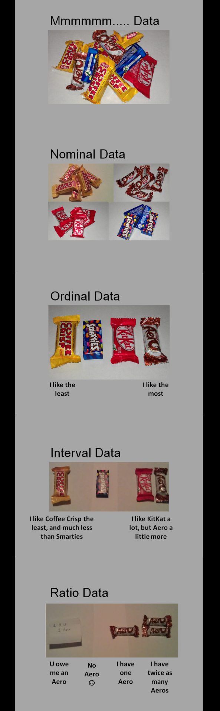

<details>

<summary><a>▼ Falls das bis jetzt alles zu verwirrend war und zu schnell ging hier ein freundlicher Guide durch all diese Worte </a></summary>


Das Schokobild fasst eigentlich alles zusammen. Für die Menschen, die das gerne nochmal etwas ausführlicher sehen wollen, folgt ein Entscheidungsbaum. Er ist als Gespräch mit einer Variablen über ihre Inhalte aufgebaut.


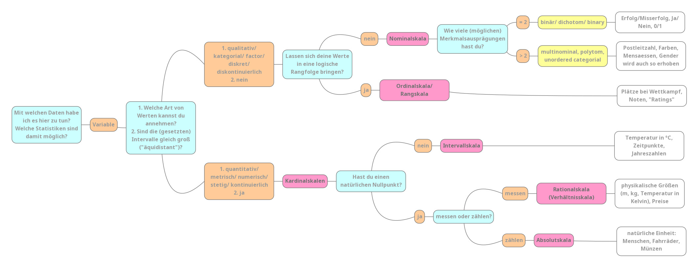{width="100%"}

#### Fall 1: Nominalskala

Und auch hier was Süßes für den Anfang:

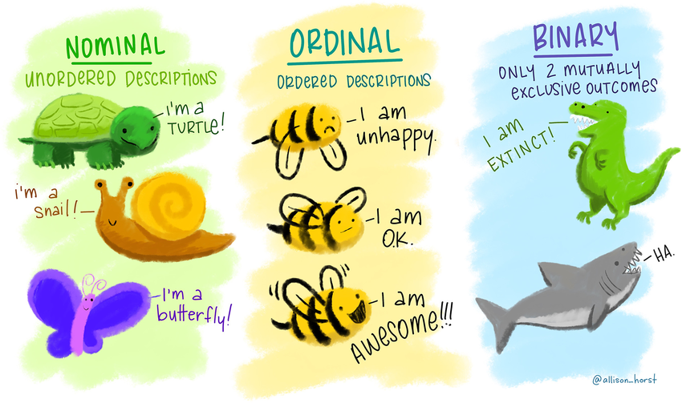{width="70%"}

Und jetzt nochmal bisschen ausführlicher...

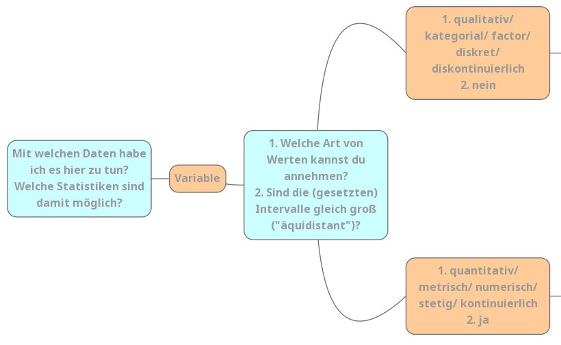
 
  - **Forschende:** *"Mit welchen Daten habe ich es hier zu tun? Welche Statistiken sind damit möglich?"*
    - **Kommentar:** Deswegen werden die unterschiedlichen Skalenniveaus erst unterschieden: Von dem Skalenniveau hängt ab, was du damit rechnen kannst und darfst.
  - **Variable:** *"Hi! Du stellst Fragen und ich Antworte!"*
  - **F:** *Welche Art von Werten kannst du annehmen?/ Sind die (gesetzten) Intervalle gleich groß ("äquidistant")?*
    - **Kommentar:** zu 2. Bei so ungewohnten und teilweise neuen Wörtern hilft es mir immer, mir deren Ursprung klar zu machen. Hier: **äquidistant:** gleich weit voneinander entfernt. Das ergibt total viel Sinn:
      - *äqui* kennst du aus "*Äquivalenz*" = "*gleich*" 
      - *distant*: kennst du aus "*Distanz*" = "*Entfernung*"
      - bedeutet also, dass die Einheiten der Skala *gleich weit voneinander entfernt* sind - z.B. bei einem Lineal sind ja alle Striche gleich weit voneinander entfernt, in schlau also "die Striche sind äquidistant"
       
  - **Variable:** <i>"In diesem Fall: 1.: Meine Werte können **qualitativ bzw. kategorial bzw. factor bzw. diskret bzw. diskontinuierlich** sein und sind damit automatisch 2. **nicht** äquidistant"</i>
    - **Kommentar:** Diese Worte bedeuten für das Level auf dem du arbeitest erstmal alle das gleiche (du kannst sie also äquivalent benutzen, lol.) Falls es dich interessiert:
      - **qualitativ:** eine (charakteristische) Qualität (= Eigenschaft, Beschaffenheit) aufweisend
        - Gegensatz: quantitativ: die Quantität (= Menge) betreffend
      - **kategorial:** Kategorien (= Klasse, Gattung) betreffend
        - Gegentsatz: metrisch: messbar (gleicher Wortstamm wie Meter, deshalb als Eselbrücke: Ein Meter ist metrisch!)
      - **factor/ faktoriell:** nach Faktoren (= Aspekten/ Bestandteilen) aufgeschlüsselt UND: zentrale Objektklasse in R zur Berechnung genau dieser Skalen brauchen
        - Gegensatz: numerisch: eine Nummer (= Zahl) betreffend; Datentyp in R
      - **diskret:** durch _endliche_ Intervalle oder Abstände _voneinander getrennt_. 
        - Ein bisschen wie Sekret: etwas das abgesondert wird. 
        - Eselsbrücke: diskret = konkret.
        - Gegensatz: stetig: beständig, kontinuierlich; (wie du es auch im Alltag nutzt)
      - **diskontinuierlich**: _nicht_ kontinuierlich, unterbrochen
        - Gegensatz: kontinuierlich: ununterbrochen, stetig (so wie du es auch im Alltag benutzt; auch: Kontinuum)
    
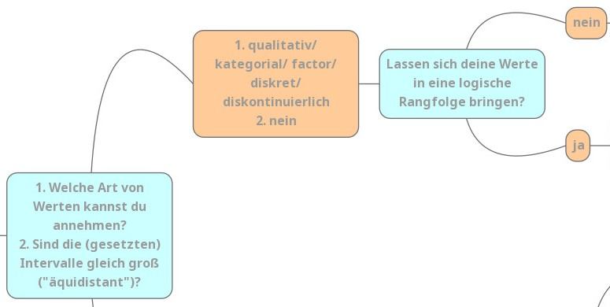  
  
  - **Variable:** *"Will sagen: meine Werte lassen sich in ein Kategoriensystem einordnen"*
  - **Forschende:** *"Ok, cool! Lassen deine Werte sich in eine logische Reihenfolge bringen?"*
  - **V:** *"Nein!"*

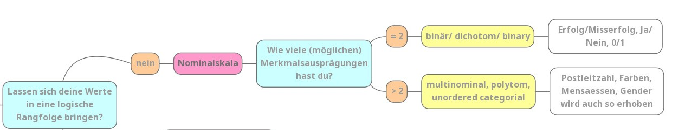{width="100%"}

  - $\to$ __**NOMINALSKALA**__
    - **Nomen**: Namen. Daten können anhand von namentlichen (nicht zahlenmäßigen) Einheiten unterschieden werden
    - Die Charakteristiken der Nominalskala:
      - Die Merkmalsausprägungen liegen in **Kategorien** vor.
      - Es gibt **keine** logische Rangfolge
      - Beispiele: Prüfung bestanden? Farbe deine Fahrrades?
      - Zugelassene logische Operaturen sind gleich ($=$) und ungleich ($\neq$)
        - rot $=$ rot
        - rot $\neq$ grün
    - Es wird noch einmal zwischen **binären** und **multinominalen** Skalen unterschieden. Das ist so, weil manche Statistiken sich nur mit binären bzw. multinominalen Variablen rechnen lassen.
      - **binär**: zwei Ausprägungen verwendend; Wortstamm: Bi: Zwei (wie in **Bi**närcode, **Bi**sexualität oder auch non-**bi**när)
      - **multinominal**: mehrere Ausprägungen verwendend
        - Multi: Viel (Multivitaminsaft)
        - nominal: den Nennwert betreffend; s. Nomen weiter oben

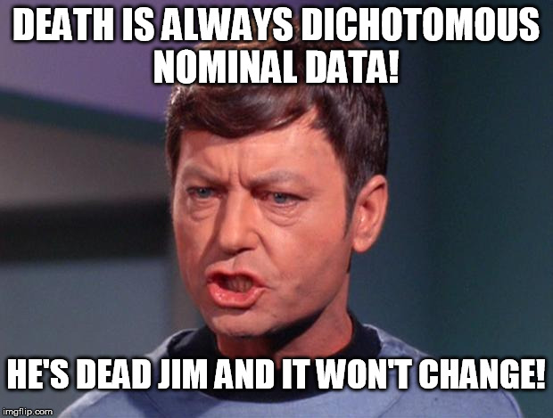{width="50%"}

#### Fall 2: Ordinalskala

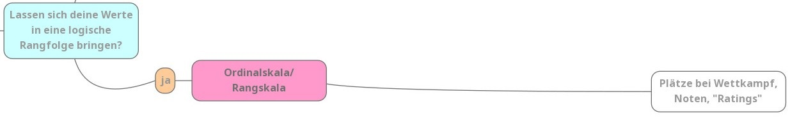{width="100%"}

  - **Forschende:** *"Okay, also deine Werte sind diskret. Lassen sie sich in eine logische Rangfolge bringen?"*
  - **V:** *"JA!"*
  - $\to$ __**ORDINAL- / RANGSKALA**__
    - **Ordinal**: eine Ordnung (Rangfolge) anzeigend
    - Die Charakteristiken der Ordinalskala:
      - Die Merkmalsausprägungen liegen in **Kategorien** vor, welche eine logische Rangfolge haben
      - Beispiele: Kleidergrößen (S < M < L), Plätze bei Wettkämpfen (1 < 2 < 3)
      - Zugelassene logische Operaturen sind neben gleich ($=$) und ungleich ($\neq$) auch kleiner ($<$) und größer ($>$)
        - S $=$ S
        - S $\neq$ M
        - S $<$ L
        - L $>$ M

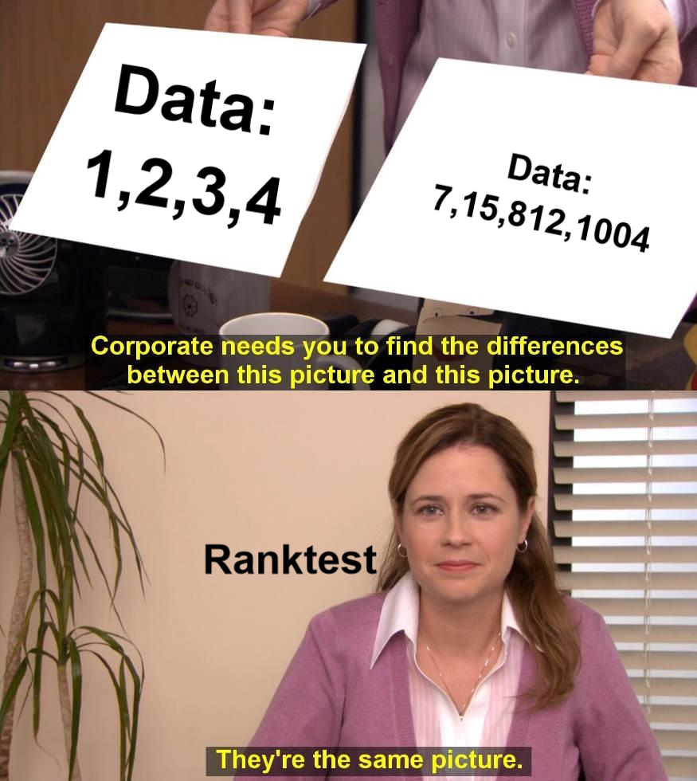{width="50%"}

#### Fall 3: Intervallskala

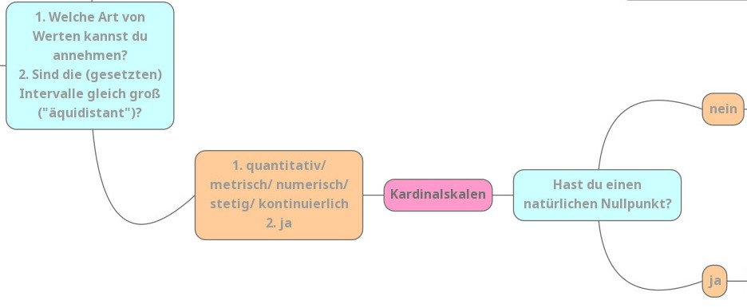{width="100%"}

  - **Forschende:** *"Ich mal wieder. 1. Welche Art von Werten kannst du annehmen?/ 2. Sind die (gesetzten) Intervalle gleich groß ("äquidistant")?"*
  - **Variable:** *"1. quantitativ/ metrisch/ numerisch/ stetig/ kontinuierlich. 2. ja"*
  - $\to$ __**KARDINALSKALEN**__:
    - **kardinal**: besonders wichtig, vorzüglich (weil wir damit besonders viele besonders gute Statistiken rechnen können)
    - zum merken: ein Kardinal in der katholischen Kirche ist der höchste Würdenträger nach dem Papst - also auch besonders wichtig
  - **F:** *"Okay, eine letzte Frage noch: Hast du einen natürlichen Nullpunkt?"*
  - **V:** *"Nö!"*

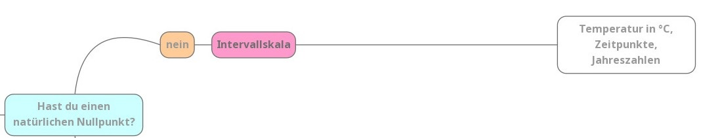

  - $\to$ __**INTERVALLSKALA**__: 
    - **Intervall**: Bereich zwischen zwei Punkten auf einer Strecke oder Skala. Die Unterschiede auf dieser Skala werden in Intervallen angegeben und sind alle gleich groß.
    - Die Charakteristiken der Intervallskala:
      - Die Merkmalsausprägungen liegen äquidistanten (gleichgroßen) Intervallen vor
      - Beispiele: Temperatur in Grad Celsius, Jahreszahlen
      - Zugelassene logische Operaturen sind neben gleich ($=$), ungleich ($\neq$), kleiner ($<$) und größer ($>$) auch Plus ($+$) und Minus ($-$)
        - 10°C $=$ 10°C
        - 10°C $\neq$ 15°C
        - 10°C $<$ 20°C
        - 10°C $>$ 5°C
        - 10°C $+$ 1°C $=$ 11°C
        - 10°C $-$ 2°C $=$ 8°C
          
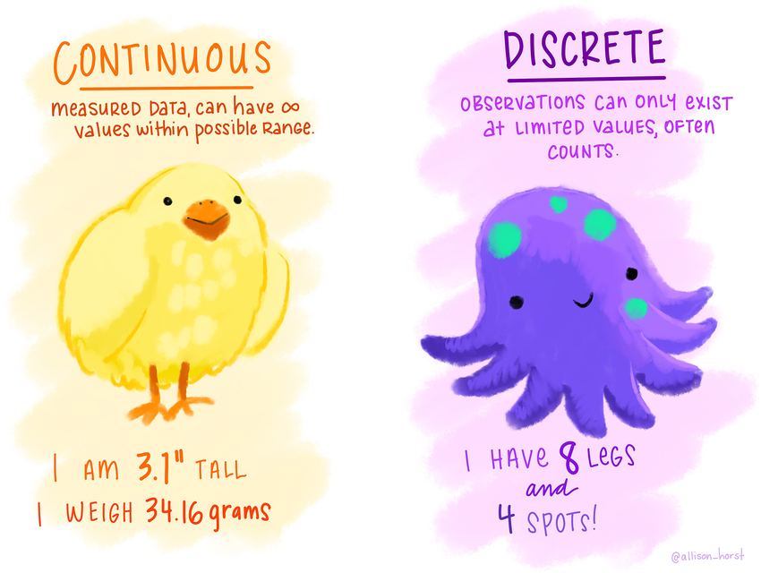{width="50%"}

#### Fall 4: Verhältnisskala/ Rationalskala

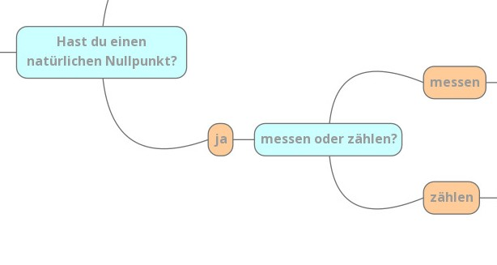

  - **Forschende:** *"Okay, deine Daten sind numerisch. Haben sie einen absoluten Nullpunkt?"*
  - **Variable:** *"Ja!"*
  - **F:** *"Erhebe ich deine Daten mit messen oder zählen?"*
  - **V:** *"Messen."*
  
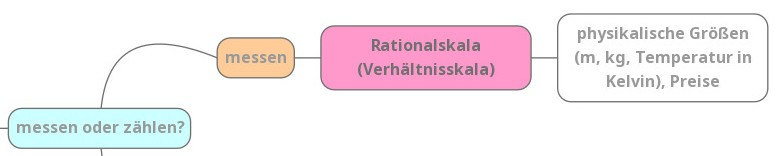

  - $\to$ __**RATIONAL-/ VERHÄLTNISSKALA**__
    - **Ratio**: Vernunft
      - rational: vernünftig
      - Eselsbrücke: Wer vernünftig ist, ist verhältnismäßig.
    - Charakteristiken der Verhältnisskala:
      - bildet Verhältnisse von Zahlen adäquat ab
      - Hat einen absoluten Nullpunkt
      - Beispiele: physikalische Größen wie Meter, Kilogramm, Temperaturen in Kelvin
      - Zugelassene logische Operatoren: neben $=$, $\neq$, $<$, $>$, $+$ und $-$ auch Multiplikationen $\cdot$ und Divisionen $:$
        - 1m $=$ 1m
        - 1m $\neq$ 2m
        - 1m $<$ 3m
        - 1m $>$ 0.5m
        - 1m $+$ 4m $=$ 5m
        - 1m $-$ 0.3m $=$ 0.7m
        - 1m $\cdot$ 6 $=$ 6m
        - 1m $:$ 10 $=$ 0.1m

#### Fall 5: Absolutskala


  - **Forschende:** *"Okay, deine Daten sind numerisch. Haben sie einen absoluten Nullpunkt?"*
  - **Variable:** *"Ja!"*
  - **F:** *"Messen oder zählen?"*
  - **V:** *"Zählen!"*
  - $\to$ __**ABSOLUTSKALA**__
  - **absolut**: ganz und gar (es geht um ganze Zahlen/ Dinge/ natürliche Einheiten/ Stück)
  - bildet Verhältnisse von Zahlen adäquat ab
  - Hat einen absoluten Nullpunkt
  - Beispiele: Menschen, Fahrräder, Münzen etc.
  - Zugelassene logische Operatoren (wie Rationalskala): neben $=$, $\neq$, $<$, $>$, $+$ und $-$ auch Multiplikationen $\cdot$ und Divisionen $:$
    - 1 Fahrrad $=$ 1 Fahrrad
    - 1 Fahrrad $\neq$ 2  Fahrräder
    - 1 Fahrrad $<$ 3  Fahrräder
    - 1 Fahrrad $>$ kein Fahrrad
    - 1 Fahrrad $+$ 4  Fahrräder $=$ 5  Fahrräder
    - 30  Fahrräder $-$ 6  Fahrräder $=$ 24  Fahrräder
    - 1 Fahrrad $\cdot$ 6 $=$ 6  Fahrräder
    - 20 Fahrrad $:$ 10 $=$ 2  Fahrräder


Zusammenfassung: Daten sind entweder in Kategorien, geordneten Kategorien oder Zahlen da. Das nennt sich: nominal, ordinal, metrisch.


<\details>

Schau doch mal in dem Quizz, was von diesen Inhalten so hängen geblieben ist:

### Quizz zu Skalenniveaus

```{r relationen, echo=FALSE}
question("Welche Beziehungen können auf dem Ordinalskalenniveau abgebildet werden? (mehrere Antworten)",
  answer("Ungleichheit", correct = TRUE),
  answer("Rangfolge", correct = TRUE),
  answer("Proportionen", message = "Proportionen können nur auf einer metrischen Skala dargestellt werden"),
  answer("Abstände", message = "Die Bestimmung der Größe von Abständen der Skalenpunkte kann nur für metrische Skalen durchgeführt werden. Wie weit 'klein' zu 'sehr klein' entfernt ist lässt sich nicht ermitteln, hingegen der Abstand von '20cm' zu '10cm' berechnet werden kann."),
  allow_retry = T
)
```

```{r sk2, echo=FALSE}
question("Welche der folgenden Skalen werden unter dem Begriff *metrisch* zusammengefasst? (mehrere Antworten)",
  answer("Nominalskala", message = "Die Nominalskala ist nicht metrisch, da ihre Kategorien nicht miteinander vergleichbar sind: z.B. grün und blau"),
  answer("Ordinalskala", message = "Die Ordinalskala ist nicht metrisch, da ihre Kategorien sich zwar in Rangfolge bringen lassen, aber die Abstände und "),
  answer("Intervallskala", correct = TRUE),
  answer("Verhältnisskala", correct = TRUE),
  answer("Absolutskala", correct = TRUE),
  allow_retry = T
)
```

```{r sk3, echo=FALSE}
question("Welche Skalen-Eigenschaften treffen auf den erreichten Rang in einem Wettkampf zu? (mehrere Antworten)",
  answer("metrisch"),
  answer("kategorial", correct = TRUE),
  answer("intervallskaliert"),
  answer("ordinalskaliert", correct = TRUE),
  answer("quantitativ", correct = TRUE),
  answer("qualitativ"),
  answer("stetig"),
  answer("diskret", correct = TRUE),
  try_again = "Hilfestellung: Begriffspaare, von denen jeweils nur einer ausgewählt werden kann: [quantitativ - qualitativ] [stetig - diskret] [intervall - ordinal] [metrisch - kategorial]",
  post_message = "Der Rang ist: \n
  - kategorial, da die Ränge mit abgrenzbaren Kategorien gleichzusetzen sind
  - ordinal, da Rangfolge die höchste abgebildete Relation ist - Abstände zwischen den Plätzen können nicht sinnvoll interpretiert werden, bzw. wir wissen nicht, wie viel schneller der erste Platz als der zweite Platz geschwommen ist. 
  - quantitativ, da der Rang sinnvoll numerisch interpretierbar ist - qualitativ wäre hingegen, wenn der Medaillenname angegeben wird (Gold, Silber, Bronze)
  - diskret, da es keine Plätze zwischen dem ersten und zweiten Platz gibt",
    allow_retry = T
  )
```


## Skalenniveaus in R

Falls das Quizz noch nicht ganz erfolgreich war, nicht verzagen, wir brechen es nochmal auf das Wesentliche runter:

In R können wir verschiedene Skalenniveaus finden, darunter nominale, ordinale, Intervall-, Verhältnis- und Absolutsskala. Jedes Skalenniveau hat unterschiedliche Eigenschaften und erfordert spezifische Analysemethoden. Hier eine kurze Zusammenfassung der Skalenniveaus:

**Nominale Skala**

- Eigenschaften: Kategorien ohne Rangfolge, **nur Unterscheidung** möglich.
- Beispiel: Farben (blau, rot, grün)

**Ordinale Skala**

- Eigenschaften: Kategorien mit **Rangfolge**, aber der Abstand zwischen den Kategorien ist nicht bekannt.
- Beispiel: Schulabschluss (ohne Schulabschluss, mit Schulabschluss, Abitur, Hochschulabschluss)

**Intervallskala**

- Eigenschaften: Bekannte Rangfolge und **bekannter Abstand zwischen den Werten**, aber kein absoluter Nullpunkt.
- Beispiel: Temperatur in Celsius (kein natürlicher Nullpunkt) (-2, 13, 23)

**Verhältnisskala**

- Eigenschaften: Bekannte Rangfolge, bekannter Abstand und **absoluter Nullpunkt**.
- Beispiel: Gewicht in Kg (0.2, 40, 100)

**Absolutskala**

- Eigenschaften: Bekannte Rangfolge, bekannter Abstand, absoluter Nullpunkt und **natürliche Einheiten**
- Beispiel: Anzahl an Fahrrädern im Keller (0, 3, 12)

::: blau-nb
Für dich wichtig im Umgang mit R: Die nominale und orinale Skala beinhalten **kategoriale** Variablen die Intervall-, Verhältnis- und Absolutskala hingegen **metrische** Variablen.
:::
</br>

R bietet hauseigene Datenformate an, um Daten in unterschiedlichen Skalenniveaus gut zu repräsentieren. Hier ist eine Auswahl davon:

::: grau-nb
-   `character`: Text
-   `factor`: effizienter als Text
-   `ordered factor` Sonderfall für ordinale Daten
-   `double`: für Zahlen
:::
</br>


Nehmen wir folgenden Beispieldatensatz (`einkaufen`):

Diese Daten wurden von Studierenden im Rahmen dieser Vorlesung im WiSe 2022-23 erhoben. Dabei fokussieren wir uns auf verschiedene Fälle:

-   Das *Lieblingsessen* von Bioladenbesucher\*innen (*nominal*)
-   Das *Verkehrsmittel*, mit dem sie zum Laden gekommen sind (*nominal*)
-   Die *Frequenz*, mit der sie einkaufen gehen (*ordinal*)
-   Den *Weg*, den sie zurückgelegt haben in Kilometern (*metrisch*)

```{r echo=FALSE}
head(rtutorials::einkaufen) |> dplyr::select(Essen, Verkehrsmittel, Frequenz, Weg) |> dplyr::mutate(Essen = as.character(Essen))
```

Kurze Wiederholung:
Hier sehen wir die obersten 6 Zeilen des Datensatzes. Wofür könnten die kleinen Abkürzungen `chr`, `fctr`, `ord` und `dbl` stehen?

```{r abk, echo=FALSE}
quiz(caption = "Wofür könnten die Abkürzungen stehen?",
  question_text("chr",
                answer("character", correct = TRUE),
                answer("text", correct = TRUE),
                answer("Character", correct = TRUE),
                allow_retry = TRUE
  ),
   question_text("fctr",
                answer("factor", correct = TRUE),
                answer("Factor", correct = TRUE),
                answer("Faktor", correct = TRUE),
                allow_retry = TRUE
  ),
   question_text("ord",
                answer("ordered factor", correct = TRUE),
                answer("Ordered Factor", correct = TRUE),
                answer("geordneter Faktor", correct = TRUE),
                allow_retry = TRUE
  ),
   question_text("dbl",
                answer("double", correct = TRUE),
                answer("double precision floating point number", correct = TRUE),
                answer("Double", correct = TRUE),
                allow_retry = TRUE
  )
)
```

| Abkürzung | Datenformat                            | geeignet für       |
|-----------|----------------------------------------|--------------------|
| \<chr\>   | character                              | Text               |
| \<fctr\>  | factor                                 | nominale Daten     |
| \<ord\>   | ordered factor                         | ordinale Daten     |
| \<dbl\>   | double precision floating point number | quantitative Daten |

*Bei `character`-Variablen werden die Inhalte als reiner Text gespeichert.

::: blau-nb
Merke: für *nominale* und *ordinale*, also *kategoriale* Variablen, bietet sich das Datenformat `factor` bzw. ein `ordered Factor` an. 

Bei *metrischen* Variablen können wir mit den gewohnten *doubles* rechnen.
:::
</br>

Schauen wir uns also an, welche Datenformate für die Variablen in dem Beispieldatensatz genutzt wurden:

::: aufgabe
Untersuche mit der Funktion class() welche Datenformate für die verschiedenen Variablen genutzt wurden
1) `essen` (Lieblingsessen)
2) `verkehrsmittel` (Welches Verkehrsmittel wird zum Einkauf verwendet)
3) `frequenz` (Wie oft wird eingekauft in 5 Kategorien)
4) `weg` (Weg in Km)
:::

```{r einkaufen}
# load einkaufen for upcoming exercises
einkaufen <-  data.frame(rtutorials::einkaufen)
#changing variable names to lower case
colnames(einkaufen) <-  tolower(colnames(einkaufen))
```

```{r class, exercise = TRUE, exercise.setup = "einkaufen"}
class()
class()
class()
class()
```
```{r class-solution}
class(einkaufen$essen)
class(einkaufen$verkehrsmittel)
class(einkaufen$frequenz)
class(einkaufen$weg)
```


```{r wassiehstdu}
learnr::question_radio("Was kannst du erkennen??",
                       answer("Die metrische Variable ist als `numeric` gespeichert",
                              correct = TRUE,
                              message = "Die Variable `weg` ist metrisch skaliert und daher als numeric gespeichert"),
                       answer("Die metrische Variable ist als `factor` gespeichert",
                              message = "Metrische Variablen sollten als numeric gespeichert werden."),
                       answer("Die nominale Variable(n) sind als `numeric` gespeichert",
                              message = "nominale Variablen sollten als `factor` gespeichert werden, da ihre numerischen Werte nur repräsentativ für eine Beschriftung sind."),
                       answer("Die ordinale Variable ist als ordered factor gespeichert",
                              correct = TRUE,
                              message = "Ordinale Variable kann in einem ordered factor ihre Rangfolge aufrecht erhalten und sollte daher stets als solche abgespeichert werden."),
                       allow_retry = TRUE)
```


Was es genau mit dem Datenformat `factor` auf sich hat erfährst du im nächsten Kapitel.

## kategoriale Variablen

In der Forschung werden kategoriale Variablen meist in sogenannte *Codes* übersetzt. So werden die Kategorien nicht mehr als Text, sondern als Zahlen repräsentiert. Dies ist v.a. beim händischen Erfassen oder Digitalisieren der Daten unablässlich, denn niemand möchte "ohne Schulabschluss" mehr als 25 Mal aufschreiben oder abtippen müssen. Stattdessen wird ein sog. *Codebook* erstellt, in dem die jeweiligen Codes aufgeschlüsselt werden.

Das könnte z.B. so aussehen:
```{r, echo=FALSE}
# Beispiel für ein Codebook für die Variable 'verkehrsmittel'
verkehrsmittel <- factor(c("1", "2", "3", "4"))

# Tabelle erstellen
codebook <- data.frame(
  Level = levels(verkehrsmittel),
  Label = c("Auto", "Zu Fuß", "Fahrrad", "ÖPNV"),
  Description = c(
    "Eigenes Kraftfahrzeug",
    "Zu Fuß unterwegs",
    "Fahrrad als Fortbewegungsmittel",
    "Öffentliche Verkehrsmittel"
  )
)
codebook
```

Da diese Verwendung von Codes gängige Praxis sind, gibt es in R einen Befehl, der den Umgang mit kategorialen Variablen und ihren Codes vereinfacht: `factor()`

### Die Factor()-Funktion

Warum brauchen wir die `factor()`-Funktion?

1. **Interpretation von Kategorien:** Kategoriale Variablen können eine begrenzte Anzahl von Kategorien haben, z. B. Farben, Geschlecht oder Verkehrsmitteltypen. Der Befehl `factor()` weist diesen Kategorien numerische Codes zu, um die Daten in einer numerischen Form darzustellen, die R verstehen kann.

2. **Ordinalität beachten:** Bei ordinalen kategorialen Variablen, bei denen die Reihenfolge der Kategorien wichtig ist (z. B. Bildungsniveau - Grundschule, Mittelschule, Hochschule), ermöglicht `factor()` die korrekte Berücksichtigung dieser Ordnung.

3. **Unterstützung in R-Funktionen:** Viele R-Funktionen, insbesondere für statistische Analysen und Datenvisualisierung, sind darauf ausgelegt, mit faktorisierten Variablen zu arbeiten. Dies erleichtert die Interpretation von Ergebnissen und die Erstellung aussagekräftiger Grafiken.

4. **Vermeidung von unerwartetem Verhalten:** Wenn wir numerische Codes ohne `factor()` verwenden, könnte R die Variable als kontinuierlich interpretieren und unerwartetes Verhalten in statistischen Analysen oder Visualisierungen verursachen.

Wir benutzten also den Befehl `factor()`, denn er hilft dabei, kategoriale Variablen korrekt zu repräsentieren, was für die Analyse und Interpretation von Daten in R von entscheidender Bedeutung ist.

#### Erklärung der Funktion

Schauen wir uns also an, wie du diesen nützlichen Befehl verwenden kannst.

In der Hilfe-Seite siehst du, dass der Befehl verschiedene Argumente hat:
`factor(x = character(), levels, labels = levels, exclude = NA, ordered = is.ordered(x))`

- *x*: Hier gibst du den Vektor oder die Spalte eines Data Frames an, den du in einen Faktor umwandeln möchtest.
- *levels* (optional): Hier kannst du die *eindeutigen Werte* oder Kategorien für deine kategoriale Variable festlegen.
- *labels* (optional): Dieses Argument erlaubt es dir, *textuelle Beschreibungen* (Labels) für die einzelnen Levels der kategorialen Variable zuzuweisen. Diese sollten *exakt der Aufzählungsreihenfolge der Levels entsprechen*!

#### Beispiel

Nehmen wir an wir haben einen Vektor an Verkehrsmittel für den wir folgendes Codebook erstellt haben:

| Level | Label   |
|-------|---------|
| 1     | Auto    |
| 2     | Zu Fuß  |
| 3     | Fahrrad |
| 4     | ÖPNV    |

Die Level sind also die Zahlen 1-4 die wir respektive für die Kategorien Auto, Zu Fuß, Fahrrad und ÖPNV nutzen.

```{r facample, exercise = TRUE}
# Erstellen eines Beispielvektors
verkehrsmittel <- c(1:4)

# den Vektor in einen Beispiel-Data-Frame laden
df <- data.frame(verkehrsmittel)

# dieser Code dient nur zur Veranschaulichung des Konzepts, dass level und label aufeinander abgestimmt sein müssen
df$verkehrsfactor <- factor(df$verkehrsmittel, levels = c(1,2,3,4), labels = c("Auto", "Zu Fuß", "Fahrrad", "ÖPNV"))

```

Wir können uns mit dem Befehl levels() auch die entsprechenden Werte anzeigen lassen

```{r facample2, exercise = TRUE, exersise.setup="facample"}
# Beispiel 
df$verkehrsmittel
levels(df$verkehrsfactor)
df
```

Wir sehen, der verkehrsfactor zeigt nun nur noch die - für uns leicht interpretierbaren -  Labels an.

::: info
Es ist also wirklich extrem wichtig, dass du bei der Benennung deines factors darauf achtest, dass du die Zuordnung von `levels` und `labels` mit dem jeweils richtigen Element in der richtigen Reihenfolge durchführst, denn von jetzt an wird R dir nur noch die Label anzeigen.
:::

### Ordinale Daten

Da auch ordinale Daten kategorial sind, sollten auch hier Faktoren genutzt werden. Da hier eine Rangfolge der Kategorien herrscht, sollte diese auch in den Daten verteten sein. In R kannst du ordinal skalierte Vektoren erstellen, indem du das Argument `ordered = TRUE` im `factor()`-Befehl verwendest. Dies signalisiert R, dass die Werte eine bestimmte Ordnung haben. Setzt du das *logische Argument* `ordered =  FALSE` so geht R davon aus, dass die Werte keine Ordnung haben.

::: info
Im Allgemeinen gilt: Wenn die Reihenfolge der Levels für die Interpretation wichtig ist (wie bei "niedrig", "mittel", "hoch"), ist es sinnvoll, den Faktor als geordnet (ordered = TRUE) zu kennzeichnen, um sicherzustellen, dass die Reihenfolge bei grafischen Darstellungen und statistischen Analysen korrekt berücksichtigt wird.
:::

{width="60%"}

Source: [Youtube.com](https://www.youtube.com/channel/UCwArXqlGpT6ANMwVVtYTtLw?view_as=subscriber)

</br>

Schauen wir uns ein Beispiel dazu an. Hier wurden die Level nicht als numerischer Code gespeichert, sondern sind bereits als Text hinterlegt (z.B. bei online erfassten Daten nicht unüblich), daher arbeiten wir hier nur mit den `levels` und nicht mit den `labels`.  

```{r order, exercise = TRUE}
# Beispielvektor
beispiel_vektor <- c("niedrig", "mittel", "hoch", "mittel", "niedrig")

# Vektor erstellen und nicht sortieren
factor_vektor <- factor(beispiel_vektor, ordered = FALSE, levels = c("niedrig", "mittel", "hoch"))

# Level anpassen

sortierter_vektor <- factor(factor_vektor, ordered = TRUE, levels = c("niedrig", "mittel", "hoch"))

beispiel_vektor
ordinal_vektor
sortierter_vektor
```

<details>

<summary><a>▼ *Was fällt dir an der Ausgabe auf?* </a></summary>

Der Befehl hat dazu geführt, dass die Levels mit "<" versehen werden, um zu zeigen, in welcher Rangfolge diese organisiert sind.

</details>

Sehen wir uns ein weiteres Beispiel an:

Auch hier kannst du die Werte mittels des Argumentes `ordered = TRUE` sortieren. Dazu schauen wir uns aus dem Beispieldatensatz die Variable `frequenz` an. Diese ist ordinalskaliert und die ersten 20 Einträge sehen so aus:

```{r frequenz}
head(rtutorials::einkaufen$Frequenz, 20)
```

Wenn du das Argument `ordered = ` auf TRUE setzt, dann speichert R die Level in einer Reihenfolge. Doch Obacht: R kann ja die Inhalte nicht lesen. Das bedeutet, dass R das nach dem zweitlogischsten Schema sortiert: Anfangsbuchstaben (kommen ja keine Zahlen vor). 

Deswegen musst du R auch noch sagen, in welcher Reihenfolge die Level gespeichert werden sollen. Das machst du mit dem Argument `levels = c()"`, und gibst dort die Reihenfolge ein. Um das zu demonstrieren ist die Variable Frequenz zurücktransformiert in einen schlichten unsortierten character Vektor mit dem Namen `frequenz`.

```{r of-setup, exercise.setup="einkaufen"}
frequenz <- as.character(einkaufen$frequenz)
```


```{r of, exercise = TRUE, exercise.setup="of-setup"}
head(frequenz, 20)

# als factor speichern.
frequenz <- factor(frequenz) 

# oh no! das ist ja die falsche Reihenfolge. Deswegen nochmal von vorn:
levels(frequenz)             

# den factor mit levels definieren und R mittels ordered = T anzeigen, dass diese in einer Rangfolge sind
frequenz <- factor(frequenz, 
                   levels = c("mehrfach die Woche", "einmal die Woche", "alle zwei Wochen",  "einmal im Monat", "seltener"), 
                   ordered = T)
levels(frequenz)            # Puh! jetzt ist ja alles gut :)
```

::: blau-nb
Du wirst wahrscheinlich gemerkt haben, dass R bei der Rangfolge davon ausgeht, das diese mit jedem Item steigt. 
:::

Daher wäre es sauberer die `levels` auch entsprechend dieser Rangfolge einzugeben. Versuch es doch einmal selbst:

::: aufgabe
Erstelle für die Variable `datum` einen `ordered factor` namens `ordereddate`
:::

```{r datum1, exercise = TRUE, exercise.setup="einkaufen"}
# lasse dir zuerst anzeigen welche Werte die Variable Datum enthält
table(einkaufen$datum)
```

```{r datum1-hint}
ordereddate <-  factor(einkaufen$datum, levels = c(), ordered = )
```

```{r datum1-solution}
ordereddate <-  factor(einkaufen$datum, levels = c("2022-11-09", "2022-11-10", "2022-11-12", "2022-11-14"), ordered = TRUE)
ordereddate
```

WOW! Das war gar nicht so leicht! Super gemacht! Dir sind bei der Ausgabe wahrscheinlich die "NA"s aufgefallen, um die werden wir uns in einem kommenden Tutorial kümmern, wenn es darum geht, die Daten zu "säubern". 

Für dieses Tutorial hast du es jetzt erstmal geschafft. 🥳

## Abschlussquiz

```{r abschluss}

quiz(
  question(text = "Welche Qualitäten lassen sich der Nominalskala zuordnen?",
         answer("qualitativ", correct = T),
         answer("quantitativ"),
         answer("kategorial", correct = T),
         answer("metrisch"),
         answer("diskret", correct = T),
         allow_retry = T, random_answer_order = T
         ),
  question("Welche Qualitäten lassen sich der Intervallskala zuordnen?",
           answer("stetig", correct = T),
           answer("diskontinuierlich"),
           answer("kontinuierlich", correct = T),
           answer("Intervalle sind nicht äquidistant"),
           answer("Intervalle sind äquidistant", correct = T),
           allow_retry = T, random_answer_order = T
  ),
  question("Welche Qualitäten lassen sich der Ordinalskala zuordnen?",
           answer("stetig"),
           answer("kategorial", correct = T),
           answer("kontinuierlich"),
           answer("Intervalle sind nicht äquidistant", correct = T),
           answer("Intervalle sind äquidistant"),
           allow_retry = T, random_answer_order = T
  ),
  question("Welche Zahlenfolgen sind aus Sicht der Ordinalskala absolut gleich zu c(1, 2, 3)",
           answer("0, 1, 2", correct = T),
           answer("109, 100, 320"),
           answer("100348, 100349, 1000349", correct = T),
           answer("rot, grün, blau"),
           allow_retry = T, random_answer_order = T
           )
)
```


## Learnings

So hast du heute abgeschnitten:

```{r context="server"}
# Shiny App um die Anzahl richtig beantworteter Fragen anzuzeigen. 
# Funktioniert in jedem Tutorial

shiny::observeEvent(
  input$get_score, 
  {
    objs2 = learnr:::get_tutorial_state()
    
    # Number of correct questions
    
    n_correct <- 
      # Access the $correct sublist item in each list item
        lapply(objs2, purrr::pluck, "correct") |>
           # make it a vector containing: TRUE and FALSE and NAs
           # NA is appearing for list items which don't have
           # a $correct subitem
                unlist() |> 
           # Taking the sum of a logical Vector returns the number of TRUEs
                sum(na.rm=TRUE)
    
    # Number of total questions
    
    total_questions <- 
      # 1. Access $type in each list item and make it a vector of types
      lapply(objs2, purrr::pluck, "type") |> unlist()
    
    # 2. Count the number of "question" in that vector
    total_questions <- total_questions[total_questions == "question"] |> 
      length()
      
      
    output$score = shiny::renderText(
      paste0(n_correct, " von ", total_questions,
        " im gesamten Tutorial beantworteten Fragen waren richtig.")
)
    invisible()
  }
)
```

```{r score, echo=FALSE}
shiny::br()
shiny::actionButton("get_score", "Auswertung!")
shiny::br()
shiny::br()
shiny::textOutput("score")
shiny::br()
```


### Zusammenfassung

Herzlichen Glückwunsch! Du hast nun die Grundlagen des Umgangs mit verschiedenen Skalenniveaus in R kennengelernt. Diese Kenntnisse werden in deiner Reise durch die Datenanalyse von unschätzbarem Wert sein. Hier sind einige Punkte, die du behalten solltest:

1. **Skalenniveaus:** Verständnis der Skalenniveaus (nominal, ordinal, metrisch) ist entscheidend, um geeignete Analysemethoden auszuwählen und die Ergebnisse korrekt zu interpretieren.

2. **Faktoren in R:** Der Einsatz von Faktoren in R ermöglicht es dir, kategoriale Variablen effizient zu verwalten. Der `factor()`-Befehl ist besonders nützlich, um numerische Codes mit aussagekräftigen Labels zu versehen.

3. **Geordnete Faktoren:** Durch die Kennzeichnung von Faktoren als geordnet (`ordered = TRUE`) kannst du sicherstellen, dass die richtige Reihenfolge bei grafischen Darstellungen und statistischen Analysen berücksichtigt wird.

4. **Kontextbezug:** Denke daran, dass die Wahl des Skalenniveaus und die korrekte Verwendung von Faktoren von der Art deiner Daten und deiner Forschungsfragen abhängen. Es ist wichtig, die Kontextinformationen zu berücksichtigen.

Deine Fähigkeiten im Umgang mit Skalenniveaus werden dir dabei helfen, Daten präziser zu beschreiben, geeignete Analysen durchzuführen und fundierte Schlussfolgerungen zu ziehen. Dies bildet das Fundament für weiterführende Themen in der Statistik und Datenwissenschaft. Viel Erfolg bei deinen zukünftigen R-Abenteuern!

### Diese neuen Konzepte kennst du nun:

-  Skalenniveaus: Du verstehst die Unterschiede zwischen nominalen, ordinalen und metrischen Skalenniveaus und kannst ihre Bedeutung in statistischen Analysen erklären.

-  Faktoren in R: Du weißt, wie man Faktoren in R erstellt, insbesondere unter Verwendung des factor()-Befehls, um kategoriale Variablen mit Labels zu versehen.

- Geordnete Faktoren: Du kannst Faktoren als geordnet markieren und verstehst, warum dies wichtig ist, insbesondere wenn die Reihenfolge der Kategorien relevant ist.

- Codebook für Faktoren: Du kannst ein Codebook für Faktoren erstellen, das die Levels und Labels einer kategorialen Variable zusammen mit ihrer Bedeutung darstellt.

### Neue Funktionen

eine Tabelle mit den wichtigesten Codes des Tutorials

| Code                          | Beschreibung                                                     |
|-------------------------------|------------------------------------------------------------------|
| `factor(x)`                   | Erstellt einen Faktor aus einem Vektor.                          |
| `factor(x, levels = )`        | Erstellt einen Faktor mit spezifizierten Levels.                 |
| `factor(x, labels = )`        | Erstellt einen Faktor mit spezifizierten Labels.                 |
| `factor(x, levels, labels)`   | Erstellt einen Faktor mit spezifizierten Levels und Labels.      |
| `levels()`                    | Zeigt die Levels eines Faktors an.                               |


## Credit
Dieses Tutorial wurde größtenteils von Gesa Graf und Marie Klosterkamp sowie in Teilen von Lukas Bruelheide geschrieben. Bei der Erstellung (u.a. der Beispiele, Aufgaben und Zusammenfassung) wurde in Teilen von ChatGPT gebrauch gemacht.
