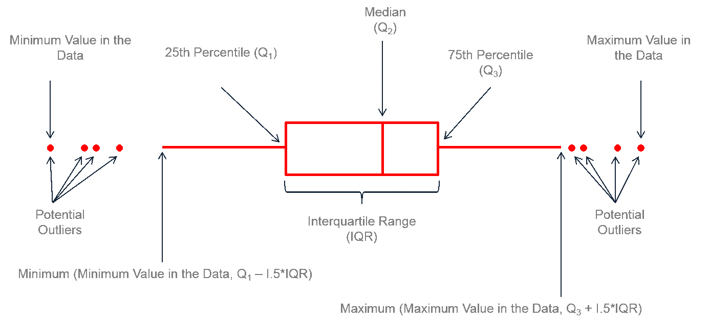

```{r setup, include=FALSE}
library(learnr)
knitr::opts_chunk$set(echo = FALSE)
library(ggplot2)
x <- c(1, 1, 9, 3, 6)
```

```{r ex}
x <- c(1, 1, 9, 3, 6)
```


## Inhalt

In diesem Tutorial lernst du, wie du Daten nicht nur zusammenfasst, sondern auch ihre Individualität berücksichtigst: Streuungsmaße. Besonders im Zentrum stehen hierbei die Varianz bzw. Standardabweichung.

## Lernziele

Am Ende des Tutorials kann ich:

-   <input type="checkbox" unchecked> die Spannweite von Daten berechnen </input>
-   <input type="checkbox" unchecked> die Varianz und Standardabweichung berechnen </input>
-   <input type="checkbox" unchecked> Quantile berechnen </input>

## Intuition bekommen

### Was ist Streuung?

Normalerweise hast du konkrete Datenpunkte und errechnest daraus die Varianz. Um die Zusammenhänge besser verstehen zu können wurde hier die Reihenfolge umgekehrt: Du veränderst am Schieberegler die Varianz und daraufhin verändern sich die Datenpunkte.

:::aufgabe
Mach dich mit den Zusammenhängen vertraut:

  - Wie sind die Punkte bei einer kleinen Varianz verteilt?
  - Wie bei einer mittleren?
  - Wie bei einer großen?
  - Wie bei keiner (=0)?
  
Was fällt dir auf?
:::

<br>

```{r ui}
            sliderInput("var",
                        "Varianz",
                        min = 0,
                        max = 50,
                        value = 5,
                        step = 0.1)

           plotOutput("distPlot")
```

```{r server, context = "server"}
 output$distPlot <- renderPlot({
       set.seed(1)
       y <- rnorm(5000, sd = sqrt(input$var))
       df <- data.frame(x = 1:5000, y)
       ggplot(df, aes(x, y)) +
         geom_hline(yintercept = 0, col = "blue") +
         geom_point(alpha = .4) +
         theme_void() +
         coord_cartesian(xlim = c(1, 5000), ylim = c(-25, +25))


    }) |> bindCache(input$var)
```

In den nächsten Kapiteln gehen wir der Frage nach, wie Streuung messbar gemacht werden kann. 


## Spannweite
Das einfachste Maß, um die Ausdehnung von Daten zu bestimmen, ist vermutlich das Minimum und Maximum.
Daraus ergibt sich dann die Spannweite (*range*).

Wir arbeiten mit Beispieldaten, die auch in der Vorlesung verwendet wurden:

```
x <- c(1, 1, 9, 3, 6)
```

```{r range, fig.height=2, out.width="100%"}
x <- c(1, 1, 9, 3, 6)

df <- data.frame(x)
ggplot(df, aes(x, y = 1)) +
  geom_point(size = 3) +
  geom_point(size = 3, aes(x = 1, y = 1.3)) +
  geom_segment(aes(y = 2, yend = 2, x = 1, xend = 9), 
               arrow = arrow(ends = "both", type = "closed", length = unit(0.1, "inches")),
               col = "red")+
  geom_label(label = "Range\n= 8", aes(y = 2, x = 5)) +
  scale_y_continuous(breaks = NULL,
                     limits = c(0.9, 2.6)) +
  scale_x_continuous(breaks = 0:10,
                     minor_breaks = NULL) +
  theme_bw() +
  labs(x = "x", y = "")
```

#### Umsetzung in R

::: aufgabe 
**1.**

Obwohl es in diesem Fall auch ohne Computer sehr überschaubar ist: verwende die R-Funktion
`range()`, um Minimum und Maximum zu bestimmen!
:::

```{r range_exercise, exercise = TRUE, exercise.setup = "ex"}
range(x)
```

Als Ergebnis steht ein Vektor mit zwei Zahlen: die erste bezeichnet das Minimum, die zweite das Maximum.

::: aufgabe
**2.**

Um nun die Spannweite zu berechnen, müssen wir $Max - Min$ rechnen. Das geht für dieses Beispiel im Kopf, aber wir üben ja für die schweren Fälle - deswegen nehmen wir wieder eine R-Funktion zu Hilfe: `diff()` um die Differenz zu berechnen. 

Füttere `diff()` mit dem Vektor, der durch `range(x)` ausgegeben wird.
:::

```{r range2, exercise = TRUE, exercise.setup = "ex"}
range(x)
```

```{r range2-solution}
diff(range(x))
```
```{r questionaes}
question_checkbox("Welches Skalenniveau muss mindestens vorhanden sein, um das Minimum und Maximum bestimmen zu können?",
                  answer("Nominal", message = "leider falsch, nominale Daten haben keine Reihenfolge"),
                  answer("Ordinal", correct = T, message = "ordinale Daten haben eine Reihenfolge"),
                  answer("Metrisch", message = "metrische Daten haben nicht nur eine Reihenfolge, sondern auch Abstände, die interpretierbar sind, was für Minimum und Maximum nicht nötig ist."), 
                  allow_retry = T)
```

```{r questionaes2}
question_checkbox("Welches Skalenniveau muss mindestens vorliegen, um die Spannweite zu berechnen?",
                  answer("Nominal", message = "Leider falsch, nominale Daten haben keine Abstände"),
                  answer("Ordinal", message = "Ordinale Daten haben leider keine Information über Abstände, weswegen das Bilden der Differenz zwischen Maximum und Minumum „illegal“ ist."),
                  answer("Metrisch", correct = T, message = "Genau! Nur metrische Daten enthalten Informationen über Abstände."), 
                  allow_retry = T)
```


## Varianz & Standardabweichung {data-progressive=TRUE}

### Streuung als Abweichung von einem Zentrum

Es ist ein einfaches und geniales Konzept: 

Streuung wird gemessen durch die gesamte Abweichung aller Werte von einem Zentrum.

Das Zentrum ist meistens der Mittelwert, aber es gibt auch weniger gebräuchliche Maße, die z.B. den Median als Zentrum verwenden. Wir fokussieren uns jetzt aber auf die Abweichungen vom Mittelwert, weil das das Fundament für Varianz, Standardabweichung, Korrelation und Regression ist!

### Abweichungen vom Mittelwert

In Rot siehst du den Abstand jedes einzelnen Werts zum Mittelwert.

```{r deviance, fig.width=3.5}
y <- c(1, 1, 9, 3, 6)
res <- y - mean(y)
df <- data.frame(x = 1:5, y = y, res = res, meanres = (y + mean(y)) / 2)
ggplot(df, aes(x, y)) +
  geom_hline(yintercept = mean(y), color = "blue") +
  geom_linerange(aes(ymin = mean(y), ymax = y), color = "red") +
  geom_point(size = 3) +
  geom_label(label = res, aes(x = x + 0, y = meanres)) +
  scale_y_continuous(breaks = 0:10) +
  scale_x_continuous(breaks = NULL) +
  theme_bw() +
  labs(x = "", y = "x")
```


Die Abstände ergeben sich, wenn man den Mittelwert von jedem einzelnen Wert abzieht: 

$\large x_i - \bar x$

+-----------------+----------+----------+----------+----------+----------+
| $x_i$           | 1        | 1        | 3        | 6        | 9        |
+=================+:=========+:=========+:=========+:=========+:=========+
| $\bar{x}$       | 4        | 4        | 4        | 4        | 4        |
+-----------------+----------+----------+----------+----------+----------+
| $x_i - \bar{x}$ | -3       | -3       | -1       | 2        | 5        |
+-----------------+----------+----------+----------+----------+----------+


: Abweichungen vom Mittelwert

#### wichtige Eigenschaft des Mittelwerts

Interessanterweise ist der Mittelwert so definiert, dass sich die Abweichungen gegenseitig aufheben, wenn sie alle addiert werden.

$$
{\large \sum_{i=1}^{n}{(x_i - \bar{x})}=0}
$$


Die Werte in der letzten Zeile stellen die Abweichungen vom Mittelwert dar. Wenn alle Werte der letzten Zeile addiert werden, kommt tatsächlich 0 heraus.

Das liegt an der Definition des Mittelwertes: Er liegt immer so, dass die negativen und die positiven Abweichungen sich gegenseitig aufheben.

Wie sähe eine mögliche Prüfung dieser Hypothese in R aus?


### Abweichungen vom Mittelwert berechnen

Um die Abweichungen vom Mittelwert ( $x_i - \bar{x}$ ) zu berechnen, wird der Mittelwert `mean(x)` von jedem einzelnen Wert des Vektors `x` abgezogen. Tatsächlich ist das in R so einfach, dass es fast nicht zu glauben ist - R's Mächtigkeit im Umgang mit Vektoren lässt grüßen!

```{r, echo=TRUE}
x - mean(x)
```

Als Ergebnis entsteht ein neuer Vektor mit den Abweichungen vom Mittelwert.

Jetzt sind bist du gefragt!

::: aufgabe
**Anwendungsaufgabe**

Prüfe, ob die Summe aller Abweichungen vom Mittelwert wirklich 0 beträgt.

Übersetze dazu die Formel $\sum{(x_i - \bar{x})}=0$ in R Code!

Denke an deine bereits erlangten Kenntnisse der letzten Tutorials.

:::

```{r deviation-setup}
x <- c(1, 1, 9, 3, 6)
```

```{r deviation-solution}
sum(x - mean(x)) == 0
```

```{r deviation-hint}
# Verwende sum() für die Formel und für die Überprüfung == 0 
```

```{r deviation, exercise=TRUE, exercise.setup = "deviation-setup", exercise.caption = "Abweichungen vom Mittelwert"}

```

Super! Aber das war erst der halbe Weg - Wie du siehst, heben sich die Abweichungen gegenseitig auf, und wir müssen noch etwas dagegen unternehmen, um zu einem sinnvollen Maß für die Streuung zu kommen. 

### Quadratsummen

Da die Abweichungen vom Mittelwert summiert immer 0 ergeben, geht ihr Informationsgehalt über die Streuung leider verloren. Um ein Maß für die Streuung (auch Dispersion genannt) zu erhalten, müssen noch zwei weitere Schritte geschehen:

Um zu verhindern, dass sich positive und negative Abweichungen aufheben, werden die einzelnen Abweichungen von Mittelwert quadriert. Das bringt den Vorteil mit sich, dass am Ende eine substantielle Kennzahl für die Streuung steht, aber auch den Nachteil, dass Extremwerte durch die Quadrierung sehr stark ins Gewicht fallen.\
Die Summe der quadrierten Abweichungen vom Mittelwert heißt Quadratsumme.

$$
{\large QS=\sum{(x_i-\bar{x})^2}}
$$

```{r deviance2, fig.height=5, fig.width=5, message=FALSE, warning=FALSE}
df$y2 <- df$y
df$y2[2] <- NA
df$yno2 <- df$y
df$yno2[-2] <- NA
df$res2 <- df$res
df$res2[2] <- NA
df$resno2 <- df$res
df$resno2[-2] <- NA

ggplot(df, aes(x, y)) +
  geom_rect(aes(ymin = mean(y), ymax = y2, xmin = x, xmax = x - abs(res)), fill = "pink", alpha = .6, col = "darkred") +
  geom_label(label = df$res2^2, aes(x = (x + (x - abs(res))) / 2, y = meanres)) +
  geom_rect(aes(ymin = mean(y), ymax = yno2, xmin = x, xmax = x - abs(res)), fill = "pink", alpha = .6, col = "darkred") +
  geom_label(label = df$resno2^2, aes(x = (x + (x - abs(res))) / 2, y = meanres)) +
  geom_point(size = 3) +
  geom_hline(yintercept = mean(y), color = "blue") +
  scale_y_continuous(breaks = 0:10) +
  scale_x_continuous(breaks = NULL) +
  theme_bw() +
  labs(x = "", y = "x")
  
```

+---------------------+---------:+---------:+---------:+---------:+---------:+
| $x_i - \bar{x}$     | -3       | -3       | 5        | -1       | 2        |
+---------------------+----------+----------+----------+----------+----------+
| $(x_i - \bar{x})^2$ | 9        | 9        | 25       | 1        | 4        |
+---------------------+----------+----------+----------+----------+----------+

: Quadrierte Abweichungen vom Mittelwert

<br>
$QS = 9 + 9+25+1+4=48$

Die Quadratsumme in unserem Beispiel beträgt 48. Mehr als die Hälfte dieses Werts (25) wurde durch einen einzigen Ausreißer verursacht.

#### Quadratsummen vergleichbar machen

Das Problem mit Quadratsummen ist: Sie sind nicht wirklich vergleichbar. Je mehr Daten wir haben, desto größer wird die Quadratsumme. Wir müssen also den Einfluss der Stichprobengröße herausrechnen, um ein vergleichbares Maß der Streuung zu erhalten.

Dafür teilen wir die Quadratsumme noch durch $n - 1$. 

$n$ ist hierbei die Stichprobengröße und davon ziehen wir $1$ *Freiheitsgrad* ab. Die Erklärung von Freiheitsgraden führt zu weit an dieser Stelle. Aber es hat sich einfach gezeigt, dass man bessere Schätzungen erhält, wenn man sie mit berücksichtigt. 

Nachdem:

- die Höhe der Abweichungen quantifizierbar ist
- und der Einfluss der Stichprobengröße herausgenommen wurde

sind wir bei der Formel für die Varianz angelangt!

### Varianz 

Die allgemeine Formel für die Varianz lautet wie folgt:

$$
{\large s^2 = {\frac{\sum{(x_i-\bar{x})^2}}{n-1}} }
$$

Die Formel für die Varianz unseres Beispiels würde so aussehen:

$$
{\large s^2 = {\frac{48}{4}}=12 }
$$

::: blau-nb
Die R-Funktion `var()` berechnet die Varianz 
:::

<br>


Überprüfe das mit R:

```{r var, exercise = T, exercise.setup = "ex"}
var(x)
```


### Standardabweichung

Die Standardabweichung $s$ ist die Quadratwurzel der Varianz $s^2$.

$$
{\large s = \sqrt{s^2} = \sqrt{12}=3.46}
$$

::: blau-nb
Die R-Funktion `sd()` berechnet die Standardabweichung. 
*SD* ist dabei eine weit verbreitete Abkürzung, die sich auch in wissenschaftlichen Berichten  wiederfindet.
:::

<br>


Überprüfung mit R:

```{r sd, exercise = T, exercise.setup = "ex"}
sd(x)
```

<br>

::: gelb
Die Standardabweichung ist lediglich eine transformierte Version der Varianz, das zugrundeliegende Messinstrument ist das selbe. Die Empfindlichkeit gegenüber Ausreißern, die der Quadratsumme eingeschrieben ist, wird durch das Ziehen der Wurzel nicht rückgängig gemacht, auch wenn es vielleicht auf den ersten Blick so scheint.
:::

<br>

::: aufgabe
**Coding Challenge**

Setze die Berechnung der Standardabweichung in R Code um, analog zur mathematischen Formel:

$$
\large s = \sqrt{\frac{\sum_{i = 1}^{n}{(x_i-\bar{x})^2}}{n-1}}
$$

Vergleiche deine Ergebnisse mit den Ergebnissen der eingebauten Funktion `sd()`. Nutze dafür die Gleichheitsbedingung `==`.
:::

::: grau-nb
**Tipps**:

-   Die Quadratwurzel wird mit `sqrt()` (*square root*) gebildet.

-   Quadrieren mit `^2`

-   $n$ kann mit `length()` bestimmt werden

-   Auf die Klammersetzung achten: tendenziell verlangt R mehr Klammern als die normale mathematische Notation
:::

```{r coding, exercise = TRUE, exercise.setup = "ex"}
s <- 
  
s == sd(x)
```

```{r coding-solution}
# verschiedene Stile:

# Kompakt
s <- sqrt(sum((x - mean(x))^2) / (length(x) - 1))

# lesbarer:
qs <- sum((x - mean(x))^2)
df <- length(x) - 1
s <- sqrt(qs / df)

s == sd(x)
```

Super! 

## Quantile {data-progressive=TRUE}

::: infobox
**Einordnung**

Ein Quantil ist eigentlich kein Streuungsmaß, sondern ein Lagemaß, wie Median, Modus oder Mittelwert. 

Der Median ist ein spezielles Quantil, nämlich das 50%-Quantil. 

Erst durch den Abstand von Quantilen erhalten wir ein Streuungsmaß. 
:::
<br>


### Beispieldaten
Wir wechseln zu anderen Beispieldaten, weil sich Quantile schlecht erklären lassen anhand von lediglich 5 Datenpunkten. 

Im WiSe 2022 haben Studierende dieses Kurses sich zusammengeschlossen und Feldforschung an Bioläden in Kassel und Umgebung betrieben. Dabei sind unter anderem die Altersdaten von Kunden gesammelt worden - ein hervorragendes Beispiel.  

Der Datensatz ist in diesem Paket enthalten und kann unter dem Namen `einkaufen` aufgerufen werden. 
Für Erklärungszwecke sind die Altersdaten von genau 100 Personen zufällig aus dem Datensatz gezogen worden. 

### Intuition bekommen

Stell dir vor, du sortierst 100 Personen nach dem Alter und stellst alle in  einer aufsteigenden Reihe auf, vom Baby bis zu Senioren. Dann ist z.B. das 25%-Quantil das Alter der 25. Person in dieser Reihe. Oder der 26. Person, je nachdem wie du es auslegst Oder sogar der Mittelwert des Alters der 25. und 26. Person. Es gibt nicht den "einen" Weg, Quantile zu berechnen. 

Die mathematische Ausdrucksweise für das 25%-Quantil im Beispiel wäre:

- wenigstens 25 Personen sind jünger oder gleich alt
- wenigstens 75 Personen sind älter oder gleich alt

::: aufgabe
Unten findest du eine interaktive Grafik, wo die 100 Altersdaten aus dem `einkaufen`-Datensatz in sortierter Reihenfolge dargestellt werden. Nutze den Slider, um verschiedene Quantile zu finden!
:::

#### p-Quantil

```{r quant_ui}
fluidPage(
  sliderInput("p", "p", min = 0, max = 1, value = .25, step = .01, animate = T),
  plotOutput("quantplot"),
  shinyWidgets::radioGroupButtons("method", "Berechnungs-Methode", choices = 1:9,
                                  selected = 1)

)
```

```{r quant_server, context = "server"}
 set.seed(10)
  data <- rtutorials::einkaufen$alter[is.na(rtutorials::einkaufen$alter) == F] |>
    sample(size = 100)
  df2 <- data.frame(count = seq_along(data),
                    data,
                    sorted = sort(data, na.last = T))
  pointi <- ggplot(df2, aes(count, sorted)) +
    geom_point() +
    theme_bw() +
    labs(y = "Alter", x = "Position in der Sortierung") +
    scale_y_continuous(breaks = seq(10, 90, by = 10)) +
    scale_x_continuous(breaks = seq(0, 100, by = 25),
                       minor_breaks = seq(10, 100, by = 10))


  output$quantplot <- renderPlot({
    val <- reactiveValues(p = input$p)
    p100 <- val$p * 100
    discrete_quart <- quantile(df2$data, probs = val$p, type = as.numeric(input$method))

    lab <- paste0(p100, "%-Quantil\n = ", round(discrete_quart, digits = 2), " Jahre")

    pointi +
      geom_segment(x = p100, xend = p100, y = 0, yend = discrete_quart,
                   linetype = "dashed", col = "grey") +
      geom_hline(yintercept = discrete_quart, col = "darkblue") +
      annotate(geom = "label",
               y = discrete_quart,
               x = 2, label = lab) +
      coord_flip()
  }) |> bindCache(input$p, input$method)

```

<details>
<summary><a>▼ Infos zur Berechnungsmethode</a></summary>

::: blau-nb
Lass dich nicht davon verunsichern, dass es 9 verschiedene Berechnungsmethoden gibt, die alle zu leicht unterschiedlichen Ergebnissen kommen. Das ist nur der Vollständigkeit halber hier, damit du nicht denkst, Quantile müssten immer auf Datenpunkten liegen wie in Methode 1. 

- Methode 1 ist für diskrete Daten gedacht und liefert nur Quantile, die auch auf tatsächlichen Datenpunkten liegen.

- Methode 8, welche die von R verwendete Standardmethode ist für kontinuierliche Daten, liefert auch Quantile zwischen den Datenpunkten. 

Für mehr Infos siehe `?quantile`.
:::
</details>
<br>

```{r medianquest}
question_numeric("Was ist der Median der obigen Altersdaten?",
                 answer(43, correct = T),
                 answer(40.5, message = "Das ist der Median aller Datenpunkte in einkaufen$alter. Wir haben hier 100 zufällige Personen aus dem Datensatz gezogen, deswegen unterscheidet sich der Median."),
                 allow_retry = T)
```

### Umsetzung in R

#### Die `quantile()`-Funktion

```{r quant_setup}
# learnr exercise Setup
set.seed(10)
alter <- rtutorials::einkaufen$alter[is.na(rtutorials::einkaufen$alter) == F] |>
  sample(size = 100)
```

```{r message=FALSE, warning=FALSE, include=FALSE}
# repeat the setup for normal code chunks... :/ because we need it outside exercises too
set.seed(10)
alter <- rtutorials::einkaufen$alter[is.na(rtutorials::einkaufen$alter) == F] |>
  sample(size = 100)
```
<br>

::: aufgabe
**1.**

Die Punkte aus den obigen Grafiken sind im Vektor `alter` gespeichert. Verwende die `quantile()`-Funktion ohne weitere Argumente außer den Daten, um dir die **Quartile** ausgeben zu lassen. (Quartil so wie *quarter* = Viertel)

:::

```{r quantex1, exercise = TRUE, exercise.setup = "quant_setup"}
quantile(alter)

```

::: blau-nb
Ohne weitere Argumente gibt `quantile()` die Quartile aus. Wie gehen wir vor, um spezifische Quantile zu ermitteln?

So sähe ein Beispiel aus, um das 20%-Quantil zu ermitteln:

```r
quantile(x, probs = 0.2)
```
:::
<br>

::: aufgabe
**2.**

Wie alt müsste ein Mensch sein, um gleich alt oder älter als 95% der Stichprobe `alter` zu sein? 

:::

```{r quant95, exercise = TRUE, exercise.setup = "quant_setup"}
quantile(alter, probs = ___)
```

```{r quant95-solution}
quantile(alter, probs = 0.95)
```


```{r quant_question}
question_radio("Welches Skalenniveau muss mindestens vorhanden sein, um Quantile bestimmen zu können?",
                  answer("Nominal", message = "leider falsch, nominale Daten haben keine Reihenfolge"),
                  answer("Ordinal", correct = T, message = "Ab Ordinalskala gibt es Informationen über eine Reihenfolge, und das ist die Mindestvoraussetzung um Quantile berechnen zu können."),
                  answer("Metrisch", message = "Metrische Daten haben nicht nur eine Reihenfolge, sondern auch Abstände, die interpretierbar sind, was für Quantile nicht nötig ist."), 
                  allow_retry = T)
```

### Interquartilsabstand

Der Interquartilsabstand ist die Spanne der Daten, in welcher die mittleren 50% der Werte liegen.

#### Umsetzung in R

::: infobox

Der Interquartilsabstand, also die Differenz 3. Quartil - 1. Quartil, wird in R mit dem Befehl
`IQR()` wie *interquartile range* berechnet. 
:::
<br>

```{r iqr, exercise = TRUE, exercise.setup = "quant_setup"}
IQR(alter)
```

```{r iqr_question}
question_radio("Welches Skalenniveau muss mindestens vorliegen, um den Interquartilsabstand zu berechnen?",
                  answer("Nominal", message = "Leider falsch, nominale Daten haben keine Abstände"),
                  answer("Ordinal", message = "Ordinale Daten haben leider keine Information über Abstände, weswegen das Bilden der Differenz zwischen Q3 und Q1 „illegal“ ist."),
                  answer("Metrisch", correct = T, message = "Genau! Dadurch dass eine Differenz gebildet wird, interpretieren wir Abstände. Nur metrische Daten enthalten Informationen über Abstände."), 
                  allow_retry = T)
```

::: aufgabe
**Anwendungsaufgabe: Boxplot**

Nimm dir ein Blatt Papier und einen Stift zur Hand. Zeichne einen Boxplot der Altersdaten!
Nutze den Codeblock, um die nötigen Maße zu erhalten. Die Daten sind im Vektor `alter` enthalten. 
:::

</br>

::: grau-nb
*Tipp*

In einem Boxplot enthaltene Daten:

- Outlier ist alles, was außerhalb $Q1 - 1.5 \cdot IQR$ und $Q3 + 1.5 \cdot IQR$ liegt.
- Die "Stäbe" (*whiskers*) gehen bis zu $Med \pm 1.5 \cdot IQR$, aber falls die Daten schon vorher aufhören, gehen die *whiskers* immer nur bis zum maximalen / minimalen Datenpunkt. 

{width=90%}

[image source](https://leansigmacorporation.com/box-plot-with-minitab/)

:::

```{r boxi, exercise = TRUE, exercise.setup = "quant_setup", exercise.caption = "Boxplot"}
alter
```

```{r boxi-solution}
# Box zeichnen mit Quartilen
quantile(alter)

# Länge der Whiskers
range(alter) # Minumum und Maximum bestimmen

# Theoretische Länge des unteren Whiskers: Q1 - 1.5 * IQR
Q1 <- quantile(alter, probs = .25, names = F)
Q1 - 1.5 * IQR(alter) # kleiner als Minimum 9, außerhalb der Daten

# Theoretische Länge des oberen Whiskers: Q3 + 1.5 * IQR
Q3 <- quantile(alter, probs = .75, names = F)
Q3 + 1.5 * IQR(alter) # größer als Maximum 84, außerhalb der Daten

# -> Whiskers nur bis Min. (9) und Max. (84) zeichnen
```

<br>
<details>
<summary><a>▼ Lösung: Boxplot anzeigen </a></summary>
```{r fig.height=4, fig.width=2}
helpdf <- data.frame(alter)
ggplot(helpdf, aes(y = alter)) +
  geom_boxplot() +
  scale_y_continuous(breaks = seq(10, 90, by = 10)) +
  theme_bw() +
  labs(x = "") +
  scale_x_discrete()
  
```

</details
<br>

### Proof of Concept

Das Diagramm zeigt die Daten dem Alter nach **sortiert**. Auf der x-Achse befindet sich die Position in der Sortierung, die 100. Person hat das größte Alter, und die 1. Person das kleinste.

```{r quantileintro}
data <- alter

df2 <- data.frame(count = seq_along(data), 
                         data, 
                         sorted = sort(data, na.last = T))
       
pointi <- ggplot(df2, aes(count, sorted)) +
         geom_point() +
         theme_bw() +
         labs(y = "Alter", x = "Reihenfolge") +
         scale_y_continuous(breaks = seq(10, 90, by = 10)) +
         scale_x_continuous(breaks = seq(0, 100, by = 25), 
                            minor_breaks = seq(10, 100, by = 10))
pointi
       
       # # might delete later
       # histo <- ggplot(df2, aes(data)) +
       #   geom_histogram(binwidth = 5, boundary = 5, col = "white", fill = "steelblue", alpha = .7) +
       #   scale_x_continuous(breaks = seq(5, 90, by = 5)) +
       #   theme_bw() +
       #   labs(x = "Alter", y = "Anzahl Personen")

```


[image source: labbe.de](https://www.labbe.de/Wie-die-Orgelpfeifen)

Dann können wir das 25% - Qua**nnnnnn**til bestimmen, was dem 1. Qua**rrrrr**til (wie *quarter* = Viertel) entspricht. 

Das 25% - Quantil ist der Wert, unterhalb dessen 25% der Werte liegen. 

```{r quartile1}
probs <- .25
probs100 <- probs * 100
discrete_quart <- quantile(df2$data, probs = probs, type = 1) # Diskrete Quantile berechnen für die Grafik (visuelle Trickserei, aber lässt unschöne Fragen zurück)


pointi +
  geom_hline(yintercept = discrete_quart, col = "darkblue") +
  geom_segment(x = probs100, xend = probs100, y = 0, yend = discrete_quart) +
         annotate(geom = "label", 
                  y = discrete_quart, 
                  x = 1, label = "Q1")
```

Das wiederholen wir jetzt noch für das zweite und dritte Quartil!

```{r}
probs <- c(0.25, 0.5, 0.75)
probs100 <- probs * 100
discrete_quart <- quantile(df2$data, probs = probs, type = 1)
helper_df <- data.frame(probs, probs100, discrete_quart)

pointi + 
    geom_hline(yintercept = discrete_quart, col = "darkblue") +
    geom_segment(data = helper_df, 
                 x = probs100, 
                 xend = probs100, 
                 y = 0, 
                 yend = discrete_quart, 
                 linetype = "dashed", 
                 alpha = .4) +
    annotate(geom = "label", 
             y = discrete_quart, 
             x = 1, label = c("Q1", "Q2", "Q3"))

```

Jetzt sind die Daten in 25%-Abschnitte aufgeteilt. Hier wird jetzt auch sichtbar, warum das sinnvoll ist um Streuung zu beschreiben:

Es ist klar zu sehen, dass die mittleren 50 % auf dichterer Fläche konzentriert sind als die 25% darüber und darunter. 

Wenn wir jetzt einen Boxplot darüberlegen, wird intuitiv klar, wie er funktioniert:

```{r}
pointi + 
  geom_boxplot(alpha = 0.8, x = 50, xmin = 0, xmax = 100, fill = "pink") +
  annotate(geom = "label", 
            y = quantile(df2$data, probs = c(0.25, 0.5, 0.75)), 
            x = 1, label = c("Q1", "Q2", "Q3"))
       

```


## Überblick deskriptivstatistische Kennwerte

Die Berechnung vieler statistischer Kennwerte ist in R ziemlich straight forward: Es gibt dafür oft eingebaute Funktionen, und wenn nicht, gibt es Pakete, die Funktionen enthalten. Immerhin wurde R entworfen mit dem Ziel, statistische Berechnungen zu ermöglichen.

Du kennst nun bereits einige statistische Kennwerte. Es gibt noch viele mehr, und es geht nicht darum, sich alles zu merken, sondern zu wissen, wo du die passende Funktion für das gewünschte Maß findest. Oft reicht dafür eine kurze Suche im Internet.\
\
Alle diese Funktionen sind sich ähnlich: Sie nehmen als erstes Argument einen Vektor, der die Werte enthält, mit denen gerechnet werden soll. Deswegen hast du im ersten Teil gelernt, wie du Vektoren erstellen und speichern kannst.

Hier nochmal eine Übersicht über deskriptivstatistische Kennwerte mit ihren eingebauten Funktionen:

+-----------------------+---------------------------+----------------+
| Name                  | Code                      | Skalenniveau   |
+=======================+===========================+================+
| arithmetisches Mittel | `mean()`                  | Intervall      |
+-----------------------+---------------------------+----------------+
| Median                | `median()`                | Ordinal        |
+-----------------------+---------------------------+----------------+
| Modus                 | `table()`\                | Nominal        |
|                       | oder mit externem Paket:\ |                |
|                       | `modeest::mfv()`          |                |
+-----------------------+---------------------------+----------------+
| Minimum und Maximum   | `range()`                 | Ordinal        |
+-----------------------+---------------------------+----------------+
| Spannweite            | `diff(range())`           | Intervall      |
+-----------------------+---------------------------+----------------+
| Quantile              | `quantile()`              | Ordinal        |
+-----------------------+---------------------------+----------------+
| Interquartilsabstand  | `IQR()`                   | Intervall      |
+-----------------------+---------------------------+----------------+
| Varianz               | `var()`                   | Intervall      |
+-----------------------+---------------------------+----------------+
| Standardabweichung    | `sd()`                    | Intervall      |
+-----------------------+---------------------------+----------------+

: Übersicht: Maße der zentralen Tendenz und Maße der Streuung in R

Hilfreich ist auch der Befehl `summary()`, der automatisch eine Zusammenfassung der wichtigen deskriptivstatistischen Kennwerte erstellt.

```{r test, exercise=TRUE, exercise.caption="Zum Ausprobieren"}
x
```

## Abschlussquiz


```{r abschlussquiz_01, echo = FALSE}
learnr::quiz(caption = "Teste dein Verständnis",
             learnr::question_radio("Die Spannweite...",
               random_answer_order = TRUE,
               answer("... gibt die mittlere Abweichung vom Mittelwert an."),
               answer("... kann in allen Skalenniveaus berechnet werden."),
               answer("... gibt an, in welchem Bereich 50 % der Werte liegen."),
               answer("... gibt den Bereich von der kleinsten zur größten Zahl an.", correct = TRUE),
               allow_retry = TRUE
             ),
             learnr::question_checkbox("Je größer die Varianz...",
                                    answer("... desto genauer ist der Mittelwert."),
                                    answer("... desto weiter streuen die Daten.", correct = TRUE),
                                    answer("... desto kleiner die Standardabweichung."),
                                    answer("... desto größer der Interquartilsabstand", correct = T),
                                    allow_retry = TRUE,
                                    random_answer_order = TRUE),
             learnr::question_radio("Ein robustes Maß der Streuung heißt:",
                                   answer("Varianz"),
                                   answer("Standardabweichung"),
                                   answer("Interquartilsabstand", correct = TRUE),
                                   allow_retry = TRUE,
                                   random_answer_order = TRUE
                                   ))
```

## Learnings

### neue Konzepte

-   Streuung als Abweichung von einem Zentrum begreifen

-   Quadratsummen als "Summe der quadrierten Abweichungen vom Mittelwert"

-   Varianz ist einfach nur die Quadratsumme geteilt durch n-1

-   Standardabweichung ist einfach nur die Wurzel der Varianz

-   Quantile als Lagemaß

-   Der Median ist das 50%-Quantil

-   Quartile sind spezielle Quantile: Bei 25, 50 und 75 %. 

-   Der Interquartilsabstand als Maß der Streuung


### neue Funktionen

| Code               | Beschreibung                    |
|--------------------|---------------------------------|
| `range()`          | Minimum und Maximum             |
| `diff(range())`    | Spannweite                      |
| `var()`            | variance                        |
| `sd()`             | standard deviation              |
| `quantile()`       | Quantile berechnen              |

## Credit

Dieses Tutorial wurde von Lukas Bruelheide verfasst und
von Gesa Graf und Marie Klosterkamp überarbeitet und erweitert.

