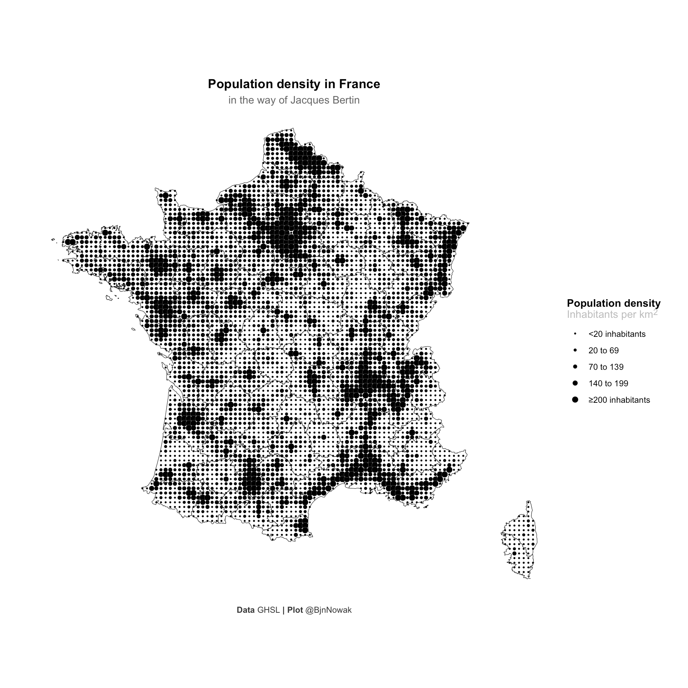
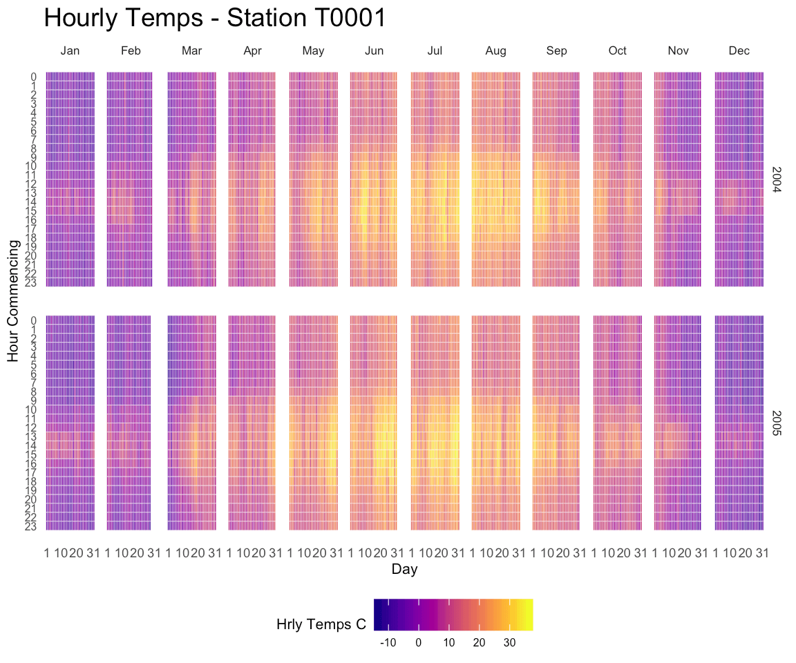
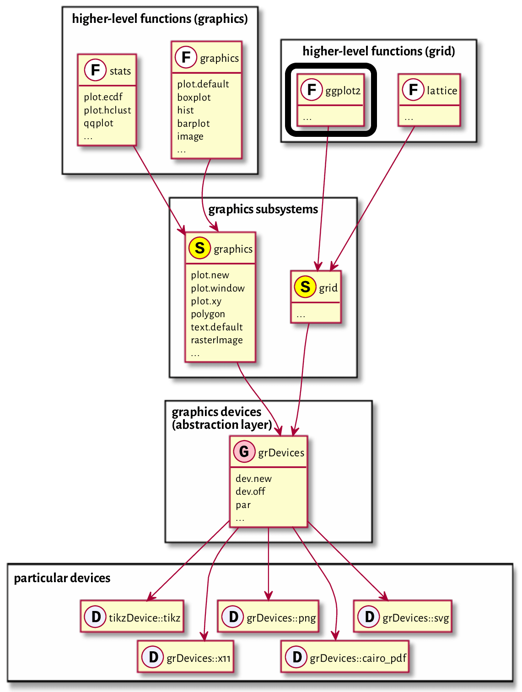
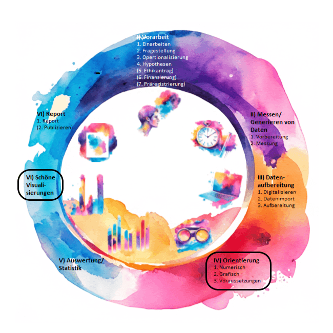
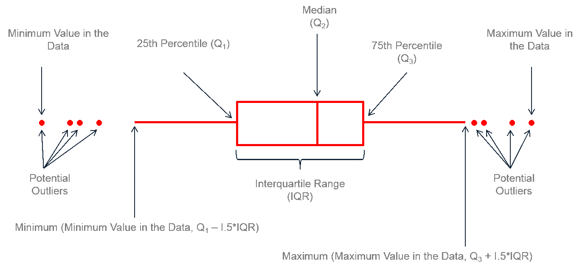
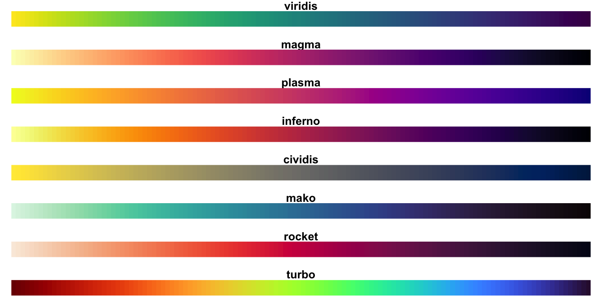
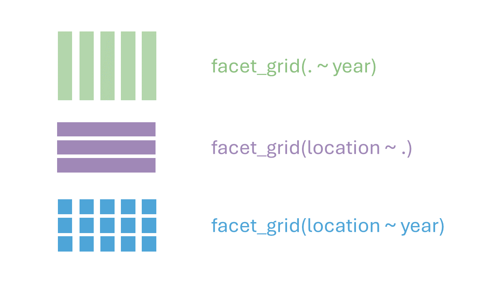
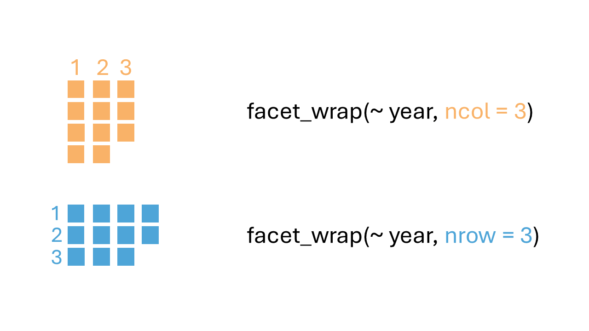

```{r setup, include=FALSE}
library(learnr)
library(ggplot2)
library(kableExtra)
library(tibble)
library(rtutorials)
library(dplyr)
library(viridis)
knitr::opts_chunk$set(echo = FALSE)
colnames(einkaufen) <- tolower(colnames(einkaufen))

```

## Inhalt

Jetzt kommt wirklich einer der allercoolsten Teile des ganzen Kurses. R ist einfach unfassbar mächtig, was das Visualisieren von Daten angeht, viel ausgefeilter und vielfältiger, als Excel und SPSS es je erreichen können. Unser Ziel ist euch ein paar schnelle Kochrezepte für die wichtigsten Visualisierungsaufgaben mitzugeben, und die Neugier auf mehr zu wecken, in dem wir eine Einführung in das Visualisierungspaket `ggplot2` geben.

Mit R sind abgefahrene Sachen möglich. Eine vielfältige Übersicht darüber, was alles möglich ist, erhältst du in der [R Graph Gallery](https://r-graph-gallery.com/). Hier sind ein paar Beispiele:

#### [Eine Karte im Stil von Jacques Bertin](https://r-graph-gallery.com/web-valued-dots-map-bertin.html)

{width="80%"}

#### [Heatmap stündliche Temperatur über zwei Jahre](https://r-graph-gallery.com/283-the-hourly-heatmap.html)

{width="80%"}

#### [Aber auch solche geometrischen Schönheiten](https://fronkonstin.com/tag/ggplot2/page/3/)

```{r fronkonstin, fig.asp = 1, out.width="80%"}
n=300
t1=1:n
t0=seq(3,2*n+1,2)%%n
t2=t0+(t0==0)*n
df=data.frame(x=cos((t1-1)*2*pi/n), 
y=sin((t1-1)*2*pi/n),
x2=cos((t2-1)*2*pi/n),
y2=sin((t2-1)*2*pi/n))
ggplot(df,aes(x,y,xend=x2,yend=y2)) +
geom_segment(alpha=.1)+theme_void()
```

Ziemlich beeindruckend, oder?

Das soll hier aber nur ein kleiner Einblick in das sein, was alles möglich ist. In diesem Tutorial starten wir natürlich bei den Basics und fokussieren uns darauf grundständige Diagramme zu zeichnen. Mit diesem Grundwissen kannst du dir dann auch selbst beibringen solche abgefahrenen Diagramme zu erstellen.

In den Links über den Grafiken findest du detaillierte Anleitungen, wenn du dann soweit bist.

Wie gesagt, wir fangen Schritt für Schritt an und daher sind das hier die Ziele für heute:

### Lernziele

<input type="checkbox" unchecked> Balkendiagramm (*barplot*) erstellen </input>

<input type="checkbox" unchecked> Histogramm (*histogram*) erstellen </input>

<input type="checkbox" unchecked> *Boxplot* erstellen </input>

<input type="checkbox" unchecked> Punktdiagramm (*scatterplot*) erstellen </input>

<input type="checkbox" unchecked> Liniendiagramm (*linegraph*) erstellen </input>

<input type="checkbox" unchecked> Schnelle Grafikfunktionen, um einen Überblick zu gewinnen </input>

<input type="checkbox" unchecked> Grafiken mit `ggplot2` nach dem Baukasten der *Grammar of Graphs* erstellen </input>

<input type="checkbox" unchecked> colorblind-friendly sein </input>

::: gelb
Am besten maximierst du das Fenster des Tutorials, um alle Abbildungen vollständig sehen zu könnnen. Ansonsten kann es passieren, dass du z.B. eine Legende nicht siehst oder andere Teile des Diagramms verdeckt sind.
:::

## Einführung

Es gibt (wie immer) tausend verschiedene Wege, Visualisierungen mit R zu erstellen. Aber einer hat sich über die Jahre als besonders beliebt erwiesen, und das ist das Paket `ggplot2`.

Der Grund, warum wir dir diesen Weg beibringen:

-   **klares Baukastenprinzip**: Auch später können komplexe Anpassungen der Grafik an die eigenen Vorstellungen relativ schmerzfrei umgesetzt werden.
-   **Popularität**: Es gibt im Internet viele gute Anleitungen.
-   **Funktionalität**: `ggplot2` kann eigentlich alles, was du brauchst, und wenn es etwas nicht kann, gibt es dafür mit hoher Wahrscheinlichkeit bereits ein Paket.

### Grammar of Graphs

Das `gg` im Paketnamen `ggplot2` steht für *Grammar of Graphs*.

Leland Wilkinson ist der Gründer des Grammar of Graphs-Ansatzes. Im Grunde ist das eine Theorie darüber, mit welchen Regeln und Bausteinen statistische Grafiken gut und übersichtlich erstellt werden können [@wilkinson2005].

`ggplot2` ist die Umsetzung dieses theoretischen Baukastens. Es wurde von Hadley Wickham geschrieben und ist ein relativ altes Paket im R-Ökosystem [@wickham2009].

#### benötigtes Paket

::: aufgabe
Der erste Schritt für dieses Tutorial ist, das Paket `ggplot2` in die aktive Sitzung zu laden. Tu das mittels `library()`. (Installiert hast du es schon, sonst wären alle anderen Tutorials nicht gelaufen.)
:::

```{r lib, exercise = TRUE, exercise.cap = "ggplot2 laden"}
library()
```

```{r lib-solution}
library(ggplot2)
```

<details>

<summary><a>▼ \* Exkurs: Einordnung in das R-Ökosystem </a></summary>


`ggplot2` ist nur eins von mehreren Interfaces für die unterhalb der Oberfläche liegenden Grafik-Strukturen von R. Es ist also nur eine Spitze des Eisbergs, und der Eisberg hat mehrere Spitzen, zum Beispiel das Paket `lattice` oder Visualisierungsfunktionen aus *base R*.

Ein Beispiel:\
Wenn du im Internet nach „Balkendiagramm erstellen mit R“ suchst, wirst du vermutlich Anleitungen für die *base R*-Variante `barplot()` finden. Trotzdem geht das auch mit `ggplot2`. Du kannst am Ende den Weg verwenden, der dir näher liegt. Wir denken, dass `ggplot2` zu einem intuitven Interface für dich werden kann, aber möchten dir bewusst machen, dass es keinesfalls das einzig Wahre ist! Jede Variante hat eigene Vor- und Nachteile.

Letztlich nutzen alle *higher level* Grafik-Funktionen unter der Oberfläche entweder `grid` oder `graphics`, um Grafiken zu erstellen. `ggplot2` gehört zur Familie der `grid`-basierten Grafikpakete.

{width="80%"}

Bild aus: [@gagolewski2023]: [Deep R Programming](https://deepr.gagolewski.com/chapter/250-graphics.html)

</details>


### Einordnung in den wissenschaftlichen Prozess

Sind die Daten erhoben und importiert folgt die Arbeit mit Grafiken. Sie sind ein guter Weg, Zusammenhänge in den Daten sichtbar zu machen. Zum einen, um sich selbst **in den Daten zu orientieren**, und zum anderen, um die **Ergebnisse der Analyse zu präsentieren**. Visualisierungen werden also an zwei Stellen im Prozess benötigt:

-   um einen **Überblick** zu gewinnen
-   um am Ende **Ergebnisse** zu **kommunizieren**

{width="80%"}

Welche Grafik du wann anwenden kannst, hängt vom Skalenniveau der Daten und der Anzahl von Variablen ab.

Grob kann unterschieden werden zwischen:

-   Plots, die die **Verteilung einer** einzelnen Variablen darstellen
-   Plots, die den **Zusammenhang** zwischen **zwei oder mehr** Variablen zeigen


### Die fünf essentiellen Diagrammtypen

Eine kurze grafische Übersicht, darf bei einem Tutorial über Grafiken natürlich nicht fehlen:

```{r echo=FALSE}
de <- c("Balkendiagramm", "Histogramm","Boxplot", "Punktdiagramm","Liniendiagramm")
en <- c("barplot", "histogram", "boxplot", "scatterplot","linegraph")
vars <- c("1 kategoriale Variable", "1 stetige Variable", "1 kategoriale & 1 stetige Variable", "2 stetige Variablen", "1 stetige und 1 zeitlich geordnete Variable")
tibble(` `= c("1.", "2.", "3.", "4.", "5."), de, en, `geeignet für` = vars) |>
  kbl() |>
  kable_styling()
```

```{r fiveplots, fig.height=8, out.width="100%"}
par(mfrow = c(2, 3),
    bty = "n")
barplot({einkaufen$verkehrsmittel |> table()}[1:5],
        main = "1.",
        axes = F,
        ylab = NA,
        xlab = NA,
        names.arg = NA)
hist(heated$maxtemp,
     main = "2.",
     axes = F,
     ylab = NA,
     xlab = NA)
boxplot(heated$maxtemp ~ factor(lubridate::month(heated$enddate)),
        main = "3.",
        axes = F,
        ylab = NA,
        xlab = NA)
plot(heated[ ,c("maxtemp", "edvisits")],
     main = "4.",
     axes = F,
     ylab = NA,
     xlab = NA)
plot(heated$enddate[heated$enddate > as.Date("2022-03-24")], 
     heated$maxtemp[heated$enddate > as.Date("2022-03-24")],
     type = "l",
     main = "5.",
     axes = F,
     ylab = NA,
     xlab = NA)
# reset par
par(mfrow = c(1, 1),
    bty = "o")
```

Steigen wir direkt ein!

<hr>

Einiges im folgenden orientiert sich an einem tollen, frei verfügbaren Online-Lehrbuch namens [*Modern Dive*](https://www.moderndive.com) [@ismay2022]. Wir haben die Reihenfolge geändert, Sachen übersetzt und paraphrasiert und unsere eigenen Gedanken hinzugefügt.

<hr>

## 1. Balkendiagramm

::: infobox
Balkendiagramme sind geeignet, um die **Verteilung** einer **einzelnen**, **kategorialen** Variable zu zeigen.

Funktion: `ggplot() + geom_bar()`
:::

<br>

::: aufgabe
So sieht Code aus, um mit `ggplot2` ein einfaches Balkendiagramm zu erstellen (das schön machen kommt später). Führe ihn aus.
:::

```{r barplot, exercise = TRUE, exercise.cap = "Einfacher Barplot"}
ggplot(data = einkaufen,
       mapping = aes(x = verkehrsmittel)) +
  geom_bar()
```

Dabei wird deutlich, dass der Code durch eine klare Sprache organisiert ist:

-   im Argument `data` wird ein Datensatz an die Funktion übergeben
-   im Argument `mapping` wird festgelegt, welche Variablen aus dem Datensatz wo gezeigt werden
-   das `+` fügt eine neue Ebene hinzu, genau wie in Photoshop / Gimp / bei Overhead-Folien
-   `geom_bar()` fügt ein `geom`etrisches Objekt, nämlich die Balken (`bar`s), hinzu

Mehr dazu, wie genau dieses *mapping* funktioniert, folgt später.

### Baukasten-Prinzip

Leland Wilkonson, Begründer der *Grammar of Graphs*-Theorie sagt, dass sich jede statistische Grafik durch diese drei Kernbestandteile beschreiben lässt:

-   `data`
-   `aesthetic mapping`
-   `geom`etric objects

Mit `data` kennst du dich ja jetzt schon aus, daher können wir direkt zum *mapping* übergehen. 

::: gelb
Wichtig ist zu wissen, dass `ggplot()` nur *data frames* als Daten akzeptiert.
:::

</br>

### aesthetic mapping

Die Funktion `aes()` konstruiert *aesthetic mappings*. Auf Deutsch: Stellt eine Verbindung mit einer Variable aus den Daten mit einer bestimmten grafischen Eigenschaft des Plots her. Dazu sagen wir auch *Mapping* einer Variable auf ein *ästhetisches Attribut*. 

Oben im Code: `aes(x = verkehrsmittel)`: Die Variable Verkehrsmittel wird auf die `x`-Achse gemappt. 

#### Verfügbare aesthetische Attribute

-   Achsen (`x`, `y`)
-   Farbe (`color`)
-   Füllung (`fill`)
-   Größe (`size`)
-   Transparenz (`alpha`)
- ... 

::: aufgabe
Ändere den Code so, dass die Variable Verkehrsmittel statt auf der `x`-Achse nun auf die `y`-Achse gemappt wird. Wie wird sich das Diagramm wohl verändern?
:::

<br>

::: blau-nb
Beachte, dass hier die Argumentnamen `data` und `mapping` weggelassen wurden, so wie es in der Praxis üblicherweise auch getan wird. Das ist möglich, da die Reihenfolge der Argumente beachtet wird, also erst `data`, dann `mapping` und schließlich `geom`etric objects.
:::

```{r ybarplot, exercise = TRUE, exercise.cap = "Mapping ändern auf y-Achse"}
ggplot(einkaufen, aes(x = verkehrsmittel)) +
  geom_bar()
```

```{r ybarplot-solution}
ggplot(einkaufen, aes(y = verkehrsmittel)) +
  geom_bar()
```

Es gibt, wie oben erwähnt, noch mehr *aesthetic attributes* außer der `x`-Achse und der `y`-Achse, die bekommen später noch ihren Raum.

### `geom_bar`

Und was ist dieses `geom_bar()`? Das wird am ehesten deutlich, wenn es weggelassen wird!

::: aufgabe
Schau dir an, wie der Plot aussieht ohne die Ebene mit`geom_bar()`!
:::

```{r plotwithoutgeom, exercise = TRUE, exercise.cap = "Ohne geom"}
ggplot(einkaufen, aes(x = verkehrsmittel))
```

Jetzt versteht du vielleicht, wofür die `geom_bar()`-Funktion da ist: Geometrische Formen, in diesem Fall Balken, in den Plot zu zeichnen! Der Plot ist leer, aber die Achsen sind bereits beschriftet und perfekt vorbereitet, aber es fehlt noch das geometrische Objekt.

Innerhalb der `geom_bar()`-Funktion finden Berechnungen statt: die einzelnen Ausprägungen der Verkehrsmittel werden gezählt, um die Höhe der Balken zu bestimmen. Aber das passiert alles im Hintergrund.

```{r weg-quest}
quiz(caption = "Quiz zu den Balkendiagrammen",
     question_radio("Welche Daten lassen sich gut mit Balkendiagrammen darstellen?",
               answer("Eine einzelne, kategoriale Variable.",
                      correct = TRUE),
               answer("Eine einzelne, stetig Variable.",
                      message = "Schon fast richtig. 
                      Es ist eine einzelne Variable, aber sie ist nicht stetig, versuch es nochmal. Für diese Datenart eignet sich ein Histogramm."),
               answer("Zwei kategoriale Variablen.",
                      message = "Schon fast richtig. Die Variable ist kategorial, aber es sind nicht zwei. Für diese Datenart eignet sich eine Kreuztabelle."),
               answer("Zwei stetige Variablen.",
                      message = "Für diese Datenart eignet sich ein Punktdiagramm."),
               allow_retry = TRUE,
               random_answer_order = TRUE,
               correct = random_praise("de"),
               incorrect = "Das stimmt leider nicht, probier es noch mal!"),

question_radio("Wie fügst du eine neue Ebene zum Plot hinzu?",
         answer("Mit dem `+`", correct = TRUE),
         answer("Mit dem Pipe-Operator `|>` oder `%>%`"),
               allow_retry = TRUE,
               random_answer_order = TRUE,
               correct = random_praise("de"),
               incorrect = "Das stimmt leider nicht, probier es noch mal!"),
         
    question_radio("Wo spezifizierst du, welche Variable auf welcher Achse angezeigt wird?",
                   answer("In der Funktion `aes()` (*aesthetic mappings*)",
                          correct = TRUE),
                   answer("In der `library()` ganz zu Beginn des Skripts"),
               allow_retry = TRUE,
               random_answer_order = TRUE,
               correct = random_praise("de"),
               incorrect = "Das stimmt leider nicht, probier es noch mal!"),

question_radio("Wie kannst du Variablen in `aes()` angeben?",
               answer("Mit der gewohnten Schreibweise: `einkaufen$alter`. Damit weiß R, dass `alter` im Datensatz `einkaufen` zu finden ist.",
                      message = "Das funktioniert zwar, aber ist unübersichtlicher und unüblich."),
               answer("Einfach nur den Variablennamen `alter`, da der Datensatz bereits vorher angegeben wurde. So weiß R, wo die Variable `alter` zu finden ist", correct = TRUE),
               allow_retry = TRUE,
               random_answer_order = TRUE,
               correct = random_praise("de"),
               incorrect = random_encouragement(language = "de")),

question_radio("Was passiert, wenn du `ggplot()` ohne eine `geom`-Ebene ausführst?",
               answer("Ein leerer Plot mit korrekten Achsenbeschriftungen wird gezeichnet, aber ohne geometrische Formen", correct = TRUE),
               answer("Es kommt zu einer Fehlermeldung!"),
               allow_retry = TRUE,
               incorrect = random_encouragement("de"),
               correct = random_praise("de")),

question_radio("Zusatz**: Welche Art von Daten wird akzeptiert durch `ggplot()`?",
               answer("Nur Vektoren"),
               answer("Nur Data Frames", correct = TRUE),
               random_answer_order = TRUE,
               allow_retry = TRUE,
               incorrect = random_encouragement("de"),
               correct = random_praise("de"))

)
```

## 2. Histogramm

::: infobox
Histogramme sind geeignet, um die Verteilung einer **einzelnen**, **stetigen** Variable zu zeigen.

Funktion: `geom_histogram()`
:::

<br>

Unser Go-To-Beispiel für eine stetige Variable ist `einkaufen$alter`, die dir schon in den letzten Tutorials begegnet sein sollte. Beachte, dass du innerhalb eines `ggplot`-Codes den `$`-Operator nicht benutzen musst. Das liegt daran, dass `ggplot` aufgrund des ersten Arguments schon weiß, in welchem Datensatz die Variable gesucht werden muss.

Hier ist `ggplot2`-Code für ein einfaches, absolut nicht schönes Histogramm. In diesem Abschnitt wird es deswegen auch mal Zeit, über Farben und Verschönerungen zu sprechen.

```{r hist, exercise = TRUE, exercise.cap = "einfaches Histogramm erstellen"}
ggplot(einkaufen, aes(alter)) +
  geom_histogram()
```

### Was ist ein Histogramm?

Bei einem Histogramm werden auf der x-Achse die möglichen Ausprägungen der Variable aufgelistet, und auf der y-Achse die Häufigkeit. Es ist also genau das gleiche Prinzip wie bei einem Balkendiagramm, nur dass du dich hier zusätzlich noch mit der Kategorienbreite (*binwidth*) auseinandersetzen musst.

Denn: Balkendiagramme sind für diskrete Daten, und diskrete Daten haben natürliche Kategorien. Zum Beispiel ist das Verkehrsmittel ÖPNV etwas anderes als Motorrad - die Kategorien liegen also schon in der Natur der Sache.

Das ist bei stetigen (kontinuierlichen) Daten anders: Von Natur her gibt es bei stetigen Daten immer unendlich viele mögliche Ausprägungen, und also auch immer unendlich viele mögliche Kategorien.

Zum Beispiel kann ein Meter in unendlich feine Messeinheiten aufgeteilt werden:

-   Meter
-   Dezimeter
-   Zentimeter
-   Millimeter
-   Mikrometer
-   Nanometer
-   Picometer
-   Femtometer
-   Attometer ...

Da es unendlich Möglichkeiten gibt einen Meter einzuteilen, gehen keine natürlichen Kategorien daraus hervor. Deswegen können die Kategorien beliebig gebildet werden.

Beim Histogramm des Alters oben sind die Balken zum Beispiel immer 2.5 Jahre breit, komplett random also. Darüber informiert `ggplot` auch beim Erstellen des Diagramms mit einer Nachricht:

```         
`stat_bin()` using `bins = 30`. Pick better value with `binwidth`
```

`ggplot` sagt damit: „Hey, ich habe deine Daten einfach mal in 30 gleich große Kategorien eingeteilt, aber das ist ein *default-Wert*, den du bitte anpassen solltest.“

### Kategorienbreite anpassen

In der Warnmeldung wurde bereits das Argument `binwidth` erwähnt. Hier ist Code, mit dem die Kategorienbreite auf 5 (Jahre) festgelegt wird.

```{r binwidth, exercise = TRUE, exercise.cap = "Kategorienbreite einstellen"}
ggplot(einkaufen, aes(x = alter)) +
  geom_histogram(binwidth = 5)
```

Generell gilt hier, je breiter die *binwidth* des Histogramms, desto "gröber" wird die Darstellung der Informationen. Das wird besonders deutlich, wenn du dir die `binwidth = 1` und die `binwidth = 20` anzeigen lässt. Versuche stets einen geeigneten Wert zu finden, der erlaubt, die Informationen der Grafik schnell zu vermitteln ohne dabei zu komplex zu sein.  

### `color` und `fill`

Da die Balken gerade visuell in einer großen grauen Masse verschwinden, wird noch nicht so ganz deutlich worum es eigentlich geht. Deswegen wäre es hilfreich, wenn alle Balken eine schwarze Umrandung hätten und etwas hellgrauer wären. Beachte, dass jetzt nach dem `binwidth`-Argument dafür noch die Argumente `color` und `fill` stehen.

Fun fact: in `ggplot` ist es für R egal, ob du die UK Variante von `colour` schreibst oder das amerikanische `color`. Wie das geschrieben wird ist in diesem Fall reine Geschmackssache.

```{r color, exercise = TRUE, exercise.cap = "Color und Fill"}
ggplot(einkaufen, aes(x = alter)) +
  geom_histogram(binwidth = 5,
                 color = "black",
                 fill = "grey")
```

Später in diesem Tutorial wird es noch farbenfroher, aber dazu im Kapitel über Farben mehr.

```{r hist-quest}
quiz(caption = "Quiz zu den Histogrammen",
     
question_radio("Welche Daten lassen sich gut im Histogramm darstellen?",
               answer("Eine einzelne, kategoriale Variable.",
                      message = "Fast richtig. Nur dass die Variable stetig ist und nicht kategorial. 
                      Hier würde sich ein Balkendiagramm anbieten."),
               answer("Eine einzelne, stetige Variable.",
                      correct = T),
               answer("Zwei kategoriale Variablen.",
                      message = "Für diese Datenart eignet sich eine Kreuztabelle."),
               answer("Zwei stetige Variablen.",
                      message = "Fast richtig. Es geht um stetige Daten, aber eben nur um eine einzelne Variable. 
                      Für diese Datenart eignet sich ein Punktdiagramm."),
               allow_retry = TRUE,
               random_answer_order = TRUE,
               correct = random_praise("de"),
               incorrect = random_encouragement("de")),

question_checkbox("Warum ein Histogramm und kein Balkendiagramm?",
               answer("Weil die abgebildete Variable stetig und nicht diskret ist.",
                     correct = T),
               answer("Weil die abgebildete Variable diskret und nicht stetig ist.",
                      message = "Genau anders herum. 
                      Die abgebildete Variable ist stetig (hat keine natürlichen Kategorien) 
                      und muss deswegen in Intervallen abgebildet werden."),
               answer("Weil Statistiker*innen gerne möglichst viele Möglichkeiten haben, 
                      um es maximal kompliziert zu machen.",
                      message = "Es mag manchmal so anmuten aber eigentlich geht es ja darum, 
                      die Sachverhalten möglichst übersichtlich und korrekt abzubilden :)"),
               answer("Weil stetige Variablen keine natürlichen Kategorien bilden.",
                      correct = T),
               allow_retry = TRUE,
               random_answer_order = TRUE,
               correct = random_praise("de"),
               incorrect = random_encouragement("de")),

question_radio("Warum verändert sich die Höhe zwischen den beiden ersten Histogrammen beim Alter um die 25 von 17 auf 25??",
               answer("Weil wir die Kategorien breiter gemacht haben und jetzt mehr Menschen in einer Kategorie zusammengefasst werden.",
                      correct = TRUE),
               answer("Weil das Alter entsprechend angepasst wurde.",
                      message = "Die 25 Beobachtungen haben nichts mit dem Alter 25 zu tun."),
               answer("Weil wir die Kategorien schmaler gemacht haben und somit mehr Menschen pro Kategorie zusammenkommen.",
                      message = "Genau anders herum: wenn die Kategorien breiter werden, werden mehr Menschen in einer Kategorie zusammengefasst."),
               allow_retry = TRUE,
               random_answer_order = TRUE,
               correct = random_praise("de"),
               incorrect = random_encouragement("de")),

question_radio("Was stimmt zur Schreibweise des Arguments `color`?",
               answer("`color` kann auch `colour` geschrieben werden.",
                      correct = TRUE),
               answer("R ist case sensitive, deswegen muss das Argument `color` stehts mit o geschrieben werden.",
                      message = "Das ist teilweise richtig. R ist case sensitive, was heißt, dass es Groß- und Kleinschreibung beachtet. `color` kann allerdings in diesem Fall sowohl mit `ou` als auch nur mit `o` geschrieben werden."),
               allow_retry = TRUE,
               random_answer_order = TRUE,
               correct = random_praise("de"),
               incorrect = random_encouragement("de"))

### ohne den Abschnitt über das Argument `boundary` ergeben diese beiden
###  Fragen keinen Sinn 

# question_radio("Was stimmt bzgl. des Arguments `boundary`?",
#                answer("Spezifiziert den Grenzpunkt zwischen zwei Kategorien",
#                       correct = TRUE),
#                answer("Spezifiziert die Grenzen des gesamten Plots.",
#                       message = "Dafür gibt es andere Funktionen (z.B. `coord_cartesian()`)."),
#                answer("Umrandet die bins in einer frei gewählten Farbe.",
#                       message = "Das gesuchte Argument heißt `color`."),
#                allow_retry = TRUE,
#                random_answer_order = TRUE,
#                correct = random_praise("de"),
#                incorrect = random_encouragement("de")),


# question_radio("Letzter Plot: Wie alt ist die älteste Person?",
#                answer("Zwischen 85 und 90 Jahren.",
#                       correct = TRUE),
#                answer("89 Jahre, 11 Monate und 3 Tage.",
#                       message = "Das könnte zwar sein, könnte aber auch nicht sein. Du kannst nur wissen, das diese Person sich im Intervall zwischen 85 und 90 Jahren befindet."),
#                answer("100",
#                       message = "Die höchste Kategorie hört bei 90 aus, also maximal 90 Jahre."),
#                allow_retry = TRUE,
#                random_answer_order = TRUE,
#                correct = random_praise("de"),
#                incorrect = random_encouragement("de"))

)
```

### aus Fehlern lernen

Und jetzt kommt das Praktische: Es gibt noch sehr viele weitere `geom_...()`-Funktionen. Zum Beispiel `geom_point()`, diese Funktion zeichnet Punkte in deinen Plot.

::: aufgabe
Probiere das doch einfach mal aus und tausche `geom_histogram()` durch `geom_point()`.
:::

```{r error-solution}
ggplot(einkaufen, aes(x = alter)) +
   geom_point()
  
```

```{r error, exercise = TRUE, exercise.cap = "Fehlermeldung"}
ggplot(einkaufen, aes(x = alter)) +
  geom_histogram()

```

Dass hier eine Fehlermeldung aufploppt, ist völlig normal! Fehlermeldungen sind freundlich, denn Programmierer\*innen geben sich (oft) viel Mühe, diese möglichst informativ und genau zu machen. Also hab keine Angst, und lies dir tatsächlich mal durch was da steht!

```         
! Problem while setting up geom.
ℹ Error occurred in the 1st layer.
Caused by error in `compute_geom_1()`:
! `geom_point()` requires the following missing aesthetics: y
```

-   Schon die erste Zeile gibt dir eine wichtige Information: Der Fehler trat beim Hinzufügen des `geom`etrischen Objekts auf und nicht an irgendeiner anderen Stelle
-   Die zweite Zeile sagt, dass der Fehler in der ersten Zeile / Ebene passiert ist. Das wird relevant, wenn du mehrere Ebenen mit `+` übereinanderlegst in deinem Plot.
-   Die dritte Zeile musst du nicht genau verstehen, das ist irgendwas Internes von `ggplot2`
-   die vierte Zeile schließlich sagt dir ganz genau, wo das Problem ist: Du brauchst eine zweite Variable. Und zwar auf der y-Achse. Das ergibt auch Sinn, denn ein Punkt hat immer zwei Koordinaten, eine `x`- und eine `y`-Koordinate! Logischerweise kann kein Punkt gezeichnet werden, wenn du nur eine `x`-Koordinate angibst.

::: aufgabe
Löse das Problem, indem du in `aes()` noch das Argument `y = weg` angibst. Denk daran, Argumente werden durch Kommata getrennt.

"`weg`" ist eine stetige Variable, die den zurückgelegten Anreiseweg zum Laden in km enthält.
:::

```{r weg, exercise = TRUE, exercise.cap = "aesthetic mapping hinzufügen für y-Achse"}
ggplot(einkaufen, aes(x = alter)) +
  geom_point()
```

```{r weg-solution}
ggplot(einkaufen, aes(x = alter, y = weg)) +
  geom_point()
```

Jetzt hast du ein Punktdiagramm gezeichnet! Es zeigt dir hier, wie Alter und Weg zusammenhängen. Wegen ein paar extremen Werten beim Weg ist nicht wirklich etwas zu erkennen. Der übliche Weg, den Menschen in Kassel zum Einkaufen zurücklegen, liegt eher in einer Größenordnung von 0-10 km, und eher nicht zwischen 0 und 600 km. Der Großteil der Werte zusammengepackt am unteren Rand des Diagramms, und es ist nicht wirklich etwas zu erkennen, weil die Punkte sich überlagern. Mehr dazu im Kapitel über Punktdiagramme!

Du kannst mitnehmen:

- Fehlermeldungen sind freundlich, 
- `ggplot` funktioniert wie ein Baukasten, 
- das `geom_...` können wir austauschen, so lange dafür gesorgt wird, dass in den `aes`thetic mappings Variablen und Skalenniveau zu dem jeweiligen `geom` passen!

## 3. Boxplot

::: infobox
Ein Boxplot ist eine effektive und robuste Methode, um die Verteilung **einer stetigen** Variable aufgeschlüsselt nach den Auprägungen **einer kategorialen** Variable zu visualisieren. Darüber hinaus lässt es uns auch Ausreißer identifizieren.

Funktion: `geom_boxplot()`
:::

<br>

Du erinnerst dich vielleicht daran im letzten Tutorial selbst bereits einen Boxplot gezeichnet zu haben. Hier noch einmal die Übersicht, welche Daten in einem Boxplot enthalten sind:

{width="90%"}

[image source](https://leansigmacorporation.com/box-plot-with-minitab/)

Boxplots werden eigentlich niemals einzeln gezeigt, sondern immer im Vergleich neben anderen Boxplots. Das heißt dann **side-by-side boxplot**. Das macht auch Sinn, denn für die Verteilung einer einzelnen stetigen Variablen haben wir ja bereits das Histogramm. Boxplots hingegen sind gut darin, mehrere Verteilungen übersichtlich zu vergleichen. Histogramme sind gut darin, eine einzelne Verteilung detailliert darzustellen.

*Side-by-side boxplots* entstehen, wenn zu der **stetigen** noch eine **kategoriale** Variable hinzukommt. 

Im Plot unten wird die stetige Variable `alter` nach der kategorialen Variable `verkehrsmittel` aufgeschlüsselt. Für jedes Verkehrsmittel ergibt sich nun eine eigene Altersverteilung. Da zeigen sich dann die ersten spannenden Einblicke in unsere Daten!

```{r sidebysideboxplot, exercise = TRUE, message=FALSE, warning=FALSE}
ggplot(einkaufen, aes(x = verkehrsmittel, y = alter)) +
  geom_boxplot()
```

Aus der Grafik können wir sehen, dass die Kategorien "E-Roller", "Motorrad" und die "fehlenden Werte (NA)" jeweils nur einen Datenpunkt beinhalten und der Boxplot daher nur aus dem Median besteht.

```{r question_boxplot}
quiz(caption = "Interpretation üben",
     
question_radio("Wie ist das obere und untere Ende der Box bei den Autofahrenden zu interpretieren? Der untere Rand der Box liegt ungefähr bei 37, der obere bei ca. 60 Jahren.",
               answer("Diese Altersspanne umfasst die mittleren 50% der Autofahrenden",
                      correct = TRUE,
                      message = "Das entspricht der IQR (*interquartile range*), also dem Abstand zwischen drittem und erstem Quartil, oder anders gesagt zwischen dem 75%-Quantil und dem 25%-Quantil."),
               answer("Diese Altersspanne umfasst die mittleren 75% der Autofahrenden",
                      message = "Das obere Ende der Box kennzeichnet das 75%-Quantil oder auch drittes Quartil, das untere das 25%-Quantil oder auch 1. Quartil. Der Abstand zwischen 75 und 25 % beträgt 50%."),
               answer("Diese Altersspanne umfasst die mittleren 25% der Autofahrenden",
                      message = "Das obere Ende der Box kennzeichnet das 75%-Quantil oder auch drittes Quartil, das untere das 25%-Quantil oder auch 1. Quartil. Der Abstand zwischen 75 und 25 % beträgt 50%."),
               allow_retry = TRUE,
               random_answer_order = TRUE,
               correct = random_praise("de"),
               incorrect = "Das stimmt leider nicht, probier es noch mal!"),

question_numeric("Wie lautet der Median des Alters aller Autofahrenden? (grob)",
                 answer(50, correct = TRUE),
                 tolerance = 2,
                 allow_retry = T,
                 correct = random_praise("de"),
                 incorrect = "Der Median ist der dicke Strich in der Mitte der Box."),

question_radio("Wie ist der Median zu interpretieren?",
               answer("Der Median ist das Alter, was die Autofahrenden in zwei gleich große Hälften teilt", correct = TRUE, 
                      message = "Wenn die Autofahrenden dem Alter nach aufgestellt würden, wäre der Median das Alter der Person in der Mitte der Aufstellung."),
               answer("Der Median ist das Alter, was am häufigsten vorkommt.", 
                      message = "Die häufigste Ausprägung nennt sich „Modus“ und wird üblicherweise für kategoriale Daten angegeben. Der Median ist etwas anderes: Wenn die Werte der Reihenfolge nach sortiert werden, ist der Median derjenige, der in der Mitte der Reihenfolge steht."),
               answer("Der Median darf hier nicht interpretiert werden, da das Alter stetig ist.", 
                      message = "Der Median darf zwar bereits für ordinale, diskrete Daten berechnet werden, aber das heißt nicht dass er für höhere Skalenniveaus verboten ist."),
               allow_retry = T,
               random_answer_order = T,
               correct = random_praise("de"),
               incorrect = random_encouragement("de")),

question_radio("Zeigt der Boxplot die Gruppengröße jedes Verkehrsmittels?",
               answer("Nein, es wird nur die Verteilung gezeigt, aber nicht auf wie vielen Datenpunkten diese Verteilung beruht!",
                      correct = TRUE,
                      message = "Das schauen wir uns im nächsten Abschnitt genauer an."),
               answer("Ja, die Größe der Box kennzeichnet auch die Anzahl an Personen.",
                      message = "Das ist leider falsch. Ganz im Gegenteil. Wenn die Box sehr klein ist, können das tausende von Personen sein, die einfach alle innerhalb einer sehr geringen Altersspanne liegen."),
               allow_retry = TRUE,
               random_answer_order = TRUE,
               correct = random_praise("de"),
               incorrect = random_encouragement(language = "de"))
)
```

### \# Show your data!

Der obige Boxplot hat einen großen Nachteil: Es ist nicht zu sehen, wie viele Personen in jeder Gruppe sind.

Du kannst dem Plot die fehlenden Informationen in einer neuen Ebene hinzufügen!

Die Funktion `geom_jitter()` zeichnet einzelne Datenpunkte, und fügt diesen einen zufälliges *Zittern* (engl. *jitter*) hinzu, um sie ein bisschen durcheinander zu schütteln, sodass nicht mehr alle Punkte übereinander liegen und Datenpunkte von anderen überdeckt werden.

-   `size` kennzeichnet die Größe der Punkte
-   `alpha` bestimmt die Transparenz der Punkte (von 0 - 1)
-   `width` ist die Stärke des horizontalen zufälligen Jitters, `height` wäre für den vertikalen Jitter

```{r showyourdata, exercise = TRUE, echo=TRUE}
ggplot(einkaufen, aes(x = verkehrsmittel, y = alter)) +
  geom_boxplot() +
  geom_jitter(alpha = 0.2,
              size = 3,
              width = 0.2, 
              height = 0)
```

::: infobox
Der Jitter führt in dieser Art der Verwendung nicht zu einem Informationsverlust/-verzerrung, da wir die zwar Punkte horizontal innerhalb der Kategorien variieren lassen (`width = 0.2`), aber nicht vertikal auf der stetigen y-Achse (`height = 0`).
:::

<br>

Achte mal auf das Verkehrsmittel "Andere". Wir sehen: Es wird ein ganzer Boxplot gezeichnet, während lediglich 7 Personen dahinter stehen, und die Box ist nicht zu unterscheiden von denen für "Auto", wo 46 Menschen hinter stehen. Aber mithilfe der Punkte können wir nun sehen, dass bei "Andere" weit weniger Datenpunkte vorliegen und wir daher bei der Interpretation dieser Gruppe Vorsicht walten lassen sollten, da sie von der Gruppengröße her nicht mit den anderen zu vergleichen ist. Das triff mehr noch für die Kategorien "Motorrad" und "E-Roller" zu.

::: aufgabe
**Aufgabe**

Probiere es auch mal aus, und schaue welche anderen zwei Variablen aus dem Beispieldatensatz `einkaufen` du gut für einen Boxplot nutzen kannst.

Achte darauf, immer eine **metrische** mit einer **kategorialen** Variable zu kombinieren! Sonst gibt es komische Fehlermeldungen / komisch aussehende Plots.

Hier eine Auflistung der Variablennamen:

**Kategorial:**

-   `essen`: Das Lieblingsessen der Person. Nominal, 97 verschiedene Ausprägungen
-   `verkehrsmittel`: Das Verkehrsmittel, mit dem die Person zum Laden gefahren ist. Nominal, 7 Auprägungen
-   `frequenz`: Wie oft die Person in einen Bioladen geht. Ordinal, 5 Stufen
-   `ort`: Befragungsort. Nominal, 5 Ausprägungen
-   `bioladen`: Ob der Laden ein Bioladen war. Nominal, binär
-   `befragung`: Kürzel der Studierenden, die die Daten erhoben haben. Nominal, 8 Ausprägungen

**Metrisch:**

-   `weg`: Die Länge der Anreise zum Laden in km, Verhältnisskala
-   `alter`: Alter der Person, Verhältnisskala
-   `kochen`: Anzahl der Tage pro Woche, an denen selber gekocht wird, Absolutskala

**Andere:**

-   `id`, `datum`, `uhrzeit` sind Metadaten die wir gerade nicht brauchen.
:::

```{r boxplot, exercise = TRUE, exercise.cap = "Boxplot Exploration"}
ggplot(einkaufen, aes(x = , y =  )) +
  geom_boxplot()
```

::: infobox
**Tipp:** Wenn du die Beschriftungen einer kategorialen Variable auf der `x`-Achse nicht mehr lesen kannst, weil sie übereinandergedruckt werden: Pack die Variable einfach auf die `y`-Achse! Dann werden die Beschriftungen untereinander dargestellt und überlappen sich nicht.
:::

```{r boxplot-quest}
question_text("Welche Variablen hast du gefunden, die sich für einen Boxplot mit 2 Variablen eignen?",
              answer_fn(\(x) correct(messages = "Wie oben erwähnt, ist es am aussagekräftigsten eine metrische Variable und eine kategoriale Variable zu verwenden. Zum Beispiel ort (kategorial) und kochen (kontinuierlich).")),
              placeholder = "Musterlösung erscheint bei Abgabe deiner Antwort...")
```

Wie bereits erwähnt, eignen sich die Beispieldaten nicht per se für jede Diagrammart. Wundere dich daher nicht, wenn es teilweise komisch aussieht auch wenn du zwei richtig skalierte Variablen benutzt hast. Du machst das super bisher! 🥳

### Boxplot-Quiz

```{r boxquiz}
quiz(caption = "Quizfragen zum Boxplot",
     
     question_radio("Welche Information zeigt ein klassischer Boxplot **nicht**?",
                     answer("Die Gruppengröße", correct = TRUE),
                     answer("Den Median"),
                     answer("Minimum und Maximum"),
                     answer("Den Interquartilsabstand"),
                     answer("Extreme Werte"),
                     correct = random_praise("de"),
                     incorrect = random_encouragement("de"),
                     allow_retry = TRUE,
                     random_answer_order = TRUE),
     
     question_radio("Wofür steht die Länge der Box in einem Boxplot?",
                    answer("Für den Interquartilsabstand (IQR)", 
                           correct = TRUE,
                           message = "Die IQR *interquartile range* ist der Abstand zwischen erstem und drittem Quartil, und kennzeichnet die mittleren 50% der Datenreihe."),
                    answer("Für die Spannweite (range)",
                           message = "Spannweite wird durch Minimum und Maximum bestimmt."),
                    answer("Für die Gruppengröße (n)",
                           message = "Die Gruppengröße fließt nicht in einen Boxplot mit ein."),
                    correct = random_praise("de"),
                    incorrect = random_encouragement("de"),
                    allow_retry = TRUE,
                    random_answer_order = TRUE)
     
     )
```

## 4. Punktdiagramm

::: infobox
Punktdiagramme sind geeignet, um den Zusammenhang **zweier stetiger** Variablen zu zeigen.

Funktion: `geom_point()`
:::

<br>

Punktediagramme können dir auch unter den Namen: *Streudiagramm*, *Punktewolke* oder englisch **Scatterplot** begegnen. 

Du hast ja bereits erfolgreich ein Punktediagramm erstellt, aber wir wollen dir auch zeigen, wie die Punktewolke aussieht, wenn tatsächlich ein Zusammenhang zwischen den Variablen zu erwarten ist:

Für dieses Diagramm wollen wir dir daher noch einen neuen Datensatz zeigen, der metrische Variablen mit vielzähligen Einträgen enthält: der *economics* Datensatz. *Economics* enthält Zeitreihendaten zu wirtschaftlichen Indikatoren in den USA. Die 6 Variablen umfassen Informationen wie Verbraucherausgaben (*pce - personal consumption expenditures, in billion dollars*) und Datum (*month of data collection*). 

Im folgenden Punktediagramm wurden die Variablen `uempmed` (*median duration of unemployment, in weeks*) und `unemploy` (*number of unemployed in thousands*) dargestellt. Sieh dir doch mal die Punktewolke dieser Variablen an.

```{r scatterplot, exercise = TRUE, exercise.cap = "Streudiagramm"}
ggplot(economics, aes(x = uempmed, y = unemploy)) +
  geom_point()
```

Die Punktewolke zeigt einen möglichen Zusammenhang zwischen der Anzahl an Arbeitslosen und der Anzahl an Wochen, die Menschen arbeitslos gemeldet sind. Je höher die Werte auf der x-Achse, desto höher auch die Werte der y-Achse. Zur Berechnung solcher Zusammenhänge erfährst du in einem späteren Tutorial zu Korrelationen noch mehr.

Zunächst bist du wieder gefragt. 

::: aufgabe
Erstelle ein Punktediagramm für den Beispieldatensatz `einkaufen`. Verwende dafür die metrischen Variablen des Datensatzes (`weg` und `alter`).
Versuche diesmal die Funktion des Beispiels an unsere Daten anzupassen. (So wirst du es später außerhalb des Tutorials auch oft anwenden)
:::

```{r scatterplot2, exercise = TRUE, exercise.cap = "Streudiagramm"}
ggplot(economics, aes(x = uempmed, y = unemploy)) +
  geom_point()
```

```{r scatterplot2-hint}
ggplot(data, aes(x = , y = )) +
  geom_point()
```

```{r scatterplot2-solution}
ggplot(einkaufen, aes(x = alter, y = weg )) +
  geom_point()
```

```{r scatterquiz}
question_radio("Verständnis-Check: Wie alt ist die Person, die 600km Anreiseweg hat?",
               answer("ca. 40 Jahre alt.",
                     correct = T),
               answer("Über 75 Jahre alt."),
               answer("Unter 25 Jahren."),
               allow_retry = TRUE,
               random_answer_order = TRUE,
               correct = random_praise("de"),
               incorrect = "Das stimmt leider nicht, probier es noch mal!")
```

Schau dir das Diagramm mal an. Einige extrem hohe Werte der Variable `weg` führen dazu, dass die Skala der y-Achse von 0 - 600 km reicht, wodurch die "normalen" Werte am unteren Rand zu einer undifferenzierbaren Masse zusammenschrumpfen.

*Da solche Werte potentiell Ausreißer sein könnten empfielt es sich, die Daten nochmal genauer unter die Lupe zu nehmen. Dazu in einem späteren Tutorial mehr.*

### "Lügen" mit log-skalierten Achsen

In Fällen, in denen deine Daten sehr ungleich verteilt sind und sich aufgrund von einzelnen extremen Werten eine undifferenzierbare Masse am Rand der Grafik gesammelt hat, gibt es eine Möglichkeit, dies besser darzustellen: Die y-Achse logarithmisch transformieren! Das geht in `ggplot` sehr einfach, du fügst, wie bereits gewohnt, eine neue Ebene bzw. die Funktion `scale_y_log10()` hinzu.

Die logarithmische Transformation ist sehr praktisch, um extreme Werte mit auf der Bildschirmfläche unterzubringen, und gleichzeitig eine sinnvolle Skalierung der normalen Werte aufrecht zu erhalten. Der Logarithmus verändert die Aussage des Diagramms wesentlich und sollte daher immer deutlich gekennzeichnet sein (siehe Diagrammbeschriftung)!

```{r logtransform, exercise = TRUE, exercise.cap = "log-transformiertes Streudiagramm"}
ggplot(einkaufen, aes(x = alter, y = weg)) +
  geom_point() +
  scale_y_log10() +
  labs(subtitle = "y-Achse logarithmisch skaliert") 
```

Um mehr über Diagrammbeschriftungen mit `labs()` zu erfahren, schau ins Kapitel 7.

## 5. Liniendiagramm

::: infobox
Liniendiagramme sind geeignet, um Verläufe und Entwicklungen darzustellen. Dafür braucht es **zwei Variablen**: eine **stetige** Variable, und eine andere mit einer **sequentiellen Abfolge** (wie z.B. die Zeit).

Die sequentielle Variable kommt dabei immer auf die `x`-Achse.

Funktion: `geom_line()`
:::

<br>

Hierfür nehmen wir wieder den `economics` Datensatz, da wir für ein Liniendiagramm einen zeitlichen Verlauf (eine wiederholte Messung) brauchen. `einkaufen` enthält zwar 160 unabhängige Messungen, aber keine der Personen wurde ein zweites Mal befragt. Deswegen ist `einkaufen` nicht geeignet, um einen Verlauf über die Zeit darzustellen.

Lassen wir uns also mittels der Variablen `date` und `unemploy` den Verlauf der Arbeitslosenrate über die Zeit darstellen.

```{r line, exercise = TRUE, exercise.cap = "Liniendiagramm"}
ggplot(economics, aes(x = date, y = unemploy)) +
  geom_line()
```

Der Zeitverlauf zeigt uns einen deutlichen "Peak" der Arbeitslosenzahlen um das Jahr 2010. Geschichtsfreunde werden wissen, dass dies wahrscheinlich durch die Wirtschaftskrise aus dem Jahre 2008 bedingt wurde. 

Es ist aber auch wichtig zu beachten, dass es ganz auf den betrachteten Zeitabschnitt ankommt, was als "Peak" gewertet wird und wie wir unsere Daten aufbereiten. Kritische Köpfe könnten jetzt anmerken, dass die Bevölkerung in dieser großen Zeitspanne auch deutlich zugenommen hat. Da hier absolute Zahlen an Arbeitslosen die Datengrundlage sind, ist das ein berechtigter Einwand. 

::: aufgabe
Verbessere die Grafik, in dem du die Anzahl an Arbeitslosen in Tausend (`unemploy`) durch die Population in Tausend (`pop`) verrechnest. 
Nutze `/` als "geteilt"-Operator
:::

```{r line2, exercise = TRUE, exercise.cap = "Liniendiagramm"}
ggplot(economics, aes(x = date, y = unemploy)) +
  geom_line()
```

```{r line2-hint}
# füge lediglich hinter `unemploy` den `/` Opertator und die Variable `pop` ein
ggplot(economics, aes(x = date, y = unemploy)) +
  geom_line()
```

```{r line2-solution}
# füge lediglich hinter `unemploy` den `/` Opertator und die Variable `pop` ein
ggplot(economics, aes(x = date, y = unemploy / pop)) +
  geom_line()
```

Super, jetzt hast du die Arbeitlosenquote über die Zeit geplottet. Du siehst, Grafiken sind sehr anfällig für unsere Wahl der Darstellung. Bleib kritisch, auch dir selbst gegenüber. 

Für schönere Achsenbeschriftungen werden wir später auch noch im Kapitel „Themes und Labs“ sorgen. 

```{r line-quest}
quiz(caption = "Quiz zum Liniendiagramm",
     
question_radio("Welche Daten lassen sich gut in einem Liniendiagramm darstellen?",
               answer("Eine einzelne, stetig Variable.",
                      message = "Das ist schon ein guter Anfang.Es fehlt noch eine weitere, sequentielle Variable. Für diese Datenart eignet sich ein Histogramm."),
               answer("Zwei kategoriale Variablen.",
                      message = "Für diese Datenart 
                      eignet sich eine Kreuztabelle."),
               answer("Eine metrische und eine nominale Variable.",
                      message = "Für ein Liniendiagramm brauchst du eine metrische/stetige und eine sequentielle Variable, wie die Zeit. Für stetig + kategorial eignen sich Boxplots oder Violin Plots."),
                answer("Eine stetige und eine sequentielle Varible.",
                      correct = T),
               allow_retry = TRUE,
               random_answer_order = TRUE,
               correct = random_praise("de"),
               incorrect = "Das stimmt leider nicht, probier es noch mal!")
)
```

## 6. Aesthetic Mapping

Jetzt kennst du bereits die 5 häufigsten Diagrammformen. Zeit Farbe ins Spiel zu bringen! Du bist einigen *aesthetic attributes* bereits über den Weg gelaufen, denn seien wir ehrlich, ohne sieht es manchmal wirklich trist und unbrauchbar aus. Hier aber noch einmal von vorne und genau erklärt was sich hinter diesen Argumenten verbirgt:

::: infobox
`aes()` konstruiert *aesthetic mappings*, und verknüpft Variablen mit einem *aesthetischen Attribut*. Solche Attribute können sein: 

-   Achsen (`x`, `y`)
-   Farbe (`color`)
-   Füllung (`fill`)
-   Form (`shape`)
-   Größe (`size`)
-   Transparenz (`alpha`)
:::

</br>

Bisher haben wir nur auf die `x`- und `y`-Achse gemappt. Aber was passiert, wenn wir zusätzlich noch eine weitere Variable mit der Farbe verknüpfen?

### Füllung und Farbe

#### `fill`

Um mehr Informationen in einem Plot darzustellen, kannst du eine zusätzliche Variable u.a. über das Attribut Füllung (`fill`) mappen.  Dafür eigenen sich sowohl *diskrete* als auch *stetige* (bzw. kontinuierliche) Daten.

```{r aestheticmapping, exercise = TRUE,  exercise.cap = "fill"}
ggplot(einkaufen, aes(y = ort, fill = verkehrsmittel)) +
  geom_bar()
```

#### `color`

Mit der Farbe (`color`) ist es ein bisschen tricky: Bei Balkendiagrammen, Histogrammen und Boxplots wird damit die Umrandung der Balken beeinflusst. Ohne das Attribut `fill` sieht ein Plot dann so aus:

```{r am_f_color, exercise = TRUE,  exercise.cap = "color"}
ggplot(einkaufen, aes(y = ort, color = verkehrsmittel)) +
  geom_bar()
```

Bei Punktdiagrammen und Liniendiagrammen wird die Punkt- bzw. Linienfarbe durch `color` bestimmt. Wird das Attribut `fill` vergeben passiert einfach nichts. 

::: aufgabe
Probiere es gerne selbst aus und ändere `color` zu `fill`.
::: 

```{r am_f_color_2, exercise = TRUE, exercise.cap = "color im Scatterplot"}
ggplot(einkaufen, aes(x = alter, 
                      y = weg, 
                      color = ort)) +
  geom_point(size = 3) +
  scale_y_log10() +
  labs(y = "log10(weg)")

```

```{r am_f_color_2-solution}
ggplot(einkaufen, aes(x = alter, 
                      y = weg, 
                      fill = ort)) +
  geom_point(size = 3) +
  scale_y_log10() +
  labs(y = "log10(weg)")

```

Das Diagramm ist übrigens so nicht barrierefrei, da z.B. rot und grün von manchen Menschen nicht unterschieden werden können. Mehr dazu im Kapitel "Barrierefreiheit" 

### Shape

Auch mittels des `shape` Arguments lässt sich die Information einer kategorialen Variable in ein Punktediagramm einbeziehen. Hier die Variable "Frequenz", die angibt, wie häufig die Menschen in einen Bioladen gehen. 

```{r am_shape, exercise = TRUE,  exercise.cap = "shape"}
ggplot(einkaufen, aes(x = alter, 
                      y = weg, 
                      shape = frequenz)) +
  geom_point(size = 3) +
  scale_y_log10() +
  labs(y = "log10(weg)")
```

Insbesondere wenn es kombiniert wird mit `color` wird es besonders eindeutig.
Beachte, wie die gleiche Variable (`frequenz`) einfach auf mehrere Attribute gleichzeitig gemappt werden kann. 

Edward Tufte, Autor des Klassikers "The Visualization of quantitative Data" (2001) wäre auf jeden Fall gegen eine solche Dopplung, da statistische Grafiken seiner Meinung nach möglichst nichts reduntantes enthalten sollten. Aber wir zeigen es euch trotzdem: 

```{r am_shape_2, exercise = TRUE, exercise.cap = "shape & color"}
ggplot(einkaufen, aes(x = alter, 
                      y = weg, 
                      shape = frequenz, 
                      color = frequenz)) +
  geom_point(size = 3) +
  scale_y_log10() +
  labs(y = "log10(weg)")
```

### Size

Auch mittels der Größe von Punkten kann eine weitere Dimension in ein Punktdiagramm gebracht werden. Das ist allerdings mit Vorsicht zu genießen, da hier der Flächeninhalt genutzt wird um eine Variable darzustellen, und Menschen sind nicht besonders gut darin Flächeninhalt korrekt einzuschätzen. 

Den Flächeninhalt eines Kreises zu variieren verzerrt in vielen Fällen die Wahrnehmung zu bestimmten Zusammenhängen.

```{r am_size, exercise = TRUE,   exercise.cap = "size"}
ggplot(einkaufen, aes(x = alter, 
                      y = verkehrsmittel, 
                      size = weg)) +
  geom_jitter(height = 0.25,
              width = 0,
              alpha = 0.6) 
```

### Alpha

Zu guter letzt folgt der `alpha` Wert, der die Transparenz von Objekten für das *mapping* nutzbar macht. 

Jedoch ist auch hier Vorsicht geboten, nur weil etwas möglich ist, heißt es nicht, dass es sinnvoll ist. 
Hier trotzdem mal ein Beispiel: Das Alter, aufgeschlüsselt nach Frequenz des Einkaufens, kombiniert mit der Variable "Kochen", die angibt, an wie vielen Tagen pro Woche selbst gekocht wird. 

Es wäre vielleicht zu erwarten, dass Menschen, die öfter selbst kochen, auch öfter einkaufen gehen. Aber vielleicht kaufen Menschen, die viel kochen, auch nur ganz selten ein, weil sie weniger Zeit haben, aber dafür kaufen sie dann sehr viel auf einmal? Mal sehen, ob das Diagramm einen klaren Trend zeigt.

```{r am_alpha, exercise = TRUE,   exercise.cap = "alpha mapping"}
ggplot(einkaufen, aes(x = alter, 
                      y = frequenz, 
                      alpha = kochen)) +
  geom_jitter(size = 3,
              height = 0.25,
              width = 0)
```

Aber wie gesagt, ein Mapping auf `color` wäre vermutlich die bessere Wahl an dieser Stelle, und nicht auf `alpha`. Überlagern sich zum Beispiel zwei halb-transparente Punkte, wirken sie zusamen wie ein nicht-transparenter Punkt. 

*Wofür ist `alpha` denn dann nützlich?*
Vielleicht erinnerst du dich, dass du `alpha` bereits in der Funktion `geom_jitter()` verwendet hast, um die Punkte etwas durchsichtiger zu machen. So lassen sich also besonders für diskrete Variablen Überdeckungen reduzieren. 

::: aufgabe
Erstelle einen zweiten Plot ohne `alpha` in der `aes()`-Funktion. Setze dafür das Argument `alpha` in der `geom()`-Funktion auf den Wert `0.2`.
:::

```{r geom_alpha, exercise = TRUE,   exercise.cap = "alpha im geom"}
ggplot(einkaufen, aes(x = alter, y = weg, alpha = verkehrsmittel)) +
  geom_point() + 
  scale_y_log10()

ggplot(einkaufen, aes(x = alter, y = weg, alpha = verkehrsmittel)) +
  geom_point() + 
  scale_y_log10()
```

```{r geom_alpha-solution}
# alpha im aes()
ggplot(einkaufen, aes(x = alter, y = weg, alpha = verkehrsmittel)) +
  geom_point() + 
  scale_y_log10()

# alpha im geom()
ggplot(einkaufen, aes(x = alter, y = weg)) +
  geom_point(alpha = 0.2) + 
  scale_y_log10()
```

Der Unterschied:

- Steht ein Attribut in einer `geom`-Funktion wird der Inhalt auf **alle** Informationen im Plot angewendet, ihr wird ein **einzelner Wert zugeordnet** und es wird **keine Legende** erstellt.
- Steht ein Attribut in der Funktion `aes()`, wird ihr eine **Variable zugeordnet**, sie bringt neue Information mit in den Plot. Das erkennst du auch daran, dass per default eine **Legende erstellt** wird. 

Dieses Prinzip gilt für alle oben vorgestellten ästhetischen Attribute. Deiner Phantasie sind keine Grenzen gesetzt. Bevor du jetzt anfängst, wild mit Farben um dich zu schmeißen wäre es allerdings wichtig, dass du noch weiterliest, denn das Unterkapitel *Barrierefreiheit* stellt eine wunderschöne Farbpalette vor, die so richtig Spaß macht. 🌈

### Ästhetische Attribute in Geoms 

Jedes `geom_xx()` hat seine eigenen Attribute, um es für deine Zwecke anzupassen. Du findest diese wie immer dort, wo du Hilfe bekommst - in den R Studio Hilfe Seiten oder auch im entsprechenden [Cheat Sheet](https://rstudio.github.io/cheatsheets/data-visualization.pdf) des Paketes. 

Was du aber noch wissen solltest ist, wie du ohne eine Variable in `aes()` zu *mappen* die Farbe anpassen kannst. Da die `geom()` -Funktionen einen einzelnen Wert für ihre Attribute benötigen, um sie auf alle Daten anzuwenden, kannst du die Standardfarben auf englisch ausschrieben z.B. `"black"` oder `"green"` oder für individualisierte Farben den jeweiligen [**Hex-Code**](https://www.color-hex.com/color-wheel/)) (das sieht dann u.a. so aus `"#1f661b"`) verwenden. 

::: aufgabe
Probiere es doch gleich mal aus. 
Such dir eine schöne Standardfarbe oder einen Hex-Code aus und probiere es selbst. 
:::

```{r am_geomfarbe, exercise = TRUE,  exercise.cap = "geom mit Frabe versehen"}
ggplot(einkaufen, aes(x = verkehrsmittel)) +
  geom_bar(fill = "#1f661b")
```

Als letztes Wort zu den ästhetischen Attributen, und das wohl am beeindruckenste: Das Vereinen von `aes()` und `geom()` mit  Funktionen wie `scale_fill_manual()`. 
Schau dir diesen Code an und versuche zu verstehen was dort passiert.

```{r am_aesundgeom, exercise = TRUE,  exercise.cap = "aes und geom"}
ggplot(einkaufen, aes(x = verkehrsmittel, fill = bioladen )) +
  geom_bar() + 
  scale_fill_manual(values = c("#1f661b", "purple"))
```

Es werden über `aes()` die Infomationen der Variable `bioladen` hinzugefügt und eine Legende erstellt. Du lässt dir mittels `geom_bar()` ein Balkendiagramm erstellen und fügst mit der Funktion `scale_fill_manual()` deine eigenen Farbwünsche dem Plot hinzu. Logischerweise benötigt die Funktion dafür entsprechend der Anzahl an Kategorien, die gleiche Anzahl an Farben. 


```{r aes-question}
quiz(caption = "Quiz zum aesthetic mapping",
     
question_radio("Welche *aesthetic mappings* in `aes()` brauchst du, um ein gestapeltes Balkendiagramm zu erstellen?",
               answer("`fill`",
                      correct = TRUE,
                      message = "`fill` splittet die Balken nach den Ausprägungen einer weiteren kategorialen Variable auf."),
               answer("`shape`",
                      message = "`shape` ist sinnvoll für Punktdiagramme."),
               answer("`size`",
                      message = "`size` ist sinnvoll für Punktdiagramme."),
               random_answer_order = TRUE,
               allow_retry = TRUE,
               incorrect = random_encouragement("de"),
               correct = random_praise("de")),

question_radio("Was passiert, wenn du in `aes()` eine Variable auf `alpha` mappst?",
               answer("Die Transparenz wird je nach Ausprägung der Variable angepasst", 
                      correct = TRUE),
               answer("Die Form wird je nach Ausprägung der Variable angepasst",
                      message = "Für die Form von Punkten ist das Attribut `shape` zuständig."),
               answer("Die Farbe wird je nach Ausprägung der Variable angepasst",
                      message = "Für die Farbe sind die Attribute `fill` und `color` zuständig."),
               random_answer_order = TRUE,
               allow_retry = TRUE,
               incorrect = random_encouragement("de"),
               correct = random_praise("de")),

question_checkbox("Welche Variablen können auf das Attribut `fill` gemappt werden?",
                  answer("Stetige Variablen", 
                         correct = TRUE,
                         message = "Für stetige Variablen wird ein Farbverlauf erzeugt"),
                  answer("Diskrete Variablen",
                         correct = TRUE,
                         message = "Für diskrete Daten werden einzelne Farben für jede Ausprägung vergeben, ohne Farbverläufe."),
               random_answer_order = TRUE,
               allow_retry = TRUE,
               incorrect = random_encouragement("de"),
               correct = random_praise("de")),

question_radio("Wie legst du die Farbe der Umrandung von Balken fest?",
               answer("Mit dem Argument `fill`.",
                      message = "`fill` bestimmt die Füllung der Balken."),
               answer("Mit dem Argument `color`.", correct = TRUE),
               random_answer_order = TRUE,
               allow_retry = TRUE,
               correct = random_praise("de"),
               incorrect = random_encouragement("de")),

question_checkbox("`size`: Was stimmt?",
              answer("`size` kann als ästhetisches Atrribut eine weitere Variable
                      abbilden.",
                      correct = TRUE),
              answer("`size` ist vor allem für Punktdiagramme ein relevantes
                     Attribut.",
                     correct = TRUE),
               answer("`size` ist das Mittel der Wahl, 
                      um eine weitere Variable in den Plot einzubinden.",
                      message = "Auf gar keinen Fall. 
                      Mittel der Wahl sind `fill` und `color`. 
                      Nur in dezidierten Fällen ist `size` eine geeignete Wahl."),
               answer("`size` bestimmt die Größe des gesamten Plots.",
                      message = "`size` bestimmt die Größe der Punkte IM Plot."),
               allow_retry = TRUE,
               random_answer_order = TRUE,
               correct = random_praise("de"),
               incorrect = "Das stimmt leider nicht, probier es noch mal!"),

question_checkbox("`alpha`: Was stimmt?",
              answer("`alpha` kann als ästhetisches Atrribut eine weitere Variable
                      abbilden.",
                      correct = TRUE),
              answer("`alpha` ist vor allem für Punktdiagramme ein relevantes
                     Attribut.",
                     correct = TRUE),
               answer("`alpha` ist das Mittel der Wahl, 
                      um eine weitere Variable in den Plot einzubinden.",
                      message = "Auf gar keinen Fall. 
                      Mittel der Wahl sind fill und color. 
                      Nur in dezidierten Fällen ist `alpha` eine geeignete Wahl."),
               answer("`alpha` bestimmt das Maß der Durchsichtigkeit des
                      Hintergrundes des gesamten Plots.",
                      message = "`alpha` bestimmt die Durchsichtigkeit der Punkte IM
                      Plot."),
                answer("`alpha` lohnt sich besonders als ästhetisches Attribut ohne mapping.",
                      correct = TRUE),
               allow_retry = TRUE,
               random_answer_order = TRUE,
               correct = random_praise("de"),
               incorrect = "Das stimmt leider nicht, probier es noch mal!")

)
```

## 7. Das Drumherum: Themes und Beschriftungen

Was noch fehlt um die Grafiken ganz grundlegend ein bisschen schöner zu machen ist die grundsätzliche Gestaltung der Plots sowie die grundsätzlichen Beschriftungen.

### Themes

Es gibt verschiedene Themes, welche Hintergrundfarbe, Umrandungen etc. bestimmen. Eine Übersicht findest du [hier](https://ggplot2.tidyverse.org/reference/ggtheme.html). Themes werden mit `+` als eine weitere Lage dem Plot hinzugefügt.

::: aufgabe
Suche dir ein Theme deiner Wahl aus und füge es dem untenstehenden Plot hinzu.
Zur Auswahl stehen z.B:

- `theme_modern()`
- `theme_classic()`
- `theme_light()`
- `theme_dark()`
- `theme_minimal()`
- `theme_void()`
- `theme_bw()`

:::

```{r drumherum-solution}
# Ein Beispiel:
ggplot(economics, aes(x = uempmed, y = unemploy)) +
  geom_point() +
  theme_void()
```

```{r drumherum, exercise = TRUE,   exercise.cap = "themes"}
ggplot(economics, aes(x = uempmed, y = unemploy)) +
  geom_point() +
  theme_bw()
```

### Beschriftungen

Die Beschriftungen sind ebenfalls eine weitere Ebene und werden mittels `labs()` Funktion hinzugefügt.

::: aufgabe
Ändere die Beschriftungen so, dass sie informativ sind.

Die Variablen `uempmed` (*median duration of unemployment, in weeks*) und `unemploy` (*number of unemployed in thousands*) sind aus dem Datensatz *economics*, der Zeitreihendaten zur US-Wirtschaft darstellt.
:::

```{r d_labs, exercise = TRUE,   exercise.cap = "labs"}
ggplot(economics, aes(x = uempmed, y = unemploy)) +
  geom_point() +
  labs(
    title = "Titel",
    subtitle = "Untertitel",
    x = "x-Achse",
    y = "y-Achse",
    caption = "Fußnote"
  )
```

```{r d_labs-solution}
ggplot(economics, aes(x = uempmed, y = unemploy)) +
  geom_point() +
  labs(
    title = "Zeitreihendaten zur US-Wirtschaft",
    subtitle = "Zusammenhang von Arbeitslosigkeitsdauer und Anzahl arbeitsloser Personen",
    x = "Arbeitslosigkeitsdauer in Monaten",
    y = "Anzahl arbeitsloser Personen in Tausend",
    caption = "economics Datensatz"
  )
```


```{r drumherum-quest}
quiz(caption = "Quiz zum Drumherum",
     
question_checkbox("Was stimmt?",
         answer("Themes sind vorgefertigte Muster (Hintergrund, Schriftart etc.), nach denen Plots gestaltet werden.",
                 correct = T),
         answer("Themes sind Themenfelder, 
                welche inhaltlich in Plots abgearbeitet werden.",
                 message = "Lies dir den Abschnitt lieber nochmal genauer durch."),
        answer("Labs sind die Beschriftungen eines Plots.",
                 correct = T),
        answer("Labs ist die Laborkennung, 
               in dem die analysierten Daten erhoben wurden.",
                 message = "Lies dir den Abschnitt lieber nochmal genauer durch."),
        allow_retry = TRUE,
        random_answer_order = TRUE,
        incorrect = random_encouragement("de"),
        correct = random_praise("de"))
)
```

## 8. Barrierefreiheit

Es mag erstmal überraschen, aber: auch in visuellen Darstellungen ist Barrierefreiheit ein relevantes Thema. Etwa 8% aller Männer und 0.4 % aller Frauen können bestimmte Farben nicht unterscheiden. Deswegen wurden von schlauen Menschen Farbpaletten entworfen, die keine ambivalenten Farben wie rot und grün enthalten, und auch ganz ohne Farbwahrnehmung nur über Helligkeit und Dunkelheit der Farben, also in schwarz weiß funktionieren. Der letzte Punkt ist ebenfalls relevant für alle Plots, die in schwarz weiß (wie bspw. in manchen Journals) abgebildet werden.

Ein weit verbreitetetes Paket namens `viridis` enthält solche Farbpaletten. Es hat auch seine eigene [Hilfeseite](https://cran.r-project.org/web/packages/viridis/vignettes/intro-to-viridis.html), auf der die Verwendung und die Hintergründe gut dokumentiert sind.

Und so sieht das ganze dann in Aktion aus:

```{r viridis-demo, message=FALSE, warning=FALSE}
library(hexbin)
library(viridis)

dat <- data.frame(x = rnorm(10000), y = rnorm(10000))

ggplot(dat, aes(x = x, y = y)) +
  geom_hex() + 
  coord_fixed() +
  scale_fill_gradientn(colors = viridis(256, option = "D")) +
  theme_bw()
```

Die obenstehende Grafik ist auch ein gutes Beispiel dafür, wie hell-dunkel Kontraste verwendet werden können. So ist das Ganze in schwarz-weiß immer noch lesbar, was insbesondere für Menschen mit eingeschränkter Farbwahrnehmung klasse ist, denn alles was schwarz weiß gut lesbar ist, ist immer auch colorblind-friendly.

Wie bekommst du diese Farbpaletten in deine Plots? Du nutzt wie gewohnt den `+` Operator um eine weitere Ebene in `ggplot()` zu erstellen. Du kennst bereits die manuelle Variante der benötigten Funktion: `scale_fill_manual()`, mit der du den Kategorien des `aes()` `color`-Attributs mittels dieser Funktion manuell selbstgewählte Farben zugeteilt hast. Farbpaletten nehmen dir diese Arbeit ab, solange du darauf achtest die entsprechende Funktion anhand des **Skalenniveaus deiner farbgebenden Variable** zu wählen. Hier eine kurze Tabelle mit einer kleinen Auswahl an möglichen Funktionen aus dem Paket `viridis`:

|                    | `color`                             | `fill`                            |
|------------------|----------------------------|--------------------------|
| **diskret**        | `scale_color_viridis(discrete = T)` | `scale_fill_virdis(discrete = T)` |
| **kontinuierlich** | `scale_color_virdis()`              | `scale_fill_viridis()` \*         |

</br>

::: aufgabe
Du kannst es dir bestimmt schon denken: Wähle aus der Tabelle die geeignete Funktion aus und ersetze damit die dir bekannte Funktion `scale_fill_manual(values = c("#1f661b", "purple"))`. 
:::

```{r am_scalefill, exercise = TRUE,  exercise.cap = "aes und geom"}
ggplot(einkaufen, aes(x = verkehrsmittel, fill = bioladen )) +
  geom_bar() + 
  scale_fill_manual(values = c("#1f661b", "purple"))
```

```{r am_scalefill-solution}
ggplot(einkaufen, aes(x = verkehrsmittel, fill = bioladen )) +
  geom_bar() + 
  scale_fill_viridis(discrete = T)
```

### Farbpaletten

Die `viridis`-Funktion nimmt jedoch noch weitere Argumente, mit denen du hier die Farbpaletten selbst wählen kannst.
Ein Ausschnitt der verfügbaren Farbpaletten ist hier:

```{r}

```

[source](https://cran.r-project.org/web/packages/viridis/vignettes/intro-to-viridis.html)

Auch auf der [Hilfeseite](https://cran.r-project.org/web/packages/viridis/vignettes/intro-to-viridis.html) sind alle Optionen mit Namen angegeben. Den Namen der Palette kannst du nutzen, um sie mit dem Argument `option =` in die entsprechende `viridis()` Funktion aus der Tabelle einzugeben.

::: aufgabe
Füge auch hier wieder eine neue Ebene mit der passenden `scale_..._viridis()`-Funktion hinzu. Suche die benötigte Funktion anhand der Tabelle raus und nutze eine Farbpalette deiner Wahl. 

`option =` (`"viridis"` (default), `"magma"`, `"plasma"`, `"inferno"`, `"cividis"`, `"mako"`, `"rocket"` oder `"turbo"`)
:::

```{r barrierefreiheit-solution}
ggplot(einkaufen, aes(x = alter, 
                      y = weg, 
                      color = kochen)) +
   geom_point(size = 4) +
   scale_y_log10() +
   labs(subtitle = "log-skalierte y-Achse") +   
   scale_color_viridis(option = "magma")
```

```{r barrierefreiheit, exercise = TRUE, exercise.cap = "Barrierefreiheit"}
ggplot(einkaufen, aes(x = alter, 
                      y = weg, 
                      color = kochen)) +
   geom_point(size = 4) +
   scale_y_log10() +
   labs(subtitle = "log-skalierte y-Achse")
   
```

<details>

<summary><a>▼ \* Du hast noch nicht genug? Hier lernst du wie du auch noch die Legende anpassen kannst. </a></summary>

**Legends**

```{r}

```

[source](https://www.reddit.com/media?url=https%3A%2F%2Fpreview.redd.it%2Fgbjhlcz41i871.jpg%3Fauto%3Dwebp%26s%3D7a940a1c20340cefabf513e1a5987359542a3b72)

Die Legende ist eine Sache für sich. Es wird hier nur angeschnitten, solltest du damit arbeiten wollen, wirst du eh auf den bekannten Seiten (su.) nachschauen. Im Folgenden sind die ganz grundlegenden Mechanismen erklärt. Wenn du die verstanden hast sollte die Nutzung von der gut strukturierten [R Graph Gallery](https://r-graph-gallery.com/239-custom-layout-legend-ggplot2.html), der [Hilfeseite](https://ggplot2.tidyverse.org/reference/guide_legend.html) oder dem [Cookbook](http://www.cookbook-r.com/Graphs/Legends_(ggplot2)/) ein Kinderspiel für dich sein ;)).

Es gibt sehr viele Wege, sie zu verändern und anzupassen und je nach Ausgangslage und Ergebnisvorstellung haben viele ihr Für und Wider. Eine dicke Empfehlung ist, es konsistent innerhalb von einem Plot zu machen.

Im Grunde gibt es zwei Möglichkeiten, etwas an der Legende zu ändern:

1.  Mittels der `aes()` Attribute - *das kannst du ja bereits*
2.  In der Legende (also im ggplot an sich) - *das lernst du jetzt*

**Legende verändern**

- **Kategorienamen der Legende verändern:** Nachdem du die passende `viridis`-Funktion ausgewählt hast fügst du ihr das Argument `labels = c("label 1", "label 2")` 
hinzu. Wobei die Sortierung die gleiche Reihenfolge haben sollte, wie die aktuelle. **PRÜFE DAS**, sonst kann es zu schwerwiegenden inhaltlichen Fehlern kommen! 

- **Titel der Legende verändern:** In die gleiche Funktion fügst du die Funktion `guide_legend()` mit dem Argument `title = "some title"` ein, um die Überschrift der Legende zu ändern. 

Das kann dann am Ende z.B. so aussehen:

```{r d_legends_2, exercise = TRUE,  exercise.cap = "labels & guide_legend()"}
ggplot(einkaufen, aes(x = verkehrsmittel, fill = bioladen)) +
  geom_bar() +
  scale_fill_viridis(discrete = T,
    labels = c("konventionell", "bio"),
    guide_legend(title = "Ladenart"))
```

</details>

## 9. Special: Facets

::: infobox
*Facets* sind nützlich, um mehrdimensionale Informationen in einem Diagramm darzustellen. Anhand von 1-2 kategorischen Variablen werden die Diagramme in kleinere Teile aufgeteilt und lassen sich so anhand dieser Ausprägungen optisch vergleichen.

Funktion: `facet_grid()` und `facet_wrap()`.
:::

<br>

::: gelb
Ein erneuter Disclaimer: Die in diesem Tutorial verwendeten Variablen dienen nur zu Darstellungszwecken. Inhaltlich ist kein Zusammenhang o.ä. zu erwarten. 
:::

<br>

### `facet_grid()`

Mit `facet_grid()` kannst du kontrollieren in welchem Raster, die kleineren Diagramme dargestellt werden. Die Funktion nimmt zwei Argumente, die **1. Variable** zum Aufteilen anhand der **rows** (Zeilen) und die **2. Variable** zur Aufteilung der **column** (Spalten). 

Schauen wir es uns doch einfach mal zusammen an, dann verstehst du was hier gemeint ist. Nehmen wir aus unserem Beispieldatensatz die Variable `bioladen` (2 Ausprägungen) für die Zeilen und `verkehrsmittel`(8 Ausprägungen) für die Spalten und lassen uns für jede entstehende Facette das `alter` als Histogramm ausgeben. 

```{r special, exercise = TRUE,   exercise.cap = "facet_grid()"}
ggplot(einkaufen, aes(x = alter))  +
  geom_histogram(binwidth = 5) +
  facet_grid(bioladen ~ verkehrsmittel)
```

Die Argumente für *facets* sind besonders, da sie durch eine Tilde (`~`) anstelle eines Kommas verbunden werden. Wenn du nur eine Variable zur Aufteilung benutzen möchtest, kannst du die Stelle vor bzw. nach der Tilde mit einem `.` als Platzhalter versehen.

::: aufgabe
Jetzt bist du dran! 
Vertausche doch einmal die Variable vor und nach der Tilde und schaue, wie sich das Ergebnis verändert. Lasse auch eine der Variablen weg, in dem du sie mit einem `.` austauschst und schaue dir an, wie das die Darstellung verändert.
:::

```{r special2, exercise = TRUE,   exercise.cap = "facet_grid()"}
ggplot(einkaufen, aes(x = alter)) +
  geom_histogram(binwidth = 5) +
  facet_grid(bioladen ~ verkehrsmittel)
```

```{r special2-solution}
# Vertauschen von verkehrsmittel und bioladen
ggplot(einkaufen, aes(x = alter)) +
  geom_histogram(binwidth = 5) +
  facet_grid(verkehrsmittel ~ bioladen)

# Nur verkehrsmittel
ggplot(einkaufen, aes(x = alter)) +
  geom_histogram(binwidth = 5) +
  facet_grid(verkehrsmittel ~ .)

# Nur bioladen
ggplot(einkaufen, aes(x = alter)) +
  geom_histogram(binwidth = 5) +
  facet_grid(. ~ bioladen)
```

::: blau-nb
Beachte: Hier wird deutlich, dass es sehr viel weniger Beobachtungen aus nicht Bioläden wie auch für manche Verkehrsmittel existieren. Eine Auswertung auf dieser Basis wäre also nicht möglich und dient hier nur zu Darstellungszwecken.
:::

<br>

Bildlich dargestellt fungiert `facet_grid()` also folgendermaßen:

{width="70%"}

### `facet_wrap()`

Mit der Funktion `facet_wrap()` hingegen lassen sich ebenfalls rechteckige Anordnungen von kleineren Diagrammen umsetzten. Hier hast du zusätzlich noch die Möglichkeit die Zeilen- **oder** die Spaltenanzahl durch die Argumente `ncol` bzw. `nrow` bestimmen.

::: aufgabe
1. Führe den Code aus und mach dich mit den Auswirkungen von `facet_wrap()` vertraut. 
2. Überlege dir, wie du mit dem Argument `nrow` die Anzahl der Zeilen auf `2` setzen kannst.
3. Wenn du es geschafft hast, probiere auch anstatt dessen `ncol` einzusetzen und schaue dir an wie sich die Anordnung verändert.
:::

```{r s_facet, exercise = TRUE,   exercise.cap = "facet_wrap()"}
ggplot(einkaufen, aes(x = alter)) +
  geom_histogram() +
  facet_wrap(~ verkehrsmittel)
```

```{r s_facet-hint}
# 2. füge der Funktion facet_wrap() das Argument `nrow = 2` hinzu
ggplot(einkaufen, aes(x = alter)) +
  geom_histogram() +
  facet_wrap(~ verkehrsmittel)
```

```{r s_facet-solution}
# 3. um stattdessen die Spaltenzahl zu bestimmen, ersetzte `nrow` mit `ncol`
ggplot(einkaufen, aes(x = alter)) +
  geom_histogram() +
  facet_wrap(~ verkehrsmittel, nrow = 2)
```

Auch hier ist für dich der Effekt von `facet_wrap()` einmal bildlich dargestellt:

{width="70%"}

```{r facets-quest}
quiz(caption = "Quiz zu den *Facets*",
     
question_checkbox("Was stimmt?",
         answer("`facet_grid()` ist besonders für für die Aufteilung anhand von zwei Variablen im Stile einer Kreuztabelle geeignet.",
                 correct = T),
        answer("`facet_grid()` ist besonders für die Aufteilung anhand einer Variable und in einer selbst gewählten Anordnung geeignet.",
                 message = "`facet_wrap()` ist für eine Aufteilung anhand einer Variable und in einer selbst gewählten Anordnung besser geeignet als `facet_grid()`."),
        answer("Die Tilde (~) wird in `facet_grid()` für die Trennung der Argumente (der kategorialen Variablen) genutzt",
                 correct = T),
         answer("Facets sind wie verschiedene Fenster im Browser, 
                zwischen denen man hin und her wechseln kann.",
                 message = "Sie ermöglichen alle Infos auf einen Blick zu bekommen."),
               allow_retry = TRUE,
               random_answer_order = TRUE,
               correct = random_praise("de"),
               incorrect = "Das stimmt leider nicht, probier es noch mal!"),

question_radio("Wie sieht das Raster deiner Diagramme aus, wenn du eine binäre Variable `x` in facet_grid(. ~ x) nutzt?",
               answer("Das Raster wird anhand von 2 *columns* gebildet", 
                      correct = TRUE),
               answer("Das Raster wird anhand von 2 *rows* gebildet",
                      message = "Schau dir nochmal die Abbildung zu facet_grid() an. Die zweite Variable beeinflusst die Spaltenanzahl (columns) des Rasters."),
               answer("Das Raster wird anhand von 3 *columns* gebildet ",
                      message = "Schau dir nochmal die Abbildung zu facet_grid() an. Beachte, binäre Variablen haben nach Definition nur zwei Kategorien."),
               answer("Das Raster wird anhand von 3 *rows* gebildet ",
                      message = "Schau dir nochmal die Abbildung zu facet_grid() an. Die zweite Variable beeinflusst die Spaltenanzahl (columns) des Rasters. Beachte, binäre Variablen haben nach Definition nur zwei Kategorien."),
               allow_retry = TRUE,
               incorrect = random_encouragement("de"),
               correct = random_praise("de"))

)
```


## 10. Becoming a Pro

{width="50%"}

[source](https://www.reddit.com/media?url=https%3A%2F%2Fpreview.redd.it%2Fgggd8zabn6s11.jpg%3Fauto%3Dwebp%26s%3Dd2d26cf405057710034a718c567cdad6d81de099)

Durch dieses Tutorial hast du nun die Grundlagen, um in Zukunft deine Plots ganz nach deinen Wünschen gestalten zu können. Deiner Phantasie sind kaum Grenzen gesetzt. Um zum nächsten Level zu kommen hilft: Recherche! Informiere dich im Internet was für deine Zwecke möglich ist und passe den Beispielcode auf deine Daten an. (Das gilt übrigens für alle Tutorials und Alles, was du hier in diesem Kurs lernst).

In den ersten Tutorials haben wir dir bereits *Cheat Sheets* verlinkt und auch im Verlauf dieses Tutorials die super hilfreiche Seite [R Graph Gallery](https://r-graph-gallery.com/) empfohlen.

**Cheat Sheets** Sind eine fantastische erste Anlaufstelle, wenn du dir Zeit nimmst sie zu verstehen. Sie geben dir für ein bestimmtes Paket einen guten Überblick zu den vielzähligen Funktionen und deren Code. Somit fungieren Sie wie die `Hilfe` Seite einer Funktion oder eines Paketes, das für dich visuell aufbereitet wurde.

Hier kannst du alle [von R Studio erstellten Cheat Sheets](https://rstudio.github.io/cheatsheets/) finden. Es gibt aber auch noch weitere *Cheat Sheets* von anderen Instanzen.

::: aufgaberstudio
Hier mal eine besondere Aufgabe: Schau dir das [ggplot Cheat Sheet](https://rstudio.github.io/cheatsheets/data-visualization.pdf) genau an und beantworte dann folgende Fragen.
:::

</br>

```{r question_cheatsheet}
quiz(caption = "Das Cheat Sheet verstehen",
question_checkbox("In der Box zu Basics hast du gelernt, dass diese Funktionen notwendig zur Erstellung einer Grafik sind:",
               answer("`ggplot(data = ...)`",
                      correct = TRUE,
                      message = "Wir brauchen Daten, die wir visualiesieren können."),
               answer("`stat = ...`",
                      message = "Die Nutzung von in der ggplot-Funktion neu berechneten Statistiken ist kein muss."),
               answer("`mapping = aes(...)`",
                      correct = TRUE,
                      message = "Wir brauchen natürlich auch `aes` für ein Koordinatensystem."),
                answer("`geom_...()`",
                       correct = TRUE,
                      message = "Die `geom` Funktion brauchen wir für das Einzeichnen unserer Datenpunkte."),
               allow_retry = TRUE,
               random_answer_order = TRUE,
               correct = random_praise("de"),
               incorrect = "Das stimmt leider nicht, probier es noch mal!"),


question_radio("Welche Art von Variablen wird für die Funktion `g + geom_count()` benötigt?",
               answer("Zwei diskrete Variablen", 
                      correct = TRUE, 
                      message = "Das Cheat Sheet ist so aufgebaut, dass die Buchstaben vor den Funktionen (z.B. das `g +` vor `geom_count()`) im Abschnitt `Geoms` für die entsprechenden Skalenniveaus und Anzahl der Variablen stehen."),
               answer("Eine kontinuierliche Variable",
                      message = "Das Cheat Sheet ist so aufgebaut, dass die Buchstaben vor den Funktionen (z.B. das `g +` vor `geom_count()`) im Abschnitt `Geoms` für die entsprechenden Skalenniveaus und Anzahl der Variablen stehen."),
               answer("Zwei kontinuierliche Variablen",
                      message = "Das Cheat Sheet ist so aufgebaut, dass die Buchstaben vor den Funktionen (z.B. das `g +` vor `geom_count()`) im Abschnitt `Geoms` für die entsprechenden Skalenniveaus und Anzahl der Variablen stehen."),
               allow_retry = T,
               random_answer_order = T,
               incorrect = "Leider nicht richtig, probier es noch mal!")
)
```

Noch ein paar Worte zu *ChatGPT*: Schau gut, inwieweit es für dich hilfreich ist. Jetzt wo du die grundlegenden Zusammenhänge verstanden hast kannst du es wahrscheinlich gut nutzen und erkennst die Fehler die sich dort eventuell in den Code eingeschlichen haben. Mit deinem Wissen bist du aber wahrscheinlich deutlich schneller und effizienter, wenn du mit den verlinkten Hilfeseiten und der R Graph Gallery arbeitest. Sich da einzuarbeiten ist wirklich ein lohnendes Investment!


## Den Überblick bekommen

Wie ganz zu Beginn erwähnt, benutzen wir Visualisierungen für zweierlei Zwecke:

-   einmal um einen **Überblick** zu gewinnen
-   sowie am Ende um **Ergebnisse** zu **kommunizieren**

Es lassen sich eigentlich alle Grafiken nuzten, um Ergebnisse zu kommunizieren, aber welche eignen sich dafür einen Überblick zu bekommen, um deine (zunächst unverständlich großen) Daten besser zu verstehen? Hier nur eine kurze Auflistung:

1.  *Histogramme*: Zweck: Zeigt die Verteilung der Daten. Verwendung: Geeignet, um die Form der Verteilung, Zentralität und Streuung zu untersuchen.

2.  *Boxplots*: Zweck: Veranschaulicht die Verteilung und Zentralität der Daten sowie Ausreißer. Verwendung: Besonders hilfreich bei der Identifizierung von Ausreißern.

3.  *Streudiagramme* (Scatter Plots): Zweck: Zeigt die Beziehung zwischen zwei kontinuierlichen Variablen. Verwendung: Ermöglicht die Identifizierung von Mustern, Korrelationen oder Ausreißern.

Dieser Art der Nutzung von Visualisierungen wirst du in späteren Tutorials erneut begegnen, wenn wir diese zur Überprüfung der Voraussetzungen für eine statistische Testgröße verwenden. Jetzt hast du es bereits schon einmal gehört - oder eher *gelesen* - und weißt dann, wenn die Zeit gekommen ist, schon Bescheid was wir zur Verfügung haben.

## Abschlussquizz

```{r abschlussquizz}
quiz(caption = "Teste dein Wissen",
     
  question_checkbox("Welche drei Kernbestandteile hat laut der Grammar of Graphs Theorie von Leland Wilkinson 
         jede statistische Grafik?",
               answer("Daten",
                      correct = TRUE),
               answer("Ästhetische Attribute",
                      correct = TRUE),
               answer("Geometrische Objekte",
                      correct = T),
               answer("Statistische Kennzahlen",
                      message = "Statistische Kennzahlen können Teil einer Grafik sein, müssen es jedoch nicht."),
                        allow_retry = TRUE,
               random_answer_order = TRUE,
               correct = random_praise("de"),
               incorrect = "Das stimmt leider nicht, probier es noch mal!"),

  question_radio("Welche Daten lassen sich gut im Boxplot darstellen?",
               answer("Eine einzelne, kategoriale Variable.",
                      message = "Fast richtig. Nur dass noch eine weitere, stetige Variable benötigt wird. Für eine einzelne, kategoriale Variable würde sich ein Balkendiagramm anbieten."),
               answer("Eine einzelne, stetige Variable.",
                      message = "An sich nicht falsch, aber Histogramme sind geeigneter in diesem Fall."),
               answer("Eine stetige Variable aufgeteilt nach den Kategorien einer kategorialen Variable",
                      correct = T),
               answer("Zwei stetige Variablen.",
                      message = "Fast richtig. Nur dass die zweite Variable kategorial sein sollte und nicht stetig. Für zwei stetige Variablen eignet sich ein Punktdiagramm besser."),
               allow_retry = TRUE,
               random_answer_order = TRUE,
               correct = random_praise("de"),
               incorrect = "Das stimmt leider nicht, probier es noch mal!"),
  
  question_checkbox("ästhetische Attribute: Was stimmt?",
              answer("Wenn ästhetische Attribute in `geom()` angewendet werden,
                     geht es wirklich um rein ästhetische Aspekte, nicht darum,
                     noch eine weitere Variable (also mehr Information)
                     einzufügen.",
                     correct = TRUE),
               answer("Farben werden auf englisch und in Anführungszeichen
                      geschrieben.",
                      correct = TRUE),
               answer("Ästhetische Attribute, die nicht gemapped werden sollen kommen ebenfalls in die `aes()` Funktion.",
                      message = "in die `aes()` Funktion kommen genau nur jene Attribute rein, 
                      die gemapped werden sollen."),
               allow_retry = TRUE,
               random_answer_order = TRUE,
               correct = random_praise("de"),
               incorrect = "Das stimmt leider nicht, probier es noch mal!")
  
  
  
)
```


## Learnings

So hast du heute abgeschnitten:

```{r context="server"}
# Shiny App um die Anzahl richtig beantworteter Fragen anzuzeigen. 
# Funktioniert in jedem Tutorial

shiny::observeEvent(
  input$get_score, 
  {
    objs2 = learnr:::get_tutorial_state()
    
    # Number of correct questions
    
    n_correct <- 
      # Access the $correct sublist item in each list item
        lapply(objs2, purrr::pluck, "correct") |>
           # make it a vector containing: TRUE and FALSE and NAs
           # NA is appearing for list items which don't have
           # a $correct subitem
                unlist() |> 
           # Taking the sum of a logical Vector returns the number of TRUEs
                sum(na.rm=TRUE)
    
    # Number of total questions
    
    total_questions <- 
      # 1. Access $type in each list item and make it a vector of types
      lapply(objs2, purrr::pluck, "type") |> unlist()
    
    # 2. Count the number of "question" in that vector
    total_questions <- total_questions[total_questions == "question"] |> 
      length()
      
      
    output$score = shiny::renderText(
      paste0(n_correct, " von ", total_questions,
        " im gesamten Tutorial beantworteten Fragen waren richtig.")
)
    invisible()
  }
)
```

```{r score, echo=FALSE}
shiny::br()
shiny::actionButton("get_score", "Auswertung!")
shiny::br()
shiny::br()
shiny::textOutput("score")
shiny::br()
```

### Zusammenfassung

Diese Tabelle fasst dir die am häufigsten verwendeten und in diesem Tutorial vorgestellten Plots nochmal zusammen und zeigt, welche Variablen diese erfordern:

|                             | kategorial                      | kontinuierlich                    |
|------------------|:-----------------------|:-----------------------------|
| **keine**                   | Balkendiagramm <br>`geom_bar()` | Histogramm <br>`geom_histogram()` |
| **kategorial**              | (`geom_count()`)                | Boxplot<br>`geom_boxplot()`       |
| **kontinuierlich (stetig)** | \-                              | Punktdiagramm<br>`geom_point()`   |
| **sequentiell (z.B. Zeit)** | \-                              | Liniendiagramm<br>`geom_line()`   |


Du hast die große Kunst der Erstellung von Plots in R nun gemeistert! Super gemacht! Jetzt bist du in der Lage mithilfe des [ggplot Cheat Sheet](https://rstudio.github.io/cheatsheets/data-visualization.pdf) sowie der [R Graph Gallery](https://r-graph-gallery.com/) deine eigenen Plots zu erstellen.🚀

### Neue Funktionen

eine Tabelle mit den wichtigesten Codes des Tutorials

| Code                                         | Beschreibung                                          |
|------------------------|-----------------------------------------------|
| `ggplot()`                                   | Erstellt die Grundebene für einen Plot                |
| `geom_bar()`                                 | Balkendiagramm                                        |
| `geom_histogram()`                           | Histogramm                                            |
| `geom_boxplot()`                             | Boxplot                                               |
| `geom_point()`                               | Punktdiagramm                                         |
| `geom_line()`                                | Linienplot                                            |
| `aes(x, y, color, fill, shape, size, alpha)` | Ästhetisches Mapping von Variablen                    |
| `facet_grid()` und `facet_wrap()`            | Aufteilung von Diagrammen in Raster                   |
| `labs(title, subtitle, x, y, caption)`       | Anpassung von Diagrammtiteln und Achsenbeschriftungen |
| `scale_color_viridis()`                      | Anpassung der Farbskala mit Viridis-Farben            |

## Credit

Dieses Tutorial wurde gemeinsam von Gesa Graf, Lukas Bruelheide und Marie Klosterkamp verfasst.

### Literaturverzeichnis

<!--  Wird automatisch generiert aus den @autorYYYY-Zitationen und der Bibliothek in ref.json. Das Literaturverzeichnis wird immer ans Ende generiert, deswegen muss das hier die letzte Überschrift bleiben. -->
