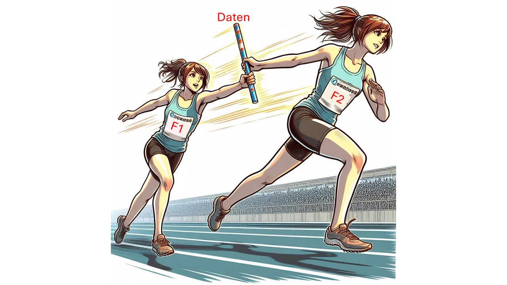
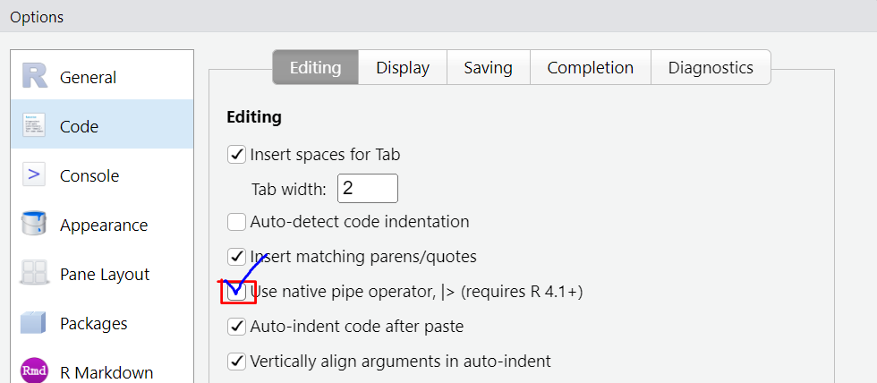
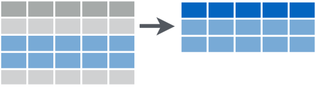

```{r setup, include=FALSE}
library(learnr)
library(rtutorials)
library(tidyverse)
knitr::opts_chunk$set(echo = FALSE)
```


## Lernziele

-   <input type="checkbox" unchecked> du lernst was eine `Pipe` ist </input>
-   <input type="checkbox" unchecked> du weißt *wann* du eine `Pipe` nutzen kannst </input>
-   <input type="checkbox" unchecked> du weißt *wie* du eine `Pipe` nutzen kannst </input>


## Pipe

Das englische *Pipe* ist hier als Röhre zu verstehen, nicht als Pfeife. Auch wenn es lustig wäre, einen "Pfeifen-Operator" zu haben. 


Der Pipe-Operator `|>` leitet den Output (**Daten**) einer Funktion(F1) als Input an die nächste Funktion (F2) weiter, quasi wie eine Röhre durch die das Ergebnis der ersten Funktion durchgeschickt wird. Analog kannst du es dir wie einen Staffelstab bei einem Staffellauf vorstellen, der von jeder Läuferin etwas (z.B. in seiner Position) verändert weitergegeben wird bis dieser am Ziel ist.  

{width="100%"}


Hier ist ein Beispiel: 

```{r einkaufen2, exercise = TRUE, exercise.cap = "Beispiel ohne Pipe"}
# mean(data, na.rm = TRUE) 
mean(einkaufen$alter, na.rm = TRUE)
```

ist genau das Gleiche wie:

```{r einkaufen, exercise = TRUE, exercise.cap = "Pipe Beispiel"}
# data |> mean(na.rm = TRUE)
einkaufen$alter |> mean(na.rm = TRUE)
```

Die Pipe `|>` fügt das, was reingegeben wird, **immer** als **erstes Argument** bei der nächsten Funktion ein. Das geht meistens gut, denn wir erinnern uns an das Tutorial "Funktionen erkunden": Das erste Argument ist meistens das **Daten**argument. 

Auch hier: Normalerweise würde es ohne Pipe so aussehen:

```{r pastepipe2, exercise = TRUE, exercise.cap = "Paste ohne Pipe"}
paste(7, "Zwerge")
```

und mit Pipe so:

```{r pastepipe, exercise = TRUE, exercise.cap = "Pipe fügt Input als erstes Argument ein"}
7 |> paste("Zwerge")
```

So lange es nur eine Pipe ist, ist sie relativ harmlos und überflüssig, und du fragst dich vielleicht wozu das Ganze gut ist. Die Pipe hat das große Potential, langen, verschachtelten
Code auf elegante Art lesbar zu machen. Nehmen wir zum Beispiel mal die schnelle Erstellung eines Balkendiagramms (mehr dazu im Visualisierungstutorial):


```{r barplot, exercise = TRUE, exercise.cap = "schneller Barplot mit Pipe"}
einkaufen$verkehrsmittel |> table() |> barplot()
```

Was sieht besser aus und ist besser zu erfassen? Der obige Code, oder das hier?

```{r barplot2, exercise = TRUE, exercise.cap = "schneller Barplot ohne Pipe"}
barplot(table(einkaufen$verkehrsmittel))
```

Beides ist von der Funktion her äquivalent, aber die Pipe ermöglicht ein klares Lesen
von links nach rechts:

*„Nimm die Spalte Verkehrsmittel, tabelliere die Häufigkeit der einzelnen Ausprägungen, dann zeichne daraus ein Balkendiagramm“*. 

```r
einkaufen$verkehrsmittel |> table() |> barplot()
```

::: grau-nb
**Verbalisierung**

`|>` kann gelesen werden wie ein „dann‘. 
:::

### die `%>%` Pipe
 
`%>%` ist auch ein Pipe-Operator, der jedoch aus dem `magrittr`-Paket stammt. Bis vor kurzem gab es `|>` noch nicht, und vorher war `%>%` jahrelang der Standard, der deswegen auch überall in Anleitungen im Internet zu sehen ist und immer noch sehr häufig genutzt wird. 

Die beiden Pipe-Operatoren tun aber ziemlich genau das selbe und unterscheiden sich vor allem in einigen technischen Details, wie sie mit Spezialfällen umgehen, was aber hier nicht wichtig ist für dich. Wichtig ist, dass du beide schon mal gesehen hast und weißt, dass:

- `%>%` nur funktioniert wenn `magrittr` geladen ist
- `|>` in `base R` eingebaut ist und die gleiche Funktion hat (wenn auch in einigen Spezialfällen anders reagiert, die uninteressant sind auf unserem Level).

### Pipelines

Die Beispiele mit zweifacher Verschachtelung oben waren ja trotzdem noch halbwegs 
lesbar. Die Pipe wird aber dann erst richtig interessant, wenn die Daten eine lange,
vielschrittige Aufbereitung durchlaufen müssen - so ähnlich wie in einer Fabrik:

```r
metall |> 
  schmelzen() |>
  gießen() |>
  abkühlen() |>
  lackieren() |>
  verpacken() |>
  verladen()
```
„**Nimm** Metall. Schmelze es, **dann** gieße es, **dann** kühle es ab, **dann**
lackiere es, **dann** verpacke, **dann** dann verlade es.“

::: blau
Für gute Lesbarkeit empfielt es sich, nach jeder Pipe eine neue Zeile zu beginnen.
:::

Das ist besonders bei der Aufbereitung von Datensätzen sehr häufig so, was 
auch *Data Wrangling* genannt wird und in einem eigenen Tutorial Raum finden wird. 

## Übung bekommen

Jetzt bist du gefragt! Werde zu Mario oder Luigi und nutze die Pipe, um an dein 
(Analyse-)Ziel zu kommen.

{width="100%"}

Wir nutzen weiterhin den Beispieldatensatz `einkaufen`. Hier ein kleiner Einblick in die Variablen, die du heute benutzt:

```{r viewdata, exercise = FALSE, Echo = FALSE}
einkaufen |> select(verkehrsmittel, essen, weg)
# nicht so schön, da nur die ersten beiden Variablen angezeigt werden
```

</br>

::: blau-nb
Noch ein kurzer Hinweis: Falls du das `|` Zeichen noch nie verwendet hast, hier die Tastenkombination:

**Windows/ Linux**: `alt gr` + `< ` oder `str` + `alt` + `<`

**Mac**: `⌥ `+ `7` 

Am besten nutzt du das in RStudio das eingebaute Tastaturkürzel `Strg/Cmd` + `Umschalt` + `M`. Dadurch wird ein ` |> ` mit Leerzeichen umgeben eingefügt.

Dafür kannst du unter *Tools* > *Globale Optionen* folgende Änderung vornehmen, um `|>` anstelle von `%>%` zu verwenden:

{width="100%"}

:::

</br>

::: aufgabe
**1**

Nutze die Pipe für die Funktion summary(), um für die Werte von `einkaufen$verkehrsmittel` den Modus zu bestimmen.
:::

```{r ex1, exercise = TRUE, exercise.cap = "Aufgabe 1"}

```

```{r ex1-hint-1}
# Daten |> funktion() 
```

```{r ex1-solution}
# Die Daten der Variable Verkehrsmittel werden in die Funktion summary() gefüttert
einkaufen$verkehrsmittel |> summary()
```

```{r modequest}
question_text("Was ist das häufigst genannte Verkehrsmittel der Befragten?",
                 answer("Auto", correct = TRUE, message = "Genau, das Auto wird mit 46 Nennungen am meisten genutzt."),
              allow_retry = TRUE)
```

</br>

::: aufgabe 
**2**

Nutze wieder den `einkaufen`-Datensatz.
Ermittle den *Mittelwert* für die Weglänge `einkaufen$weg` in dem du die Daten mittels Pipe in die Funktion eingibst. Schließe die `NA`s dafür von der Berechnung aus.
:::

```{r ex2, exercise = TRUE, exercise.cap = "Aufgabe 2"}

```

```{r ex2-hint-1}
# Die Variable heißt einkaufen$weg 
# Die Funktion für den Mittelwert ist mean()  
# Das Argument kannst du durch Eingabe von `mean?` in der Console herausfinden

# # Daten |> funktion( `zweites` Argument) 

```

```{r ex2-hint-2}
# Die Daten der Variable Weg werden in die Funktion mean() an erster Stelle eingesetzt, es folgt das Argument na.rm = TRUE, um die NAs auszuschließen
einkaufen$weg |> mean(na.rm = TRUE)
```


```{r meanquest}
question_text("Was ist der Mittelwert für den Weg zum Einkaufsladen auf zwei Nachkommastellen gerundet?",
                 answer(12.76, correct = TRUE, message = "Genau, im Durchschnitt beträgt die Weglänge zum Einkaufsladen 12.76 km."),
              allow_retry = TRUE)
```


Genial! Du hast jetzt also schon verstanden, wie du die Pipe für eine Funktionen mit einem zweiten Argument nutzt! 

Als letztes gibt es hier jetzt schon einen kleinen Einblick in das Tutorial `Data Wrangling`, da die Pipe hier eine große Rolle spielt. 

### Daten filtern

```{r, echo=FALSE, fig.align='center'}

```

**Neues Paket:**

Der Paketname `dplyr` ist eine Abkürzung für *data plyers*, „Datenzange“. Es ist
super hilfreich was das Arbeiten mit Tabellen angeht, und mit einem Fokus auf 
Leserlichkeit und Übersichtlichkeit des Codes entworfen worden. Wir stellen das
hier vor, weil sehr viele Funktionen aus diesem Paket super in eine Pipeline 
passen. 

Die Funktion `filter()` aus `dplyr` erlaubt, bestimmte Zeilen aus einem 
Datensatz herauszugreifen mit der „Datenzange“. 

```{r, echo=FALSE, fig.align='center'}

```

<center>
[Image Source: Data Wrangling Cheat Sheet](https://www.rstudio.com/wp-content/uploads/2015/02/data-wrangling-cheatsheet.pdf)
</center>
<br>

Zum Beispiel im `einkaufen`-Datensatz alle Zeilen von Personen, die als
Lieblingsessen „Pizza“ angegeben haben:

```{r filt, exercise = TRUE, exercise.cap = "filter(): Funktionsweise"}
filter(einkaufen, essen == "Pizza")
```

Achte auf die Spalte "Essen"! Im ganzen Datensatz werden nur noch Zeilen angezeigt, die als Essen "Pizza" angegeben haben.

::: blau-nb
`filter()` Basic Syntax folgt dieser Form:

```r
filter(Daten, Variable == Wert)
```

Oder mit Pipe:

```r
Daten |>
  filter(Variable == Wert)
```

`filter()` erwartet als Argumente den `Datensatz`, die `Variable` mit `Operator` und filterndem `Wert`.

:::

</br>

::: aufgabe 
**3** *(schwerer)*

Nutze für diese Aufgabe wieder die Pipe.

Nimm den Datensatz `einkaufen`, dann pipe ihn in die Funktion `filter()`, 
und filtere dort in der Variable `essen` nach dem Wert `"Pasta"`. 
Übergib dann die Daten an die Funktion `count()`, um dir die Anzahl von Menschen
mit Lieblingsessen "Pasta" ausgeben zu lassen.
:::

```{r ex3, exercise = TRUE, exercise.cap = "Aufgabe 3"}

```

```{r ex3-hint-1}
# Nutze den gesamten Datensatz von einkaufen 
# filter(Variable Operator Wert) 
# count()

# Datensatz |> 
# Funktion(zweites Argument) |>
# Funktion()

```

```{r ex3-hint-2}
# Die Daten des Datensatz einkaufen werden in die Funktion filter() an erster Stelle eingesetzt, es folgt das Argument wonach gefiltert wird: In der Variable Essen nach Einträgen die gleich (==) "Pizza" sind.
einkaufen |> 
  filter(essen == "Pasta") |> 
  count()
```

```{r lastquest}
question_text("Wie viele Menschen haben Pasta als Lieblingessen angegeben?",
                 answer(15, correct = TRUE, message = "Genau, 15 Befragte essen am liebsten Pasta."),
              allow_retry = TRUE)
```

Applaus!!! 👏
Das war wirklich nicht einfach! 

{width="100%"}

Du hast die Pipes gemeistert und bist bereit für das nächste Tutorial!

## Abschlussquizz

```{r Abschlussquizz}
quiz(caption = "Teste dein Wissen!",

learnr::question_checkbox("Welche der folgenden Aussagen sind korrekt? Markiere alle zutreffenden Aussagen.",
         answer("Der Pipe-Operator ist in deinem Code nicht erforderlich, aber es ist hilfreich, weil er Code linear lesbar macht.",
         correct = TRUE),
         answer("Der Pipe-Operator gibt den Output als erstes Argument in die nachfolgende Funktion ein.",
                correct = TRUE,
                message = "Genau. Die meisten Funktionen nehmen Daten als erstes Argument. Diese Funktionen können wir also mit Daten aus der Pipe füttern."),
         answer("Der Pipe-Operator kann auch Daten von rechts nach links weitergeben",
                message = "Der Pipe-Operator gibt immer den linken Output an die rechte Funktion weiter"),
         allow_retry = TRUE,
         random_answer_order = TRUE
         ),


learnr::question_checkbox("Was ist der Unterschied zwischen dem `%>%` und dem `|>` Pipe Operator?",
         answer("Die `|>`Pipe ist genauer als die `%>%`Pipe.",
              message = "Die Pipes unterscheiden sich nicht in der Genauigkeit, beide geben die Daten in die nächste Funktion weiter. Die Pipes unterscheiden sich aber in ihrer Funktionsweise in Spezialsituationen."),
         answer("Die `|>` Pipe kann nur genutzt werden, wenn das `magrittr`-Paket geladen wurde.",
              message = "Die `|>` Pipe ist in `Base R` implementiert und muss nicht extra aus einem Paket geladen werden."),
         answer("Die `%>%` Pipe kann nur genutzt werden, wenn das `magrittr`-Paket geladen wurde.",
              message = "Genau, um die `%>%` Pipe nutzen zu können, muss das `magrittr`-Paket geladen sein", 
              correct = TRUE),
         allow_retry = TRUE,
         random_answer_order = TRUE
         )
)
```


## Learnings

So hast du heute abgeschnitten:

```{r context="server"}
# Shiny App um die Anzahl richtig beantworteter Fragen anzuzeigen. 
# Funktioniert in jedem Tutorial

shiny::observeEvent(
  input$get_score, 
  {
    objs2 = learnr:::get_tutorial_state()
    
    # Number of correct questions
    
    n_correct <- 
      # Access the $correct sublist item in each list item
        lapply(objs2, purrr::pluck, "correct") |>
           # make it a vector containing: TRUE and FALSE and NAs
           # NA is appearing for list items which don't have
           # a $correct subitem
                unlist() |> 
           # Taking the sum of a logical Vector returns the number of TRUEs
                sum(na.rm=TRUE)
    
    # Number of total questions
    
    total_questions <- 
      # 1. Access $type in each list item and make it a vector of types
      lapply(objs2, purrr::pluck, "type") |> unlist()
    
    # 2. Count the number of "question" in that vector
    total_questions <- total_questions[total_questions == "question"] |> 
      length()
      
      
    output$score = shiny::renderText(
      paste0(n_correct, " von ", total_questions,
        " im gesamten Tutorial beantworteten Fragen waren richtig.")
)
    invisible()
  }
)
```

```{r score, echo=FALSE}
shiny::br()
shiny::actionButton("get_score", "Auswertung!")
shiny::br()
shiny::br()
shiny::textOutput("score")
shiny::br()
```


### Zusammenfassung

In diesem Tutorial habst du die Pipe-Operatoren `|>` und `%>%` kennengelernt. 
Der Pipe-Operator leitet den Output einer Funktion als Input an die nächste Funktion weiter, was zu einem klaren und lesbareren Code führt. `%>%` und `|>` sind äquivalente Pipe-Operatoren, wobei `%>%` aus dem `magrittr`-Paket stammt und `|>` in `base R` eingebaut ist.

### Diese neuen Konzepte kennst du nun:
-     Stichpunktartige Beschreibung

### Neue Funktionen
eine Tabelle mit den wichtigesten Codes des Tutorials

| Code                      | Beschreibung                                       |
|---------------------------|----------------------------------------------------|
| `x |> f()`                | Leitet den Output von `x` als erstes Argument an `f()` weiter. |
| `x %>% f()`               | Äquivalente Verwendung von `%>%` für die gleiche Funktionalität. |
| `paste(x, "Zwerge")`      | Verbindet den Vektor `x ` nach der Konvertierung in `char` mit "Zwerge"|
| `table(x)`                | Erstellt eine Häufigkeitstabelle für die Werte in `x`.|
| `barplot(x)`              | Erstellt ein Balkendiagramm für die Werte in `x`. |
| `filter(data, condition)` | Filtert Daten nach einer bestimmten Bedingung.|
| `count(x)`                | Zählt die Werte in `x`.|


## Credit

Dieses Tutorial wurde von Lukas Bruelheide und Marie Klosterkamp geschrieben. 

*Bei der Erstellung wurde teilweise von ChatGPT und Bing Image Creator Gebrauch gemacht.*
