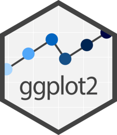
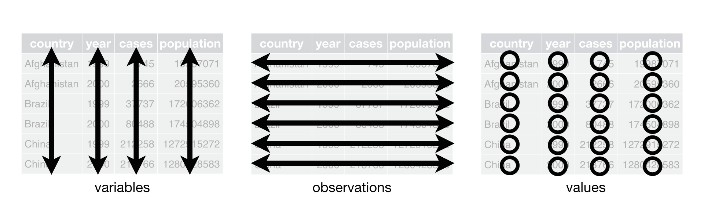

```{r setup, include=FALSE}
library(learnr)
knitr::opts_chunk$set(echo = FALSE)
```

## Inhalt

kurze Beschreibung des Inhalts

Verortung auf der Roadmap

## Lernziele

kleine Checkliste mit abhakbaren Checkboxen:

-   <input type="checkbox" unchecked> Wie verschiedene Überschriften
    gerendert werden </input>
-   <input type="checkbox" unchecked> farbige HTML-Boxen </input>
-   <input type="checkbox" unchecked> HTML-Tag für Absätze </input>
-   <input type="checkbox" unchecked> ausklappbare Abschnitte </input>
-   <input type="checkbox" unchecked> LaTex </input>


## Tidyverse

Wenn unsere Welt mal wieder im Chaos versinkt, gibt es  einen Rückzugsort, wo die Welt noch in *Ordnung* ist: das **Tidyverse**.  

{width="100%"}

Was ist das Tidyverse? Es ist ein Universum von Paketen, die sich einem bestimmten Ziel widmen, nämlich R für *Data Science* zu nutzen. Dazu gehört vor allem die Arbeit mit Tabellen und Daten.

Dabei hat sich eine Art Dialekt gebildet, der das Ziel hat, übersichtlich zu sein und konsistent und nutzerfreundlich. In den meisten Fällen werden Tidyverse-Funktionen diesem Anspruch gerecht und deswegen macht es auch Sinn, sie zu nutzen.

::: gelb
Trotzdem *ein Wort der Warnung*: Alles, was mit Tidyverse-Paketen möglich ist, lässt sich auch mit `base R` erreichen. Es wäre nicht so schlau, die "Basis" zu vergessen, und nur noch Tidyverse zu lernen. Tidyverse schreibt selbst auf seiner [Website](https://www.tidyverse.org/), es sei ein „opinionated R Package". Das heißt, es vertritt eine klare Meinung darüber, was eigentlich *tidy*, also aufgeräumt sein, für R bedeutet. Letztlich kann das Tidyverse nicht alles und nicht alle sind überzeugt davon. Manche R-Kurse entscheiden sich, um nicht zu verwirrend zu sein, nur noch Tidyverse zu lehren, beispielsweise @ismay2022 oder @wickham2016.
:::

</br>

Folgende Pakete gehören zum Tidyverse:

{width="20%"} 

-   `ggplot2`: konsistente *Grammar of Graphs* für Visualisierungen

{width="20%"}

-   `dplyr`: *Data Plyers* "Datenzange"

{width="20%"}

-   `tidyr`: Daten in ein *tidy*-Format bringen

-   ... und noch einige mehr, unter anderem `tibble`, `readr` and `purrr`.

Alle diese Pakete können entweder einzeln installiert werden oder alle auf einmal, indem das Schirmpaket `tidyverse` installiert wird.

```
# 1 mal zur Installation ausführen
install.packages("tidyverse") 

# für jede Session ausführen, in der tidyverse packete genutzt werden sollen
library(tidyverse)            
```

Ein Beispiel für die Design-Richtlinien, nach denen sich Tidyverse-Funktionen richten müssen, ist keine Punkte zu verwenden in Funktionsnamen (wie z.B. `base R`: `as.data.frame()`), sondern Unterstriche wie in `as_tibble()`. Das ist ein klassisches Zeichen, dass wir uns im Tidyverse bewegen.

## Von der Datenerhebung zur Analyse

Es klingt banal, aber wenn die Daten aufgeräumt sind, ist bereits die größte Hürde geschafft. Einen Großteil der Zeit von Datenanalyse verbringen Forschende damit, Daten in die richtige Form zu bringen. Die Auswertung selbst geht dann oft vergleichsweise schnell.

Den ganzen Aufräumprozess können Sie erleichtern, wenn Sie die Daten von Anfang an so organisieren, dass R gut damit umgehen kann.

Aber was gibt es eigentlich für Formen in denen Daten sein können?


Gleiche Daten, aber anders organisiert:

```{r}
df <- trees |> tibble::rowid_to_column(var = "id")
library(dplyr)
library(tidyr)
df |> pivot_longer(cols = !id, names_to = "variable")

df |> arrange(Height) |> pivot_wider(id_cols = "id", names_from = "Height",
                                     names_prefix = "Height=", values_from = "Volume")
```


## Datenerhebung

Wir beginnen damit, Daten zu erheben. Im Wintersemester 2022/23 haben 8 Studierende sich vor Bioläden in und um Kassel gestellt und den Kund_innen Fragen gestellt - zum Beispiel zum Lieblingsessen, wie oft sie selbst kochen und wie weit der Weg bis zum Laden war.

Die Antworten wurden mitgeschrieben und später in Excel oder OpenOffice eingetippt. Damit die Analyse in R später gut funktioniert, müssen die Daten in einer speziellen Form eingegeben werden:

```{r}
knitr::include_graphics(path = "images/clean.png")
```

::: grau-nb
Merke: Beobachtungen sind immer die Zeilen, und Variablen immer die Spalten.
:::

##### Variablen

Variablen sind die unterschiedlichen Fragen, die wir gestellt haben. Zum Beispiel:

-   Wie alt sind Sie? -\> Variable: Alter

-   Wie weit war Ihr Weg in km? -\> Variable: Weg

##### Beobachtungen

Beobachtungen sind hier die einzelnen Personen, denen die Fragen gestellt wurden. Eine Person ist dabei eine Beobachtung.

##### tidy data

Das oben vorgestellte Konzept wurde unter dem Namen "*tidy data"* formalisiert.

Hier sind drei wichtige Grundregeln für *tidy data* nach @wickham2016:

<div>

> 1.  Jede Variable braucht ihre eigene Spalte.
>
> 2.  Jede Beobachtung braucht ihre eigene Zeile.
>
> 3.  Jeder Wert braucht seine eigene Zelle.

</div>

grafisch dargestellt:
{width="90%"}

Source: [R for Data Science, H. Wickham, M. Cetinkaya-Rundel, G. Grolemund](https://r4ds.hadley.nz/data-tidy)

Mit diesen drei Grundregeln werden Sie weniger Kopfschmerzen bei der Analyse von Daten mit R bekommen.


## dplyr

## tidyr


## Abschlussquiz

**Wichtig:** Argument setzen: `allow_retry = TRUE`


```{r abschlussquiz_01, echo = FALSE}
learnr::question_radio("Was vermutest du: Was wird ausgegeben durch `wg$name`?",
                       answer("Ein Data Frame",
                              message = "Es ist kein Data Frame, weil die Werte dann untereinander in einer Spalte ausgegeben würden und nicht nebeneinander."),
                       answer("Ein Vektor",
                              correct = TRUE,
                              message = "Genau. Es ist ein Vektor, denn bei einem Data Frame würden die Werte untereinander in einer Spalte ausgegeben statt horizontal."),
                       allow_retry = TRUE)
```


## Learnings

So hast du heute abgeschnitten:

```{r context="server"}
# Shiny App um die Anzahl richtig beantworteter Fragen anzuzeigen. 
# Funktioniert in jedem Tutorial

shiny::observeEvent(
  input$get_score, 
  {
    objs2 = learnr:::get_tutorial_state()
    
    # Number of correct questions
    
    n_correct <- 
      # Access the $correct sublist item in each list item
        lapply(objs2, purrr::pluck, "correct") |>
           # make it a vector containing: TRUE and FALSE and NAs
           # NA is appearing for list items which don't have
           # a $correct subitem
                unlist() |> 
           # Taking the sum of a logical Vector returns the number of TRUEs
                sum(na.rm=TRUE)
    
    # Number of total questions
    
    total_questions <- 
      # 1. Access $type in each list item and make it a vector of types
      lapply(objs2, purrr::pluck, "type") |> unlist()
    
    # 2. Count the number of "question" in that vector
    total_questions <- total_questions[total_questions == "question"] |> 
      length()
      
      
    output$score = shiny::renderText(
      paste0(n_correct, " von ", total_questions,
        " im gesamten Tutorial beantworteten Fragen waren richtig.")
)
    invisible()
  }
)
```

```{r score, echo=FALSE}
shiny::br()
shiny::actionButton("get_score", "Auswertung!")
shiny::br()
shiny::br()
shiny::textOutput("score")
shiny::br()
```


### Zusammenfassung

Hier ein kleiner Text, was gelernt wurde und vlt. auch warum das wichtig ist.

### Diese neuen Konzepte kennst du nun:
-     Stichpunktartige Beschreibung

### Neue Funktionen
eine Tabelle mit den wichtigesten Codes des Tutorials
| Code           | Beschreibung                           |
|----------------|----------------------------------------|
| `[ ]`          | Indizierung                            |
| `&`            | UND-Operator für logische Indizierung  |

## Credit
<!-- vielleicht in diese Richtung? -->
Dieses Tutorial wurde (größtenteils) von Marie Klosterkamp sowie in Teilen von Lukas Bruelheide geschrieben. 

Bei der Erstellung (u.a. der Beispiele, Aufgaben und Zusammenfassung) wurde teilweise von ChatGPT und Bing Image Creator gebrauch gemacht.


