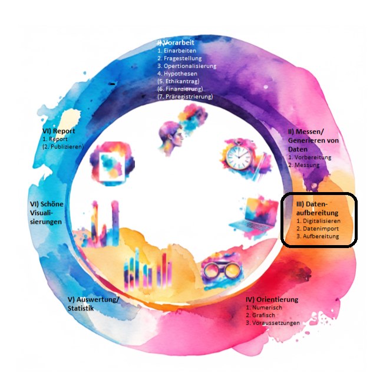
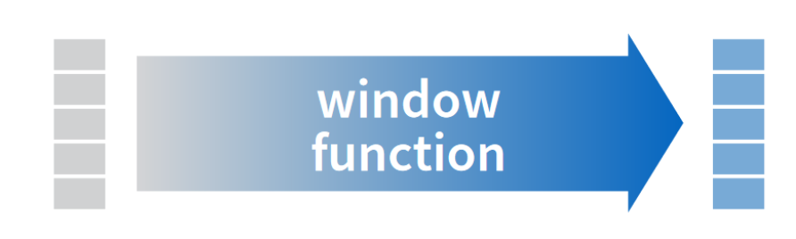
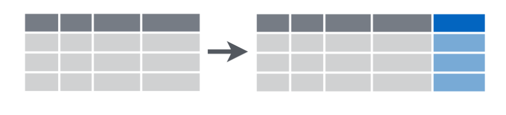
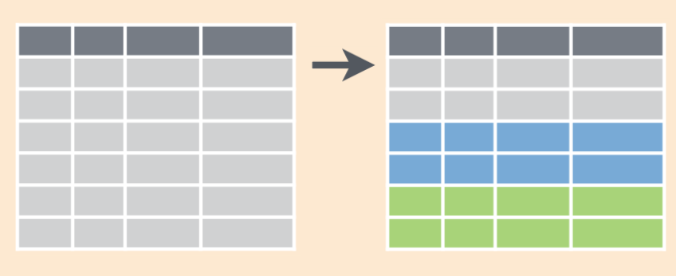
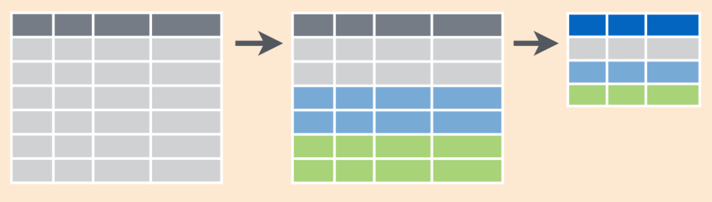
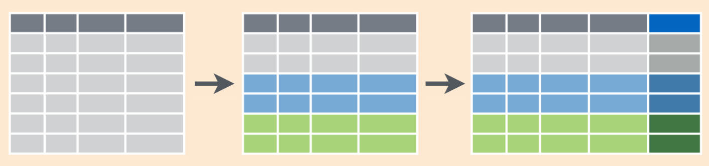
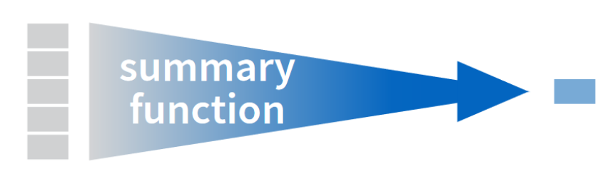

```{r setup, include=FALSE}
library(learnr)
library(rtutorials)
library(tidyverse)
knitr::opts_chunk$set(echo = FALSE)
```

## Inhalt

Im wissenschaftlichen Prozess steht die Daten-Aufbereitung
logischerweise vor der Visualisierung und Auswertung. Die Daten werden
so arrangiert, dass sie später im richtigen Format für die Auswertung
vorliegen. Dabei werden unter anderem auch Ausreißer analysiert und
fehlende Werte betrachtet.

{width="80%"}

## Lernziele

In diesem Tutorial lernst du:

-   <input type="checkbox" unchecked> Was das *tidyverse* ist</input>
-   <input type="checkbox" unchecked> Wie *saubere* Daten ausssehen
    </input>
-   <input type="checkbox" unchecked> Wie du Daten mit dem Paket `dplyr`
    arrangierst </input>
-   <input type="checkbox" unchecked> Wie du deine Daten *reinigst*
    </input>

<hr>

Einiges im folgenden orientiert sich an einem tollen, frei verfügbaren R
Tutorial namens [*DoSStoolkit*](https://dosstoolkit.com/) [@rohan2023].
Wir haben die Reihenfolge geändert, Sachen übersetzt und paraphrasiert
und unsere eigenen Gedanken hinzugefügt.

<hr>

## Tidyverse

Wenn unsere Daten-Welt mal wieder im Chaos versinkt, gibt es einen
Rückzugsort, wo die Welt noch in *Ordnung* ist: das **tidyverse**.

{width="70%"}

*Was ist das tidyverse?* Es ist ein **Universum von Paketen**, die sich
einem bestimmten Ziel widmen, nämlich R für *Data Science* zu nutzen.
Dazu gehört vor allem die Arbeit mit Tabellen und Daten.

Dabei hat sich eine Art Dialekt gebildet, der das Ziel hat,
übersichtlich zu sein, konsistent und nutzerfreundlich. In den meisten
Fällen werden *tidyverse*-Funktionen diesem Anspruch gerecht und
deswegen macht es auch Sinn, sie zu nutzen.

::: gelb
Trotzdem *ein Wort der Warnung*: Alles, was mit *tidyverse*-Paketen
möglich ist, lässt sich auch mit *Base R* erreichen. Es wäre nicht so
schlau, die "Basis" zu vergessen, und nur noch *tidyverse* zu lernen.
*Tidyverse* schreibt selbst auf seiner
[Website](https://www.tidyverse.org/), es sei ein „opinionated R
Package". Das heißt, es vertritt eine klare Meinung darüber, was
eigentlich *tidy*, also aufgeräumt sein, für R bedeutet. Letztlich kann
das *tidyverse* nicht alles und nicht alle sind überzeugt davon. Manche
R-Kurse entscheiden sich, um nicht zu verwirrend zu sein, nur noch
*tidyverse* zu lehren, beispielsweise @ismay2020 oder @wickham2016.
:::

</br>

Folgende Pakete gehören zum *tidyverse*:

-   `ggplot2`: konsistente *Grammar of Graphs* für Visualisierungen
    (kannst du ja sogar schon 👏)

{width="20%"}

-   `tidyr`: Daten in ein *tidy*-Format bringen

{width="20%"}

-   `dplyr`: *Data Plyers* "Datenzange"

{width="20%"}

-   ... und noch einige mehr, unter anderem `tibble`, `readr` and
    `purrr`.

Alle diese Pakete können entweder einzeln installiert werden oder alle
auf einmal, indem das Schirmpaket `tidyverse` installiert wird.

Ein Beispiel für die Design-Richtlinien, nach denen sich
*tidyverse*-Funktionen richten müssen, ist keine Punkte zu verwenden in
Funktionsnamen (wie z.B. *Base R*: `as.data.frame()`), sondern
Unterstriche wie in `as_tibble()`. Das ist ein klassisches Zeichen, dass
wir uns im *tidyverse* bewegen. Außerdem ist dort alles *lowercase*,
also kleingeschrieben, damit es nicht zu Verwirrungen wegen Groß- und
Kleinschreibung kommt.

## Von der Datenerhebung zur Analyse

Es klingt banal, aber wenn die Daten aufgeräumt sind, ist bereits die
größte Hürde geschafft. Einen Großteil der Zeit von Datenanalyse
verbringen Forschende damit, Daten in die richtige Form zu bringen. Die
Auswertung selbst geht dann oft vergleichsweise schnell.

Den ganzen Aufräumprozess kannst du erleichtern, wenn du die Daten von
Anfang an so organisierst, dass *R* gut damit umgehen kann.

Aber was gibt es eigentlich für Formen in denen Daten vorliegen können?

Gleiche Daten, aber anders organisiert:

```{r}
df <- trees |> tibble::rowid_to_column(var = "id")

df |> pivot_longer(cols = !id, names_to = "variable")

df |> arrange(Height) |> pivot_wider(id_cols = "id", 
                                     names_from = "Height",
                                     names_prefix = "Height=", values_from = "Volume")
```

## Datenerhebung

Im Falle unseres Beispieldatensatzes `einkaufen` haben 8 Studierende
sich vor Bioläden in und um Kassel gestellt und den Kund_innen Fragen
gestellt - zum Beispiel zum Lieblingsessen, wie oft sie selbst kochen
und wie weit der Weg bis zum Laden war.

Die Antworten wurden mitgeschrieben und später in *Excel* oder *OpenOffice*
eingetippt. Damit die Analyse in R später gut funktioniert, müssen die
Daten in dieser speziellen Form eingegeben werden:

```{r}
knitr::include_graphics(path = "images/clean.png")
```

::: grau-nb
Merke: Beobachtungen sind immer die Zeilen, und Variablen immer die
Spalten.
:::

##### Variablen

Variablen sind die unterschiedlichen Fragen, die wir gestellt haben. Zum
Beispiel:

-   Wie alt sind Sie? -\> Variable: Alter

-   Wie weit war Ihr Weg in km? -\> Variable: Weg

##### Beobachtungen

Beobachtungen sind hier die einzelnen Personen, denen die Fragen
gestellt wurden. Eine Person ist dabei eine Beobachtung.

##### tidy data

Das oben vorgestellte Konzept wurde unter dem Namen "*tidy data"*
formalisiert.

Hier sind drei wichtige Grundregeln für *tidy data* nach @wickham2016:

<div>

> 1.  Jede Variable braucht ihre eigene Spalte.
>
> 2.  Jede Beobachtung braucht ihre eigene Zeile.
>
> 3.  Jeder Wert braucht seine eigene Zelle.

</div>

grafisch dargestellt: 

{width="90%"}

Source: [R for Data Science, H. Wickham, M. Cetinkaya-Rundel, G.
Grolemund](https://r4ds.hadley.nz/data-tidy)

Mit diesen drei Grundregeln wirst du weniger Kopfschmerzen bei der
Analyse von Daten mit R bekommen.

<!-- ## tidyr -->

<!-- {width="20%"} -->

<!-- Das tidyr Paket hilft uns dabei unsere Daten in ein *tidy*-Format zu bringen. Die Hauptfunktionen von *tidyr* sind: -->

<!-- - *Pivoting*: Dies ermöglicht die Umwandlung zwischen der langen und breiten Form eines Data Frames. In diesem Kapitel werden die Funktionen `pivot_wider()` und `pivot_longer()` vorgestellt.  -->

<!-- - Umgang mit *fehlenden Werten*: Du kannst NA-Werte mit der Funktion `drop_na()` entfernen oder du kannst `replace_na()` verwenden, um die NA-Werte durch einen bestimmten Wert zu ersetzen. -->

Stelle bei der Erhebung sicher, dass deine Daten in diesem Format
vorliegen, dann kannst du sie mithilfe des *tidyverse* nach deinen
Wünschen arrangieren. Im folgenden stellen wir dir dafür dir das Pakete
`dplyr` und dessen Funktionen vor.

## Das Paket `dplyr`

{width="20%"}

`dplyr` steht für *Data Plyers*, "Datenzange". Es
enthält essentielle Funktionen um deine Daten zu greifen und in Form zu bringen:

-   `rename()` lässt dich deine Variablen umbenennen.
-   `select()` ermöglicht es dir, Variablen anhand ihrer Namen
    auszuwählen.
-   `arrange()`, um die Reihenfolge der Zeilen zu ändern.
-   `filter()`, um Zeilen basierend auf ihren Werten auszuwählen.
-   `mutate()`, um neue Variablen zu erstellen
-   `group_by()`, um Funktionen gruppenweise durchzuführen
-   `summarise()`, dampt mehrere Zeilen ein zu einer einzigen zusammenfassenden Zahl

Starten wir direkt mit der ersten Funktion: `rename()`.

## rename()

Bist du mit der Wahl deiner Variablennamen unzufrieden? Die Funktion
`rename()` ist deine Rettung.

::: blau-nb
Es empfielt sich Variablen nicht mitten im Skript umzubenennen, das
sollte direkt zu Beginn, nach dem Import der Daten geschehen. So
ersparst du dir einige unnötige Fehlermeldungen aufgrund nicht
auffindbarer Variablen.

Möchtest du dein Skript im nachhinein an die neue Schreibweise anpassen
kannst du mit dem Tastenkürzel `strg + f` das entsprechende Wort im
Skript suchen und ersetzen lassen (`replace`). *Der Befehl öffnet ein
kleines Extra Menü über deinem Skript.* Auch außerhalb von R Studio ist
es übrigens ein sehr hilfreiches Tastenkürzel um Texte zu durchsuchen.
:::

</br>

Was kann die Funktion `rename()`:

-   `rename()` ist hilfreich, um Spalten in etwas einfacheres und
    eindeutigeres umzubenennen.
-   Es lassen sich auch mehrere Spalten in einem Data Frame auf einmal
    umbenennen.
-   Auch nicht beschriftete Spalten (oder Spalten mit Leerzeichen)
    können geändert werden.

Die Syntax von `rename()` ist relativ simple und entspricht dem was wir
von R gewohnt sind:

`rename(data, new = old)`

Die Funktion nimmt als *ersten Input unseren Data Frame* (praktisch für
unsere Pipe), und möchte erst den *neuen* und *dann* den *alten Namen*.
Beachte dabei die Regeln für Variablennamen (muss mit einem Buchstaben
beginnen, keine Leerzeichen, möglichst aussagekräftig und kurz, etc.).
Die Variablennamen müssen hier jedoch nicht mit Anführungszeichen als
String eingegeben werden, da sie eben Variablen sind, denen wir etwas
zuweisen.

::: blau-nb
Jetzt ist auch die Zeit gekommen, in der dein Wissen und Können zum
Thema Pipe-Operator `|>` nützlich wird. Diesen werden wir heute
umfassend nutzen.

Falls du im Internet Code findest der diese Pipe `%>%` verwendet, die
stammt ebenfalls aus dem *tidyverse*. Beide funktionieren in diesem
Tutorial.

Die Pipe kannst du wie gewohnt mit der Tastenkombination
`strg bzw. Cmd + shift + M` hinzufügen.
:::

</br>

Hier ein erstes Beispiel, wie du die Funktion nutzen kannst, um
`frequenz` zu `freq` und `bioladen` zu `bio` umzubenennen: (hier nur zur
Veranschaulichung, die Namen waren vorher schon gut gewählt).

```{r rename1, exercise = TRUE}
# abspeichern als einkaufen_rn (renamed)
einkaufen_rn <- einkaufen |>
  rename(freq = frequenz,
         km = weg)

head(einkaufen_rn)
```

Wir speichern das Ergebnis auch direkt als Datensatz ab, damit die
Änderungen einen Effekt haben. Natürlich könntest du es auch in dem
originalen Datensatz abspeichern und damit weiterarbeiten.

### rename() mit Index

Falls die Variablen aus einem anderen Programm stammen und evtl.
aufgrund von Leerzeichen nicht richtig von R interpretiert werden
können, lässt sich die Spalte auch durch den Index bearbeiten:

Dafür solltest du dir zunächst die Variablennamen ausgeben lassen
(`names(data)`), oder in deinem Datensatz anschauen an welcher Stelle
die Variablen stehen, die du ändern möchtest.

```{r rename2, echo = TRUE}
names(einkaufen)
```

Um den Namen zu ändern, gib anstelle des alten Namens die Position der
Spalte ein:

```{r rename3, exercise = TRUE}
# ändert Spalte 2 von `verkehrsmittel` zu `mode`
einkaufen_neu <-  einkaufen |>
  rename(mode = 2)

head(einkaufen_neu)
```

Wenn du es selbst ausprobieren möchtest, nutze gerne den Codechunk zum
experimentieren.

Damit hast du die erste Funktion bereits erfolgreich erkundet.👏

::: blau-nb
Richtig lernen, wie es funktioniert wirst du am besten, wenn du den Code
auf deine eigenen Daten außerhalb dieses Tutorials anwendest. Denn wir Menschen lernen durch die Handlung, nicht durch das Lesen. 
:::

## select()

In diesem Kaptiel wirst du lernen, wie du die Funktion `select()`
verwendest.

Wenn du mit großen Datensätzen arbeitest, stellst du möglicherweise
fest, dass es schwierig ist, einen Überblick über deinen Datensatzen zu behalten.
Vielleicht fragst du dich, wie du nur die Variablen auswählen kannst,
die du für die Analyse oder Ausgabe verwenden möchtest. Nun, es gibt
eine super Möglichkeit, die von dir ausgewählten Variablen zu fassen:
`select()`.

So sieht die Funktion aus:

`select(data, variables)`

Die Ausgabe der Funktion ist eine Teilmenge der Eingabedaten (Spalten),
möglicherweise in einer anderen Reihenfolge. Die Funktion `select()`
verändert jedoch nicht den Originaldatensatz/die Originalspalten. Wenn
du also die neuen ausgewählten Spalten verwenden möchtest, musst du
diese einer neuen Variable zuweisen. (Dieser Prozess wird auch
*subsetting* genannt, weil du ein Sub-Set aus deinen Daten erstellst.)

Hier ist ein einfacher Datensatz mit durchschnittlichen Temperaturen für
jede Jahreszeit. Wie du in der Ausgabe sehen kannst, gibt es 3
Beobachtungen (Zeilen) und 4 Variablen (Spalten) im Datensatz.

```{r temperature, exercise = TRUE, exercise.cap = "select()"}
temperature_data <- tibble(spring = c(3, 5, 10), 
                  summer = c(23, 27, 25), 
                  fall = c(19, 17, 14), 
                  winter = c(2, -1, -8)) 
temperature_data
```

Nehmen wir an, wir möchten nur die Temperaturen im Frühling (*spring*)
sehen. Um dies zu tun, wähle die Variable aus, die du behalten möchtest,
indem du den Variablennamen in die Funktion `select()` einfügst.

### Beispiele

Möchten wir nur die Spalte `spring` sehen, sieht der Code dafür so aus:

```{r select1, exercise = TRUE, exercise.setup = "temperature", exercise.cap = "select()"}
select(temperature_data, spring)
```

Es ist jedoch wichtig zu wissen, dass sich die Daten in
`temperature_data` nicht geändert haben, wie du sehen kannst. Die
Funktion verändert den Originaldatensatz nicht.

```{r select2, exercise = TRUE, exercise.setup = "temperature", exercise.cap = "select()"}
temperature_data
```

Wenn du den neuen Datensatz mit der Variable `spring` verwenden
möchtest, musst du die ausgewählte Spalte einer neuen Variable zuweisen:

```{r select3, exercise = TRUE, exercise.setup = "temperature", exercise.cap = "select()"}
new_data <- select(temperature_data, spring)
new_data
```

Du kannst auch **mehrere Variablen durch Kommas getrennt auswählen**,
solange der Datensatz der erste Input der Funktion ist. Geanu hier ist
dann auch die Pipe nützlich, da wir das damit sicherstellen.

```{r select4, exercise = TRUE, exercise.setup = "temperature", exercise.cap = "select()"}
temperature_data |>
  select(summer, winter)
```

### Operatoren:

Jetzt wissen wir, wie die Funktion `select()` funktioniert. Es gibt
darüber hinaus noch verschiedene Möglichkeiten, die Funktion mit diesen
hilfreichen Operatoren zu erweitern:

-   `!` eine Aussage oder eine Spalte **negieren**
-   `|` **ODER**-Operator
-   `&` **UND**-Operator
-   `-` eine Spalte **ausschließen**
-   `:` eine Reihe **aufeinanderfolgender Variablen auswählen**

</br>

**Der Operator `!`** verneint eine Auswahl:

```{r select5, exercise = TRUE, exercise.setup = "temperature"}
temperature_data |>
select(!winter)
```

</br>

**Die Operatoren `|` und `&`** wählen die Vereinigung (`|`) oder eine
Schnittmenge (`&`) der Auswahlen aus.

```{r select6, exercise = TRUE, exercise.setup = "temperature"}
temperature_data |>
select(winter | summer)
```

</br>

::: gelb
Beachte: `select(temperature_data, winter & summer)` würde hingegen
einen Fehler verursachen, da es keine Werte geben kann, die eine
Schnittmenge aus Winter und Sommer sind. `&` ist besser dafür geeignet
nach Bedingungen zu filtern, wie du es vielleicht noch vom Indizieren
her kennst.
:::

</br>

**Der Operator `:`** wählt einen Bereich aufeinanderfolgender Variablen
aus, beginnend mit der Variable links des Doppelpunkts bis zur Variable
rechts des Doppelpunkts.

```{r select7, exercise = TRUE, exercise.setup = "temperature"}
temperature_data |> 
  select(summer:winter)
```

</br>

**Der Operator `-`** schließt eine Spalte aus.

Wenn du die meisten Spalten im Datensatz auswählen möchtest und nur
einige Spalten ausschließen möchtest, gibt es eine einfachere
Möglichkeit. Du kannst einfach - vor den Namen der Spalte setzen, die du
ausschließen möchtest. Zum Beispiel möchte ich die Spalten "summer" und
"winter" ausschließen, dann setze ich einfach ein - vor die Spalten:

```{r select8, exercise = TRUE, exercise.setup = "temperature"}
temperature_data |> 
  select(-summer, -winter)
```

**Jetzt bist du dran!**

::: aufgabe
Lasse dir vom Datensatz `einkaufen` nur die Variablen `verkehrsmittel`
und `alter` ausgeben.
:::

```{r q1_select, exercise = TRUE, exercise.cap = "2 Variablen auswählen"}

```

```{r q1_select-hint}
# füge der Funktion select die entsprechenden Variablen hinzu
einkaufen |>
   select() 
```

```{r q1_select-solution}
einkaufen |>
   select(verkehrsmittel, alter) 
```

::: aufgabe
Lasse dir vom Datensatz `einkaufen` alle Variablen bis auf `id` und
`datum` ausgeben.
:::

```{r q2_select, exercise = TRUE, exercise.cap = "2 Variablen ausschließen"}

```

```{r q2_select-hint}
# füge der Funktion select die entsprechenden Variablen hinzu
einkaufen |>
   select() 
```

```{r q2_select-solution}
einkaufen |>
   select(-id, -datum) 
```

```{r q3_select}
question_checkbox("Es gibt Variablen `id`, `gpa`, `age`, `height`, `weight` in einem Datensatz `data`. 
                  Du möchtest *nur* die Variablen `id`, `height` und `weight` auswählen. Was solltest du schreiben?",
  answer("data |> select (id, height, weight)", 
         correct = TRUE),
  answer("data |> select (id & height & weight)", 
         message = "Bei dem & Operator ist es etwas tricky. Erinnere dich, dass alle Bedingungen TRUE sein müssen, damit die Bedingung erfüllt ist. Es gibt logischerweise keine Variable, die sowohl id, height und weight  beinhaltet."),
  answer("data |> select (id | height | weight)", 
         correct = TRUE),
  answer("data |> select (id | height:weight)", 
         correct = TRUE),
  allow_retry = TRUE,
  random_answer_order = TRUE,
  incorrect = "Versuche es erneut. Du schaffst das!"
)
```

Super, das sitzt! 👌 Dann kann es jetzt zur nächsten `dplyr` Funktion
weitergehen.

## arrange()

Manchmal möchtest du einen Datensatz in einer bestimmten Reihenfolge
anzeigen lassen. Datensätze werden oft in der Reihenfolge angezeigt, in
der die Daten eingegeben wurden, aber du möchtest ihn möglicherweise
nach einer anderen Variable sortiert sehen. Du kannst die *tidyverse*
`arrange()`-Funktion verwenden, um einen Datensatz nach einer bestimmten
Spalte zu sortieren.

Die `arrange()`-Funktion nimmt einen Dataframe und die zu sortierenden
Spalten als Eingabe entgegen und gibt den neu geordneten Dataframe aus.
`arrange()` ändert dabei keine Werte in deinen Daten, sondern ändert nur
die Darstellung.

```{r arrange1, exercise = TRUE}
einkaufen |>
  arrange(weg) |> 
  select(weg, alter, frequenz)
```

Du siehst, die Weglänge ist nun aufsteigend arrangiert worden. Auch hier
kannst du die Funktion für mehrere Variablen gleichzeitig nutzen:

```{r arrange2, exercise = TRUE}
einkaufen |>
  arrange(weg, alter) |> 
  select(weg, alter, essen)
```

::: gelb
Aber Vorsicht: Dir wird aufgefallen sein, dass Alter zwar etwas sortiert wurde, aber nur in den Fällen, in denen die Menschen die gleiche Weglänge angegeben haben. Es wird also primär nach `weg` sortiert und dann erst nach `alter`.
:::

</br>

::: blau-nb
Auch hier gilt: Es gibt viele Wege das Ziel zu erreichen. Die *Base R*
Variante `sort()` kennst du ja auch bereits, die einen gegebenen
**Vektor** sortieren kann:
:::

```{r sort, exercise = TRUE}
einkaufen$weg |>
  sort(decreasing  = T) 
```

In einem Data Frame bietet sich `arrange()` jedoch besser an, da
`sort()` nur einen einzelnen Vektor sortiert.

## filter()

Die `filter()`-Funktion wird verwendet, um *Zeilen* aus einem gegebenen
Data Frame *basierend auf bestimmten Kriterien zu extrahieren*. Alle
Zeilen, die diese Kriterien nicht erfüllen, werden verworfen.

Diese Kriterien werden in Form von **logischen Bedingungen**
geschrieben. Zum Beispiel können wir,
wenn ein DataFrame `ToothGrowth` eine Variable namens `len` für *length*
hat, alle Zeilen extrahieren, bei denen `len` gleich 22 ist, mit dem
Ausdruck `len == 22.0`. Es kann eine *einzelne* Bedingung oder *mehrere*
Bedingungen vorhanden sein.

Einige nützliche Funktionen und Operatoren sind:

-   `==`, `>`, `<`, `>=`, `<=`
-   `&`, `|`, `!`, `xor()`
-   `is.na()`

`filter()` funktioniert dabei ähnlich wie das Indizieren anhand von
eckigen Klammern `[]` in *Base R*. Allerdings, falls beim Auswerten
unserer Bedingungen auf einer Zeile NAs auftreten, verwirft `filter()`
diese Zeilen, während `[]` diese weiterhin extrahiert. Das solltest du
also unbedingt im Kopf behalten.

### Welche Argumente nimmt `filter()`?

`filter(data, Bedingungen)`

-   `.data`: den Data Frame, mit dem wir arbeiten
-   `...`: die Bedingungen für die zu extrahierenden Zeilen


### Welchen Wert gibt `filter()` zurück?

`filter()` gibt einen Data Frame zurück, der eine *Teilmenge der Zeilen*
des Data Frames basierend auf den definierten Bedingungen oder Kriterien
enhält. Dabei bleiben die Spalten unverändert und die Reihenfolge der
Zeilen bleibt ebenfalls gleich. Aber schauen wir es uns doch einfach mal
an.

Angenommen, wir interessieren uns nur für die Antworten von Menschen,
deren Lieblingsessen "Pasta" ist. So könnten wir mit dem folgenden Code
entsprechend nur jene Zeilen ausgeben lassen, bei denen die Befragten
"Pasta" als Lieblingsessen angaben.

```{r filter1, exercise = TRUE}
einkaufen |> 
filter(essen == "Pasta")
```

::: aufgabe
Ändere den Code so um, dass stattdessen nach dem Verkehrsmittel
"Fahrrad" gefiltert wird.
:::

```{r filter2, exercise = TRUE, exercise.cap = "Filtern mit 1 Variable"}
einkaufen |> 
filter(essen == "Pasta")
```

```{r filter2-solution}
einkaufen |> 
filter(verkehrsmittel == "Fahrrad")
```

Das hat doch schon mal super geklappt! Gehen wir also einen Schritt
weiter.

::: aufgabe
Ändere den Code so um, dass sowohl nach dem Verkehrsmittel "Fahrrad" als
auch einer Weglänge (`weg`) von über `5`km gefiltert wird.
:::

```{r filter3, exercise = TRUE, exercise.cap = "Filtern mit 2 Variablen"}
einkaufen |> 
filter()
```

```{r filter3-hint}
# füge der ersten Filterbedingung mit dem &-Operator eine weitere Bedingung für `weg ist größer 5` hinzu.
einkaufen |> 
filter(verkehrsmittel == "Fahrrad")
```

```{r filter3-solution}
einkaufen |> 
filter(verkehrsmittel == "Fahrrad" & weg > 5)
```

Noch eine kurze Übung zu den NAs. Wie du oben bereits gelesen hast,
werden als default NAs in deiner zu filternden Variable herausgefiltert.
Möchtest du dir hingegen nur die NAs einer Variable anzeigen lassen, so
ist auch das mit der `filter()` Funktion möglich. Dafür nutzen wir die
Funktion `is.na(*variable*)` innerhalb der `filter()` Funktion. Das
sieht dann so aus:

```{r filter4, exercise = TRUE}
einkaufen |> 
filter(is.na(ort))
```

```{r q1_filter}
question_radio("Welche der folgenden Codes ist korrekt?",
  answer("data |> filter(id & weight)", 
         message = "`filter()` braucht spezifische Bedingungen, die mittels Operatoren bewerkstelligt werden. Möchtest du nur die Variablen auswählen, kannst du dafür `select()` nutzen.") ,
  answer("data |> filter(weight = 60)", 
         message = "`=` ist kein gültiger Operator. Nutze dafür `==`"),
  answer("data |> filter(height <= 1,80)", 
         correct = TRUE),
  answer("data |> filter(farbe == grün)", 
         message = "String-Variablen müssen in Anführungszeichen geschrieben werden, damit R sie nicht als eine Variable interpretiert."),
  allow_retry = TRUE,
  random_answer_order = TRUE,
  incorrect = random_encouragement("de"),
  correct = random_praise("de")
)
```

Super, auch das hast du gemeistert! Weiter geht´s!

## mutate()

Die `mutate()`-Funktion in R, die durch das Paket `dplyr` bereitgestellt
wird, ermöglicht es, neue Spalten zu deinem Data Frame hinzuzufügen oder
vorhandene Spalten zu verändern, basierend auf bestimmten Berechnungen
oder Transformationen. Dies ist besonders nützlich, um neue
Informationen aus vorhandenen Daten zu generieren oder um bestehende
Daten zu modifizieren.

Um `mutate()` zu nutzen, müssen wir angeben, welcher Data Frame
bearbeitet werden soll, gefolgt von der Definition der neuen oder zu
verändernden Spalte(n). Die Syntax lautet:

`mutate(data, new_column = expression)`

- `data`: Der Data Frame, der bearbeitet werden soll. 
- `new_column`: Der Name der neuen Spalte oder einer vorhandenen Spalte, die modifiziert werden soll. 
- `expression`: Die Berechnung oder Transformation, die auf
die Daten angewendet werden soll.

Mutate ist somit eine *window function*, das bedeutet, die Funktion
**nimmt** als Input **einen Vektor und gibt auch wieder einen gleichlangen Vektor aus**.

{width="70%"}

[Source:CheatSheet](https://www.rstudio.com/wp-content/uploads/2015/02/data-wrangling-cheatsheet.pdf)

### Beispiel

Angenommen, wir wollen für unseren Data Frame `einkaufen` den Weg nicht nur in km sondern auch in Meter verfügbar haben. Um eine neue Spalte `weg_m` zu berechnen, könnten wir folgenden Code verwenden:

```{r mutate1, exercise = TRUE}
# nur weg auswählen, um den data frame zur Veranschaulichung klein zu halten
einkaufen |> 
  select(weg) |> 
  mutate(weg_m = weg*1000)
```

Willst du die neue Variable jedoch deinem Data Frame hinzufügen, so
musst du diese mit dem Assignment auch noch zuweisen:

```
einkaufen <-  einkaufen |> 
  mutate(weg_m = weg*1000)
```

::: gelb
Vorsicht, benutzt du bei dem Assignment in der Pipe auch die
`select()`-Funktion, so verlierst du dabei die anderen Variablen deines
Datensatzes. Für solche Fälle kannst du besser einen neuen Data Frame
erstellen.
:::

</br>

Das Ergebnis des obrigen Codebeispiels, kannst du dir grafisch so vorstellen:

{width="80%"} 

[Source:CheatSheet](https://www.rstudio.com/wp-content/uploads/2015/02/data-wrangling-cheatsheet.pdf)

Aber `mutate()` kann noch vieles mehr als eine neue Variable berechnen.
Schau dir dafür gerne auch das [Cheat Sheet vom Paket
dyplr](https://www.rstudio.com/wp-content/uploads/2015/02/data-wrangling-cheatsheet.pdf)
an.

### Expertenlevel

Eine sehr interessante Möglichkeiten von `mutate()` ist die bedingte
Mutation. Hier können Spalten basierend auf bestimmten Bedingungen
erstellt werden.

Nehmen wir an, wir wollen eine unserer metrischen Variablen in selbst
gewählte Kategorien aufteilen. Dafür nutzen wir die Funktion
`ifelse(B, y, z)` in `mutate()`. 

Damit sagen wir R, wenn Bedingung `B`,dann `x` ansonsten `y`.

In einem Beispiel ist dies bestimmt leichter zu verstehen:

```{r ifelse, exercise = TRUE}
einkaufen <- einkaufen |> 
  mutate(weglaenge = ifelse(weg > 5, "fern", "nah"))

einkaufen |>  
  select(weg, weglaenge)
```

Hier haben wir eine neue Spalte `weglaenge` erstellt, die basierend auf
der Bedingung, ob (*if*) der Weg "größer" als 5km ist, den Wert "fern"
oder ansonsten (*else*) "nah" enthält. Ziemlich cool, wenn man
verstanden hat wie es funktionert.

Wenn du magst, probiere es doch gleich mal selbst aus:

::: aufgabe
Erstelle eine neue kategoriale Variable `alterskategorien` aus `alter`.
Wähle dabei nach deinem Ermessen was du für "jung" und "alt" hälst, denn
das ist nicht objektiv, wie es bei einer metrischen Variable wäre.

Zur Hilfe: `ifelse(Bedingung, "erfüllt", "nicht_erfüllt")`
:::

```{r jungundalt, exercise = TRUE, exercise.cap = "Kategorien erstellen"}

```

```{r jungundalt-hint}
einkaufen_alter <-  einkaufen |> 
  select(alter) |> 
  mutate(alterskategorien = 
           ifelse(Bedingung, "erfüllt", "nicht_erfüllt")
         )
```

```{r jungundalt-solution}
# für mich sind Menschen unter 18 jung und darüber alt
einkaufen_alter <-  einkaufen |> 
  select(alter) |> 
  mutate(alterskategorien = 
           ifelse(alter > 18, "alt", "jung")) 

# wir können uns darüber hinaus auch die Kategorien zählen lassen:
einkaufen_alter |>  
  count(alterskategorien)
```

Wow, das war wirklich nicht leicht! Dann sind die folgenden Fragen für
dich auch kein Problem:

```{r q1_mutate}
quiz(caption = "Teste dein Wissen zu `mutate()`!",
     
  question_radio("Welche Aussage über `mutate()` ist korrekt?",
    answer("Die durch `mutate()` neu berechnete Variable hat *gleich viele* Zeilen wie die Variable aus der sie berechnet wurde",
         correct = TRUE),
    answer("Die durch `mutate()` neu berechnete Variable kann auch *mehr Zeilen* als die Variable aus der sie berechnet wurde enthalten", 
         message = "Dass die neu berechnete Variable mehr Zeilen hat, ist rechnerisch nicht möglich, da sie sich ja aus den bestehenden Werten berechnet"),
  allow_retry = TRUE,
  random_answer_order = TRUE,
  incorrect = random_encouragement("de"),
  correct = random_praise("de")),
  
  question_radio("Welche Aussage über `mutate()` ist korrekt?",
    answer("Um die neu berechnete Variable zu speichern, muss der Assignment Operator genutzt werden",
         correct = TRUE),
    answer("Die neu berechnete Variable wird in dem Data Frame gespeichert", 
         message = "Du siehst beim Ausführen von `mutate()` zwar das Ergebnis, aber zum tatsächlichen Speichern wird wie immer der `<-` Assignment Pfeil benötigt"),
  allow_retry = TRUE,
  random_answer_order = TRUE,
  incorrect = random_encouragement("de"),
  correct = random_praise("de"))
  
)
```

## group_by()

Ein wichtiger Teil der Datenanalyse besteht darin, zu sehen, wie **deine
Daten in bestimmten Gruppen** aussehen, und die `group_by()` Funktion
ist dabei sehr hilfreich. Die `group_by()` Funktion nimmt einen
Datensatz und ermöglicht es dir, andere Funktionen zu verwenden, um eine
Vorstellung davon zu bekommen, wie diese Gruppen aussehen.

Wenn du beispielsweise einen Datensatz mit den Höhen und Gewichten
verschiedener Tiere hast, ist die `group_by()` Funktion nützlich, um
Dinge wie das durchschnittliche Gewicht jedes Tiertyps im Datensatz zu
finden. Die Funktion `ungroup()` wird verwendet, um die Gruppierung
durch die `group_by()` Funktion aufzuheben.

Normalerweise wird die `group_by()` Funktion mit anderen
`dplyr`-Funktionen kombiniert, um deine Analyse durchzuführen.

Zusammengefasst:

-   Die `group_by` Funktion ermöglicht es dir, Datensätze nach von dir
    ausgewählten Variablen zu gruppieren.
-   `group_by` funktioniert am besten, wenn es mit anderen
    `dplyr`-Funktionen kombiniert wird, um entweder die Anzahl der
    Elemente in einer Gruppe zu zählen oder neue Variablen aus den
    Gruppen zu erstellen.
-   möchtest du die Gruppierung wieder aufheben, nutzt du die Funktion
    `ungroup()`.

Grafisch kannst du dir das Gruppieren so vorstellen:

{width="80%"} 

[Source:CheatSheet](https://www.rstudio.com/wp-content/uploads/2015/02/data-wrangling-cheatsheet.pdf)

### Argumente

-   **`group_by(data, variables)`**: Die beiden Hauptargumente für `group_by` sind die
    **Daten**, die du analysieren möchtest, und die **Variablen, nach denen du gruppieren möchtest**.

-   **`ungroup(data)`**: Die Funktion `ungroup()` nimmt **ein Argument**
    entgegen, den gruppierten **Datensatz**, für den du die Gruppierung aufheben möchtest.

### Beispiel

Lass uns direkt einsteigen und den `einkaufen` Datensatz nach
Verkehrsmittel aufteilen und als neuen Datensatz `einkaufen_grouped`
speichern.

```{r example_1groupby, exercise = TRUE, echo = T}
einkaufen_grouped <- einkaufen |>  
  group_by(verkehrsmittel)

head(einkaufen_grouped)
```

Huch da scheint erstmal nichts passiert zu sein, die Reihenfolge ist
weiterhin zufällig. Das liegt daran, dass die Funktion normalerweise in Kombination mit anderen Funktionen erst zur Geltung kommt.

Zählen wir mit der Funktion `count()` z.B. noch die Verkehrsmittel, wird
es ersichtlich:

```{r example_2groupby, exercise = TRUE}
einkaufen |>  
  select(verkehrsmittel) |> 
  count()

einkaufen |>  
  group_by(verkehrsmittel) |> 
  count()
```

Anstelle der Anzahl an Einträgen (166) für `verkehrsmittel` zählt
`count()` mithilfe der `group_by()` Funktion die Anzahl für jede
Kategorie.

Das kannst du dir grafisch so vorstellen:

{width="80%"}

[Source:CheatSheet](https://www.rstudio.com/wp-content/uploads/2015/02/data-wrangling-cheatsheet.pdf)

### Probiere es doch selbst mal aus.

::: aufgabe
Gruppiere (`group_by()`) den Datensatz `einkaufen` nach `ort` und lass
dir mit `count()` anzeigen wie viele Einträge es für jeden Ort gibt.
:::

```{r groupby1, exercise = TRUE, excercise.cap = "Gruppieren üben"}

```

```{r groupby1-hint}
# füge der Funktion group_by() das entsprechende Argument hinzu
einkaufen |> 
  group_by() |> 
  count()
```

```{r groupby1-solution}
einkaufen |> 
  group_by(ort) |> 
  count()
```

Nice! Die Grundlage hast du nun verstanden. Gehen wir also einen kleinen
Schritt weiter und Gruppieren den Datensatz nach 2 Variabeln. Dafür
kannst du wie gewohnt einfach durch ein Komma getrennt eine weitere
Variable in die Funktion `group_by()` einfügen.

::: aufgabe
Gruppiere den Datensatz `einkaufen` nach `bioladen` UND
`verkehrsmittel`, lass dir mit `count()` anzeigen wie viele Einträge es
für die entehenden Gruppen gibt.
:::

```{r groupby2, exercise = TRUE, excercise.cap = "Gruppieren mit 2 Variablen"}
einkaufen |> 
  group_by() |> 
  count()
```

```{r groupby2-solution}
einkaufen |> 
  group_by(ort, verkehrsmittel) |> 
  count()
```

Es lassen sich zwar beliebig viele Variablen zur Gruppierung hinzufügen,
aber sinnvoll ist das nicht unbedingt, da die Kategorien schnell so
viele neue Gruppen erstellen, dass jede Gruppe am Ende aus 1-2 Einträgen besteht. Einen Mittelwert oder ähnliches hieraus zu berechnen wäre nicht sinnvoll.

```{r groupby3, exercise = TRUE, excercise.cap = "Gruppieren mit vielen Variablen"}
einkaufen |> 
  group_by(verkehrsmittel, weg, alter) |> 
  count()
```

Du siehst, wir haben so wieder 165 Kategorien, also nur 1 Kategorie weniger als Einträge insgesamt.

### group_by() und mutate()

Kommen wir zu unserem "Expertenlevel" der Funktion `group_by()`. Die
Verknüpfung mit der zuvor gelernten Funktion `mutate()`.

```         
einkaufen |>
  group_by(ort) |>
  mutate(neue_variable = mean(weg))
```

```{r q1_groupmutate}

question_radio("Was denkst du passiert wenn wir group_by() und mutate() wie im oben stehenden Beispiel verknüpfen?)",
  answer("Zeilenanzahl von `neue_variable` entspricht der Anzahl der Zeilen von `weg`",
         correct = TRUE),
  answer("Zeilenanzahl von `neue_variable` entspricht der Anzahl der Kategorien von `bioladen`",
         message = "Das war ein guter Gedanke, tatsächlich enthält die Variable jedoch genau so viele Zeilen wie `weg`. Lies weiter im Tutorial, um zu verstehen warum das so ist."),
  allow_retry = TRUE,
  random_answer_order = TRUE,
  incorrect = random_encouragement("de"),
  correct = random_praise("de"))

```

#### neue Variablen mit group_by()

Was dir vielleicht zunächst komisch erscheint, hat dennoch ein
hinterliegendes System und Verwendung.

Um zu verstehen was durch die Verknüpfung mit `mutate()` entstanden ist
auch hier für dich die grafische Darstellung:

{width="70%"}

[Source:CheatSheet](https://www.rstudio.com/wp-content/uploads/2015/02/data-wrangling-cheatsheet.pdf)

Willst du wie im angegebenen Beispiel für jede Gruppe den Mittelwert
berechnen und als neue Variable abspeichern, erhältst du logischerweise
einen Vektor mit Dopplungen für jeden Eintrag einer Kategorie. Sehen wir
uns die Ausgabe gemeinsam an:

```{r groupmutate, exercise = TRUE, excercise.cap = "group & mutate"}
einkaufen <- einkaufen |>
  group_by(frequenz) |>
  mutate(weg_mean = mean(weg, na.rm = T)) 

einkaufen|>
  select(frequenz, weg_mean, verkehrsmittel)

```

Auf diesem Wege könntest du z.B. händisch die Abweichung vom Mittelwert
der Gruppe errechnen, in dem du die Spalte `weg - weg_mean` rechnest. 

```{r groupmutate1, exercise = TRUE, exercise.setup = "groupmutate", excercise.cap = "group & mutate"}
 einkaufen |>
  mutate(weg_abw = weg - weg_mean) |>
  select(weg, weg_mean, weg_abw)
```

Aber keine Angst, auch dafür gibt es in *R* bereits geeignete Funktionen, das soll hier nur als Beispiel dienen.

### ungroup()

Zu guter letzt noch die versprochene `ungroup()` Funktion, die du nutzen
kannst, wenn du keinen neuen Data Frame erstellt hast und stattdessen
deinen ursprünglichen Data Frame wieder *un-gruppieren* möchtest:

```{r ungroupby1, exercise = TRUE, exercise.cap = "Gruppieren mit vielen Variablen"}
einkaufen |> 
  group_by( bioladen) |> 
  count()

einkaufen |> 
  group_by( bioladen) |> 
  ungroup() |> 
  count()
```

Du siehst, die Funktion `ungroup()` revidiert die Aufhebung. In der Console würdest du auch vor jedem Output sehen, dass die Daten Gruppiert wurden. Hier mit `bioladen` und [2] Kategorien.

Anfang der Consolen-Ausgabe von `count()` mit Guppierung:

```         
# A tibble: 2 × 2
# Groups:   bioladen [2]
```

und Ausgabe von `count()` nach `ungroup()`:

```         
# A tibble: 1 × 1
```

Natürlich würdest du es in deinem Code nicht so schreiben wie oben
dargestellt, sondern als alleinstehende Zeile nach deinen Analysen der Gruppen den Code so anfügen:

```         
einkaufen <- einkaufen |> 
  ungroup() 
```

## summarise()

`summarise()` verwendet Zusammenfassungs-Funktionen, d.h. die Funktionen
*nehmen einen Vektor von Werten* und geben einen **einzelnen Wert** *zurück*:

{width="80%"}

[Source:CheatSheet](https://www.rstudio.com/wp-content/uploads/2015/02/data-wrangling-cheatsheet.pdf)

Es gibt viele Zusammenfassungs-Funktionen, die du innerhalb von
`summarise()` verwenden kannst, unter anderem:

-   `min()` (Minimum)

-   `max()` (Maximum)

-   `sum()` (Summe)

-   `var()` (Varianz)

-   `sd()` (Standardabweichung)

-   `mean()` (Mittelwert)

Dabei wird `summarise()` wird oft mit `group_by()` verwendet.

Schauen wir uns die Verwendung der Funktion in Aktion an:

```{r summarise1, exercise = TRUE}
einkaufen |> 
  summarise(weg_m = sum(weg))
```

Wir bekommen ein `NA`?! Komisch? Nein, erinnere dich daran, dass R sobald ein `NA` in der Rechnung beteiligt ist, dir stehts `NA` als Antwort ausgibt.

Für uns kein Problem, wir sagen der Funktion `sum()` mit dem
Zusatzargument `(na.rm = T)`, dass sie die `NA`s nicht mit in die Rechnung einbeziehen soll:

```{r summarise2, exercise = TRUE}
einkaufen |> 
  summarise(weg_m = sum(weg, na.rm = T))
```

Jetzt bist du dran!

::: aufgabe
Finde den Maximalwert für die Variable `weg` für jeden `ort`. Verwende
wieder `na.rm = T` in der Zusammenfassungs-Funktion
:::

```{r summarise3, exercise = TRUE, exercise.cap = "Zusammenfassen"}

```

```{r summarise3-hint}
einkaufen |>
  group_by() |> 
  summarise()
```

```{r summarise3-solution}
einkaufen |>
  group_by(ort) |> 
  summarise(weg_max = max(weg, na.rm = T))
```

Ich möchte dir noch eine Zusammenfassungs-Funktion zeigen, die für den
Beispieldatensatz hilfreich ist: `n_distinct()`. Die Funktion zählt alle
unterschiedlichen (distinkten) Werte in einer Variable. Das können wir
gut für die Variable `essen` nutzen.

Probiere es doch mal aus.

::: aufgabe
Nutze die Funktion `n_distinct()`, um für die variable `essen`, alle unterschiedlichen Einträge zu zählen.
:::

```{r summarise4, exercise = TRUE, exercise.cap = "n_distinct"}
einkaufen |>
  summarise(anzahl_lieblingsgerichte = n_distinct())
```

```{r summarise4-solution}
einkaufen |>
  summarise(anzahl_lieblingsgerichte = n_distinct(essen))
```

Super auch das hast du jetzt verstanden! Vielleicht geht dir auch
langsam die Logik von R ins Blut und die Finger über und du beherrscht so langsam die Daten-Magie. 🧙

## Exkurs: Check your data

Jetzt wo du weißt, wie du deine Daten arrangieren kannst, wird es auch
Zeit das Thema Ausreißer und Datenreinigung anzusprechen.

Dazu wollen wir zuerst kurz definieren, was Ausreißer sind und ergründen
weshalb sie entstehen, um dann kurz aufzuzeigen, wie du damit umgehen
kannst.

### Definition

**Ausreißer**, sind Werte, die **nicht aus unserer Population** stammen.
*Extreme Werte* hingegen, sind ungewöhnlich, aber gehören zu der selben
Population.

Das klingt dann doch sehr technisch, hier ein weltliches Beispiel zum
Verständnis:

Nehmen wir an, wir wollen das Durchschnittsgewicht von Kamelen messen.

{width="60%"} 

Tierliebhabende sehen sofort, hier haben sich doch einige Dromedare in unsere Herde
geschlichen! Das sind in dem Fall *Ausreißer*, die wir für unsere
Analysen ausschließen sollten, da wir sonst zu falschen Schlüssen über
unsere Kamele kommen würden.

### Gründe für Ausreißer

Nun ist es im Beispiel ziemlich eindeutig gewesen, welche Tiere/Werte
nicht zur Population gehören. In der Praxis ist es oft etwas
undeutlicher, aber zunächst zu den Gründen für Ausreißer:

-   Mess- oder ggf. Tippfehler
-   echter Ausreißer (Daten gehören nicht zur Population)

Auch hier ein Beispiel: Im Falle eines Fragebogens kann es z.B.
passieren, dass die Probanden eine Frage falsch verstanden haben. Wird
nach dem Geburtsjahr gefragt und du hast einige Antworten die
offensichtilich die Anzahl an Jahren sind (z.B: `61`) handelt es sich um
einen *Mess- bzw. Tippfehler*. Ist die Antwort hingegen `3050` können wir
davon ausgehen, dass der *Wert nicht zu unserer Population* gehört, da dies als Geburtsjahr nicht möglich ist. Haben wir als Antwort jedoch den Wert `1920` ist dies zwar ein extremer Wert, aber möglich wäre es durchaus.

Wichtig für dich also: **Check your data!**

### Datenreinigung

Sieh dir nach dem Einlesen immer deine Daten an, scrolle durch die
Tabelle und suche nach Auffälligkeiten. Klicke dafür in der Environment
auf deinen Datensatz und dort auf die einzelnen Variablennamen, um diese
auf- und absteigend anzeigen zu lassen. Auch die `summary()` Funktion
bietet sich für einen Überblick über deine Variablen an.

Damit sind wir auch schon beim Identifizieren und Behandeln von
Ausreißern. Fallen dir beim Überprüfen offensichtlich unmögliche Werte
(aus dem Beispiel: `61` und `3050`) auf solltest du diese in "missing"
umcodieren. (Die `61` könnte sowohl 61 Jahre als auch Jahrgang 1961
bedeuten und sollte daher nicht händisch auf das entsprechende Geburtsjahr 
"korrigiert" werden.)

Aber was machen wir mit der `1920`? Ein Wert der zwar möglich, aber
durchaus unplausibel (insbesondere für einen online Fragebogen)
erscheint.

Vielleicht erinnerst du dich aus dem Visualisierung Tutorial, daran,
dass wir z.B. Boxplots verwenden können, um Ausreißer zu identifizieren.
Der Boxplot basiert dabei auf der Annahme, dass alles was außerhalb
$1.5 \cdot IQR$ also 1.5x der Länge des Interquartilsabstands liegt, als
Ausreißer gewertet werden *kann*. Sei dir dabei jedoch bewusst, dass
dies nur *eine* mögliche statistische Definition ist. Es gibt weitaus
mehr Verfahren zur mathematischen Identifikation und alle sind mehr und
weniger von zufälligen Werten (1.5 IQR) bestimmt. Als weiterführende
Literatur ist @leys2019 zu empfehlen. Generell beruhen diese Verfahren
alle auf der Annahme, dass diese Werte in unserer Verteilung einfach
sehr unwahrscheinlich sind.

Das Kriterium $1.5 \cdot IQR$ ist nichtsdestotrotz ein guter
Anhaltspunkt und findet viel Anwendung in der Literatur. Daher wollen auch wir es nutzen, um als Beispiel die Variable `weg` aus unserem Datensatz `einkaufen` zu bereinigen.

Boxplot **vor** dem Ausschluss von Ausreißern in `weg`:
```{r box_mit_ausr, echo = FALSE}
# Boxplot vor Ausschluss
ggplot(einkaufen, aes(y = weg))+
  geom_boxplot()
```

Code zum Ausschluss von Werten außerhalb der 1.5-fachen *IQR*:
```{r ausreisser1, exercise = TRUE, exercise.cap = "Ausreißer raus"}
# zuerst berechnen wir die Grenzwerte Q1 & Q3, sowie die Länge der IQR
Q1 <- quantile(einkaufen$weg, .25, na.rm=T)
Q3 <- quantile(einkaufen$weg, .75, na.rm=T)
IQR <- IQR(einkaufen$weg, na.rm=T)

# dann können wir diese benutzen, um ein Subset aus einkaufen zu filtern, bei dem diese Werte ausgeschlossen werden
no_outliers <- einkaufen |> 
  filter(weg > (Q1 - 1.5*IQR) & weg < (Q3 + 1.5*IQR))

# mit `nrow` können wir feststellen, wie viele Zeilen von einkaufen in no_outliers rausgefiltert wurden 
nrow(einkaufen) - nrow(no_outliers)
```


Boxplot **nach** dem Ausschluss von Ausreißern in `weg`:
```{r box_ohne_ausr}
# zuerst berechnen wir die Grenzwerte Q1 & Q3, sowie die Länge der IQR
Q1 <- quantile(einkaufen$weg, .25, na.rm=T)
Q3 <- quantile(einkaufen$weg, .75, na.rm=T)
IQR <- IQR(einkaufen$weg, na.rm=T)

# dann können wir diese benutzen, um ein Subset aus einkaufen zu filtern, bei dem diese Werte ausgeschlossen werden
no_outliers <- einkaufen |> 
  filter(weg > (Q1 - 1.5*IQR) & weg < (Q3 + 1.5*IQR))

# Boxplot nach Ausschluss
ggplot(no_outliers, aes(y = weg))+
  geom_boxplot()
```

**Ganz wichtig!**: Wenn du Daten ausschließt solltest du das, inklusive
der Argumentation warum, **gut dokumentieren.** Im Normalfall sollte
bereits vor der Datenerhebung festgelegt werden, nach welchen Kriterien
Daten ausgeschlossen werden müssen - damit nicht nachträglich das
Ergebnis in eine bestimmte Richtung gelenkt wird.

In unserem Fall würdest du also berichten, dass nach
Ausreißerbeseitigung 20 Personen/bzw. Einträge ausgeschlossen
wurden.

::: gelb
Beachte, dass damit also auch **alle anderen Antworten der Personen
rausgefiltert** wurden und somit auch für andere Fragestellungen abseits
der Analyse des `weg`s wegfallen! Daher sollte ein Ausschluss gut begründet und notwendig sein.
:::


### NAs ausschließen

Besonders in Fragebögen kommt es oftmals dazu, dass Personen den
Fragebogen nach einer bestimmten Zeit abbrechen und somit viele `NA`s in unserem Datensatz entstehen. Da diese Fälle für eine Analyse meist unbrauchbar sind, gibt es auch hier eine Möglichkeit unseren Datensatz davon zu "reinigen".

```{r narm, exercise = TRUE}
# nur rows mit weniger oder genau 50% NA Werten werden beibehalten
einkaufen[rowMeans(is.na(einkaufen)) <= .5,]
```

Doch auch hier ist wieder Vorsicht geboten. Der Schwellenwert (hier 50%) sollte im Vorhinein gut überlegt sein und der **Auschluss der Daten gut dokumentiert und berichtet** werden!

```{r naquizz}
question_radio("Welchen Wert solltest du wählen, wenn du möchtest, dass nur Zeilen mit weniger als 20% NA-Werten beibehalten werden ",
                    answer("rowMeans(is.na(einkaufen)) <= .8,",
                           message = "Die Funktion vergleicht mit `<=` ob die Reihen jeweils weniger oder gleich 0.8 also 80% NAs enthalten"),
                    answer("rowMeans(is.na(einkaufen)) <= .2,",
                            correct = TRUE),
                    allow_retry = TRUE,
                    random_answer_order = TRUE,
                    incorrect = random_encouragement("de"),
                    correct = random_praise("de"))
```

Mehr und ausführlichere Infos zum Thema Ausreißer und wie du damit
verfahren solltest findest du auch
[hier.](https://statistikguru.de/r/ungepaarter-t-test-r/umgang-mit-ausreissern-2.html)

## Abschlussquiz

```{r abschlussquiz_01, echo = FALSE}
quiz(caption="Teste dein Wissen...", 
     
     question_radio("Aus welchem Paket kommt die Funktion filter()",
                    answer("`tidyr`",
                           message = "tidyr ist zwar auch aus dem tidyverse, aber die Funktion `filter()` ist aus dem `dplyr` Paket."),
                    answer("`dplyr`",
                            correct = TRUE),
                    answer("`ggplot`",
                            message = "`ggplot` ist zwar auch aus dem tidyverse, aber die Funktion `filter()` ist aus dem `dplyr` Paket."),
                    allow_retry = TRUE,
                    random_answer_order = TRUE,
                    incorrect = random_encouragement("de"),
                    correct = random_praise("de")),
     
      question_radio("Welchen Effekt hat die Funktion group_by(data, x)",
                    answer("Sie zählt die Kategorien unserer Daten anhand von `x`.",
                           message = "Nicht ganz, aber zusammen mit der Funktion `count()` lässt es sich bewerkstelligen."),
                    answer("Sie erstellt Kategorien anhand von `x`.",
                            correct = TRUE),
                    allow_retry = TRUE,
                    random_answer_order = TRUE,
                    incorrect = random_encouragement("de"),
                    correct = random_praise("de")),
     
     question_radio("Mit welcher Funktion kannst du eine Teilmenge der Zeilen auswählen",
                    answer("Mit `group_by(data, variable)`.",
                           message = "Nicht ganz, da du mit group_by() die Daten nur gruppierst, aber keine Teilmenge erstellst."),
                    answer("Mit `select(data, variable)`.",
                           message = "Nicht ganz, aber mit select lässt sich eine Teilmenge der Spalten auswählen."),
                    answer("Mit `filter(data, bedingung)`.",
                            correct = TRUE),
                    allow_retry = TRUE,
                    random_answer_order = TRUE,
                    incorrect = random_encouragement("de"),
                    correct = random_praise("de")),
     
      question_radio("Welchen Effekt hat die Funktion summarise(data, mean(x))",
                    answer("Sie gibt den Mittelwert von `x` aus.",
                           correct = TRUE),
                    answer("Sie gibt einen Vektor an Mittelwerten mit der Länge von `x` aus.",
                            message = "`summarize()` ist eine Zusammenfassungs-Funktion, eine Window-Funktion wie `mutate()` hingegen würde einen gleichlangen Vektor ausgeben."),
                    allow_retry = TRUE,
                    random_answer_order = TRUE,
                    incorrect = random_encouragement("de"),
                    correct = random_praise("de")),
     
        question_radio("Welchen Effekt hat die Funktion mutate(data, mean(x))",
                    answer("Sie gibt den Mittelwert von `x` aus.",
                           message = "`mutate()` ist eine Window-Funktion, eine Zusammenfassungs-Funktion wie `summarise()` hingegen würde einen einzelnen Wert ausgeben."),
                    answer("Sie gibt einen Vektor an Mittelwerten mit der Länge von `x` aus.",
                            correct = TRUE),
                    allow_retry = TRUE,
                    random_answer_order = TRUE,
                    incorrect = random_encouragement("de"),
                    correct = random_praise("de"))
)
```

## Learnings

So hast du heute abgeschnitten:

```{r context="server"}
# Shiny App um die Anzahl richtig beantworteter Fragen anzuzeigen. 
# Funktioniert in jedem Tutorial

shiny::observeEvent(
  input$get_score, 
  {
    objs2 = learnr:::get_tutorial_state()
    
    # Number of correct questions
    
    n_correct <- 
      # Access the $correct sublist item in each list item
        lapply(objs2, purrr::pluck, "correct") |>
           # make it a vector containing: TRUE and FALSE and NAs
           # NA is appearing for list items which don't have
           # a $correct subitem
                unlist() |> 
           # Taking the sum of a logical Vector returns the number of TRUEs
                sum(na.rm=TRUE)
    
    # Number of total questions
    
    total_questions <- 
      # 1. Access $type in each list item and make it a vector of types
      lapply(objs2, purrr::pluck, "type") |> unlist()
    
    # 2. Count the number of "question" in that vector
    total_questions <- total_questions[total_questions == "question"] |> 
      length()
      
      
    output$score = shiny::renderText(
      paste0(n_correct, " von ", total_questions,
        " im gesamten Tutorial beantworteten Fragen waren richtig.")
)
    invisible()
  }
)
```

```{r score, echo=FALSE}
shiny::br()
shiny::actionButton("get_score", "Auswertung!")
shiny::br()
shiny::br()
shiny::textOutput("score")
shiny::br()
```

### Zusammenfassung

In diesem Tutorial hast du die grundlegenden Funktionen von `dplyr`
kennengelernt, einem leistungsstarken Paket für die Datenmanipulation in
R. Die wichtigsten Funktionen, darunter `select()`, `filter()`,
`mutate()`, `group_by()`, `summarise()` und `arrange()`, ermöglichen es
dir, Daten effizient zu selektieren, filtern, transformieren, gruppieren
und zusammenfassen.

Das Tutorial hat dir auch gezeigt, wie du Daten bereinigen kannst, indem
du Ausreißer identifizierst und entscheidest, ob und wie du sie aus
deiner Analyse ausschließen solltest. Es wurde betont, dass die
Entscheidung, Datenpunkte auszuschließen, auf einer fundierten
Beurteilung basieren sollte.

Zusammenfassend hast du sowohl praktische Fähigkeiten in der
Datenmanipulation mit `dplyr` erworben als auch ein Bewusstsein für die
Bedeutung der Datenreinigung und Ausreißererkennung entwickelt, um
robuste Analysen durchzuführen.

### Diese neuen Funktionen kennst du nun:

-   `rename()` lässt dich deine Variablen umbenennen.
-   `select()` ermöglicht es dir, Variablen anhand ihrer Namen
    auszuwählen.
-   `filter()`, um Fälle basierend auf ihren Werten auszuwählen.
-   `summarise()`, fasst mehrere Werte zu einer einzigen Zusammenfassung
    zusammen.
-   `arrange()`, um die Reihenfolge der Zeilen zu ändern.
-   `group_by()`, um Funktionen gruppenweise durchzuführen.

### Neue Funktionen

| Code          | Beschreibung              |
|---------------|---------------------------|
| `rename()`    | Umbenennen von Variablen  |
| `select()`    | Auswahl von Variablen     |
| `filter()`    | Filtern von Datensätzen   |
| `mutate()`    | Erstellen neuer Variablen |
| `group_by()`  | Gruppierung von Daten     |
| `summarise()` | Zusammenfassung von Daten |
| `arrange()`   | Sortieren von Datensätzen |

## Credit

Dieses Tutorial wurde von Marie Klosterkamp sowie in Teilen von Lukas
Bruelheide geschrieben.

Bei der Erstellung des Bildes wurde von Bing Image Creator gebrauch gemacht.

### Literaturverzeichnis

<!--  Wird automatisch generiert aus den @autorYYYY-Zitationen und der Bibliothek in ref.json. Das Literaturverzeichnis wird immer ans Ende generiert, deswegen muss das hier die letzte Überschrift bleiben. -->
