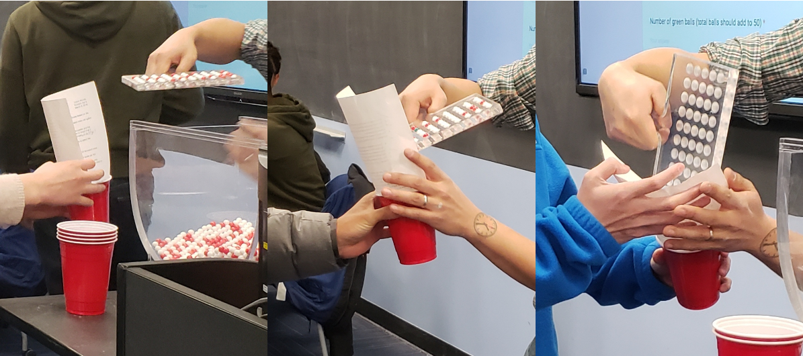
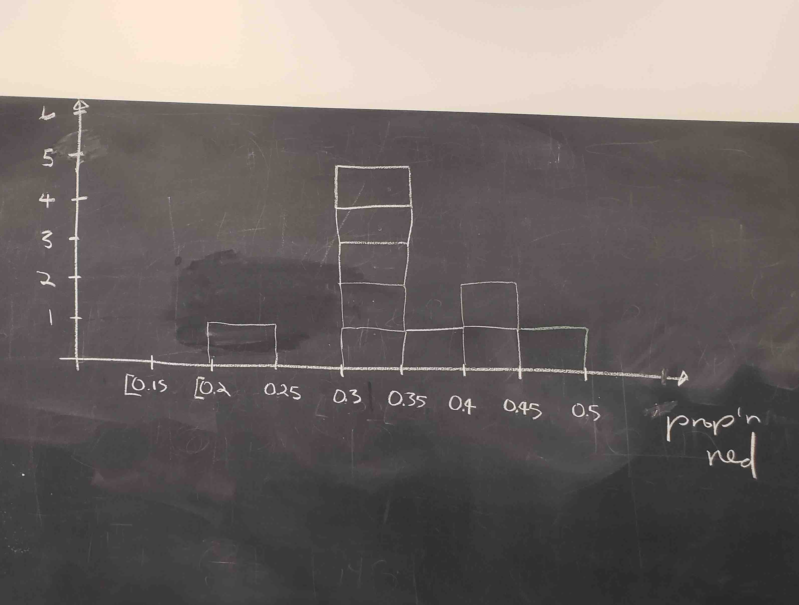
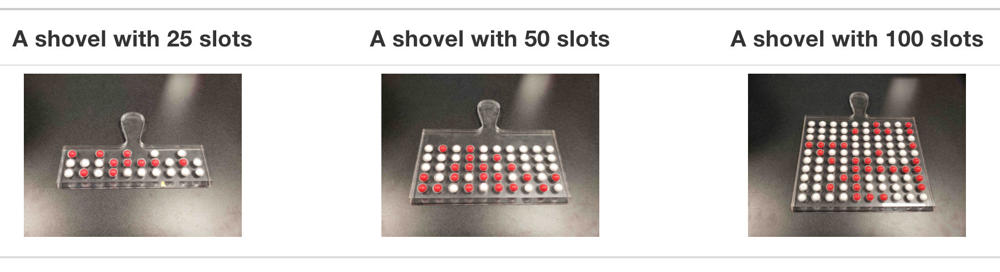

```{r setup, include=FALSE}
library(learnr)
library(tidyverse)
knitr::opts_chunk$set(echo = FALSE)
library(ggplot2)
library(moderndive)
library(shiny)
```

## Lernziele

Während wir bisher vor allem deskriptive Statistiken ausgewertet haben, also unsere Daten beschrieben haben, erkunden wir heute die Grundlagen der Inferenzstatistik. Dies ist ein Bereich der Statistik, der es uns ermöglicht, von einer Stichprobe auf die gesamte Population zu schließen. Wir konzentrieren uns also nun darauf zu verstehen, wie wir aus unseren Stichproben Schlussfolgerungen für die gesamte Population ziehen können.

Dabei werden viele neue Konzepte und Begriffe fallen. Einige davon sind:

<input type="checkbox" unchecked> Stichprobenvariation (*sampling variation*)</input>

<input type="checkbox" unchecked> Stichprobenkennwerteverteilung (*samling distribution*) </input>

<!-- <input type="checkbox" unchecked> zentraler Grenzwertsatz (*central limit theorem*)</input> -->

<!-- <input type="checkbox" unchecked> Punktschätzungen </input> -->

<!-- <input type="checkbox" unchecked> Intervallschätzungen </input> -->

<!-- <input type="checkbox" unchecked> $t$-Verteilung </input> -->

<!-- <input type="checkbox" unchecked> $t$-Test </input> -->

## Stichprobenkennwerteverteilung

Der fundamentale Baustein für das Verständnis von Inferenzstatistik ist zu verstehen, was eine \
**Stichproben---Kennwerte---Verteilung** ist.

Dazu gibt es ein tolles Buchkapitel im frei verfügbaren Online-Lehrbuch [*Modern Dive*](https://moderndive.com/7-sampling.html), was wir hier übernehmen [@ismay2022]. Der folgende Teil ist eine Übersetzung von Teilen des Kapitels 7, leicht adaptiert.

<hr>

In diesem Gefäß ist eine unbekannte Zahl roter und weißer gleichgroßer Kugeln. Es wurde gut durchmischt. Wir fragen uns jetzt: „Welcher Anteil der Kugeln ist rot?\"

{width=100%}
</br>

Eine Möglichkeit, den Anteil roter Kugeln zu bestimmen, wäre eine vollständige Zählung aller Kugeln. Dann könnte die Zahl der roten Kugeln durch die Gesamtanzahl geteilt werden. In der Schüssel sind aber mit Absicht so viele Kugeln, dass das ein langer und ermüdender Prozess wäre.

### Eine Stichprobe ziehen

Anstelle der vollständigen Zählung können wir eine Schaufel mit kugelförmigen Aussparungen verwenden, um 50 zufällige Bälle aus dem Gefäß zu ziehen.

{width=100%}

{width=100%}

17 Kugeln von 50 sind rot - damit beträgt der Anteil
$$\frac{17}{50}=0.34=34 \%$$

Wir können den Anteil der roten Bälle in dieser Schaufel als eine Schätzung für die gesamte Schüssel verwenden. Während es zwar nicht so exakt ist wie alle Kugeln aus der gesamten Schüssel zu zählen, hat unsere Schätzung von 34% sehr viel weniger Zeit und Energie gekostet.

Nun denn, lasst uns sagen, wir würden diesen Prozess jetzt noch einmal von vorne wiederholen. In anderen Worten, wir tun die 50 Kugeln zurück in die Schüssel und beginnen von vorn. Würden wir wieder genau 17 rote Kugeln ziehen? In anderen Worten, wäre unser Schätzer für den Anteil roter Kugeln im Gefäß wieder 34%? Vielleicht?

Was, wenn wir die diese Aktivität mehrmals wiederholen würden? Würden wir jedes Mal 17 rote Kugeln erhalten, aka einen Anteil von 34% für die gesamte Schüssel schätzen? Sicherlich nicht. Lasst uns diese Übung nun mehrmals wiederholen mit der Hilfe von 33 Gruppen von Freunden, um zu verstehen wie die Werte sich durch Wiederholung verändern. 

### 33 mal eine Stichprobe ziehen

Jede der 33 Gruppen wird das Folgende tun:

- die Schaufel nutzen, um 50 Kugeln zu ziehen
- Anzahl der roten Kugeln zählen und den Anteil ausrechnen
- Die Kugeln zurücklegen in die Schüssel.
- Den Inhalt etwas mischen, um nicht die Resultate der nächsten Gruppe zu beeinflussen. 

{width=100%}

Jede der 33 Gruppen trägt dann den von ihnen bestimmten Anteil roter Kugeln in ihrer Stichprobe in einem handgezeichneten Histogramm ein:

{width=100%}

{width=100%}

Schau dir das Histogramm mit den ersten 10 handgezeichneten Einträgen an:

- Am unteren Ende hat eine Gruppe in ihren 50 Kugeln einen Anteil zwischen 20-25% roten gefunden

- Am oberen Ende wurde in einer Stichprobe mit 50 Kugeln ein Anteil von 45-50% roten Kugeln gefunden.

- Allerdings war der am häufigsten auftretende Anteil zwischen 30-35%, ganz in der Mitte der Verteilung.

- Die Form der Verteilung kann man als grob "glockenförmig" beschreiben (mit etwas gutem Willen)

Lasst uns jetzt ebendieses Histogramm noch einmal in R herstellen mit den Daten-Visualisierungsskills die du im letzten Tutorial erlangt hast! Wir haben unsere 33 Gruppen im `tactile_prop_red`-Dataframe gespeichert, der im `moderndive`-Paket mitgeliefert wird. 

Führe den Codeblock aus, um dir die ersten 10 von 33 Zeilen anzeigen zu lassen:

```{r tibble, exercise = TRUE}
moderndive::tactile_prop_red
```

Das hier ist zu ist zu sehen: Für jede Gruppe haben wir die Namen der Studierenden, die Anzahl roter Kugeln, und den zugehörigen Anteil aus 50 Kugeln (`prop_red`). Außerdem haben wir die Variable `replicate`, welche die Zeilen nummeriert. Wir haben diesen Namen ausgesucht, weil jede Zeile als eine Instanz einer replizierten (wiederholten) Aktivität besteht. 

::: aufgabe
Lasst uns die Verteilung der 33 Proportionen roter Kugeln visualisieren mithilfe von `ggplot` und `geom_histogram` mit `binwidth = 0.05`!

Für deinen Komfort ist das Paket `ggplot2` bereits geladen in diesem Tutorial. 

:::

```{r hist, exercise=TRUE}
ggplot(moderndive::tactile_prop_red, aes(x = prop_red)) +
  labs(x = "Anteil roter Kugeln", title = "Verteilung von 33 Stichproben mit 50 Kugeln") +
```

```{r hist-solution}
ggplot(moderndive::tactile_prop_red, aes(x = prop_red)) +
  geom_histogram(binwidth = 0.05, boundary = 0.4, color = "white", fill = "darkred") +
  labs(x = "Anteil roter Kugeln", title = "Verteilung von 33 Stichproben mit 50 Kugeln")

```


### Was haben wir gerade gemacht?

Du hast gerade eine Stichproben-Kennwerte-Verteilung hergestellt!
Das ist nichts anderes als die **Verteilung** eines **Kennwerts** über viele **Stichproben** hinweg.

In diesem Fall ist der Kennwert der Anteil roter Kugeln. Für jede Zufalls-Stichprobe wurde dieser Kennwert berechnet. Im Histogramm wurde dann die Verteilung des Kennwerts visualisiert. Dort sehen wir, wie der Anteil roter Kugeln über verschiedene Stichproben hinweg schwankt. Diese Schwankung ist als **Stichprobenvariation** bekannt. 

Es mag simpel erscheinen, aber die Idee dass zufällig gezogene Stichproben einer zufälligen Schwankung unterliegen ist fundamental! Merken. 

Damit hast du die ersten zwei Schlüsselbegriffe gelernt!

1. **Stichprobenvariation** (*sampling variation*)
2. **Stichprobenkennwerteverteilung** (*sampling distribution*)

Im nächsten Abschnitt werden wir die soeben durchgeführte praktische Probenahme mit einem Computer simulieren! Dadurch können wir nicht nur das Stichprobenziehen viel öfter als 33 Mal wiederholen, sondern auch Schaufeln mit einer anderen Anzahl von Löchern als nur 50 verwenden.

```{r learning_check1}
quiz(
  caption = "Learning Check",
  
  learnr::question_text(
    text = "Warum war es wichtig, die Kugeln zu mischen, bevor die Stichprobe gezogen wurde?", 
    placeholder = "Musterlösung erscheint beim Einreichen der Antwort...",
    answer_fn(function(x) correct()),
    correct = "Damit sichergestellt war, dass die Stichprobe zufällig ist."
    ), 
  question_text(
    text = "Warum haben nicht alle 33 Gruppen die selbe Proportion an roten Kugeln gezogen?",
    placeholder = "Musterlösung erscheint beim Einreichen der Antwort...",
    answer_fn(function(x) correct()),
    correct = "Wegen Stichprobenvariation! Da die Stichproben zufällig sind, gibt es zufällige Abweichungen."
  )
)
```

## Virtuelles Stichprobenziehen

Im vorherigen Abschnitt haben wir taktile Stichprobenziehungen mit der Hand gemacht aus einer echten Schüssel mit richtigen Kugeln und realen Schaufen. Dadurch konnten wir ein solides Verständnis aufbauen von den Grundideen hinter dem Stichprobenziehen. In diesem Abschnitt werden wir das taktile Stichprobenziehen simulieren durch ein virtuelles Stichprobenziehen mit dem Computer. 

### einmalige Nutzung der Schaufel

Lasst uns damit beginnen, eine einzelne Stichprobe zu ziehen. Dafür brauchen wir zuerst ein virtuelles Analog zur Schüssel mit den Kugeln. Zu diesem Zweck haben wir den Dataframe `bowl` ins `moderndive`-Paket hinzugefügt. Eine Zeile in diesem Datensatz entspricht einer tatsächlichen Kugel in der Schüssel:

```{r bowl, exercise = TRUE}
library(moderndive)
bowl

```

`bowl` hat 2400 Zeilen, was heißt dass die Schüssel 2400 gleichgroße Bälle enthält. Die erste Variable `ball_ID` wird als „Identifikationsvariable“ verwendet, um die einzelnen Kugeln zu unterscheiden, auch wenn die Kugeln natürlich keine Nummern tragen. Die zweite Variable `color` zeigt ob eine bestimmte Kugel rot oder weiß ist. 

::: aufgabe
Überzeuge dich nochmal, dass es wirklich sehr viele Kugeln sind!
:::

```{r manyballs, exercise = TRUE}
print(bowl, n = 2000)
```

### virtuelle Schaufel

Jetzt brauchen wir noch ein virtuelles Analog zu unserer Schaufel, um virtuelle Stichproben von jeweils $n = 50$ Kugeln zu ziehen. Wir werden dafür die `rep_sample_n()`-Funktion benutzen aus dem `moderndive`-Paket. Diese Funktion erlaubt uns, `rep`eated `sample`s der Größe `n` zu nehmen. 

```{r virtualshovel, exercise = TRUE}
virtual_shovel <- bowl |>
  rep_sample_n(size = 50, reps = 1)
virtual_shovel
```

Was sehen wir?

Der Output `virtual_shovel` hat 50 Zeilen, für jede der gewünschten 50 Kugeln eine Zeile. 

Die `ball_ID`-Variable zeigt, welche der 2400 Kugeln gezogen wurden und die `color`-Variable verrät uns ihre Farbe.

Aber was sagt die `replicate`-Variable uns? In diesem Fall ist `replicate` = 1 für alle 50 Einträge. Das sagt uns, dass diese 50 Zeilen zur ersten Stichprobe gehören. Wir werden gleich sehen, was passiert wenn wir virtuell 33 Stichproben ziehen - dann nimmt `replicate` Werte zwischen 1 und 33 an. 

### Proportion berechnen

Unser Ziel ist nun mithilfe von `dplyr`-Verben wie `mutate()` und `summarize()` den Anteil roter Kugeln in der Stichprobe zu berechnen. 

Der erste Schritt ist, eine neue Variable erstellen, die anzeigt ob eine Kugel rot ist und dafür entweder `TRUE` oder `FALSE` enthält. Dafür nutzen wir den Vergleichsoperator `==`, welcher jedes Element der Spalte `color` abfragt, ob es dem Wert "red" entspricht, und für jedes Element (jede Kugel) `TRUE` oder `FALSE` ausgibt. Dieser neue logische Vektor wird in der Spalte `is_red` abgespeichert. 

```{r wrangle, exercise = TRUE, exercise.cap = "Neue Spalte erstellen", exercise.setup = "virtualshovel"}
virtual_shovel |> 
  mutate(is_red = (color == "red"))
```

Wir sehen, dass überall dort, wo `color == "red"`, der logische Wert `TRUE` zurückgegeben wurde, und überall wo das nicht gilt, `FALSE` steht. 

Im zweiten Schritt berechnen wir den Anteil roter Kugeln mit der `summarize()`-Funktion. Erinnere dich, dass `summarize()` einen Data Frame mit vielen Zeilen als Input nimmt und als Output einen Data Frame mit einer einzigen Zeile zurückgibt, die *summary statistics* wie `mean()` oder `median()` enthält. In diesem Fall nutzen wir die Summe `sum()`:

```{r sum, exercise = TRUE, exercise.cap = "Summarize", exercise.setup = "virtualshovel"}
virtual_shovel |>
  mutate(is_red = (color == "red")) |>
  summarize(num_red = sum(is_red))
```

Warum funktioniert das? Weil R `TRUE` wie die Zahl `1` behandelt und `FALSE` wie eine `0`. Also ist das Aufsummieren von `TRUE` und `FALSE` genau wie das Summieren von `1` und `0`. Letztendlich zählt diese Operation die Anzahl aller roten Kugeln. Die Zahl der roten Kugeln schwankt, wenn du den Code neu ausführst - Warum? Wegen Stichprobenvariation (*sampling variation*)!

Drittens und als letzten Punkt berechnen wir den Anteil roter Kugeln, in dem wir die Anzahl `num_red` durch die Stichprobengröße (in diesem Fall 50) dividieren.

```{r div, exercise = TRUE, exercise.cap = "Durch n dividieren", exercise.setup = "virtualshovel"}
virtual_shovel %>% 
  mutate(is_red = color == "red") %>% 
  summarize(num_red = sum(is_red)) %>% 
  mutate(prop_red = num_red / 50)
```

Die Proportion lässt sich auch als Prozentzahl interpretieren. Zum Beispiel könntest du bei 0.24 sagen, „24% der Kugeln waren rot“. 

Jetzt machen wir den Code noch etwas kompakter, indem wir den ersten `mutate()`- und den zweiten `summarize()`-Aufruf kombinieren:

```{r comb, exercise = TRUE, exercise.cap = "kompakter Code", exercise.setup = "virtualshovel"}
virtual_shovel %>% 
  summarize(num_red = sum(color == "red")) %>% 
  mutate(prop_red = num_red / 50)
```

Sehr gut!

Wenn wir die Stichprobenziehung nun öfter wiederholen, wird es wahrscheinlich zu Stichprobenvariation kommen, und es wird nicht immer der selbe Anteil roter Kugeln herauskommen.
Wiederholen wir die Stichprobenziehung nun 33 Mal, wie im letzten Kapitel, dieses Mal aber mit der virtuellen Schaufel!

### Nutze die virtuelle Schaufel 33 mal

Erinnere dich, dass im letzten Kapitel 33 Gruppen von Studierenden jeweils die Schaufel genutzt haben, um eine Stichprobe zu ziehen, was zu 33 Stichproben mit jeweils $n = 50$ Kugeln geführt hat. Dann haben wir daraus 33 Proportionen berechnet.

In anderen Worten, wir haben das Stichprobenziehen 33 mal repliziert (wiederholt).
Wir können das virtuell wiederholen, wieder mit der `rep_sample_n()`-Funktion. Dieses Mal fügen wir das Argument `reps = 33` hinzu, was R sagt, dass wir das Stichprobenziehen 33 mal wiederholen wollen. 

Die Ergebnisse speichern wir in einem Data Frame namens `virtual_samples`. Während wir im folgenden Output lediglich die ersten 10 Zeilen angezeigt bekommen, passiert das wirklich Wichtige erst in Zeile 51.

::: aufgabe
Nutze `print(n = ...)` um dir 60 Zeilen anzeigen zu lassen!
:::

```{r rep33, exercise = TRUE, exercise.cap = "33 Stichproben ziehen"}
virtual_samples <- bowl |>
  rep_sample_n(size = 50, reps = 33)
virtual_samples
```

```{r rep33-solution}
virtual_samples |> print(n = 60)

# oder ohne Pipe:
print(virtual_samples, n = 60)
```

Du siehst, dass die ersten 50 Zeilen der Spalte `replicate` den Wert 1 tragen, und die nächsten 50 Zeilen den Wert 2, und so weiter, bis zur 33. Das sagt uns dass die ersten 50 Zeilen zur ersten Stichprobe gehören, die nächsten 50 Zeilen zur zweiten, und so weiter. Da sich dieses Muster durchgängig wiederholt, hat `virtual_samples` $33 \cdot 50 = 1650$ Zeilen. 

#### Proportionen berechnen

Nun wollen wir den jeweiligen Anteil roter Kugeln in den 33 Stichproben herausfinden.
Wir werden die selben `dplyr`-Verben wie zuvor verwenden, aber dieses Mal noch mit `group_by()` nach der `replicate`-Variable gruppieren.

Erinnere dich daran, dass bei `group_by()` vor `summarize()` die *summary statistics* für jede Gruppe einzeln berechnet werden, unsere Ausgabe also 33 Zeilen haben wird.

```{r prop33, exercise = TRUE, exercise.cap = "33 Proportionen berechnen", exercise.setup = "rep33"}
virtual_prop_red <- virtual_samples |> 
  group_by(replicate) |>
  summarize(red = sum(color == "red")) |>
  mutate(prop_red = red / 50)
virtual_prop_red
```

Du siehst die ersten 10 Zeilen von 33, was völlig ausreichend ist um zu begreifen, dass wir nun den Anteil roter Kugeln für jede der 33 Stichproben errechnet haben.

Wie bei der realen Stichprobenziehung gibt es auch hier Stichprobenvariation zwischen den Anteilen roter Kugeln in den einzelnen Stichproben. 

#### Visualisierung

Nun wollen wir die Stichprobenkennwerteverteilung der 33 Stichproben visualisieren.
Beachte, dass wir die Argumente `binwidth = 0.05` und `boundary = 0.4` hinzugefügt haben. Erinnere dich daran, den `boundary = 0.4` zu setzen, um sicherzustellen, dass die Grenze einer Kategorie bei 0.4 liegt. Weil `binwidth = 0.05` ebenfalls festgelegt ist, wird das Kategorien mit Grenzen bei 0.30, 0.35, 0.40, 0.45 und so weiter erzeugen. 

```{r plot33, exercise = TRUE, exercise.cap = "Histogramm", exercise.setup = "prop33"}
ggplot(virtual_prop_red, aes(x = prop_red)) +
  geom_histogram(binwidth = 0.05, boundary = 0.4, color = "white") +
  labs(x = "Anteil roter Kugeln aus 50", 
       subtitle = "simulierte Stichprobenziehung (33 mal)", 
       title = "Verteilung der Anteile") 
```

Wir sehen, dass wir seltener Anteile unter 25% oder über 45% erhalten haben. Die am häufigsten auftretenden Anteile liegen zwischen 25% und 45%. Warum gibt es diese Unterschiede in den Anteilen? Wegen Stichprobenvariation.

Vergleichen wir das Histogramm aus der realen Stichprobenziehung mit dem aus der virtuellen:

```{r compare}
ggplot(moderndive::tactile_prop_red, aes(x = prop_red)) +
  geom_histogram(
    binwidth = 0.05, 
    boundary = 0.4, 
    color = "white", 
    fill = "darkred") +
  labs(x = "Anteil roter Kugeln", 
       subtitle = "reale Stichprobenziehung (33 mal)", 
       title = "Verteilung der Anteile")
```


Du siehst, dass beide Histogramme gewisse Ähnlichkeiten aufweisen, was das Zentrum und die Variation angeht, obwohl sie nicht identisch sind.
Auch das ist wieder einmal auf die Stichprobenvariation zurückzuführen. Und mit gutem Willen können wir sagen, dass beide Verteilungen eine gewisse Glockenform annehmen. 

```{r learningcheck2}
quiz(
  caption = "Learning Check",
  
  learnr::question_text(
    text = "Warum konnten wir den Effekt der Stichprobenvariation erst sehen, als wir mehrere (z.B. 33) Stichproben gezogen haben und nicht bei einer Stichprobe?", 
    placeholder = "Musterlösung erscheint beim Einreichen der Antwort...",
    answer_fn(function(x) correct()),
    correct = "Weil wir aus einer Stichprobe nur einen Anteil berechnen konnten, und den nicht vergleichen konnten mit einem anderen. Um eine Bandbreite von Anteilen zu erreichen, brauchten wir mehrere Stichproben."
    )
)
```

### Nutze die Schaufel 1000 mal

Jetzt wollen wir die Effekte von Stichprobenvariation nicht nur für 33 Stichproben untersuchen, sondern eher für größere Anzahlen, sagen wir mal 1000. Wir haben zwei Möglichkeiten an diesem Punkt: Wir könnten die Studierenden per Hand 1000 Stichproben mit je 50 Kugeln ziehen lassen und händisch die 1000 Proportionen ausrechnen lassen. Das wäre aber ein mühseliger und zeitaufwendiger Prozess. Genau darin sind Computer besonders exzellent: lange und monotone Aufgaben automatisch und schnell ausführen. An dieser Stelle werden wir also händisches Stichprobenziehen hintenanstellen und lieber eine Simulation verwenden. 

Wir werden noch einmal die `rep_sample_n()`-Funktion verwenden, wieder mit der Stichprobengröße bei `size = 50`, aber dieses Mal die Anzahl der Wiederholungen `reps = 1000` setzen. Auch hier schauen wir uns ein paar mehr Zeilen an mit `print(n = ...)`.

```{r reps1000, exercise = TRUE, exercise.cap = "1000 Stichproben ziehen"}
virtual_samples <- bowl |>
  rep_sample_n(size = 50, reps = 1000)
virtual_samples |> print(n = 300)
```

Beobachte, dass `virtual_samples` $1000 \cdot 50 = 50 000$ Zeilen hat.
Mit dem selben Data Wrangling wie zuvor berechnen wir jetzt für die 1000 Stichprobe jeweils den Anteil roter Kugeln.

```{r prop1000, exercise = TRUE, exercise.setup = "reps1000", exercise.cap = "1000 Anteile berechnen"}
virtual_prop_red <- virtual_samples |>
  group_by(replicate) |>
  summarize(red = sum(color == "red")) |> 
  mutate(prop_red = red / 50)
virtual_prop_red

```

Wir sehen, dass es nun 1000 Zeilen gibt mit je einer Proportion roter Kugeln für eine Stichprobe. 
Nun nutzen wir den selben Code wie zuvor, um die Verteilung der Proportionen als Histogramm zu visualisieren.

```{r plot1000, exercise = TRUE, exercise.cap = "Histogramm", exercise.setup = "prop1000"}
ggplot(virtual_prop_red, aes(x = prop_red)) +
  geom_histogram(binwidth = 0.05, boundary = 0.4, color = "white") +
  labs(x = "Anteil roter Kugeln aus 50", 
       subtitle = "simulierte Stichprobenziehung (1000 mal)", 
       title = "Verteilung der Anteile") 
```

Hier ist nun eindeutig die Kategorie 35% - 40% die am häufigsten auftretende Proportion roter Kugeln. 

Ganz selten finden wir nun auch Anteile unter 20% oder über 55%. Diese sind jedoch wirklich selten. Vor allem haben wir jetzt eine Verteilung, die auch ohne guten Willen "glockenförmig" genannt werden dürfte. Sie ist tatsächlich nah an einer *Normalverteilung* dran. 

```{r learningcheck3}
quiz(
  caption = "Learning Check",
  
  learnr::question_text(
    text = "Wenn du das Histogramm ansiehst, würden du sagen, es ist wahrscheinlich, eine einzelne Stichprobe mit 30% - 35% roten Kugeln zu ziehen?", 
    placeholder = "Musterlösung erscheint beim Einreichen der Antwort...",
    answer_fn(function(x) correct()),
    correct = "Das kommt relativ häufig vor, in ca. 180 von 1000 Fällen (die genaue Zahl kommt natürlich auf Ihre konkreten 1000 Stichproben an)."
    ),
  learnr::question_text(
    text = "Und was ist mit einer Stichprobe mit unter 10% roten Kugeln?", 
    placeholder = "Musterlösung erscheint beim Einreichen der Antwort...",
    answer_fn(function(x) correct()),
    correct = "Die Chance ist verschwindend gering, so dass es in den meisten Fällen bei 1000 Stichproben nicht einmal vorkommt."
    )
)
```

## verschieden große Schaufeln verwenden

Nehmen wir an, du hättst die Wahl zwischen drei verschiedenen Schaufeln, um Stichproben zu ziehen: Mit 25, 50 oder 100 Slots.

{width=100%}

<br>

Wenn dein Ziel immer noch ist, die Proportion der roten Kugeln in der gesamten Schüssel möglichst gut abzuschätzen, welche der Schaufeln würdest du verwenden?

Die meisten Menschen würden die Schaufel mit 100 Slots wählen, denn es würde den "besten" Schätzer für die wahre Proportion liefern. Aber wann ist ein Schätzer der "beste"? Das gehen wir in diesem Kapitel an.

Wir können unsere neu erlernten Werkzeuge für simulierte Stichprobenziehung nehmen, um den Effekt verschiedener Stichprobengrößen zu untersuchen! In anderen Worten, wir nutzen `rep_sample_n()` mit `size =` gesetzt auf `25`, `50` und `100`, während wir die Anzahl der Wiederholungen auf `reps = 1000` festhalten.

1. Schaufel nutzen
2. Proportionen berechnen
3. Histogramm erstellen.

Diese Schritte haben wir im Hintergrund automatisiert und ein Interface geschrieben, wo du die Inputs hineingeben und das Histogramm hinaus bekommst. 

::: aufgabe
Experimentiere mit der Stichprobengröße, während die Zahl von Stichprobenziehungen konstant bei 1000 bleibt.

Welches Muster erkennen du?
:::

<br>

```{r ui, echo = FALSE}
fluidPage(
    sidebarLayout(
        sidebarPanel(
            sliderInput("reps",
                        "Stichprobenziehungen",
                        min = 1,
                        max = 2000,
                        value = 1000),
            sliderInput("size",
                        "Stichprobengröße",
                        min = 0,
                        max = 200,
                        value = 50,
                        step = 5),
            sliderInput("bins",
                        "binwidth",
                        min = 0.01, 
                        max = 0.05, 
                        value = 0.02,
                        step = 0.01),
            actionButton("reload", "Neu generieren")
        ),
        mainPanel(
           plotOutput("distPlot"),
           textOutput("sd")
        )
    )
)

```

```{r server, context = "server"}

  rv <- reactiveValues()
  
  observeEvent(c(input$reload, input$size, input$reps), {
      rv$samples <- rep_sample_n(bowl, 
                                 size = input$size, 
                                 reps = input$reps)
      rv$props <- rv$samples |> group_by(replicate) %>% 
        summarize(red = sum(color == "red")) %>% 
        mutate(prop_red = red / input$size)
      
      rv$sd <- rv$props |> summarize(sd = sd(prop_red)) |> pull(sd)
      })
  
    output$distPlot <- renderPlot({
      
      ggplot(rv$props, aes(x = prop_red)) +
        geom_histogram(binwidth = input$bins, boundary = 0.4, color = "white") +
        coord_cartesian(xlim = c(0.05, 0.65)) +
        labs(x = paste0("Anteil von roten Kugeln aus ", as.character(input$size)),
             title = "Verteilung der Anteile",
             subtitle = paste0(input$reps, " Stichproben")) 
    })
    
    output$sd <- renderText({
      paste0("Stichprobenvariation (Standardabweichung der Verteilung): ", round(rv$sd[1], digits = 2))
      })

```

```{r learningcheck4}
quiz(
  caption = "Learning Check",
  learnr::question_text(
    text = "Welches Muster habst du beim Verändern der Stichprobengröße bemerkt?", 
    placeholder = "Musterlösung erscheint beim Einreichen der Antwort...",
    answer_fn(function(x) correct()),
    correct = "Die Standardabweichung der Stichprobenkennwerteverteilung nimmt ab, wenn die Stichprobengröße steigt. Zunächst nimmt die Verteilung einen breiten Wertebereich ein bei geringer Stichprobengröße, bis sie schließlich relativ schmal wird. In anderen Worten, es gibt weniger Einfluss der Stichprobenvariation und die Verteilung zentriert sich enger um einen bestimmten Wert. "
    )
)
```

Wir können also feststellen: Wenn die Stichprobengröße steigt, werden unsere Schätzer der wahren Proportion immer akkurater. 

Theoretisch bis zu dem Punkt, wo die Stichprobe so groß ist, dass sie alle 2400 Kugeln auf einmal zieht und damit den wahren Anteil roter Kugeln automatisch immer richtig bestimmt. 

```{r learningcheck5}
quiz(caption = "Learning Check",
     question_radio("Wenn wir die Stichprobengröße erhöht haben, wie hat sich die Varianz der Proportionen roter Kugeln verändert?",
     answer("Die Proportionen variierten weniger", correct = TRUE),
     answer("Die Proportionen variierten mehr"),
     answer("Die Varianz der Proportionen blieb unverändert"),
     allow_retry = TRUE
     ),
     question_radio("Welches Maß haben wir verwendet, um zu quantifizieren wie sehr die 1000 Proportionen variierten?",
                    answer("Die Varianz"),
                    answer("Die Standardabweichung", correct = TRUE),
                    answer("Den Mittelwert"),
                    answer("Die Summe"),
                    answer("Den Interquartilsabstand"),
                    allow_retry = TRUE)
)
```

## Terminologie

Jetzt, wo du ein intuitives Verständnis von der Stichprobenziehung bekommen hast, können wir den Konzepten, die du eben gesehen habst, Fachbegriffe zuordnen.

Die ersten Begriffe haben mit **Populationen** zu tun.

### Populationen

1. Eine **Population** ist eine Sammlung von Individuen oder Beobachtungen, an denen wir Interesse haben. Mathematisch kann die Größe der Population mit einem großen $N$ notiert werden.

2. Ein **Populations-Parameter** ist eine numerische Zusammenfassung über die Population, die wir nicht kennen, aber gerne kennen würden. Beispielsweise könnte der Parameter ein Mittelwert sein wie die mittlere Größe aller Kanadier. Oft wird der Parameter auch als der unbekannte "wahre Wert" bezeichnet und trägt allgemein den griechischen Buchstaben $\theta$ (Theta).

3. Ein **Zensus** ist eine erschöpfende Aufzählung aller $N$ Individuen in der Population. Nur damit kann der Populations-Paramater *exakt* bestimmt werden. Natürlich wird das immer zeit-, energie- und geld-intensiver je größer $N$. 

Die **Population** in unserer Stichprobenziehungs-Aktion wird durch die $N = 2400$ Kugeln in der Schale dargestellt. 

Der **Populations-Parameter** ist uns noch unbekannt, aber wir können den wahren Anteil roter Kugeln in der Population berechnen, da wir in `bowl` eine erschöpfende Liste aller Kugeln haben! (**Zensus**)

::: aufgabe
Berechne die wahre Proportion roter Kugeln in der Population! 

(Das ist normalerweise nicht möglich, da normalerweise keine Liste vorliegt mit den Werten aller Individuen der Population, aber in diesem Lehrbeispiel geht das)
:::

<br>

```{r theta, exercise = TRUE, exercise.cap = "wahre Proportion roter Kugeln"}
bowl
```

```{r theta-solution}
bowl |>
  summarize(red = sum(color == "red")) |>
  mutate(prop_red = red / 2400)
```

```{r truepercent}
question_numeric("Wie viel Prozent der Population sind rote Kugeln? (Zahl von 0 - 100)",
                 answer(37.5, correct = TRUE))
```

An diesem Punkt könntest du dich fragen, wenn wir den wahren Populations-Parameter so einfach bestimmen konnten, warum haben wir dann überhaupt Stichproben gezogen?
Gute Frage! Normalerweise würde man in einer solchen Situation, wo ein **Zensus** der Population möglich ist, auch nicht anfangen Stichproben zu ziehen. Die simulierte Stichprobenziehung in diesem Tutorial soll einfach ein Beispiel dafür sein, wie es im echten Leben abläuft. Wir haben die Simulationen durchgeführt, um folgende Konzepte zu studieren:

- den Effekt von *Stichprobenvariation* auf unsere Schätzer
- den Effekt von *Stichprobengröße* auf *Stichprobenvariation*!

Wie wir im Kapitel über Umfragen lernen werden, wird manchmal nicht nur die Populationsgröße $N$ zu groß sein, um einen **Zensus** durchzuführen, manchmal wissen wir nicht einmal, wie groß sie ist. 

Gehen wir zum nächsten Oberbegriff: **Stichprobenziehung** (*Sampling*)

### Stichprobenziehung

- *Sampling* ist der Akt des Ziehens einer Stichprobe aus der Population, was wir normalerweise nur tun, wenn es nicht möglich ist, einen Zensus durchzuführen. Mathematisch notiert wird die Stichprobengröße mit einem kleinen $n$, im Gegensatz zu einem großen $N$ für die Populationsgröße.
Normalerweise ist $n$ sehr viel kleiner als $N$, weshalb *Sampling* eine viel günstigere Alternative ist als einen Zensus durchzuführen.

- Eine **Punktschätzung**, auch bekannt als Stichprobenkennwert, ist eine *summary statistic* aus einer gezogenen Stichprobe, die als Schätzer für den unbekannten Populationsparameter verwendet wird. Mit *summary statistic* sind Maße wie Mittelwert, Proportion oder Standardabweichung gemeint.

Zuvor haben wir also *Sampling* durchgeführt mit $n = 50$ und als wir die Proportion in der Stichprobe errechnet haben, haben wir einen **Punktschätzer** für die wahre Populations-Proportion generiert. 

In der Statistik ist es eine Konvention, Schätzungen mit einem Dach zu versehen. Wenn die Populations-Proportion $p$ heißt, ist die Stichproben-Proportion $\hat p$.


## Learnings

So hast du heute abgeschnitten:

```{r context="server"}
# Shiny App um die Anzahl richtig beantworteter Fragen anzuzeigen. 
# Funktioniert in jedem Tutorial

shiny::observeEvent(
  input$get_score, 
  {
    objs2 = learnr:::get_tutorial_state()
    
    # Number of correct questions
    
    n_correct <- 
      # Access the $correct sublist item in each list item
        lapply(objs2, purrr::pluck, "correct") |>
           # make it a vector containing: TRUE and FALSE and NAs
           # NA is appearing for list items which don't have
           # a $correct subitem
                unlist() |> 
           # Taking the sum of a logical Vector returns the number of TRUEs
                sum(na.rm=TRUE)
    
    # Number of total questions
    
    total_questions <- 
      # 1. Access $type in each list item and make it a vector of types
      lapply(objs2, purrr::pluck, "type") |> unlist()
    
    # 2. Count the number of "question" in that vector
    total_questions <- total_questions[total_questions == "question"] |> 
      length()
      
      
    output$score = shiny::renderText(
      paste0(n_correct, " von ", total_questions,
        " im gesamten Tutorial beantworteten Fragen waren richtig.")
)
    invisible()
  }
)
```

```{r score, echo=FALSE}
shiny::br()
shiny::actionButton("get_score", "Auswertung!")
shiny::br()
shiny::br()
shiny::textOutput("score")
shiny::br()
```


### Zusammenfassung

Heute hast du gelernt, wie der wahre Wert, die Stichprobengröße und die Stichprobenkennwertverteilung in Zusammenhang stehen. Mit diesem Grundlagenwissen wird es dir leichter fallen die inferenzstatistischen Tests, wie den *t-Test*, den *Chi-Test* und auch *Regressionen*, zu verstehen. 

## Credit

Dieses Tutorial wurde von Lukas Bruelheide geschrieben. 

### Literatur
