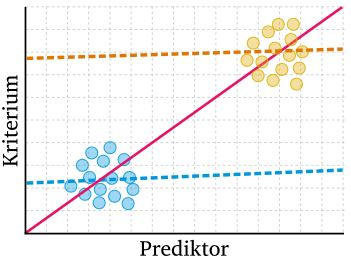

```{r setup, include=FALSE}
library(learnr)
library(ggplot2)
library(tidyverse)
library(rtutorials)
knitr::opts_chunk$set(echo = FALSE)
```

## Inhalt

Heute wirst du verschiedene Zusammenhänge mittels Korrelation erforschen und verstehen was der Ausspruch *"Korrelation ist nicht Kausalität"* bedeutet.

In unserem wissenschaftlichen Prozess sind wir nun schon bei der Auswertung und dem Berichten unserer Ergebnisse angelangt: {width="90%"}

## Lernziele

In diesem Tutorial lernst du:

-   <input type="checkbox" unchecked> Was eine Korrelation ist</input>
-   <input type="checkbox" unchecked> Welche Arten von es Korrelation gibt</input>
-   <input type="checkbox" unchecked> Was du bei Korrelationen beachten solltest</input>
-   <input type="checkbox" unchecked> Wie du eine Korrelation berechnest</input>
-   <input type="checkbox" unchecked> Das Berichten der Ergebnisse nach APA-Richtlinien </input>

## Grundlagen

Korrelationen sind eine Möglichkeit, den statistischen **Zusammenhang zwischen zwei Variablen** zu messen. Sie geben an, wie sich Veränderungen in einer Variable auf Veränderungen in einer anderen Variable auswirken (meist in einer *"je mehr/weniger XX, desto mehr weniger YY"* - Beziehung). Es ist wichtig zu beachten, dass Korrelationen nur auf rechnerische Abhängigkeiten hinweisen, ohne einen kausalen Zusammenhang zwischen den Variablen herzustellen.

Ein einfaches Beispiel für eine **positive Korrelation** wäre die Beziehung zwischen der Anzahl der Stunden, die jemand pro Woche studiert, und den Punkten in der Abschlussprüfung. Wenn jemand **mehr Zeit** mit dem Studieren verbringt, **steigen** normalerweise auch **die Punkte in der Abschlussprüfung**.

```{r positive_korrelation}
set.seed(341)
noten <- runif(50, min=0, max=100)
studienzeit <- noten * 0.2 + rnorm(50, mean =26, sd=1)

plot(studienzeit, noten, 
     main="Positive Korrelation: Studienzeit und Punkte in der Prüfung", 
     xlab="Studienzeit (Stunden/Woche)", 
     ylab="Punkte", 
     col="blue")
```

Eine **negative Korrelation** könnte zwischen der Anzahl der gerauchten Zigaretten pro Tag und der Lungenkapazität bestehen. Je **mehr geraucht** wird, desto **stärker nimmt** tendenziell die **Lungenkapazität ab**.

```{r negative_korrelation}
set.seed(371)
zigaretten <- runif(50, min=0, max=30)
lungenkapazitaet <- 100 - zigaretten * 1.5 + rnorm(50, mean=0, sd=5)
plot(zigaretten, lungenkapazitaet, 
     main="Negative Korrelation: Rauchen und Lungenkapazität", 
     xlab="Zigaretten (Stück/Tag)", 
     ylab="Lungenkapazität", 
     col="blue")
```

::: gelb
Es ist jedoch wichtig zu beachten, dass **Korrelationen nicht immer auf eine tatsächliche Beziehung hinweisen**. Zum Beispiel könnte es eine Korrelation zwischen der Anzahl der Eiscremebecher, die im Sommer verkauft werden, und der Anzahl der Badeunfälle geben, aber das bedeutet nicht, dass das Essen von Eiscreme zu Badeunfällen führt. Es könnte eine gemeinsame Ursache geben, wie warmes Wetter, das sowohl den Verkauf von Eiscreme als auch Badeunfälle beeinflusst.
:::

```{r mediierte_korrelation}
set.seed(371)
eiscremebecher <- runif(50, min=0, max=5000)
badeunfaelle <- eiscremebecher * 0.6 + rnorm(50, mean=50, sd=500)

plot(eiscremebecher, badeunfaelle, 
     main=" Korrelation: Eiscreme und Badeunfälle", 
     xlab="Eiscremebecher (Anzahl)", 
     ylab="Badeunfälle", 
     col="red")
```

</br>

Für diesen Sachverhalt hat sich das Mantra: **"Korrelation ist nicht Kausalität"** unter der Gruppe an Statstikgelehrten verbreitet. Es ist quasi das Codewort für den Club der Statistik, mit dem sich die Mitglieder auch gleichzeitig in der Öffentlichkeit wiedererkennen können.

Korrelation ist also totale Gleichberechtigung zwischen den beiden Variablen. Es wird keine Annahme gemacht, ob und in welcher Weise eine der beiden Variablen die andere Beeinflusst. Wollen wir das herausfinden, müssen wir zu komplexeren Methoden wie der Regression greifen und unser Versuchsdesign entsprechend geschickt entwerfen.

Aber zurück zur Korrelation: Es gibt in der Statistik **vielreiche Arten eine Korrelation** zu berechnen. Wir wollen uns heute auf die zwei populärsten Arten Beschränken:

-   Pearson-Produkt-Moment-Korrelation (für zwei intervallskalierte Variablen)
-   Spearman´s Rho (für eine intervall- und eine ordnialskalierte Variable)

## Pearson Korrelation

::: gelb
Die Pearson-Korrelation misst die Stärke und Richtung des **linearen** Zusammenhangs zwischen zwei **metrisch** skalierten Variablen.
:::

Die Pearson-Produkt-Moment Korrelation (kurz: Pearson-Korrelation), ist ein Maß für den linearen Zusammenhang zwischen zwei Variablen. Sie variiert zwischen -1 und +1, wobei +1 eine perfekte positive Korrelation, -1 eine perfekte negative Korrelation und 0 keine Korrelation bedeutet. Dazu lassen sich diese Korrelationen auch nach ihrer Stärke einordnen:

-   \|*r*\| = .10 **geringe / schwache Korrelation**
-   \|*r*\| = .30 **mittlere / moderate Korrelation**
-   \|*r*\| = .50 **große / starke Korrelation**

Diese Interpretation wurde, wie auch die Effektstärke, von @cohen1988 hergeleitet.

### Hypothesen aufstellen

Für unsere Korrelationsanalyse stellen wir wie immer zwei Hypothesen auf:

-   H0 (Nullhypothese): Es besteht keine Korrelation zwischen den Variablen.
-   H1 (Alternativhypothese): Es besteht eine Korrelation zwischen den Variablen.

Nehmen wir an, wir untersuchen den Datensatz `economics` aus dem `ggplot2`-Paket in *R*, der Zeitreihendaten zur US-Wirtschaft enthält. Der `economics` Datensatz enthält unter anderem Daten zur Arbeitslosenquote (`unemploy`) und zur medianen Dauer der Arbeitslosigkeit (`uempmed`). Wir untersuchen, ob ein Zusammenhang zwischen diesen beiden Variablen besteht.

Hypothesen:

-   H0 (Nullhypothese): Es besteht keine Korrelation zwischen der medianen Dauer der Arbeitslosigkeit und der Arbeitslosenquote.
-   H1 (Alternativhypothese): Es besteht eine Korrelation zwischen der medianen Dauer der Arbeitslosigkeit und der Arbeitslosenquote.

```{r economics, exercise = TRUE, exercise.cap = "Beispieldaten" }
# Laden des economics Datensatzes
# library(ggplot2)
# library(tidyverse)

head(economics) |> 
  select(uempmed, unemploy)

```

Bevor wir die Korrelation berechnen, müssen wir sicherstellen, dass unsere Daten die notwendigen Voraussetzungen erfüllen.

### Voraussetzungen prüfen

Damit wir Aussagen von unserer Stichprobe auf die Grundgesamtheit übertragen (Inferenzstatistik) können, müssen wir zuvor unsere Daten etwas genauer inspizieren.

Voraussetzungen für Korrelationen:

- keine Ausreißer
- keine Kluster
- Normalverteilung
- Endliche Varianz
- Linearität
- Homoskedastizität

Wir gehen diese eins nach dem anderen durch:

#### keine Ausreißer

Korrelationen sind sehr empfindlich gegenüber Ausreißern. Daher sollten wir unsere Daten im Vorhinein entsprechend mittels Visualisierungen überprüfen und ggf. aufbereiten.

Am leichtesten lassen sich Ausreißer im Boxplot erkennen:

```{r boxplot, exercise = TRUE, exercise.cap = "Ausreißer"}
boxplot(economics$uempmed, main="uempmed: durchschnittliche Dauer der Arbeitslosigkeit,")
boxplot(economics$unemploy, main="unemploy: Arbeitslosenquote")
```

```{r ausreisserquiz}
  question_radio("Denkst du wir haben Ausreißer in den Daten?",
    answer("Es gibt eine Menge an Ausreißern in beiden Variablen.", 
           correct = TRUE),
    answer("In der Variable `uempmed` gibt es 1 Ausreißer.", 
           message = "Es gibt einen Ausreißer der heraussticht, aber auch alle anderen Punkte bis zum Wisker, können als Ausreißer interpretiert werden."),
    answer("Es gibt keine Ausreißer in den Daten.",
           message = "alle Punkte, die nach dem Wisker eingezeichnet sind, können als Ausreißer interpretiert werden."),
    correct  = "In dem Fall des Boxplots sind Daten die Auserhalb der 1.5xIQR liegen als Ausreißer markiert. Das sind hier alle Punkte die auserhalb des Wiskers liegen.",
    incorrect = random_encouragement("de"),
    allow_retry = TRUE,
    random_answer_order = TRUE
  )
```


#### keine Kluster

Kluster führen zu falschen Annahmen über unsere Daten. Das lässt sich am besten grafisch zeigen:



Source: @gruber2019, [online](https://wgruber.github.io/Modellbildung2/)

Ohne die Kluster zu beachten, würden wir hier von einem starken positiven Zusammenhang ausgehen (pinke Linie). Berechnen wir pro Kluster den Zusammenhang (gelbe und blaue Linie) sieht der Zusammenhang schon wesentlich schwächer aus.

Schauen wir uns den Economics Datensatz im Hinblick auf mögliche Kluster an:

```{r kluster, exercise = TRUE, exercise.cap = "Kluster identifizieren"}
plot(economics$uempmed, economics$unemploy, main="Scatterplot: durchschnittliche Dauer der Arbeitslosigkeit vs. Quote")
```

```{r klusterquiz}
  question_radio("Denkst du wir haben Kluster in den Daten?",
    answer("Es gibt keine erkennbaren Kluster in den Daten.", 
           correct = TRUE),
    answer("Die Daten lassen sich deutlich in 2 Kategorien unterscheiden.", 
           message = "Ich weiß was du meinst, die Daten werden immer weniger je weiter sie auf der x-Achse gezeichnet werden, aber das hat eher mit unseren Ausreißern als mit Klustern zu tun. Wir können keine klaren Gruppen trennen."),
    correct  = "Die Daten werden immer weniger je weiter sie auf der x-Achse gezeichnet werden, aber das hat eher mit unseren Ausreißern als mit Klustern zu tun. Wir können daher keine klaren Gruppen erkennen.",
    incorrect = random_encouragement("de"),
    allow_retry = TRUE,
    random_answer_order = TRUE
  )
```

#### Normalverteilung

Wie du auf eine Normalverteilung untersuchst, hast du im letzten Tutorial bereits gelernt, aber übung macht den Meister:

Schau dir die **Q-Q-Plots** für unsere Beispieldaten an:

durchschnittliche Dauer der Arbeitslosigkeit

```{r normal_da, exercise = TRUE, exercise.cap = "Normalverteilung identifizieren"}
qqnorm(economics$uempmed) 
qqline(economics$uempmed, col= "red")
```

Arbeitslosenzahlen:

```{r normal_az, exercise = TRUE, exercise.cap = "Normalverteilung identifizieren"}
qqnorm(economics$unemploy) 
qqline(economics$unemploy, col= "red")
```

```{r normquiz}
quiz(
  question_radio("Denkst du wir haben eine Normalverteilung für unsere Daten?",
    answer("Die Daten weichen insbesondere an den Enden sehr stark von der Diagonalen ab, daher sind die Daten *nicht* normalverteilt.",
           correct = TRUE),
    answer("Die Daten weichen nur marignal von der Diagonalen ab, daher sind die Daten normalverteilt.", 
           message = "Obwohl es nur an den Rändern abweicht, ist das Maß der Abweichung doch so stark, dass diese Daten nicht mehr als normalverteilt bezeichnert werden sollten"),
    correct  = "Falls es Kluster gibt, so lassen diese sich auf dem ersten Blick nicht deutlich erkennen.",
    incorrect = random_encouragement("de"),
    allow_retry = TRUE,
    random_answer_order = TRUE
  ))
```

#### Endliche Varianz

In der Statistik bezieht sich der Begriff "endliche Varianz" darauf, dass die Varianz einer Variablen einen spezifischen, begrenzten Wert hat. Varianz ist ein Maß dafür, wie weit die Werte einer Variablen um ihren Mittelwert streuen. Wenn eine Variable eine "endliche Varianz" hat, bedeutet dies, dass ihre Streuung messbar und nicht unendlich ist.

Du kannst die Varianz einer Variablen mit der Funktion `var(x)` ausgeben lassen:

```{r varianz, exercise = TRUE, exercise.cap = "endliche Varianz"}
var(economics$uempmed)
var(economics$unemploy)
```

Wenn die Varianz einen endlichen Wert zurückgibt, der nicht extrem hoch ist, kannst du davon ausgehen, dass ihre Variable eine endliche Varianz hat. Dies ist ein gutes Zeichen dafür, dass die Variable für statistische Analysen wie Korrelationsberechnungen geeignet ist.

In unserem Beispiel ist die Varianz zwar nicht unendlich, aber sie ist für die Arbeitslosenzahlen doch schon sehr hoch (6979948).

#### Linearität

Da wir den linearen Zusammenhang testen, sollten wir auch davon ausgehen, dass unsere Daten einen linearen Zusammenhang darstellen.

```{r}
set.seed(123)

# Definieren der Anzahl der Datenpunkte
n <- 20

# Erzeugen von Daten für vier verschiedene Szenarien
x <- 1:n
y_linear <- 1.5 * x + rnorm(n, mean=0, sd=1)  # Linearer Zusammenhang
y_exponential <- 0.8 * exp(x/2) + rnorm(n, mean=0, sd=1)  # Exponentieller Zusammenhang
y_cluster <- c(rep(5, 10), rep(20, 10)) + rnorm(n, mean=0, sd=0.5)  # Kluster-Effekt
y_outlier <- c(rep(5, n-1), 50) + rnorm(n, mean=0, sd=0.5)  # Extrem hoher Ausreißer

# Berechnung des Korrelationskoeffizienten für linearen Zusammenhang
cor_linear <- cor(x, y_linear)

# Erstellen der Plots
par(mfrow=c(2,2))

plot(x, y_linear, main=paste("Linearer Zusammenhang\nKorrelation:", round(cor_linear, 2)), ylim=c(0, 55), pch=19)
abline(a=0, b=1.5, col="red")

plot(x, y_exponential, main="Exponentieller Zusammenhang", ylim=c(0, 55), pch=19)
abline(a=0, b=1.5, col="red")

plot(x, y_cluster, main="Kluster-Effekt", ylim=c(0, 55), pch=19)
abline(a=0, b=1.5, col="red")

plot(x, y_outlier, main="Effekt durch hohen Ausreißer", ylim=c(0, 55), pch=19)
abline(a=0, b=1.5, col="red")

```

#### Homoskedastitzität: gleichmäßige Streeung der Daten

Wieder mal ein langes und kompliziertes Wort, das dir da begegnet. Aber nicht verzagen, es meint lediglich: sind die Varianzen der Daten gleich verteilt.


```
var(economics$uempmed) var(economics$unemploy)

plot(economics$uempmed, economics$unemploy, main="Homoskedastizität & Linearität") abline(lm(economics$unemploy ~ economics$uempmed), col="red")
```
## Abschlussquiz

```{r Abschlussquiz}
quiz(caption = "Teste dein Wissen!",

  learnr::question_checkbox("Was ist der Unterschied zwischen gerichteten und ungerichteten Hypothesen?",
         answer("Ungerichtete Hypothesen spezifizieren keine Richtung des Unterschieds.", 
                 correct = TRUE,
                 message = "Richtig! Ungerichtete Hypothesen behaupten nur, dass ein Unterschied existiert."),
         answer("Gerichtete Hypothesen werden nur in experimentellen Designs verwendet.",
                 message = "Nicht ganz. Gerichtete Hypothesen können in verschiedenen Studientypen verwendet werden und spezifizieren die erwartete Richtung des Unterschieds."),
         answer("Gerichtete Hypothesen testen Unterschiede in mehr als zwei Gruppen.",
                 message = "Das ist nicht korrekt. Die Anzahl der Gruppen beeinflusst nicht, ob eine Hypothese gerichtet ist oder nicht."),
         allow_retry = TRUE,
         random_answer_order = TRUE
         ),

  learnr::question_radio("Welche Aussage trifft auf den abhängigen *t*-Test zu?",
         answer("Er wird verwendet, um zwei unabhängige Stichproben zu vergleichen.",
              message = "Das ist nicht ganz richtig. Der abhängige *t*-Test vergleicht zwei verbundene oder gepaarte Stichproben."),
         answer("Er vergleicht die Mittelwerte derselben Gruppe zu zwei verschiedenen Zeitpunkten.",
              correct = TRUE,
              message = "Genau! Der abhängige *t*-Test wird für gepaarte Stichproben verwendet, wie z.B. Messungen an derselben Gruppe zu zwei verschiedenen Zeitpunkten."),
         answer("Er kann ohne Prüfung auf Normalverteilung der Differenzen angewendet werden.",
              message = "Das ist nicht korrekt. Es ist wichtig, die Normalverteilung der Differenzen in den gepaarten Daten zu überprüfen."),
         allow_retry = TRUE,
         random_answer_order = TRUE
         ),

  learnr::question_radio("Wofür wird die Effektstärke in einer statistischen Analyse verwendet?",
         answer("Um die Wahrscheinlichkeit eines Typ-1-Fehlers zu bestimmen.",
              message = "Das ist nicht korrekt. Die Effektstärke misst die Größe eines Effekts, nicht die Wahrscheinlichkeit eines Fehlers."),
         answer("Um die Größe eines beobachteten Effekts zu quantifizieren.",
              correct = TRUE,
              message = "Richtig! Die Effektstärke gibt Aufschluss über die praktische Bedeutung eines statistischen Ergebnisses."),
         answer("Um zu entscheiden, welche statistische Testmethode verwendet werden soll.",
              message = "Das ist nicht ganz richtig. Die Entscheidung für eine Testmethode basiert auf anderen Kriterien, wie dem Studiendesign und den Verteilungsannahmen."),
         allow_retry = TRUE,
         random_answer_order = TRUE
         ),

  learnr::question_radio("Wie berichtet man die Ergebnisse eines *t*-Tests nach APA-Richtlinien?",
         answer("Indem man nur den *p*-Wert angibt.",
              message = "Das ist nicht ausreichend. Nach APA-Richtlinien sollten auch der *t*-Wert, die Freiheitsgrade und die Mittelwerte mit Standardabweichungen berichtet werden."),
         answer("Indem man den *t*-Wert, die Freiheitsgrade, den *p*-Wert sowie Mittelwerte und Standardabweichungen angibt.",
              correct = TRUE,
              message = "Genau! Ein vollständiger Bericht nach APA-Richtlinien umfasst all diese statistischen Informationen."),
         answer("Indem man eine ausführliche Beschreibung der deskriptiven Analyse gibt.",
              message = "Während die Beschreibung der deskriptiven Analyse wichtig ist, erfordern APA-Richtlinien spezifische statistische Informationen wie *t*-Wert, Freiheitsgrade und *p*-Wert."),
         allow_retry = TRUE,
         random_answer_order = TRUE
         ))

```

## Learnings

So hast du heute abgeschnitten:

```{r context="server"}
# Shiny App um die Anzahl richtig beantworteter Fragen anzuzeigen. 
# Funktioniert in jedem Tutorial

shiny::observeEvent(
  input$get_score, 
  {
    objs2 = learnr:::get_tutorial_state()
    
    # Number of correct questions
    
    n_correct <- 
      # Access the $correct sublist item in each list item
        lapply(objs2, purrr::pluck, "correct") |>
           # make it a vector containing: TRUE and FALSE and NAs
           # NA is appearing for list items which don't have
           # a $correct subitem
                unlist() |> 
           # Taking the sum of a logical Vector returns the number of TRUEs
                sum(na.rm=TRUE)
    
    # Number of total questions
    
    total_questions <- 
      # 1. Access $type in each list item and make it a vector of types
      lapply(objs2, purrr::pluck, "type") |> unlist()
    
    # 2. Count the number of "question" in that vector
    total_questions <- total_questions[total_questions == "question"] |> 
      length()
      
      
    output$score = shiny::renderText(
      paste0(n_correct, " von ", total_questions,
        " im gesamten Tutorial beantworteten Fragen waren richtig.")
)
    invisible()
  }
)
```

```{r score, echo=FALSE}
shiny::br()
shiny::actionButton("get_score", "Auswertung!")
shiny::br()
shiny::br()
shiny::textOutput("score")
shiny::br()
```

### Zusammenfassung

-   Was der *t*-Tests ist und wann er angewendet wird: Der *t*-Tests ist ein statistisches Verfahren, das verwendet wird, um zu testen, ob sich die Mittelwerte zweier Stichproben signifikant voneinander unterscheiden. Es gibt verschiedene Arten von *t*-Tests, einschließlich des Einstichproben-, des unabhängigen und des abhängigen T-Tests.

-   Wie man die Voraussetzungen für den *t*-Tests überprüft: Dazu gehört die Überprüfung der Normalverteilung und der Varianzhomogenität.

-   Wie man den T-Test in R durchführt: Du hast gelernt, wie du den *t*-Tests mit realen und simulierten Daten durchführst und wie du die Ergebnisse interpretierst.

-   Die Bedeutung von Effektstärken: Neben dem P-Wert ist auch die Effektstärke wichtig, um die praktische Bedeutung der Ergebnisse zu beurteilen.

-   Berichten der Ergebnisse nach APA-Richtlinien: Du hast gesehen, wie man die Ergebnisse eines *t*-Tests präzise und gemäß den APA-Standards berichtet.

### Neue Funktionen

| Funktion in R          | Erklärung                                                                    |
|------------------------|-----------------------------------------------|
| `t.test()`             | Durchführung eines T-Tests, einschließlich aller Varianten                   |
| `qqnorm()`, `qqline()` | Erstellung von QQ-Plots zur Überprüfung der **Normalverteilung**             |
| `shapiro.test()`       | Durchführung des Shapiro-Wilk-Tests zur Überprüfung der **Normalverteilung** |
| `leveneTest()`         | Durchführung des Levene-Tests zur Überprüfung der **Varianzhomogenität**     |
| `mean()`, `sd()`       | Berechnung von Mittelwert und Standardabweichung.                            |
| `cohen.d()`            | Berechnung der **Effektstärke** (Cohens d) für T-Tests.                      |

## Credit

Dieses Tutorial wurde von Marie Klosterkamp sowie in Teilen von Lukas Bruelheide geschrieben.

## Literaturverzeichnis

<!--  Wird automatisch generiert aus den @autorYYYY-Zitationen und der Bibliothek in ref.json. Das Literaturverzeichnis wird immer ans Ende generiert, deswegen muss das hier die letzte Überschrift bleiben. -->

### Zwischenspeicher

Note to self: verwende `faithful` als Datensatz, weil numerisch und hohe Korrelation

Note to self: `loblolly` ist auch ein guter Datensatz `Orange` auch
