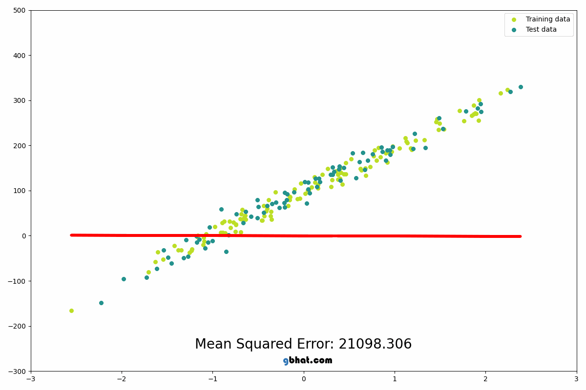
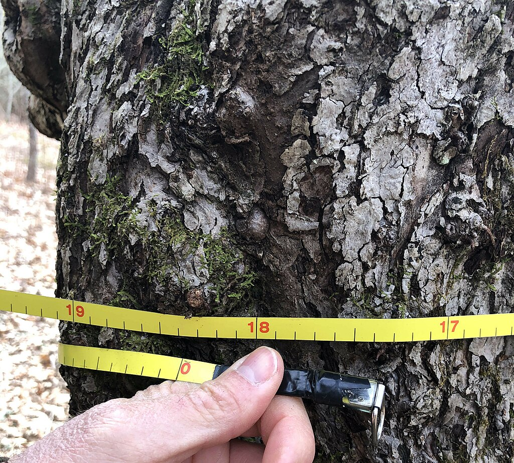

```{r setup, include=FALSE}
library(learnr)
library(ggplot2)
library(shiny)
library(pander)
library(correlation)

if(!require(ggbrace, quietly = TRUE)){
   message("\nVersuche das Paket `ggbrace` von GitHub zu installieren...\nEs wird für eine Grafik benötigt, die ansonsten nicht funktioniert.\nFür die Installation braucht es eine Internetverbindung.\n")
  try(devtools::install_github("NicolasH2/ggbrace"))
  require(ggbrace)
}else{
 library(ggbrace)
}
knitr::opts_chunk$set(echo = FALSE)
```

## Inhalt

In diesem sehr umfangreichen Tutorial wirst du die Grundlagen von
Regressionen verstehen, deren Voraussetzungen testen und die Berechnung
und Interpretation üben.

Die Kapitel, die mit "**Ex:**" beginnen, bieten dabei eine interaktive Vermittlung der
Grundlagen. Wenn du diese bereits verinnerlicht hast kannst du diese auch überspringen
(natülich auf eigene Gefahr, etwas interessantes zu verpassen😉).

In unserem wissenschaftlichen Prozess sind wir weiterhin bei der
Auswertung und dem Berichten unserer Ergebnisse:

{width="70%"}

## Lernziele

Am Ende wirst du folgendes gelernt haben:

-   <input type="checkbox" unchecked> Grundlagen der Regression </input>
-   <input type="checkbox" unchecked> Voraussetzungen der Regression zu
    prüfen </input>
-   <input type="checkbox" unchecked> Modelgüte zu schätzen </input>
-   <input type="checkbox" unchecked> Regressionsergebnisse zu
    interpretieren </input>
-   <input type="checkbox" unchecked> Regressionsergebnisse zu
    visualisieren </input>
    
## Unser Beispiel

Als Förster\*in in den USA stehst du vor einer spätblühenden
Traubenkirsche (*Prunus serotina*)
([wiki](https://de.wikipedia.org/wiki/Sp%C3%A4tbl%C3%BChende_Traubenkirsche)).
Sie soll bald gefällt werden, denn sie hat ein begehrtes Holz, und du
brauchst Geld. Am liebsten möchtest wissen, bevor du den Baum fällst,
wie viele Kubikmeter Holz wohl dabei herauskommen werden, die du
verkaufen kannst. Aber du möchtest keine allzu komplexen Messungen
vornehmen. Den besten und einfachsten Schätzer, den wir bequem nehmen
können ist der Durchmesser des Baumes, der sich ungefähr aus dem Umfang
errechnen lässt. Dafür braucht es lediglich ein Maßband und $\pi$.

Der Baum, vor dem wir stehen, hat einen Durchmesser von 45 cm. Wie viele
Kubikmeter Holz können wir erwarten?

Bild: Kein Kirschbaum, aber zeigt das Prinzip.

{width="60%"}

[Source: US Army Corps of Engineers. Patrick Bloodgood, photographer.
[CC BY 2.0](https://creativecommons.org/licenses/by/2.0), via Wikimedia
Commons]

::: infobox
Achtung! **Vereinfachungsalarm**

Wir lassen hier einige Dinge der Einfachheit halber komplett außer Acht,
zum Beispiel:

-   in der Forstwirtschaft wird zur Schätzung des Volumens eine etwas
    kompliziertere Formel verwendet, in die neben dem Durchmesser auch
    die Höhe mit einfließt
-   Dabei gibt es verschiedene Volumenmaße für Holz mit und ohne Rinde
-   ...
:::

### Beispieldaten

Wir haben bereits Daten von 31 gefällten Bäumen der gleichen Art, und
können damit eine Vorhersage treffen. Die Daten befinden sich im
`trees`-Datensatz, der in *Base R* eingebaut ist.

Schauen wir uns die Daten mal an:

::: aufgabe
**1.** Wie sehen die ersten Zeilen des Datensatzes `trees` aus? Lass dir
den Datensatz mit `head()` anzeigen
:::

```{r head, exercise = TRUE}

```

```{r head-solution}
head(trees)
```

### Ein bisschen Data-Cleaning

::: aufgabe
**2.**

Die Höhe `Height` lassen wir heute außen vor.

Der Durchmesser heißt im Datensatz fälschlicherweise `Girth`, was Umfang
bedeutet. (Das ist einfach ein Fehler in der Benennung, siehe `?trees`).

Behebe das, in dem du in `trees` mittels Assignments eine neue Variable
im dataframe `trees` namens `diameter` erstellst, die den Inhalt der
Variable `Girth` enthält.
:::

```{r girth, exercise = TRUE}

```

```{r girth-solution}
trees$Diameter <- trees$Girth
```

::: aufgabe
**3.**

Die Variablen sind (typisch USA) alle in nicht-metrischen Einheiten
angegeben.

Rechne `Diameter` und `Volume` in metrische Einheiten um, damit das
Beispiel intuitiver verständlich ist. Benenne die neuen Variablen dabei
mit kleinen Anfangsbuchstaben.

`diameter` = $cm = Inch * 2.54$

`volume` = $m^3 = ft^3 * 0.0283168466$
:::

```{r feet-setup}
trees$diameter <- trees$Girth
```

```{r feet, exercise = TRUE}

```

```{r feet-hint}
# passe den Code an:
trees$variable <- trees$Variable * Umrechnungsfaktor
trees$variable <- trees$Variable * Umrechnungsfaktor

```

```{r feet-solution}
trees$diameter <- trees$Diameter * 2.54 # Inch in cm
trees$volume <- trees$Volume * 0.0283168466 #  ft³ in m³

```

```{r silentsetup}
# Hier drauf sollten sich alle Exercise Code Chunks, die das trees-Dataset verwenden, beziehen

trees$diameter <- datasets::trees$Girth * 2.54 # Inch in cm
trees$volume <- datasets::trees$Volume * 0.0283168466 #  ft³ in m³

trees$diameter_centered <- trees$diameter - mean(trees$diameter)

fit <- lm(volume ~ diameter, data = trees)

trees_predict <- trees["volume"]
trees_predict$predict <- predict(fit)
```

```{r silentsetup-global}
# Und das gleiche noch mal fürs Global Environment

trees$diameter <- datasets::trees$Girth * 2.54 # Inch in cm
trees$volume <- datasets::trees$Volume * 0.0283168466 #  ft³ in m³

trees$diameter_centered <- trees$diameter - mean(trees$diameter)
```

### Visualisierung

Ein schneller Scatterplot gibt uns jetzt Auskunft über die Beziehung
zwischen Durchmesser und Volumen:

```{r scat, echo = TRUE}
ggplot(trees, aes(x = diameter, y = volume)) +
  geom_point() +
  theme_minimal() +
  labs(x = "Durchmesser (cm)", y = "Volumen (m³)")
```

Grundsätzlich sieht es so aus, dass wir mehr Holz ernten, je dicker der
Baum war.

Durchmesser und Volumen hängen also irgendwie proportional zusammen. Für
unsere Vorhersage wünschen wir uns aber zu wissen, wie genau diese
Proportion aussieht.

Glücklicherweise sieht der Zusammenhang linear aus, das heißt, wir
könnten ihn sinnvoll mit einer Gerade beschreiben:

```{r linplot, echo=FALSE, message=FALSE, warning=FALSE}
ggplot(trees, aes(x = diameter, y = volume)) +
  geom_point() +
  geom_smooth(method = "lm", se = F) +
  theme_minimal() +
  labs(x = "Durchmesser (cm)", y = "Volumen (m³)")
```

Die blaue Gerade ist unser Modell, die Punkte sind die (Daten der) Realität, aus der
wir das Modell abgeleitet haben. Ein Modell wird den Komplexitäten der
Realität nie komplett gerecht. Die Gerade hier ist ein sehr einfaches Modell und beschreibt
die Realität trotzdem relativ gut.

Geraden werden beschrieben durch lineare Funktionen. Unser Modell
besteht also essentiell aus einer linearen Funktion! Wie genau das alles
funktioniert, erfährst du im nächsten Abschnitt. Vorher aber noch ein
kleiner Test, ob du auch schon mit dem Modell umgehen kannst und die
Eingangsfrage lösen könntest:

```{r first}
question_numeric(
  "Wie viel Kubikmeter Holz sind zu erwarten laut der blauen Gerade (unserem linearen Modell) bei einem Durchmesser von 45 cm?",
  answer(1.5, correct = T)
)
```

Super, das waren die ersten Schritte! Im nächsten Kapitel werden die
mathematischen Grundlagen aufgefrischt.


## Ex: lineare Funktionen

Bisher sieht unser Modell so aus:


Wir wissen nicht genau, was was das Modell im Inneren macht, nur das wir den **Prädiktor**
$x$ (Durchmesser) reingeben und daraus das **Kriterium** $y$ (Volumen)
herausbekommen wollen. In diesem Kapitel erklären wir, was im Modell
vorgeht - nämlich eine lineare Funktion.

### ein bisschen Begriffsarbeit

Die lineare Funktion kennst du sicher noch aus der Schule:

$$
y = mx + n
$$

oder in anderer Notation:

$$
y = a + bx
$$

Egal welche der Notationen du kennst, oder auch wenn du noch gar keine
Berührungspunkte mit linearen Funktionen hattest, der Aufbau ist immer
gleich.

Wir werden diese Notation verwenden:

$$
\hat y_i = b_0 + b_1\cdot x_i
$$

-   Dabei steht $\hat y_i$ für den durch das Modell vorhergesagten Wert, die **abhängige Variable** (AV) auch engl. "*response variable*" genannt, "*output variable*" oder
    **Kriterium**. Im Beispiel wäre es das Holzvolumen in m³.

    Ein Dach über der Variable kennzeichnet immer, dass es sich hier um
    einen geschätzten Wert handelt.

-   $x_i$ ist der **Prädiktor**, die **unabhängige Variable** (UV) oder engl. 
*input variable*, im Beispiel der Baumdurchmesser in cm.

-   Der tiefgestellte Index $i$ bezeichnet die Nummer eines
    Messwertpaars

Daraus ergibt sich für uns folgendes Modell:

$$
\hat{Volumen_i} = b_0 + b_1 \cdot Durchmesser_i 
$$

</br>

#### Was sind $b_0$ und $b_1$?

Beides sind Regressions**koeffizienten** - zwei Parameter, die die Lage der
Gerade beschreiben.

-   $b_0$ ist die **Regressions*konstante***.

    Das ist der vorhergesagte Wert, wenn $x$ 0 ist. Das ergibt sich aus
    der Gleichung, wenn man für $x$ 0 einsetzt:

    $\hat y_i = b_0 + b_1 \cdot 0 = b_0$

    Bei einer Gerade ist $b_0$ also dort, wo $x = 0$. Das ist oft auch
    dort, wo die y-Achse verläuft, deswegen nennt man $b_0$ auch
    y-Achsenabschnitt oder *Intercept* auf Englisch.

-   $b_1$ ist das **Regressions*gewicht***.

    Es entspricht der Steigung der Gerade (engl. *Slope*) und ist
    inhaltlich die Änderung im vorhergesagten Wert ($\hat y_i$), wenn
    man $x$ um eine Einheit erhöht.

    Es erinnern sich bestimmt alle an das Dreieck, was man an die Gerade
    zeichnen kann, um die Steigung zu bestimmen.

### Beispiel-Gerade

Hier einmal eine Beispiel-Gerade, beschrieben durch die Gleichung
$\hat y_i = 9 - 1.5x_i$.

-   Intercept $b_0 = 9$
-   Steigung $b_1 = -1.5$

```{r geraden_raten}
.gerade <- function(x, intercept = 0, slope = 1){
  intercept + slope * x
}

ggplot() +
  stat_function(fun = `.gerade`, xlim = c(-1, 10), args = list(slope = -1.5, intercept = 9)) +
  geom_segment(aes(x = 2, y = 6, yend = 6, xend = 3), color = "red", 
               arrow = arrow(length = unit(0.03, "npc"))) +
  geom_segment(aes(x = 3, xend = 3, y = 6, yend = 4.5), color = "red",
               arrow = arrow(length = unit(0.03, "npc"))) +
  annotate("text", x = 2.5, y = 6.5, label = "1") +
  annotate("text", x = 3.5, y = 5.125, label = "-1.5") +
  coord_cartesian(xlim = c(0, 10), ylim = c(0, 10), expand = F) +
  scale_y_continuous(breaks = 0:10) +
  scale_x_continuous(breaks = 0:10) +
  theme_minimal()
```

Für die Steigung berechnest du also die Differenz von y geteilt durch die Differenz von x: $Δy/Δx$ = $-1.5/1$.

### Quiz

```{r quizgraph}

ggplot() +
  stat_function(fun = `.gerade`, xlim = c(0, 20),
                args = list(intercept = 5, slope = 0.5)) +
  stat_function(fun = `.gerade`, xlim = c(0, 20),
                args = list(intercept = 10, slope = 1), linetype = "dashed") +
  coord_cartesian(ylim = c(0, 20), xlim = c(0, 20)) +
  theme_minimal()
```

```{r guess}
quiz(caption = "Schulmathe auffrischen",
  question_numeric(
  "Welche Steigung (b1) hat die gestrichelte Linie?",
  answer(1, correct = T),
  allow_retry = TRUE
  ),
  question_numeric(
  "Welche Steigung (b1) hat die durchgezogene Linie?",
  answer(0.5, correct = T),
  allow_retry = TRUE
  ),
  question_numeric(
    "Welches Intercept (b0) hat die gestrichelte Linie?",
    answer(10, correct = T),
  allow_retry = TRUE
  ),
  question_numeric(
    "Welches Intercept (b0) hat die durchgezogene Linie?",
    answer(5, correct = T),
  allow_retry = TRUE
  )
  
)
```

Alles klar! Wir sind bereit, $b_0$ und $b_1$ für unser eigenes Modell zu
bestimmen.

## Fitting the model

Nun wissen wir also, dass das Modell einer einfachen linearen Regression
einfach eine Geradengleichung ist, beschrieben durch die Parameter $b_0$
(Intercept) und $b_1$ (Steigung).

Aber wie genau kommen wir auf diese Parameter? Den Prozess, ein Modell
zu erstellen, was die Realität möglichst gut erklärt, nennt man auf
Englisch *to fit a model*.

$b_0$ und $b_1$ werden so gewählt, dass die Regressionsgerade einen
möglichst kleinen Abstand zu allen Datenpunkten hat.

::: aufgabe
Probiere selbst aus, die Regressionsgerade optimal durch die
Datenpunkte zu legen!
:::

</br>

```{r shiny_ui, echo=FALSE}
sliderInput("b0", "Intercept b0:", min = -1.5, max = 1.5, value = 1, step = 0.0001)
sliderInput("b1", "Slope b1:", min = 0, max = 0.15, value = 0, step = 0.0001)
plotOutput("distPlot")
actionButton("show", "Antwort einreichen & Lösung anzeigen", class = "btn-default")
tableOutput("estimate")
plotOutput("optimumPlot")
```

```{r shiny_server, context="server"}
  # Prerequisites: Daten müssen noch mal erstellt werden weil shiny app verwendet eigenes environment
  require(ggplot2)
  # sysinfo <- Sys.info()
  # if(sysinfo["sysname"] == "Linux") require(Cairo) #bessere Grafik unter Linux, ist aber nur hörensagen und nicht nötig

  trees$diameter <- datasets::trees$Girth * 2.54 # Inch in cm
  trees$volume <- datasets::trees$Volume * 0.0283168466 #  ft³ in m³
  fit <- lm(volume ~ diameter, data = trees)

  # Wahre Werte für b0 und b1 bestimmen
  coefs <-  fit |> coef() |> as.numeric()

  # Minimale QS_res bestimmen
  sum_res_min <- (trees$volume - predict(fit))^2 |> sum()

  # Lösungsplot
  optimumPlot <- ggplot(trees, aes(x = diameter, y = volume)) +
    geom_point() +
    geom_abline(intercept = coefs[1], slope = coefs[2], color = "blue") +
    geom_linerange(x = trees$diameter, ymin = trees$volume, ymax = predict(fit),
                   linetype = "solid", colour = "red") +
    annotate(geom = "label", x = 50, y = 0.3, hjust = 0, col = "red", size = 5,
             label = paste0("Summe der \nquadrierten\nResiduen \n=", round(sum_res_min, 4))) +
    theme_minimal() +
    labs(x = "Durchmesser (cm)", y = "Volumen (m³)", title = "beste Schätzung") +
    coord_cartesian(xlim = c(20, 55), ylim =c(0, 2.5), expand = F)

  # Reaktive Vorhersage (für rote Linien)
  pre <- reactive(input$b0 + input$b1 * trees$diameter)

  # reaktive Summe der quadrierten Residuen
  res <- reactive(sum((trees$volume - pre()) ^ 2))

  # Grading Function
  .estimate_grader <- function(x){
    real <- c(coefs, sum_res_min)
    deviation <- (x - real) * 100 / real
    data.frame("Ihre Schätzung" = x,
               "beste Schätzung" = real,
               "Abweichung" = paste(round(deviation, 2), "%"),
               row.names = c("Intercept", "Slope", "summierte quadrierte Residuen"),
               check.names = FALSE)
  }

  # Check Button Logic
  observeEvent(input$show, {
    estimate_cache <- c(input$b0, input$b1, res())
    # updateSliderInput(inputId = "b0", value = coefs[1])
    # updateSliderInput(inputId = "b1", value = coefs[2])
    output$estimate <- renderTable(.estimate_grader(estimate_cache),
                                   rownames = TRUE, digits = 4)
    output$optimumPlot <- renderPlot(optimumPlot)
  })

  # Plot
  output$distPlot <- renderPlot({

  ggplot(trees, aes(x = diameter, y = volume)) +
    geom_point() +
    geom_abline(intercept = input$b0, slope = input$b1, color = "blue") +
    geom_linerange(x = trees$diameter, ymin = trees$volume, ymax = pre(),
                   linetype = "solid", colour = "red") +
    annotate(geom = "label", x = 50, y = 0.3, hjust = 0, col = "red", size = 5,
             label = paste0("Summe der \nquadrierten\nResiduen \n=", round(res(), 5))) +
    theme_minimal() +
    labs(x = "Durchmesser (cm)", y = "Volumen (m³)") +
    coord_cartesian(xlim = c(20, 55), ylim =c(0, 2.5), expand = F)

})
```

</br>

Hervorragend! Du hast jetzt hoffentlich ein intuitives Gefühl für die
Problemstellung bekommen.

Wie du gesehen hast, gab es auch eine durch den Computer berechnete
„beste Schätzung“ - vielleicht hast du das einfach so hingenommen,
aber was qualifiziert diese Schätzung eigentlich dazu, sich die „beste“
zu nennen?

Ein wichtiges Konzept sind dabei die Residuen.

### Residuen

Die oben in rot gekennzeichneten vertikalen Abstände zwischen realen
Werten und den vorhergesagten Werten nennt man auch **Residuen**, also
"Überbleibsel". Residuen stellen die Abweichung der Realität vom Modell
dar, also den "Fehler", den das Modell nicht erklären kann.

Offensichtlich ist es daher besser, wenn die Residuen kleiner sind, als
wenn sie sehr groß sind. **Kleine Residuen bedeuten, dass das Modell näher an der Realität liegt**.

#### Formel

Ein Residuum $e$ (wie Error) der Messung $i$ errechnet sich aus:

$$e_i = y_i - \hat y_i$$

dabei gilt:

-   $y_i$ = tatsächlicher Wert

-   $\hat y_i$ = vorhergesagter Wert

#### Methode der kleinsten Quadrate

Eine Möglichkeit, zu definieren wann eine Regressionsgerade optimal an
die Daten angepasst ist, zu sagen:

*„Die Regressionsgerade liegt optimal, wenn die Summe der quadrierten 
Residuen minimal ist.“*

$$
\sum_{i = 1}^n \left(e_i\right)^2 = min
$$

Dahinter steht ein grundlegendes Konzept, die „**Methode der kleinsten
Quadrate**“ (*least squares*), was eine weit verbreitete Schätzmethode
ist.

Natürlich hat *least squares estimation* auch Nachteile, zum Beispiel
durch das Quadrieren hohe Empfindlichkeit gegenüber Extremwerten.
Deswegen sei hier gesagt: es gibt auch andere Methoden, jedoch ist
*least squares* der Standard.

<details>

<summary><a>▼ \* Hintergründe: analytische Lösung der
Minimierung</a></summary>

::: infobox
##### Woher kommen die Formeln für $b_1$ und $b_0$?

Das tolle an der Methode der kleinsten Quadrate ist, dass es für die
Regressionskoeffizienten eine analytische Lösung gibt, das heißt,
mathematische Formeln, mit denen sie *garantiert* so bestimmt werden,
dass die quadrierten Residuen minimal sind.

Das hier ist die Ausgangslage, das Kriterium für eine optimal liegende
Gerade: Die Summe der quadrierten Residuen soll minimal sein.

$$
\sum_{i = 1}^n \left(e_i\right)^2 = \sum_{i = 1}^n \left( y_i - \hat y_i \right)^2 = min
$$

Da quadrierte Werte immer positiv sind, erreicht man, dass sich negative
und positive Abweichungen beim Summieren nicht aufheben. Außerdem stellt
das Quadrieren weitere günstige mathematische Eigenschaften für das
Minimieren her.

##### Einsetzen der Regressionsgleichung für $\hat y$:

$$
\sum_{i = 1}^n \left( y_i - (b_0 + b_1 \cdot x_i) \right)^2 = min
$$

##### Minimieren:

Du hast vermutlich an den Schiebereglern selbst bemerkt - es
funktioniert nicht, nur einen der beiden Koeffizienten isoliert zu
optimieren, sondern du musst verschiedene Kombinationen ausprobieren.

Ähnlich ist es bei der Herleitung allgemeiner Formeln. Sie funktioniert
über das Nullsetzen der beiden partiellen Ableitungen nach $b_0$ und
nach $b_1$. Es gibt gute externe Quellen dazu, z. B. im [wikibook über
lineare
Regression](https://de.wikibooks.org/wiki/Statistik:_Regressionsanalyse#Einfaches_lineares_Regressionsmodell).

Daraus leiten sich letzten Endes folgende Formeln ab:

```{=tex}
\begin{align}
b_1 &= \frac{cov(x,y)}{var(x)}
\\
b_0 &= \bar y - b_1 \cdot \bar x
\end{align}
```
Der Key-Takeaway ist: Diese Formeln liefern per mathematischer
Definition die **optimale Regressionsgerade mit minimalen Residuen**!

Amazing.🌈
:::

</details>

</br>

<details>

<summary><a>▼ \* Exkurs: iterative Lösung der Minimierung</a></summary>

::: infobox
Das Gegenstück zu einer analytischen Lösung ist ein **iterativer Ansatz**,
also „Trial & Error“, wie du es oben selbst vermutlich auch gemacht
hast. Das ist ebenso eine weit verbreitete Methode, die quadrierten
Residuen zu minimieren, besonders dann, wenn die mathematischen
Voraussetzungen für die klassische Lösung nicht gegeben sind (das sind
einige, siehe Kapitel „Voraussetzungen“). Prädestiniert für die Trial &
Error-Lösung sind Machine-Learning-Algorithmen. Wir werden keine dieser
Algorithmen in R verwenden, aber ich möchte darauf hinweisen, dass es
das gibt.

Hier eine Illustration des Fitting-Prozesses, allerdings mit anderen
Daten. Die Grafik zeigt wie ein Machine-Learning-Algorithmus sich
Schritt für Schritt der optimalen Regressionsgerade annähert, und die
mittleren quadrierten Residuen (Mean Squared Error, MSE) immer kleiner
werden, bis es nicht kleiner geht.

{width="80%"}

Source:
[ghbat.com](https://gbhat.com/machine_learning/linear_regression.html)
:::

</details>

</br>

#### Übung Residuen

::: aufgabe
**1.** Um die Formeln noch mal selbst anzuwenden, ist hier eine kleine
Praxisaufgabe.

In der Tabelle `trees_predict` finden Sie zwei Spalten: Das tatsächliche
Volumen ($y_i$, `volume`) und das vorhergesagte Volumen ($\hat y_i$, `predict`).

a)  Schauen Sie sich `trees_predict` an.
b)  Berechnen Sie eine neue Spalte mit den Residuen für jeden einzelnen
    Messwert! (`Residuen <- tatsächlicher Wert - vorhergesagter Wert`)
c)  Berechnen Sie die Summe der quadrierten Residuen!
    (`Sum(residuen ^ 2)`)
:::

</br>

```{r predict, exercise = TRUE, exercise.setup = "silentsetup"}
trees_predict
```

```{r predict-hint}
# a)
head(trees_predict)

# b)
trees_predict$resid <- trees_predict$XXX - trees_predict$predict

# c)
sum(XXX ^ 2)
```

```{r predict-solution}
# a)
head(trees_predict)

# b)
trees_predict$resid <- trees_predict$volume - trees_predict$predict

# c)
sum(trees_predict$resid ^ 2)
```

```{r predict-question}
question_numeric("Welchen Wert hast du für die summierten quadrierten Residuen herausbekommen? (3 Nachkommastellen)",
                 answer(0.420, correct = T, message = "Das ist genau der gleiche Wert wie oben bei der Aufgabe mit den Schiebereglern."), tolerance = 0.001, allow_retry = T)
```

</br>

Hang on! In den nächsten Kapiteln wird es praktisch: Wie kann ich die Voraussetzungen prüfen? Wie ein Modell in *R* erstellen und mir die **Koeffizienten** ausrechnen lassen? Und die
wichtige Frage wird sein: Wo finde ich die relevanten Ergebnisse, und wie interpretiere ich sie?


## Vorraussetzungen prüfen

Hier ein kleiner Überblick, darüber, wie die Voraussetzungen einer Regression
in R geprüft werden können:

+-------------------------------------+--------------------------------+
| Vorannahme                          | Überprüfung                    |
+=====================================+================================+
| 1.  metrische Variablen             | Vorwissen über die Erhebung    |
+-------------------------------------+--------------------------------+
| 2.  Zufällige Stichprobe            | Vorwissen über die Erhebung    |
+-------------------------------------+--------------------------------+
| 3.  Linearer Zusammenhang in den    | Streudiagramm                  |
|     Daten                           |                                |
+-------------------------------------+--------------------------------+
| 4.  Es gibt Variation beim          | Streudiagramm                  |
|     Prädiktor                       |                                |
+-------------------------------------+--------------------------------+


: Vor dem Modellieren

+----------------------------------+-----------------------------------+
| Vorannahme                       | Überprüfung                       |
+==================================+===================================+
| 5.  Homoskedastizität            | `plot(fit)`                       |
+----------------------------------+-----------------------------------+
| 6.  Unkorreliertheit der         | `plot(fit)`                       |
|     Residuen mit der UV          |                                   |
+----------------------------------+-----------------------------------+
| 7.  keine Autokorrelation der    | `car::durbinWatsonTest(fit)`      |
|     Residuen                     |                                   |
+----------------------------------+-----------------------------------+
| 8.  Normalverteilung der         | Q-Q-Plot: der zweite Plot bei     |
|     Residuen                     | `plot(fit)`                       |
|                                  |                                   |
|                                  | Histogramm der                    |
|                                  | standardisierten Residuen         |
|                                  |                                   |
|                                  |                                   |
|                                  | `resid(fit) |> scale() |> hist()` |    
|                                  |                                   |
+----------------------------------+-----------------------------------+

: Nach dem Modellieren

Wir können einige unserer Annahmen also erst nach der Berechnung des Modells 
überprüfen. Das ist für uns neu! Hier stellen wir dir zunächst alle Voraussetzungen
und Tests vor und später im Übungskapitel wenden wir diese auf unseren 
heutiges Beispiel an.

### 1. Metrische Variablen

Sowohl der Prädiktor als auch das Kriterium müssen metrisch sein.

<details>

<summary><a>▼ \* Hier sind einige andere Verfahren, falls das nicht
gegeben ist: </a></summary>

::: infobox
kategorialer Prädiktor + metrisches Kriterium

-   bei zwei Kategorien / Gruppen: $t$-Test

-   bei mehr als zwei Kategorien / Gruppen: Varianzanalyse (ANOVA) oder
    generalisiertes lineares Modell (GLM) mit Dummy-Kodierung

metrischer Prädiktor + kategoriales Kriterium:

-   logistische Regression
:::

</details>

</br>

### 2. Zufällige Stichprobe

Im Beispiel mit der spätblühenden Traubenkirsche wäre es zum Beispiel
wichtig, dass nicht selektiv nur Bäume vermessen wurden, die eine
besonders gute Wuchsform hatten, sondern eine ausreichend große,
zufällige Auswahl aus allen möglichen Bäumen getroffen wurde, damit eine
Normalverteilung angenommen werden kann. Dabei heißt ausreichend große
Stichprobe als Faustregel ungefähr $n > 30$.

### 3. Linearer Zusammenhang in den Daten

Manche Daten werden besser nicht durch Geraden erklärt, sondern haben
vielleicht quadratische Zusammenhänge, wie in diesem Beispiel:

```{r sim_nonlinear_data}
data <- data.frame(temperatur=c(6, 9, 12, 14, 30, 35, 40, 47, 51, 55, 60),
                   enzymaktivität=c(14, 28, 50, 70, 89, 94, 90, 75, 59, 44, 27))


straight_fit <- lm(enzymaktivität ~ temperatur, data = data)
data$temperatur2 <- data$temperatur^2
quad_fit <- lm(enzymaktivität ~ temperatur + temperatur2, data = data)
zeit <- seq(0, 60, 0.1)
prediction <- predict(quad_fit, list(temperatur = zeit, temperatur2 = zeit^2))

plot(enzymaktivität ~ temperatur, data = data)
abline(straight_fit, col = "red")
lines(zeit, prediction, col = "blue")
```

Die Gerade erklärt die Daten nicht gut und trifft falsche Vorhersagen,
während die quadratische Funktion sehr nah an der Realität liegt.
(Fiktive Daten)

Die Überprüfung einer linearen Beziehung in den Daten erfolgt visuell
über ein Punktdiagramm. Die Punkte sollten sich alle durch eine Gerade
beschreiben lassen und keine *systematischen* Abweichungen von der
Linearität haben. Zufällige Streuung hingegen ist komplett in Ordnung.

Beispiele:

```{r plotmaking, fig.height=5, fig.width=6}
p1 <- ggplot(rtutorials::concrete, aes(x = coarse_aggregate, y = compressive_strength)) +
  geom_point(alpha = 0.2) +
  theme_void() +
  labs(title = "1")

p2 <- ggplot(rtutorials::heated, aes(x = edvisits, y = maxtemp)) +
  geom_point(alpha = 0.18) +
  theme_void() +
  labs(title = "2")

p3 <- ggplot(rtutorials::airfoil, aes(x = angle, y = displacement_thickness)) +
  geom_point(alpha = 0.03) +
  theme_void() +
  labs(title = "3")

p4 <- ggplot(iris, aes(x = Petal.Length, y = Petal.Width)) +
  geom_point(alpha = 0.2) +
  theme_void() +
  labs(title = "4")

p5 <- ggplot(women, aes(x = height, y = weight)) +
  geom_point(alpha = 0.5) +
  theme_void() +
  labs(title = "5")
  
p6 <- ggplot(faithful, aes(x = eruptions, y = waiting)) +
  geom_point(alpha = 0.34) +
  theme_void() +
  labs(title = "6")

gridExtra::grid.arrange(p1, p2, p3, p4, p5, p6)
```

```{r plotquiz}
question_checkbox("Bei welchen dieser Plots würden Sie eine zugrunde liegende lineare Beziehung vermuten?",
                  answer("1", message = "(1) Hier ist es schwer zu sagen - die Daten enthalten sehr viel Streuung. Aufällig ist die Konzentration viele Punkte auf bestimmten x-Werten."),
                  answer("2", message = "(2) Diese Beziehung zwischen Notaufnahmebesuchen (y) und Hitze (x) folgt eher einer Kurve als einer Gerade"),
                  answer("3", message = "(3) Hier liegt scheinbar eher eine Exponentialfunktion zu Grunde, keine Gerade"),
                  answer("4", correct = T, message = "(4) Hier könnte eine Gerade die Punkte gut beschreiben."),
                  answer("5", correct = T, message = "(5) Es handelt sich um den Zusammenhang zwischen Körpergröße und Gewicht."),
                  answer("6", correct = T, message = "(6) Auch hier lässt sich eine lineare Beziehung vermuten."),
                  allow_retry = TRUE
         )
```

### 4. Variation des Prädiktors

*Wie sieht ein Plot ohne Variation des Prädiktors aus?*

Alle Punkte liegen auf dem selben $x$-Wert! In diesem Fall hilft $x$
überhaupt nicht, Varianz in $y$ zu erklären. Die beste Vorhersage für
$y$ ist dann der Mittelwert $\bar y$.

Dieser Fall ist in der Praxis extrem unwahrscheinlich, da es meistens
ein bisschen zufällige Variation gibt.

```{r novariation, fig.height=5, fig.width=5}
plot(x = rep(20, 100), y = rnorm(100), yaxt = "n", xaxt = "n", xlab = "x", ylab = "y")
```

Diese Betrachtungen kann man ohne Modell bereits vor der Analyse durchführen. 

Für die letzten Voraussetzungen (5-8) brauchen wir unser bestehendes Modell.

### 5. Homoskedastizität

Wieder mal ein langes und kompliziertes Wort, das dir da begegnet. Aber
nicht verzagen, es meint lediglich: **die Varianz der Daten sind über
die Variable gleich verteilt**. Das bedeutet, dass die Streuung der
Residuen um die Regressionslinie für alle Werte der unabhängigen
Variablen gleich bleibt. Wenn diese Bedingung erfüllt ist, spricht man
von Homoskedastizität. Ist sie nicht erfüllt, also wenn die Varianz der
Residuen mit den Werten der unabhängigen Variablen variiert, spricht man
von Heteroskedastizität.

Die Einhaltung der Homoskedastizität ist wichtig, da viele statistische
Tests, insbesondere in der linearen Regression, auf der Annahme
basieren, dass diese Bedingung gegeben ist. Heteroskedastizität kann zu
ungenauen Schätzungen und zu irreführenden Testergebnissen führen.

Was ist hier gemeint? Schau dir die Grafiken an und versuche zu
verstehen, welche der Variablen keine gleichverteilten Residuen hat.

```{r homoskedasis_grafiken, message=FALSE, warning=FALSE}
# H1 Homosked.
set.seed(1)
x <- 1:1000
y <- rnorm(1000, sd = 100)
df1 <- data.frame(x, y)
h1 <- ggplot(df1, aes(x, y)) +
  geom_point(alpha = 0.34) +
#  geom_smooth(method = "lm", se = F) +
  theme_void() +
  labs(title = "1")

y <- 2 + 0.5 * x + rnorm(1000, sd = x)
df2 <- data.frame(x, y)
h2 <- ggplot(df2, aes(x, y)) +
  geom_point(alpha = 0.34) +
  # geom_smooth(method = "lm", se = F) +
  theme_void() +
  labs(title = "2")

sd3 <- sin(seq(0, 5, length.out = 1000))^2
y <- rnorm(1000, sd = sd3)
df3 <- data.frame(x, y)
h3 <- ggplot(df3, aes(x, y)) +
  geom_point(alpha = 0.34) +
  # geom_smooth(method = "lm", se = F) +
  theme_void() +
  labs(title = "3")

y <- sin(seq(0, 10, length.out = 1000)) + rnorm(1000, sd = 0.5)
df4 <- data.frame(x, y)
h4 <- ggplot(df4, aes(x, y)) +
  geom_point(alpha = 0.34) +
  # geom_smooth(method = "lm", se = F) +
  theme_void() +
  labs(title = "4")

y <- 2 + 0.5 * x + rnorm(1000, sd = 30)
df5 <- data.frame(x, y)
h5 <- ggplot(df5, aes(x, y)) +
  geom_point(alpha = 0.34) +
  # geom_smooth(method = "lm", se = F) +
  theme_void() +
  labs(title = "5")

y <- 10 - 0.5 * x + rnorm(1000, sd = 1000:1)
df6 <- data.frame(x, y)
h6 <- ggplot(df6, aes(x, y)) +
  geom_point(alpha = 0.34) +
  # geom_smooth(method = "lm", se = F) +
  theme_void() +
  labs(title = "6")

gridExtra::grid.arrange(h1, h2, h3, h4, h5, h6)
```

```{r homoskedasis_question}
question_checkbox("Welche der Grafiken zeigen eine homoskedastische Verteilung?",
                  answer(1, correct = T, message = "(1) Hier ist es offensichtlich"),
                  answer(2, message = "(2) Das klassische Beispiel für Heteroskedastizität - die Trompetenform"),
                  answer(3), message = "(3) könnte ein Beispiel für saisonale Schwankungen sein - heteroskedastisch",
                  answer(4, correct = T, message = "(4) ist eigentlich homoskedastisch, weil die Streuung überall gleich ist, aber es liegt eine Sinuskurve anstelle einer Gerade zugrunde. (Dadurch ist dann auf jeden Fall eine andere Voraussetzung verletzt, nämlich die Linearitätsannahme)"),
                  answer(5, correct = T, message = "(5) hat eine in der Praxis fast unrealistisch kleine Streuung, aber sie ist überall gleich breit - homoskedastisch"),
                  answer(6, message = "(6) Das klassische Beispiel für Heteroskedastizität - die Trompetenform"), 
                  allow_retry = T)
```

### 6. Unkorreliertheit der Residuen mit Kriterium

Wir wollen also auch untersuchen, ob die standardisierten Residuen mit unserer 
abhängigen Variable (Kriterium) korrelieren. Auch dafür schauen wir uns ein Scatterplot
diese beiden Größen an.
Verlaufen die Residuen in einer erkennbaren Form mit dem Kriterium, dann ist das ein Hinweis auf einen nicht-linearen (quadratischen/ logarithmischen) Zusammenhang der Variablen. 
Vergleichen wir dafür noch einmal zwei Plots:

<!-- not needed (double): -->
<!-- h1 + geom_smooth(method = "lm", se = F) -->
<!-- h4 + geom_smooth(method = "lm", se = F) -->

```{r grafiken_homosked, echo=T, message=FALSE, warning=FALSE, setup = "homoskedasis_grafiken"}
fit1 <- lm(y ~ x, data = df1)
plot(fit1, which = 1)

fit4 <- lm(y ~ x, data = df4)
plot(fit4, which = 1)
```

Der erste Plot zeigt die gewünschte gleichmäßige Verteilung, der zweite einen deutlichen 
quadratischen Zusammenhang, der darauf hinweißt, dass die Annahme der Unkorreliertheit 
hier verletzt ist.

### 7. keine Auto-Korrelation der Residuen

Was bedeutet Auto-Korrelation?

Die altgriechische Vorsilbe „Auto-“ bedeutet „Selbst-“ oder „Eigen-“. Es
geht also um Korrelation der Werte mit sich selbst.

Dabei wissen wir ja eigentlich, dass die Korrelation jeder Variable mit
sich selbst perfekt ist, also 1 beträgt. Darum geht es also nicht.

Die Frage hier ist, ob die Höhe eines Residuums die Höhe der
benachbarten Residuen beeinflusst. Wenn das übermäßig der Fall ist, sind
die Residuen nicht zufällig.

Warum ist das wichtig? Das Modell baut darauf, dass ein linearer
Zusammenhang zugrunde liegt, und dass jegliche Streuung in den Daten um
diese Gerade rein zufälliger Natur ist, also keine Systematik dahinter
steht.

#### Überprüfung in R

Die Auto-Korrelation kann in R berechnet und ausgegeben werden mitsamt
eines Hypothesentests, der die Nullhypothese *rho* = 0 testet („Die
Auto-Korrelation beträgt in Wahrheit 0“).

```{r autocor-question}
question_checkbox("Wie müsste der *p*-Wert aussehen, wenn unsere Daten vermutlich aus einer Population ohne Autokorrelation stammen?",
                  answer("$p \\le 0.05$", message = "Wenn *p* kleiner als 0.05 wäre, müssten wir die Nullhypothese verwerfen. Da die Nullhypothese aber enthält, dass die Autokorrelation in Wahrheit 0 ist, wäre das also nicht der erwünschte Fall, diese Annahme zu verwerfen - das wäre dann ein Hinweis darauf, dass es Autokorrelation gibt."),
                  answer("$p > 0.05$", correct = T, message = "Genau! In diesem Fall halten wir danach Ausschau, dass der Test nicht signifikant wird, der *p*-Wert größer als 0.05 bleibt, damit die Nullhypothese beibehalten werden darf, da das das „erwünschte“ Ergebnis ist."),
                  allow_retry = T,
              random_answer_order = T)
```

Geprüft wird das mit einem **Durbin-Watson-Test**. Das Paket `car` stellt
eine Funktion dafür bereit:

Testen wir das zunächst an einem extremen Beispiel, was ich simuliert
habe und definitiv Auto-Korrelation enthalten sollte: Plot 4 aus dem
Homoskedastizität-Abschnitt, die Residuen variieren systematisch!

Wenn Auto-Korrelation besteht, dann variieren benachbarte Residuen
gemeinsam.

```{r heterosked_plot, message=FALSE, warning=FALSE}
fit4 <- lm(y ~ x, data = df4)
pre4 <- predict(fit4)
h4 + geom_smooth(method = "lm", se = F) +
  geom_linerange(aes(ymin = pre4, ymax = y), color = "red", alpha = .4)

```

```{r durbinwatsonfit, echo = TRUE}
car::durbinWatsonTest(fit4)
```

```{r autocor_question1}
question_radio("Was ist deine Hypothesenentscheidung, wenn du den $p$-Wert des Tests mit $\\alpha = 0.05$ vergleichst?",
               answer("H0 beibehalten", message = "Da $p$ < $alpha$ ist der Test signifikant. Bei Signifikanz muss die H0 abgelehnt werden."),
               answer("H0 ablehnen", correct = T,
                      message = "Da $p < \\alpha$, ist der Test signifikant."),
               allow_retry = T,
              random_answer_order = T,
               correct = random_praise("de"),
               incorrect = random_encouragement("de"))
```

<!-- Zur Frage oben: In Character Strings wird backslash als Escape-Character geparst und muss daher von einem weiteren backslash escaped werden, um in $$ an LaTex übergeben werden zu können. -->

```{r autocor_question2}
question_radio("Was bedeutet eine Entscheidung gegen die $H_0$ inhaltlich?",
               answer("Es besteht Autokorrelation", correct = T, message = "Da $p$ < $alpha$ ist der Test signifikant. Bei Signifikanz muss die $H_0$ abgelehnt werden. Sie sagt, es gibt keine Autokorrelation. Wenn wir das ablehnen, dann gibt es demzufolge welche."),
               answer("Es besteht keine Autokorrelation",
                      message = "Die $H_0$ besagt genau das, aber wenn wir sie ablehnen gilt das eben nicht."),
               allow_retry = T,
              random_answer_order = T,
               correct = random_praise("de"),
               incorrect = random_encouragement("de"))
```


### 8. Normalverteilung der Residuen

Eine letzte und zentrale Annahme ist, dass die Residuen normalverteilt
sein müssen.

Eine Möglichkeit, das grob visuell zu überprüfen, ist ein Histogramm der 
standardisierten Residuen zu erstellen.

Dafür berechnen wir die Residuen des Models *fit* `resid(fit)` geben dies in eine
Funktion zur Standardisierung `scale()` und lassen uns daraus ein Histogramm erstellen
`hist()`.

```r
resid(fit) |> scale() |> hist()
```

Wir erinnern uns: Ein Histogramm ermöglicht, die Verteilung einer
metrischen Variable zu visualisieren.

```{r residuenhist, exercise = T}
resid(fit) |> scale() |> hist()
```

#### visuelle Überprüfung

Es mag willkürlich erscheinen, rein aus dem Visuellen grob zu bestimmen,
ob etwas normalverteilt ist oder nicht. Mit diesem kleinen Spiel kannst du deine
Intuition etwas schärfen:

```{r ui_distribution-guesser}
verteilungen <- c("Normal", "Uniform", "Bimodal")

fluidPage(

  shinyFeedback::useShinyFeedback(),
  shinyjs::useShinyjs(),

  # Application title
  titlePanel("Verteilungen erraten"),


  sidebarLayout(
    sidebarPanel(
      sliderInput("n", "Stichprobengröße (aka Schwierigkeitsgrad)",
                  value = 50, min = 30, max = 300, step = 1),
      # sliderInput("bins", "Anzahl Bins", min = 3, value = 20, max = 80, step = 1),
    ),

    mainPanel(
      plotOutput("plot"),
      radioButtons("radio",
                   "Aus welcher Verteilung wurde die Stichprobe gezogen?",
                   verteilungen, selected = character(0)),
      actionButton("button", "Nächster Plot"),
      tableOutput("table"),
      textOutput("text"),
      actionButton("reset", "Neustart")
    )
  )
)

```

```{r server_distribution-guesser, context = "server"}
# Die App wird separat entwickelt, da sonst für jeden Test das Laden des gesamten tutorials nötig ist
# source of truth: https://github.com/luk-brue/normal-distribution-guesser
library(shinyFeedback)
library(shinyjs)

verteilungen <- c("Normal", "Uniform", "Bimodal")

  sampler <- function() sample(verteilungen, size = 1)
  zufall <- reactiveValues(sample = sampler())
  counter <- reactiveValues(richtig = 0, falsch = 0, round = 0)

  observeEvent(input$button, counter$round <- counter$round + 1)

  observeEvent(input$n, {
    feedback(inputId = "n", text = "unmöglich", color = "darkred",
             show = {input$n < 30})
    feedback(inputId = "n", text = "schwer", color = "red",
             show = {input$n > 30 && input$n <= 39})
    feedback(inputId = "n", text = "mittelschwer", color = "orange",
             show = {input$n > 39 && input$n <= 50})
    feedback(inputId = "n", text = "medium", color = "yellow",
             show = {input$n > 50 && input$n <= 100})
    feedback(inputId = "n", text = "leicht", color = "darkgreen",
             show = {input$n > 100 && input$n <= 200})
    feedback(inputId = "n", text = "sehr leicht", color = "lightgreen",
             show = {input$n > 200})

  })

  observeEvent(input$reset, {
    zufall$sample <- sampler()
    counter$richtig <- 0
    counter$falsch <- 0
    counter$round <- 0
  })

  output$text <- renderText({

    paste("Erfolgsquote:",
          if(counter$round >= 5){
            paste(
              round(
                counter$richtig / (counter$richtig + counter$falsch) * 100,
                digits = 2
              ),
              "%")
          } else {
            "wird erst ab 5 Versuchen angezeigt"
          }
    )
  })

  output$plot <- renderPlot({
    input$button
    x <- switch(zufall$sample,
                "Normal" = rnorm(input$n),
                "Uniform" = runif(input$n),
                "Bimodal" = c(rnorm(input$n / 2), (rnorm(input$n / 2) + 5))
    )
    df <- data.frame(x)
    bins <- as.integer(nclass.Sturges(x) * 1.4)
    ggplot(df, aes(x = x)) +
      geom_histogram(bins = bins, fill = "gray", color = "black") +
      theme_minimal()
  })
  observeEvent(input$radio,
               {
                 req(input$radio)
                 test <- input$radio == zufall$sample
                 if(test){
                   counter$richtig <- counter$richtig + 1
                   showToast(type = "success",
                             message = "",
                             keepVisible = TRUE)
                 } else {
                   counter$falsch <- counter$falsch + 1
                   showToast(type = "error", message = zufall$sample,
                             keepVisible = TRUE)
                 }
                 disable("radio")
               })
  observeEvent(input$button,
               {updateRadioButtons(session, inputId = "radio",
                                   selected = character(0))
                 zufall$sample <- sampler() # Zufallsgenerator
                 enable("radio")
                 hideToast(animate = F)
               })

  output$table <- renderTable({
    data.frame(richtig = counter$richtig, falsch = counter$falsch)
  }, digits = 0)
```


## Regression berechnen

In R erhält man die Regressionskoeffizienten $b_0$ und $b_1$ über die
Funktion `lm()` (*linear model*).

Fokussieren wir uns zunächst auf die Eingabe, den Output schauen wir uns
im nächsten Schritt an.

### Funktion

``` r
# Modell erstellen und abspeichern 
fit <- lm(outcome ~ predictor, data = datensatz)

# Modell ansehen
summary(fit)
```

### Code Breakdown

`lm()`:

-   `outcome ~ predictor`: ist eine Formel, die R sagt: **explain `outcome` by
    `predictor`**.

    Ich finde es hilfreich, die Tilde (~) im Kopf zu lesen als: *explained
    by* oder auf deutsch "erklärt durch". Links der Tilde kommt immer
    die Variable hin, die wir erklären oder vorhersagen wollen, und
    rechts der Tilde die Prädiktoren.

-   `data = datensatz`: Da wir die die Variablennamen ohne
    `data$...` davor verwenden wollen, sagen wir *R*  im Argument `data`, wo die
    Variablen zu finden sind.

`fit <-`:

-   Schließlich speichern wir das Modell in einem Objekt, was wir `fit`
    genannt haben (frei ausgewählter Name).

`summary(fit)`:

-   ruft eine Zusammenfassung unseres gespeicherten Modells auf, was uns
    zur Ausgabe führt.

### Ausgabe

Der Output sieht eventuell überwältigend aus, weil er eine ziemlich hohe
Informationsdichte hat. Das macht aber gar nichts, denn wir richten
unsere Aufmerksamkeit zunächst gezielt auf den Abschnitt "Coefficients:"

```         
Call:
lm(formula = volume ~ diameter, data = trees)

Residuals:
      Min        1Q    Median        3Q       Max 
-0.228386 -0.087972  0.004303  0.098961  0.271468 

Coefficients:
             Estimate Std. Error t value Pr(>|t|)    
(Intercept) -1.046122   0.095290  -10.98 7.62e-12 ***
diameter     0.056476   0.002758   20.48  < 2e-16 ***
---
Signif. codes:  0 ‘***’ 0.001 ‘**’ 0.01 ‘*’ 0.05 ‘.’ 0.1 ‘ ’ 1

Residual standard error: 0.1204 on 29 degrees of freedom
Multiple R-squared:  0.9353,    Adjusted R-squared:  0.9331 
F-statistic: 419.4 on 1 and 29 DF,  p-value: < 2.2e-16
```
Dort finden wir die Parameter $b_0$ (Intercept) und $b_1$ (Steigung). Und
zwar in der Spalte "Estimate".

```         
Coefficients:
             Estimate    
(Intercept) -1.046122   <--- b0
diameter     0.056476   <--- b1
```

Daraus können wir entnehmen:

-   Intercept $b_0 = -1.0461$
-   Steigung $b_1 = 0.0565$

<details>

<summary><a>▼ \* Exkurs: Welchen Algorithmus verwendet
`lm()`?</a></summary>

::: infobox
Lustigerweise wird unter der Haube von `lm()` letztlich nach vielen
Zwischenschritten eine uralte Funktion in einer anderen
Programmiersprache, nämlich FORTRAN, aufgerufen, um die Schwerarbeit zu
machen. Sie stammt aus dem `LINPACK`-Paket, was original für
Supercomputer in den 70ern und 80ern verfasst wurde, um lineare
Gleichungssysteme zu lösen. Es ist scheinbar trotz des Alters nach wie
vor effizient darin, *least squares optimization* zu betreiben.

Hier gibt es einen interessanten Blogbeitrag [(A deep dive into how R
fits a linear
model)](https://madrury.github.io/jekyll/update/statistics/2016/07/20/lm-in-R.html)
dazu, der jeden einzelnen Schritt auflistet bis zur untersten Ebene, dem
FORTRAN-Herzstück von `lm()`.

Der verwendete Algorithmus basiert auf QR-Zerlegung, und ist durch die
Methode der „Householder-Transformationen“ implementiert. Ich weiß
nicht, was das ist - aber
[Wikipedia](https://de.wikipedia.org/wiki/QR-Zerlegung) weiß es :)
:::

</details>

</br>

Jetzt bist du dran!

::: aufgabe
Erstelle mit `lm()` ein lineares Modell zur Erklärung des Volumens (`volume`)
durch den Durchmesser (`diameter`) im `trees`-Datensatz und speichere es ab als
`fit`.

Lasse dir mit `summary()` eine Zusammenfassung des gespeicherten
Modells ausgeben! 

Wenn du möchtest, kannst du auch hier die `pander::pander()` Funktion nutzen, 
um einen besser lesbaren Output zu erhalten.

Finde $b_0$ und $b_1$!
:::

```{r model, exercise = TRUE, exercise.setup = "silentsetup"}

```

```{r model-hint}
# passe den Code an:
modell <- lm(outcome ~ predictor, data = dataframe)

summary(modell)

```

```{r model-solution}
fit <- lm(volume ~ diameter, data = trees)

summary(fit) |> pander()

```

Die Berechnung und das Ablesen scheint zu klappen, dann geht es weiter zur Interpretation.

</br>

{width="40%"}

[Bild: Wikimedia Commons, CC 0]

## Interpretation der Koeffizienten

Jetzt haben wir herausgefunden, dass $b_0 = -1.0461$ und $b_1 = 0.0565$ - aber
was bedeuten diese Werte inhaltlich?

Zunächst einmal können wir uns merken, dass die Regressionskoeffizienten
immer **in Einheiten der vorhergesagten Variable** interpretiert werden. In unserem 
Fall also als Volumen (m³).

### $b_0$ (Intercept)

Generell gilt:
*„$b_0$ ist der vorhergesagte Wert des Kriteriums, wenn der Prädiktor den Wert 0
annimt."*

Bezogen auf unser Beispiel:
**„Wenn der Durchmesser eines Baumes 0 cm betragen würde, wäre das
vorhergesagte Holzvolumen -1.05 Kubikmeter."**

Das ergibt inhaltlich wenig Sinn - es gibt keinen Baum, der er einen 
Durchmesser von 0 cm hat, und es gibt auch kein negatives Volumen. Das ist mit 
allen Daten so, bei denen $x = 0$ nicht im sinnvollen Wertebereich ist.
Man *kann* dann für eine bessere Interpretierbarkeit die Daten zentrieren,
so dass $x = 0$ einen sinnvollen Wert darstellt. Siehe den Exkurs: "Zentrieren".

### $b_1$ (Steigung)

Generell:
*„$b_1$ ist die vorhergesagte Änderung im Kriterium, wenn der Prädiktor um **eine Einheit** 
erhöht wird."*

Für unser Beispiel:
*„Pro Zentimeter Durchmesser mehr steigt unser erwartetes Volumen um
0.0565 Kubikmeter."*

Erinnert euch an Schulmathe, die Gerade und das Steigungsdreieck: Wenn man $x$ um eine Einheit erhöht, wie viel größer wird dann $y$? Das ist die Steigung der Geraden. 

```{r steigungsdreieck}
pred <- function(x) -1.05 + x*0.05605
yend <- pred(5)
ystart <- pred(4)
ggplot() +
  stat_function(fun = `.gerade`, xlim = c(-1, 22), args = list(slope = 0.05605, intercept = -1.05)) +
  geom_segment(aes(x = 4, y = pred(4), yend = pred(4), xend = 5), color = "red", 
               arrow = arrow(length = unit(0.03, "npc"))) +
  geom_segment(aes(x = 5, xend = 5, y = !!pred(4), yend = !!pred(5)), color = "red",
               arrow = arrow(length = unit(0.03, "npc"))) +
  annotate("text", x = 4.5, y = pred(3.4), label = "1 cm") +
  annotate("text", x = 5.8, y = pred(4.5), label = "0.0565 m³") +
  coord_cartesian(xlim = c(0, 10), ylim = c(-1.06, -0.4), expand = F) +
  scale_y_continuous(breaks = scales::breaks_pretty()) +
  scale_x_continuous(breaks = 0:10) +
  labs(y = "y: Vorherges. Holzvol. (m³)", x = "x: Durchmesser (cm)") +
  theme_minimal()
```

Schön zu sehen ist auf der Grafik auch der Achsenabschnitt (*Intercept*) $b_0$ bei $x = 0$. 

::: gelb
Das Regressionsgewicht $b_1$ ist eng verwandt mit der Korrelation, aber
es gibt einen wichtigen Unterschied: Es ist nicht „symmetrisch“ wie eine
Korrelation. Es lässt immer nur **Rückschlüsse in eine Richtung** zu, z.B.
vom Durchmesser auf das Volumen, nicht umgekehrt. Das ist das Spezielle
an der linearen Regression!

<details>

<summary><a>▼ Für diejenigen, die das anhand von Formeln verstehen
möchten:</a></summary>

Formel für die Korrelation

$$
r = \frac{cov(x, y)}{s_x \cdot s_y}
$$ 

Formel für das Regressionsgewicht:

$$
b_1 = \frac{cov(x, y)}{s_x^2}
$$ Hier fehlt im Nenner die Varianz von y

</details>

:::

</br>

{width="40%"}


## Modellgüte $R^2$

*Was ist $R^2$?*

$R^2$ definiert, **wie gut ein Modell an die Daten angepasst** ist und heißt
deswegen auch „**Anpassungsgüte**“.

Um $R^2$ zu verstehen, ist es hilfreich zu verstehen, dass man die
**Varianz** im Kriterium (Schwankungen im Holzvolumen) in
zwei Teile **aufteilen** kann:

-   in einen durch das Modell (0.056 \* Durchmesser - 1.04) **erklärten
    Teil**
-   und in den **Fehler**, der **nicht erklärbare** zufällige **Abweichung** vom
    Modell ist.

Aus beiden Teilen zusammen ergibt sich die Gesamtvarianz des Kriteriums.

Die Formel für $R^2$ ist dann:

$$
R^2 = \frac{\text{durch das Modell erklärte Varianz in y}}{\text{Gesamte Varianz in y}} = \frac{\sum_{i=1}^n( \hat y_i - \bar y)^2}{\sum_{i=1}^n(y_i - \bar y)^2}
$$

### Im Output finden

Konzentrieren wir uns also auf einen neuen Bereich im *R*-Output:

```{r modelgoodness, exercise = T, exercise.eval = TRUE, exercise.setup = "silentsetup"}
fit_centered <- lm(volume ~ diameter_centered, data = trees)
summary(fit_centered)
```

Das $R^2$ (auch Determinationskoeffizient) finden wir in der vorletzten Zeile, bei:

```         
Multiple R-squared:  0.9353   <------- R²
```

Also ist $R^2 = 0.9353$.

<details>

<summary><a>▼ Warum heißt es im Output „Multiple
R-squared“?</a></summary>

::: infobox
Der Präfix "Multiple" ist wie eine Warnung: Wenn mehr als ein Prädiktor
im Modell verwendet werden, wird $R^2$ mit jedem Prädiktor zwangsläufig
höher, außer man korrigiert diese Verzerrung. Das heißt dann
`Adjusted R-squared` und das ignorieren wir hier alles, weil wir nur
einfache lineare Regression machen, also nur einen Prädiktor verwenden.
:::

<br>
</details>

#### Interpretation

Wir können mit $R^2$ also ausdrücken, wie gut unser Modell unsere Daten beschreibt:

Generell wäre die Interpretation wie folgt:
„$R^2 \cdot 100 =$ % der Varianz in der *abhängigen Variable* können durch
*das Modell* aufgeklärt werden.“

Für unser Beispiel also:
*„93,53% der Varianz **im Holzvolumen** können durch das Modell aufgeklärt
werden.“*

Das Modell besteht in diesem Fall nur aus einem Prädiktor, deswegen
können wir auch „Modell“ durch den Prädiktor ersetzen:

„93,53 % der Varianz im Holzvolumen können auf den **Durchmesser** 
zurückgeführt werden.“

::: gelb
Die Höhe des Wertes ist nicht wirklich gut vergleichbar, da es vom
Forschungsgebiet abhängt, wie viel Varianzaufklärung als "gut" gilt.
Über 90% Varianzaufklärung durch das Modell sind aber fast schon
unglaublich und das kommt in der Praxis nur selten vor.
:::


<details>

<summary><a>▼ Ex: Zusammenhang mit Korrelationskoeffizient $r$ </a></summary>

Im Fall der einfachen linearen Regression, aber nicht bei multipler
Regression, entspricht $R^2$ der quadrierten Pearson-Korrelation $r$ des
Prädiktors mit dem Kriterium. Daraus folgt: $\sqrt{R^2} = r$

**Übung**

::: aufgabe
Berechnen Sie den Korrelationskoeffizienten auf zwei Wegen:

-   als Wurzel von $R^2$ mit der Funktion `sqrt(x)` - square root of x
-   mit der `cor(variable1, variable2)`-Funktion

Sind die Ergebnisse identisch?
:::

```{r cor, exercise = TRUE, exercise.setup = "silentsetup", exercise.cap = "Korrelation"}
r2 <- 0.9353

```

```{r cor-hint}
r2 <- 0.9353
# füge den fehlenden Code ein:
sqrt(X)
cor(trees$Y, trees$Z) 

```

```{r cor-solution}
r2 <- 0.9353
sqrt(r2)
cor(trees$diameter, trees$volume) 
# 0.967109 == 0.967112
# Die kleine Abweichung ist ok, wir runden auf 4 Nachkommastellen, weil R² uns nicht präziser gegeben ist.
```

```{r korrelationsfrage}
question_numeric("Geben Sie Ihren errechneten Wert der Pearson-Korrelation zwischen Volumen und Durchmesser ein, gerundet auf 4 Nachkommastellen!",
                 answer(0.9671, 
                        correct = TRUE, 
                        message = "Wir runden auf 4 Nachkommastellen, weil R² uns nicht präziser gegeben ist."),
                 allow_retry = TRUE)
```

**Reminder: Interpretation Korrelation**

Wie interpretiert man noch mal den Korrelationskoeffizienten? Siehe
Tutorial "Korrelation".

```{r korrelationswiederholung}
question_checkbox("Wie interpretiert man noch mal den Korrelationskoeffizienten?",
                 answer("Als Stärke des Zusammenhangs", 
                        correct = TRUE, 
                        message = "Richtig. Die größe von |*r*| sagt uns die Stärke des Zusammenhangs. Alles ab ca. |.5| ist nach Cohen (1988) ein starker Zusammenhang."),
                 answer("Als Richtung des Zusammenhangs", 
                        correct = TRUE, 
                        message = "Die Vorzeichen sagen uns die Richtung des Zusammenhangs."),
                 answer("Als Richtung des Effektes", 
                        message = "Wir runden auf 4 Nachkommastellen, weil R² uns nicht präziser gegeben ist."),
                 allow_retry = TRUE,
              random_answer_order = T
              )
```

Demnach ist unser $\sqrt{R^2} = r$ mit 0.9671 ein starker positiver Zusammenhang“.

</details>

Nun hast du dich ausgiebig mit der Modellgüte befasst. Allerdings
können wir damit noch keine allgemeinen Aussagen treffen über
Kausalität, denn $R^2$ ist ein rein deskriptives, also *beschreibendes*
Maß unserer Modellgüte. Um Schlussfolgerungen abzuleiten, müssen wir wieder 
Inferenzstatistik betreiben (schließende Statistik).

## Signifikanztests

Alles, was wir bisher beobachtet haben, gilt zwar in unserer kleinen
Stichprobe von 31 spätblühenden Traubenkirschen, aber wir wissen nicht,
ob wir die Ergebnisse auch verallgemeinern können.

Für die multiple Regression wird in 2 Arten von Signifikanztests unterschieden:
- Test, ob das Modell insgesamt einen Erklärungsbeitrag leistet (**Gesamtmodell**)
- Test, ob die Regressionskoeffizienten einen Erklärungsbeitrag leisten (**Lokalmodell**)

Da in der einfachen Regression (mit einem Prädiktor) das Gesamtmodell dem 
Lokalmodell gleicht, brauchen wir keine zusätzlichen Lokalmodelle testen, um den 
alleinigen Einfluss der jeweiligen anderen Prädiktoren zu testen (wie es bei der
multiplen Regression der Fall wäre). Du solltest jedoch nur Lokaltests rechnen, 
wenn dein Gesamtmodell signifikant ist! Wie du das überprüfst findest du als 
nächstes heraus:

### Test des Gesamtmodells

Mit dem Test des Gesamtmodells wollen wir herausfinden, ob der Einbezug des Prädiktors (UV) die Vorhersage des Kriteriums (AV) signifikant gegenüber der simplen Vorhersage über
den Mittelwert des Kriteriums (AV) verbessert.

Der Hintergrundgedanke ist folgender:

Wir könnten eine Stichprobe gezogen haben, in welcher der
Durchmesser und das Holzvolumen **zufällig** zusammenhängen, obwohl das
eigentlich generell im ganzen Wald nicht der Fall ist.

{width="60%"}

Die Hypothesen des Gesamtmodelltests lauten daher: 

$H_0: R^2 = 0$

$H_1: R^2 \neq 0$

### R-Output

Wir finden den Test des Gesamtmodells in der allerletzten Zeile des
R-Outputs:

```{r ftest_output, exercise = T, exercise.eval = TRUE, exercise.setup = "silentsetup"}
fit_centered <- lm(volume ~ diameter_centered, data = trees)
summary(fit_centered)
```

Der Test des Gesamtmodells ist ein $F$-Test, da zwei Varianzen ins
Verhältnis gesetzt werden: Die durch das Modell erklärte Varianz, und
die nicht erklärte Varianz. (Immer, wenn Varianzen verglichen werden,
klingt das in deinen Ohren nach $F$-Test. Zumindest sollte das so sein.)

Wie genau die `F-statistic` zustande kommt kann hier nicht ausführlich behandelt
werden. Das sind nur Zwischenschritte auf dem Weg zur Berechnung des
$p$-Werts. **Wichtig ist, dass du den $p$-Wert als Endresultat
interpretieren kannst, egal ob er von einem $F$-, $t$- oder $z$-Test
ist.**

Hier ist die relevante Zeile:

```         
F-statistic: 419.4 on 1 and 29 DF,  p-value: < 2.2e-16   <--- p-Wert Gesamtmodelltest
```

```{r pgesamtquestion}
learnr::question_radio("Wie würde darauf basierend deine Hypothesenentscheidung für das Gesamtmodell aussehen? (α = 0.05)",
               answer("Nullhypothese beibehalten", 
                      message = "Da *p* mit 0.00…22 kleiner als 0.05 ist, sollten wir die Nullhypothese verwerfen."),
               answer("Nullhypothese verwerfen", 
                      correct = TRUE, 
                      message = "Da *p* unglaublich klein ist, auf jeden Fall kleiner als das Signifikanzniveau von 0.05, ist es richtig, die Nullhypothese zu verwerfen."),
               allow_retry = TRUE,
              random_answer_order = T
)
```

```{r gesamtmodelltest_inhaltsfrage}
question_radio("Was bedeutet eine Entscheidung gegen die $H_0$ inhaltlich?",
               answer("Das Modell leistet einen Beitrag zur Aufklärung der Varianz", correct = T, message = "Da $p$ < $alpha$ ist der Test signifikant. Bei Signifikanz muss die $H_0$ abgelehnt werden."),
               answer("Das Modell leistet keinen Beitrag zur Aufklärung der Varianz",
                      message = "Die $H_0$ besagt genau das, aber wenn wir sie ablehnen gilt das eben nicht."),
               allow_retry = T,
              random_answer_order = T,
               correct = random_praise("de"),
               incorrect = random_encouragement("de"))
```


**APA-Bericht**

Super! Wir können also davon ausgehen, dass:

::: blau-nb
*"Der Durchmesser von Kirschbäumen erklärt einen signifikanten Anteil der Varianz 
des Volumens dieser Bäume $(R^2 = .935,\ F(1, 29) = 419.4,\ p < .001)$."*
::: 

### Lokaltest

Der Lokaltest testet jeden Regressionskoeffizienten $(b_0\ , b_1)$ einzeln. Dabei lautet die Nullhypothese:

$H_0:$ Regressionskoeffizient ist in Wahrheit 0. 

Der Lokaltest ist besonders für die *multiple* lineare Regression wichtig, wo es mehrere
Prädiktoren gibt, die alle einen unterschiedlichen Beitrag zur Varianzaufklärung des gesamten Modells liefern können! Alle Prädiktoren haben dann jeweils ein eigenes Regressionsgewicht $(b_1, b_2, b_3)$ und so weiter, die alle einzeln vom Lokaltest getestet werden können. 

**Im Fall der einfachen linearen Regression entspricht der Lokaltest des Regressionsgewichts des einen Prädiktors dem Test für das Gesamtmodell, weil das gesamte Modell nur aus einem
Prädiktor besteht**


{width="35%"}

Das lässt sich auch schön zeigen anhand der Beziehung zwischen der
$t$-Statistik aus dem Lokaltest und der $F$-Statistik aus dem
Gesamtmodelltest:

Generell gilt: $F = t^2$.

Der *t*-Wert für unseren $b_1$ beträgt 20.48 und der *F*-Wert des Gesamtmodells $419.4$

mit $t^2 = 20.48^2 = 419.4 = F$

Dennoch gibt uns der Lokaltest darüber hinaus relevante Informationen
über den linearen Zusammenhang der unabhängigen und abhängigen Variable. 
Daher schauen wir uns den Lokaltest im Output jetzt gemeinsam an.

#### R-Output

Die Ergebnisse des Lokaltests befinden sich im Abschnitt `Coefficients`:

```{r localtest_output, exercise = T, exercise.eval = TRUE, exercise.setup = "silentsetup"}
fit_centered <- lm(volume ~ diameter, data = trees)
summary(fit_centered)
```

Den $p$-Wert für den Test von $b_1$ finden wir in der Zeile `diameter`,
also der Variablenname des Prädiktors.Er befindet sich in
der Spalte `Pr(>|t|)`.

Er ist identisch mit dem Wert aus dem Gesamtmodelltest! Auch das stützt,
dass die Tests im Fall der einfachen linearen Regression äquivalent
sind.

```         
Coefficients:
             Estimate Std. Error t value Pr(>|t|)    
(Intercept) -1.046122   0.095290  -10.98 7.62e-12 ***
diameter     0.056476   0.002758   20.48  < 2e-16 *** <----- p-Wert
---
Signif. codes:  0 '***' 0.001 '**' 0.01 '*' 0.05 '.' 0.1 ' ' 1
```

Den Lokaltest für *Intercept* ignorieren wir, da es in der Regel nicht
interessant ist zu wissen, ob der Achsenabschnitt in Wirklichkeit 0
ist - das wäre ja eigentlich gar kein Problem, deswegen müssen wir das
auch nicht herausfinden.

Was für uns also zählt ist: Da der Durchmesser das Volumen *signifikant* vorhersagt,
dürfen wir auch diesen Wert interpretieren. Das hast du bereits in einem früheren 
Kapitel gelernt, aber nutze doch das Quizz, um dein Wissen zu festigen.

```{r questionuncentered}
question_radio("Wie würdest du $b_1$ = 0.056 jetzt interpretieren?",
                  answer("Für jeden cm Baumdurchmesser steigt das vorhergesagte Volumen um 0.056 m³.", 
                         correct = TRUE, 
                         message = "$b_1$ ist der vorhergesagte Wert, wenn der Prädiktor den Wert 0 annimt. Da nun 0 dem Mittelwert entspricht, können wir von einem mittleren Durchmesser sprechen"),
                  answer("Wenn man das Volumen um eine Einheit erhöht, steigt der vorhergesagte Durchmesser um 0.056 cm", 
                         correct = FALSE, 
                         message = "Hier ist alles verdreht. Das Volumen ist unser Kriterium, also können wir daraus nicht den Durchmesser vorhersagen."),
                  answer("Bei einem Durchmesser von 0.056 cm nimmt das vorhergesagte Volumen um eine Einheit zu.", 
                         correct = FALSE, 
                         message = "Das stimmt leider nicht, denn die Koeffizienten liegen immer in Einheiten des Kriteriums vor, also in diesem Fall m³."),
                  allow_retry = TRUE,
                  random_answer_order = T,
                  correct = "Das generelle Schema lautet „Wenn man Prädiktor (Durchmesser) um 1 Einheit (cm) erhöht, um wie viel ändert sich dann die Vorhersage (Volumen um 0.056m³)?"
                  )
```

So können wir das Ergebnis jetzt auch nach APA Standard berichten

### APA berichten

Wir fügen der Aussage zum Gesamtmodell nun die spezifische Aussage über unseren 
Prädiktor nach diesem Schema hinzu:

*b*="Estimate", *t*("df")="t-Wert", *p*<."Pr(>|t|)" 
(die Werte, wie hier *b*, kannst du auch im Fließtext angeben)

::: blau-nb
*"Der Durchmesser von Kirschbäumen erklärt einen signifikanten Anteil der Varianz 
des Volumens dieser Bäume $R^2 =.935,\ F(1, 29) = 419.4,\ p < .001)$." Für jeden cm 
Baumdurchmesser steigt das Volumen um .056 m³ $t(29)=20.48,\ p<.001$*.
::: 
<br>
::: gelb
**Hinweis**: Bei einem **Intercept mit natürlichem Nullpunkt** würden wir bei 
einer einfachen Regression auch dies hier in die Interpretation und den Bericht 
einfließen lassen und analog zum $b_1$ mit der entsprechenden Statistik versehen.

„Für Bäume deren Durchmesser 0 cm beträgt, ist das
vorhergesagte Holzvolumen -1.05 m³ $t(29)=-10.98, p<.001$."
:::
<br>

Du hast jetzt erfolgreich verstanden:

-   <input type="checkbox" unchecked> warum wir unser Modell testen  </input>
-   <input type="checkbox" unchecked> was wir testen  </input>
-   <input type="checkbox" unchecked> wo du den $p$-Wert findest, sowohl 
    für Lokaltest als auch Gesamtmodelltest  </input>
-   <input type="checkbox" unchecked> wie du die Ergebnisse berichtest  </input>

::: aufgabe
Übungsaufgaben dazu findest du in einem eigenen Übungs-Kapitel, wo du
alles Gelernte an einer Reihe von *R-Outputs* testen kannst.
:::
<br>
Prima! Weiter geht es damit, wie du deine Daten und dein Modell visualisieren
kannst.


## Visualisierungen

Es gibt viele Wege, eine Punktwolke mit Regressionsgerade in R
herzustellen.

Ich stelle hier nur zwei vor:

1.  Der schnelle Weg, mit *base R*
2.  Der schöne Weg, mit `ggplot`

Aber es ist unfassbar wichtig, mindestens einen dieser Wege zu können,
um schnell und unkompliziert visuell zu überprüfen, ob die Daten
überhaupt einen linearen Zusammenhang haben, und auch, um zu sehen, wie
gut die Gerade die Datenpunkte "erklärt".

### Der schnelle Weg mit base R

```{r fitvis, echo = TRUE}
fit <- lm(volume ~ diameter, data = trees) # Modell erstellen

plot(volume ~ diameter, data = trees) # Punktdiagramm erstellen

abline(fit) # Regressionsgerade ins Punktdiagramm einbinden
```

#### Code Breakdown

-   Modell erstellen mit `lm()` und abspeichern wie gewohnt.

-   `plot()`:

    Funktioniert genau wie `lm` mit der Formelschreibweise `y ~ x`

    (Pluspunkt für Konsistenz)

-   `abline()`:

    heißt literally $a$-$b$-Line und fügt eine Gerade zum Plot hinzu.

    $a$ ist in dem Fall Intercept und $b$ Slope.

    Das aufregende und schöne ist: Wir können einfach das gesamte
    gespeicherte Modell `fit` als Argument übergeben, und `abline()`
    weiß selbst, wo die Koeffizienten zu finden sind und liest sie aus.

#### Übung

Damit es etwas spannender wird, verwenden wir mal einen anderen
Datensatz: In `airquality` findest du Daten der Luftqualität in New York
im Sommer 1973. Unter anderem wurde die Windgeschwindigkeit in
Meilen pro Stunde, und die maximale Tagestemperatur in Grad Fahrenheit gemessen.

```{r slopeestim}
question_radio("Gib einen Tipp ab: Welche Steigung wird die Regressionsgerade vermutlich haben?",
               answer("positiv", 
                      message = "Leider nicht so wahrscheinlich - dann würde es heißer werden, wenn der Wind schneller weht."),
               answer("negativ", 
                      correct = T, 
                      message = "Sinnvoll, da höhere Windgeschwindigkeit eher zu niedrigeren Temperaturen führt -> negativer Zusammenhang"),
              random_answer_order = T
               )
```

::: aufgabe
Erstelle ein simples Punktdiagramm mitsamt Regressionsgerade
mit *base R*.

1.  Stelle ein Regressionsmodell namens `temp_model` auf, was
    Veränderungen der Temperatur (`Temp`) durch Veränderungen der
    Windgeschwindigkeit (`Wind`) erklären kann.
2.  Erstelle ein Punktdiagramm
3.  Füge die Regressionsgerade hinzu

Variablennamen: `Wind` = Windgeschwindigkeit `Temp` = Temperatur
Der Datensatz `airquality` folgt also nicht den *tidy-Data*-Prinzipien der Kleinschreibung 
von Variablennamen!
:::


```{r baser, exercise = TRUE, exercise.setup = "silentsetup", exercise.cap = "base R Grafik"}

```

```{r baser-hint}
# passe den Code an: 
model <- lm(outcome ~ predictor, data = airquality) # Modell erstellen

plot(outcome ~ predictor, data = airquality) # Punktdiagramm erstellen

abline(model) # Regressionsgerade zum Plot hinzufügen
```

```{r baser-solution}
temp_model <- lm(Temp ~ Wind, data = airquality) # Modell erstellen

plot(Temp ~ Wind, data = airquality) # Punktdiagramm erstellen

abline(temp_model) # Regressionsgerade zum Plot hinzufügen
```

### Der schöne Weg mit ggplot

Und hier der zweite Weg mit `ggplot`:

```{r ggplot_beauty, echo = TRUE}
library(ggplot2) # Paket laden

ggplot(trees, aes(x = diameter, y = volume)) +   # Daten und Mappings definieren
  geom_point() +                                 # Punktdiagramm
  geom_smooth(method = "lm", se = F) +           # Regressionsgerade
  theme_minimal() +                              # Schnick-Schnack
  labs(x = "Durchmesser (cm)", y = "Volumen (m³)", title = "spätblühende Traubenkirsche")
```

#### Code Breakdown

Ich setze hier Grundkenntnisse in ggplot voraus, da das den Rahmen
sprengen würde (siehe Tutorial "Visualisierung").

-   `geom_smooth()` ist das Geom, was wir verwenden um eine
    Regressionsgerade zu zeichnen. Der entscheidende Unterschied zu *base
    R* ist, dass wir vorher kein Modell aufstellen müssen, sondern das
    wird automatisch von `geom_smooth()` intern übernommen.

    -   `method = "lm"`: Da es auch viele andere mögliche Modelle gibt,
        müssen wir im Argument `method` angeben, dass wir die Funktion
        `lm` nutzen wollen, also ein **l**ineares **M**odell.

        Intern wird dadurch `lm()` aufgerufen, standardmäßig mit der
        Formel `y ~ x`. Das Ergebnis hängt davon ab, welche Variablen
        wir auf $x$ mappen und auf $y$. Dieser Sachverhalt wird uns auch
        in einer neutralen Nachricht bewusst gemacht:
        `geom_smooth() using formula = 'y ~ x'`.

    -   `se = F`: **s**tandard **e**rror = **F**ALSE. Standardmäßig ist
        dieses Argument `TRUE`, und es wird automatisch ein
        Konfidenzintervall mit eingezeichnet, was wir aber im Moment nicht
        benötigen.

#### Übung

::: aufgabe
Erstelle nun analog zur letzten Übung eine Grafik mittels `ggplot`,
die den Einfluss von `Wind` auf die `Temp`eratur in einem Punktdiagramm mit
Regressionsgerade darstellt.

Die Daten befinden sich wieder im `airquality`-Datensatz.
:::

```{r airggplot, exercise = TRUE, exercise.cap = "ggplot Grafik"}

```

```{r airggplot-hint}
# passe den Code an
ggplot(data, aes(x = , y = )) +           # Datensatz und Mappings definieren
  geom_point() +                          # Punktdiagramm zeichnen
  geom_smooth(method = "", se = F) +      # Regressionsgerade zeichnen
  theme_minimal()                         # weißer Hintergrund

# Zusatzaufgabe:
                     
#  geom_smooth(method = "lm", se = F, color = "red")  
```

```{r airggplot-solution}
ggplot(airquality, aes(x = Wind, y = Temp)) +  # Datensatz und Mappings definieren
  geom_point() +                          # Punktdiagramm zeichnen
  geom_smooth(method = "lm", se = F) +    # Regressionsgerade zeichnen
  theme_minimal()                         # weißer Hintergrund

# Zusatzaufgabe:
                     
#  geom_smooth(method = "lm", se = F, color = "red")  
```

::: aufgabe
**\* Zusatzaufgabe**

Ändere die Farbe der Regressionsgeraden mit (`color = "red"`).
:::

Super, jetzt hast du gelernt, wie eine einfache lineare Regression
visuell dargestellt werden kann!


## Übungskapitel

Hier findest du eine Reihe von Aufgaben zu Regressionen in R. Dabei wollen wir einen
*natürlichen* Verlauf zeigen: d.h. erst die Vorannahmen testen, dann ein Modell berechnen, 
letzte Vorannahmen bezogen auf die Modellresiduen prüfen und dann die Ergebnisse 
interpretieren.

### Vorannahmen prüfen 1

Hier nochmal die Vorannahmen, die wir jetzt prüfen:

+-------------------------------------+--------------------------------+
| Vorannahme                          | Überprüfung                    |
+=====================================+================================+
| 1.  metrische Variablen             | Vorwissen über die Erhebung    |
+-------------------------------------+--------------------------------+
| 2.  Zufällige Stichprobe            | Vorwissen über die Erhebung    |
+-------------------------------------+--------------------------------+
| 3.  Linearer Zusammenhang in den    | Streudiagramm                  |
|     Daten                           |                                |
+-------------------------------------+--------------------------------+
| 4.  Es gibt Variation beim          | Streudiagramm                  |
|     Prädiktor                       |                                |
+-------------------------------------+--------------------------------+

::: aufgabe
**Aufgabe 1: Vorannahmen prüfen**

Wir hatten für das Korrelations-Tutorial
bereits den Datensatz `mtcars` genutzt, und den Zusammenhang von der Reichweite pro 
Gallone Treibstoff `mtcars$mpg` und dem Gewicht der Autos `mtcars$wt` untersucht.
Erstelle ein Streudiagramm für diese beiden Variablen, um die ersten Vorannahmen zu prüfen!

**Tipp**: Nutze entweder `plot()` oder `ggplot()`, wie es dir lieber ist. 
::: 

```{r vorannahmenuebung, exercise = TRUE, exercise.setup = "silentsetup", exercise.cap = "Vorannahmen prüfen"}

```

```{r vorannahmenuebung-solution}
plot(wt ~ mpg, data = mtcars)
# oder ggplot:
ggplot(mtcars, aes(wt, mpg)) +
  geom_point()
```

```{r vorannahmen_questions}
question_checkbox("Welche der Vorannahmen würdest du nun als gegeben ansehen?",
                  answer("metrische Variablen", 
                         correct = T, 
                         message = "Beide Variablen Volumen und Durchmesser sind metrisch."),
                  answer("Linearer Zusammenhang in den Daten",
                        correct = T, 
                        message = "Der Scatterplot zeigt einen linearen Zusammenhang."),
                  answer("Es gibt Variation beim Prädiktor", 
                         correct = T, 
                         message = "Die Variation im Prädiktor ist ungleich 0."),
                  allow_retry = T
)
```

Super! 

### Modell berechnen
Jetzt können wir testen, ob das Gewicht als Prädiktor einen signifikanten Teil der
Varianz in der Reichweite erklären kann:

::: aufgabe
**Aufgabe 2: Modell aufstellen**

Berechne ein Modell (`car_fit`) zur Erklärung der Reichweite (`mpg`) anhand des Gewichts (`wt`).
Lasse dir anschließend die Statistiken ausgeben (`summary()`):

-   `mpg` - Miles per Gallon, Reichweite von Autos pro Gallone
    Kraftstoff (höherer Wert = sparsamer!)
-   `wt` - weight - Gewicht in 1000lbs
:::

</br>

```{r ueb1_routput, exercise = TRUE, exercise.cap = "Regression berechnen"}

```

```{r ueb1_routput-hint}
# passe den code an:
car_fit <- lm(outcome ~ predictor, data = mtcars) 
# erstelle eine summary

```

```{r ueb1_routput-solution}
car_fit <- lm(mpg ~ wt, data = mtcars)  
summary(car_fit)
```

Bevor wir zur Interpretation kommen, sollten wir anhand des Outputs überprüfen,
ob unser Modell siginikant zur Erklärung der Varianz der abhängigen Variable beiträgt.

```{r signifikanz_pruefen}
quiz(caption = "Signifikanztests:",
     
     question_checkbox("Was sollten wir auf Signifikanz überprüfen?",
                  answer("das Gesamtmodell", 
                         correct = T, 
                         message = "Richtig, wir testen das Gesamtmodell, um zu überprüfen, 
                         ob wir ein Modell haben, dass die Varianz in der
                         abhängigen Variable besser als deren Mittelwert aufklärt."),
                  answer("die Residuen",
                        message = "Die Residuen sind der Teil der Varianz, die wir mit unserem Modell nicht aufklären können. Diese werden nur in Hinsicht auf Erfüllung unserer Vorannahmen getestet."),
                  allow_retry = T,
                random_answer_order = T),
     
     question_radio("Ist das Gesamtmodell signifikant?",
                  answer("Ja, denn `p-value: 1.294e-10`", 
                         correct = T, 
                         message = "Richtig das Gesamtmodell ist signifikant"),
                  answer("Ja, denn `Pr(>|t|):  1.29e-10`", correct = T,
                        message = "Das ist der p-Wert des Lokalmodels (für unseren Prädiktor `weight`). Dennoch können wir bei einer einfachen Regression bei einem signifikanten Lokaltest des Prädiktors auch von einem signifikanten Gesamtmodell ausgehen, da das Modell nur aus diesem einen Prädiktor besteht."),
                  answer("Nein, denn `Multiple R-squared:  0.7528` ",
                        message = "Das $R^2$ sagt uns, dass unser Modell 75% der Varianz in unserem Kriterium aufklären kann. Das ist schon sehr viel, aber die Signifikanz kannst du hier nicht ablesen."),
                  allow_retry = T,
                random_answer_order = T),
     
    question_text("Interpretiere die Modellgüte $R^2$!",
                  placeholder = "Musterlösung erscheint nach Einreichung deiner Antwort...",
        answer_fn(~ correct()),
              correct = "Musterlösung: \n
R² beträgt 0.7528. Das bedeutet, das Modell erklärt 75,28% der totalen Varianz der Reichweite. Das ist eine vergleichsweise hohe Varianzaufklärung.")
)     
```

### Modell interpretieren

```{r test_this}
quiz(caption="Korrelationskoeffizienten interpretieren",
question_radio("Was sagt das Intercept (b0 = 37.29) in unserem Regressionsmodell aus?",
    answer("Der Intercept gibt an, wie schwer die Autos im Durchschnitt sind, die 37.29 Meilen pro Gallonen verbrauchen.",
        message = "Dies ist eine falsche Interpretation. Das Intercept (b0) ist der vorhergesagte Wert (Meilen pro Gallone), wenn der Prädiktor (Gewicht) den Wert 0
annimt."),    
answer("Der Intercept gibt an, dass die Autos im Durchschnitt mit einer Gallone 37.29 Meilen fahren können.",
        message = "Dies ist eine falsche Interpretation. Das Intercept (b0) ist der vorhergesagte Wert (Meilen pro Gallone), wenn der Prädiktor (Gewicht) den Wert 0
annimt. Es ist also nicht der Durchschnittswert sondern, der Wert für Gewicht = 0."),
    answer("Für ein Gewicht von 0 lbs sagt das Modell 37.29 Meilen pro Gallone Treibstoff vorher.", 
        correct = T,
        message = "Richtig! Für ein Gewicht von 0 lbs sagt das Modell 37.29 Meilen pro Gallone Treibstoff vorher. Das ist inhaltlich natürlich sinnlos, aber technisch ist das die richtige Interpretation."),
    random_answer_order = T,
    allow_retry = T
),

question_radio("Was bedeutet der Steigungskoeffizient (b1 = -5.34) in unserem Regressionsmodell?",
    answer("Eine Erhöhung des Gewichts um 1 lb verringert die Reichweite pro Gallone um 5.34 Meilen.",
        message = "Diese Interpretation ist falsch. Der Koeffizient -5.34 bezieht sich auf eine Erhöhung um 1000 lbs, nicht um 1 lb."),
    answer("Wenn man das Gewicht um 1000 lbs erhöht, verringert sich die vorhergesagte Reichweite pro Gallone um 5.34 Meilen.",
        correct = T,
        message = "Richtig! Der Steigungskoeffizient gibt an, wie sich die abhängige Variable (Reichweite) ändert, wenn die unabhängige Variable (Gewicht) um eine Einheit (hier 1000 lbs) erhöht wird."),
    answer("Für eine Reduktion des Gewichtes um -5.34 lb steigt die Reichweite um 1 Meile  pro Gallone.",
        message = "$b_1$ ist die vorhergesagte Änderung im Kriterium (Meilen pro Gallone), wenn der Prädiktor(Gewicht) um eine Einheit erhöht wird."),
    random_answer_order = T,
    correct = "Genau, wenn man das Gewicht um 1000 lbs erhöht, verringert sich die vorhergesagte Reichweite pro Gallone um -5.34 Meilen.",
    allow_retry = T
)

)
```

Wow! Das klappt doch schon richtig gut! 👏

### Vorannahmen 2

Es gibt noch einige Voraussetzungen der Regression, die erst nach dem Erstellen des Modells geprüft werden können. Das tun wir jetzt:

+----------------------------------+-----------------------------------+
| Vorannahme                       | Überprüfung                       |
+==================================+===================================+
| 5.  Homoskedastizität            | `plot(fit)`                       |
+----------------------------------+-----------------------------------+
| 6.  Unkorreliertheit der         | `plot(fit)`                       |
|     Residuen mit der UV          |                                   |
+----------------------------------+-----------------------------------+
| 7.  keine Autokorrelation der    | `car::durbinWatsonTest(fit)`      |
|     Residuen                     |                                   |
+----------------------------------+-----------------------------------+
| 8.  Normalverteilung der         | Q-Q-Plot: der zweite Plot bei     |
|     Residuen                     | `plot(fit)`                       |
|                                  |                                   |
|                                  | Histogramm der                    |
|                                  | standardisierten Residuen         |
|                                  |                                   |
|                                  |                                   |
|                                  | `resid(fit) |> scale() |> hist()` |    
|                                  |                                   |
+----------------------------------+-----------------------------------+

Plotten wir doch zuest unser erstelltes Modell, um die **Homoskedastizität** und **die 
Unkorreliertheit der Residuen mit der unabhängigen Variable** zu überprüfen. Dafür kannst du in der *Base R* Funktion `plot()` einfach den Modellnamen `fit` eingeben und das Modell wird visualisiert. (Mit dem zusätzlichen Argument `which` lassen wir uns nur die ersten beiden Plots ausgeben).

```{r car_fit_setup}
car_fit <- lm(mpg ~ wt, data = mtcars)
```

```{r ueb2_voraussetzungen, exercise = TRUE, exercise.setup = "silentsetup", exercise.cap = "Voraussetzungen prüfen"}
# 1. Modell aufstellen (haben wir oben auch schon mal gemacht
# nur zur Veranschaulichung hier:)
car_fit <- lm(mpg ~ wt, data = mtcars)

# Residuen vs. vorhergesagte Werte
plot(car_fit, which = 1)
# Breusch-Pagan-Test
lmtest::bptest(car_fit)
# QQ-Plot
plot(car_fit, which = 2)
```

**Plot 1: Residuals vs. Fitted**
Hier siehst du die Residuen abgetragen gegen unsere vorhergesagten Werte (*Fitted*) für die abhängige Variable. 

```{r car_fit_globalsetup}
# This chunk is not used by any exercise, therefore car_fit appears in global environment
car_fit <- lm(mpg ~ wt, data = mtcars)
```

```{r standardised_resid, message = FALSE, echo = TRUE, warning = FALSE}
plot(car_fit, which = 1)
```

Dieser Plot zeigt uns, wie gut die Vorhersage war: Sind die Residuen positiv (über 0) deutet das darauf hin, dass die Prognose an der Stelle zu niedrig gewesen sein könnte. Sind die Residuen negativ, deutet das darauf hin, dass die Prognose durch das Modell zu hoch ausgefallen ist. Wir wünschen uns, dass die rote Linie, die den Mittelwert der Residuen darstellt, im Grunde horizontal und um Null zentriert sein sollte. Denn das sagt uns, dass für die Residuen (Abweichung des Modells von der Realität)  Homoskedasizität vorliegt.

Im obigen Plot wird z.B. die Reichweite des Chrysler Imperial unterschätzt, weswegen dessen Residuum sehr hoch ist. Im großen und ganzen verläuft die rote Linie relativ horizontal, und die Varianz um diese Linie scheint auch relativ gleichmäßig zu sein nach grober Einschätzung durch Augenmaß. Der Plot hilft euch vor allem, systematische Prognosefehler zu erkennen, und das ist etwas was wir nicht wollen: Die Residuen (aka Prognosefehler) müssen zufällig sein, also normalverteilt, damit die ganze Statistik drum herum funktioniert. Das heißt, auch die Streu-Breite des Prognosefehlers sollte gleichmäßig sein (aka Homeskedastizität) und nicht systematisch durch irgendwas beeinflusst. Um das per Augenmaß abzuschätzen, eignet sich dieser Plot hervorragend.

Willst du auf Nummer sicher gehen kannst du auch **analytisch ermitteln**, ob Homoskedastizität vorliegt. Dafür kannst du das Modell in die Funktion `bptest()` aus dem Paket `lmtest` geben. Der `bptest()` (Breusch-Pagan-Test) prüft die Nullhypothese, dass Homoskedastizität vorliegt. Ein signifikanter p-Wert sagt dir also auch hier, dass unsere Vorannahme *nicht* gegeben ist.

```{r breusch_pagan, message = FALSE, echo = TRUE, warning = FALSE}
# Breusch-Pagan-Test H0: Homoskedastizität
lmtest::bptest(car_fit)
```

**Plot 2:**
Hier siehst du die Verteilung der Residuen anhand des QQ-Plots und kannst sie 
hinsichtlich der Einhaltung der **Normalverteilung** überprüfen. Je mehr die 
Residuen auf der Linie liegen, desto eher solltest du davon ausgehen, dass 
die Residuen normalverteilt sind. 

```{r resid_qqplot, message = FALSE, echo = TRUE, warning = FALSE}
plot(car_fit, which = 2)
```


```{r vorannahmenzwei_questions}
question_checkbox("Welche der Vorannahmen würdest du anhand der Plots als gegeben ansehen?",
                  answer("Homoskedastizität", correct = T,
                         message = "Sowohl der Plot 1 als auch der bp-Test deuten darauf hin, dass Homoskedastizität gegeben ist."),
                  answer("Normalverteilung der Residuen", 
                        correct = T, 
                        message = "Genau, die Residuen sind annähernd normalverteilt. Das siehst du im QQ-Plot."),
                  allow_retry = T,
                  random_answer_order = T,
                  correct = random_praise("de"),
                  incorrect = random_encouragement("de")
)
```

Als nächstes testen wir die **Autokorrelation** der Residuen mit dem `car::durbinWatsonTest(model)`.
Du merkst vielleicht bereits, dass es super angenehm ist, dass die Funktionen das Modell als Input nehmen können und dementsprechen ihr Verhalten anpassen. Mal wieder ein Grund warum *R* einfach toll ist 🥰.


```{r ueb3_voraussetzungen, exercise = TRUE, exercise.setup = "car_fit_setup", exercise.cap = "Voraussetzungen prüfen"}
car::durbinWatsonTest(car_fit)
```

```{r vorannahmendrei_questions}
question_radio("Ist die Vorannahme erfüllt, dass die Residuen keine Autokorrelation vorweisen? ($\\alpha = .05$)",
                  answer("Ja.", 
                         correct = F, 
                         message = "Der $p$-Wert des Durbin-Watson-Tests ist kleiner als .05 und somit signifikant"),
                  answer("Nein.", 
                        correct = T, 
                        message = "Genau, da $p = .03 < \\alpha = .05$ können wir die Nullhypthese verwerfen, dass es keine Autokorrelation gibt."),
                  allow_retry = T,
               correct = random_praise("de"),
               incorrect = random_encouragement("de")
)
```


```{r ueb4_voraussetzungen, exercise = TRUE, exercise.setup = "car_fit_setup", exercise.cap = "Voraussetzungen prüfen"}
resid(car_fit) |> 
  scale() |> 
  hist()
```

```{r vorannahmenvier_questions}
question_radio("Ist die Vorannahme erfüllt, dass die Residuen normalverteilt sind?",
                  answer("Ja!", 
                         correct = T, 
                         message = "Ja, das Histogramm sieht annähernd normalverteilt aus."),
                  answer("Nein!", 
                        message = "Es reicht eine annähernde Normalverteilung. Schau dir das Histogramm so lange an, bis du mir glaubst, dass das als annähernde Normalverteilung gilt."),
                  allow_retry = T,
               correct = random_praise("de"),
               incorrect = random_encouragement("de")
)
```

## Ex: Ausblick in die Multiple lineare Regression

In der Praxis wird selten nur eine einfache (im Sinne von 1-fach)
lineare Regression gerechnet, sondern mehrere Prädiktoren werden
verwendet, um ein Kriterium vorherzusagen oder zu erklären.

Bei unserem Forst-Beispiel ist das ja auch so: Die **Höhe der Bäume** spielt natürlich
auch eine wichtige Rolle, und ist nicht zu vernachlässigen, wenn wir
einen guten Schätzer für das Holzvolumen eines Baumes haben wollen.
Ein zweiter Prädiktor kann hinzugefügt werden in der Formelschreibweise durch das Plus `+`. Die Formel lautet dann:

```
volume ~ diameter + height
```

> „Volumen erklärt durch Durchmesser und Höhe“

Der Rest funktioniert wie gehabt, nur dass vorher auch noch die Höhe von Fuß in Meter umgerechnet werden muss:

```{r multi, echo = TRUE}
trees$height <- trees$Height * 0.3048  # Umrechnung Fuß in Meter
# Aufstellen eines multiplen Regressionsmodells
multifit <- lm(volume ~ diameter + height, data = trees)
# Ausgeben der Ergebnisse
summary(multifit)
```

Der Output sieht nicht groß anders aus, außer dass `height` nun in der Liste der Prädiktoren auftaucht. 

```{anova_quest}
question_radio("Was denkst du, wie verändert sich die Modellgüte $R^2$ (auch Anpassungsgüte genannt) durch das Hinzufügen eines weiteren Prädiktors?",
               answer("Die Anpassung des Modells an die Daten bleibt gleich"),
               answer("Die Anpassung des Modells an die Daten steigt", correct = T,
                      message = "Durch mehr Input liefert das Modell auch präziseren Output."),
               answer("Die Anpassung des Modells an die Daten sinkt"),
               allow_retry = T,
               incorrect = random_encouragement("de"),
               correct = random_praise("de"),
               random_answer_order = T)

```

Ein zusätzlicher Prädiktor bedeutet mehr Informationen, mehr Daten. Das ermöglicht dem Modell, sich besser an die Daten anzupassen. Dementsprechend steigt die Anpassungsgüte $R^2$, mit mehr Informationen kann auch mehr Varianz aufgeklärt werden. Allerdings ist das ein zweischneidiges Schwert, was vor allem bei Big Data sichtbar wird, wo hunderte von Prädiktoren verfügbar sind. Es gibt nämlich auch so etwas wie Übermäßige Anpassung: Wenn das Modell zwar perfekte Vorhersagen für die Daten liefert auf denen es trainiert wurde, aber viel zu spezifisch ist um auch auf andere Daten generalisierbar zu sein - dann haben wir nichts gewonnen. Es ist also bei einer großen Anzahl von Prädiktoren immer ein Trade-Off zwischen Spezifität und Generalisierbarkeit. 

```{r rsquaredmultiquestion}
question_numeric("Wie lautet $R^2$ im multiplen Regressionsoutput oben?",
                 answer(.948, correct = T),
                 tolerance = .05,
                 allow_retry = T,
                 incorrect = random_encouragement("de"),
                 correct = random_praise("de"))
```

```{r rsquared_multi_comparison_question}
question_radio("Ist das mehr als das $R^2$ für das Modell mit nur einem Prädiktor?",
               answer("Ja.", correct = TRUE, message = "$R^2$ für ein Modell mit nur einem Prädiktor beträgt 0.935, was weniger ist."),
               answer("Nein.", message = "$R^2$ für ein Modell mit nur einem Prädiktor beträgt 0.935, was weniger ist."),
               allow_retry = T,
               incorrect = random_encouragement("de"),
               correct = random_praise("de"),
               random_answer_order = T)
```

Es besteht natürlich die Möglichkeit, dass die unterschiedlichen $R^2$ für die verschiedenen Modelle einfach durch zufällige Schwankung zustandekommen, was bei einer so geringen Stichprobengröße von $n = 31$ gut sein kann. 

Das heißt, es ist wieder ein Signifikanztest gefragt, um die Modelle zu vergleichen. Dort geht nämlich die Stichprobengröße mit ins Ergebnis ein. Hier wird die Nullhypothese getestet, dass beide Modelle in Wahrheit das gleiche $R^2$ haben. Ist der Test signifikant, ist das ein Indiz, dass der Unterschied in $R^2$, der durch das Hinzufügen des Prädiktors "Höhe" zustandekommt, nicht wahrscheinlich ist unter der Annahme, dass eigentlich beide $R^2$ gleich sind.


```{r sigtest_anova, echo = TRUE}
anova(fit, multifit)
```

Der Modellvergleich passiert mit der Funktion `anova()`, wobei "anova" für **An**alysis **o**f **Va**riance steht. Hier interessiert uns auch wieder nur der $p$-Wert, der sich unter `Pr(>F)` versteckt. 

```{r pvalquest}
question_numeric("Wie lautet der $p$-Wert des Modellvergleichs? (3 Nachkommastellen)",
                 answer(.01449, correct = T),
                 tolerance = .001,
                 allow_retry = T,
                 incorrect = "Suche den $p$-Wert unter `Pr(>F)` im Output. Runde auf drei Nachkommastellen.",
                 correct = random_praise("de"))
```

```{r significquest}
question_radio("Ist der Modellvergleichs-Test signifikant? $(\\alpha = .05)$",
               answer("Ja.", correct = TRUE, message = "Ja, $.014 < .05$!"),
               answer("Nein.", message = "Schau noch mal genau hin. Wenn $p$ kleiner als $\\alpha$, dann muss der Test signifikant sein."),
               allow_retry = T,
               incorrect = random_encouragement("de"),
               correct = random_praise("de"),
               random_answer_order = T)
```

```{r signific_interpret_quest}
question_radio("Würdest du sagen, das Hinzufügen des Prädiktors „Holz” hat die Anpassungsgüte $R^2$ des Modells signifikant verbessert?",
               answer("Ja.", correct = TRUE, message = "Ja, da der Test signifikant war, sollte die $H_0$, dass die Modelle das gleiche $R^2$ haben, verworfen werden."),
               answer("Nein.", message = "Schau noch mal, was die Nullhypothese bedeutet beim Modellvergleich. $H_0$: $R^2$ ist in Wahrheit gleich, es gibt keinen Unterschied. Bei Signifikanz muss die $H_0$ verworfen werden."),
               allow_retry = T,
               incorrect = random_encouragement("de"),
               correct = random_praise("de"),
               random_answer_order = T)
```

## Ex: Zentrieren

Zuerst ein paar Worte über Transformationen:

Ab dem Intervallskalenniveau sind Transformationen zulässig 
(aber nicht zwingend notwendig), solange sie die Proportion erhalten. 
Für die lineare Regression müssen das Kriterium $y$ und der Prädiktor 
$x$ beide metrisch sein, sind also mindestens intervallskaliert.

| Transformation | Daten        |
|----------------|--------------|
| $x$ (Original) | 10, 20, 30   |
| $x \cdot 5$    | 50, 100, 150 |
| $x - 20$       | -10, 0, 10   |

: Beispiele für proportionale Transformation:

Eine dieser proportionserhaltenden Transformationen ist das **Zentrieren**.

### Zentrieren

Beim Zentrieren wird **von jedem Wert der Mittelwert abgezogen**. Das
entspricht der letzten Tabellenzeile, wenn 20 der Mittelwert der
Zahlenreihe ist. Die **transformierten Daten bilden** dann **die Differenz zum
Mittelwert ab**.

#### Formel

$$
x' = x - \bar x
$$ 

Du bist dran!

::: aufgabe
**1.** Zentriere die Variable `diameter` aus dem `trees`-Datensatz
und speichere das Ergebnis als eine neue Spalte namens
`diameter_centered` ab.
:::

```{r center, exercise = TRUE, exercise.setup = "silentsetup", exercise.caption = "Zentrieren"}

```

```{r center-hint}
# nutze mean(trees$diameter) um den Mittelwert der Variable zu berechnen
```

```{r center-solution}
trees$diameter_centered <- trees$diameter - mean(trees$diameter)
```

```{r meancenter}
question_numeric("Was ist der Mittelwert einer *zentrierten* Variable? Prüfe notfalls im obigen Codeblock nach.",
                 answer(0, 
                        correct = TRUE, 
                        message = "Super! Der Mittelwert einer zentrierten Variablen ist immer 0, da wir die Daten so zentriert haben, dass sie die Abweichung zum Mittelwert beschreiben. Dabei weicht der Mittelwert logischerweise nicht von sich selbst ab: 20-20=0."),
                 incorrect = "Der Mittelwert einer zentrierten Variablen ist immer 0, da wir die Daten so zentriert haben, dass sie die Abweichung zum Mittelwert beschreiben. Dabei weicht der Mittelwert logischerweise nicht von sich selbst ab: 20-20=0.",
                 allow_retry = TRUE)
```

<details>

<summary><a>▼ mathematischer Beweis, was der Mittelwert einer
zentrierten Variablen sein muss</a></summary>

::: infobox
Es ist auch mathematisch zu zeigen, dass der Mittelwert einer
zentrierten Variable immer 0 ist:

```{=tex}
\begin{align}
\mbox{Allgemeine Formel für arithmetisches Mittel} & ~ & \bar x' = \frac{\sum_{i = 1}^n x_i'}{n} &= 0 \\
\mbox{Einsetzen der Zentrierungsformel} & ~ & \frac{\sum_{i = 1}^n (x_i - \bar x)}{n} &= 0 \\
\mbox{Aufspalten der Summe in mehrere Summen} & ~ & \frac{\sum_{i = 1}^n x_i - \sum_{i = 1}^n \bar x}{n} &= 0 \\
\mbox{\(\bar x\) ist eine Konstante - Summe einer Konstanten = \(n \cdot Konstante\)} & ~ & \frac{\sum_{i = 1}^n x_i - n \cdot \bar x}{n} &= 0 \\
\mbox{Einsetzen der Formel für \(\bar x\)} & ~ & \frac{\sum_{i = 1}^n x_i - n \cdot \frac{\sum_{i = 1}^n x_i}{n}}{n} &= 0 \\
\mbox{Kürzen} & ~ & \frac{\sum_{i = 1}^n x_i - \sum_{i = 1}^n x_i}{n} &= 0 \\
\mbox{was zu zeigen war: 0 ist 0} & ~ & \frac{0}{n} &= 0
\end{align}
```
:::

</details>

#### Modell mit zentriertem Prädiktor

::: aufgabe
Rechne das Modell (`lm()`) noch einmal mit der *zentrierten* Variable `diameter_centered`. 
Gib dem Modell den Namen (`fit_centered`) und lasse dir dafür die `summary()` ausgeben.
:::

```{r centernew, exercise = TRUE, exercise.setup = "silentsetup"}
trees$diameter_centered <- trees$diameter - mean(trees$diameter)

# berechnen des Modells


```

```{r centernew-hint}
trees$diameter_centered <- trees$diameter - mean(trees$diameter)

# die Funktion funktioniert wie folgt:
model <- lm(outcome ~ predictor, data = dataset)
summary(model)
```

```{r centernew-solution}
trees$diameter_centered <- trees$diameter - mean(trees$diameter)

fit_centered <- lm(volume ~ diameter_centered, data = trees)
summary(fit_centered)
```

```{r centerquestion}
quiz(
question_numeric("Wie lautet $b_0$ (*Intercept*) (auf drei Nachkommastellen)?",
                 answer(0.854347, 
                        correct = T),
                 answer(0.854, 
                        correct = T),
                        allow_retry = TRUE),
question_numeric("Wie lautet $b_1$ (*Slope*) (auf drei Nachkommestellen)?",
                 answer(0.056476, 
                        correct = T),
                 answer(0.056, 
                        correct = T),
                        allow_retry = TRUE),
caption = "Koeffizienten finden:")
```

Am Modell hat sich nichts geändert außer dem *Intercept*.

Stellen wir das visuell dar:

```{r echo=FALSE, message=FALSE, warning=FALSE}
uncentered <- ggplot(trees, aes(x = diameter, y = volume)) +
  geom_point() +
  geom_smooth(method = "lm", se = F) +
  theme_minimal() +
  labs(x = "Durchmesser (cm)", y = "Volumen (m³)")

centered <- ggplot(trees, aes(x = diameter_centered, y = volume)) +
  geom_point() +
  geom_smooth(method = "lm", se = F) +
  theme_minimal() +
  labs(x = "Durchmesser (cm), zentriert", y = "Volumen (m³)")

gridExtra::grid.arrange(uncentered, centered)
```

Die Steigung $b_1$ ändert sich durch das Zentrieren nicht.
**Nur die x-Achse ist anders skaliert**, die **Proportionen bleiben aber
erhalten**.

Bei den unzentrierten Daten ist 0 nicht im Wertebereich enthalten und
lässt sich auch nicht sinnvoll interpretieren.

Durch das Zentrieren haben wir 0 zu einem sinnvollen Wert gemacht, der
auch tatsächlich durch die Daten abgedeckt ist, nämlich der Mittelwert! Das ist
für die Interpretation dann aber entsprechend zu beachten!


#### Interpretation zentrierte Prädiktoren

```{r questioncenter}
question_radio("Wie würdest du $b_0$ = 0.854 jetzt interpretieren, wo der Prädiktor zentriert wurde?",
                  answer("Bei einem mittleren Baumdurchmesser sagt das Modell 0.854 m³ Holzernte voraus.", 
                         correct = TRUE, 
                         message = "$b_0$ ist der vorhergesagte Wert, wenn der Prädiktor den Wert 0 annimt. Da nun 0 dem Mittelwert entspricht, können wir von einem mittleren Durchmesser sprechen"),
                  answer("Wenn man das Volumen um eine Einheit erhöht, steigt der mittlere Durchmesser um 0.854 cm", 
                         correct = FALSE, 
                         message = "Hier ist alles verdreht. Zunächst, das Volumen ist unser Kriterium, also können wir daraus nicht den Durchmesser vorhersagen. Aber selbst dann wäre das Schema „Wenn man Prädiktor um 1 Einheit erhöht, um wie viel ändert sich dann die Vorhersage?“ für die Interpretation für das Regressionsgewicht $b_1$ geeignet und nicht für die Regressionskonstante $b_0$. Zuletzt: Die Koeffizienten liegen immer in Einheiten des Kriteriums vor, also ist cm hier auch nicht die richtige Einheit."),
                  answer("Bei einem hypothetischen Durchmesser von 0.854 cm nimmt das vorhergesagte Volumen den Mittelwert an", 
                         correct = FALSE, 
                         message = "Das stimmt leider nicht, denn die Koeffizienten liegen immer in Einheiten des Kriteriums vor, also in diesem Fall m³. Und dann ist auch noch der Mittelwert an der falschen Stelle, nämlich eigentlich ist 0.854 das vorhergesagte Volumen in m³ bei einem Durchmesser von 0 - da wir aber zentriert haben, entspricht das einem mittleren Durchmesser."),
                  allow_retry = TRUE
                  )
```

```{r importantcenter}
question_text("Hast du das Wichtigste mitgenommen? Was repräsentiert der Wert 0 bei einer zentrierten Variablen? (Stichwort)", 
                 answer("den Mittelwert", 
                        correct = T),
                 answer("arithmetisches Mittel", 
                        correct = T),
                 answer("Mittelwert", 
                        correct = T),                 
                 answer("mittelwert", 
                        correct = T),
            correct = "Super! Du hast das Wichtigste verstanden.", 
            incorrect = "Probieren Sie es nochmal (vielleicht eine andere Schreibweise). Zentrierte Daten haben als Wert ihren Abstand zum Mittelwert. Der Mittelwert hat den Abstand 0 zum Mittelwert",
            allow_retry = TRUE
)
```

Du bist schon sehr weit gekommen! Das kann gefeiert werden:


## Ex: Signifikanz erklärt

Dieses Kaptiel erklärt dir nochmal Schritt für Schritt was genau es mit dem 
Signifikanztest und *p*-Wert auf sich hat. Dabei wird als Beispiel der 
Signifikanztest des Gesamtmodells des `trees`-Datensatzes verwendet.

### Grundlage:

Was der Signifikanztest tut, ist zu schauen: Wie groß ist die
Wahrscheinlichkeit $p$, die vorliegende Stichprobe (oder eine noch
extremere) aus einer Population zu ziehen, in der die Nullhypothese
gilt?

Wie groß ist die Wahrscheinlichkeit, in den Wald zu gehen, 31 Bäume zu
fällen, bei denen der Durchmesser zufällig 93% der Varianz im Volumen
aufklären kann, obwohl im ganzen Wald der Durchmesser eigentlich nichts
mit dem Volumen zu tun hat?

Wenn es sich als sehr unwahrscheinlich herausstellt, gewinnen wir
gewissermaßen rückwärts die Erkenntnis, dass die Nullhypothese aller
Wahrscheinlichkeit nach nicht in der Population gilt.

Aber ab wann ist etwas sehr unwahrscheinlich?

Das sind arbiträr festgelegte Grenzen, die sich je nach Fachgebiet
unterscheiden, aber ein allgemeiner Standard ist ein Signifikanzniveau
$\alpha = 0.05\ \ (5\%)$.


### Interpretation des $p$-Werts

<details>

<summary><a>▼ Wie wird `2.2e-16` gelesen?</a></summary>

</br>

::: vorteile
Keine Panik - das ist wissenschaftliche Notation (*scientific
notation*).

Das wird verwendet, um sehr viele Nullen kompakt darzustellen.

So ist das Schema:

`2.2e-16`$= 2.2 \cdot 10^{-16} = 0\overbrace{.0000000000000002}^{\substack{\text{Komma} \\ \text{16 Stellen nach vorne}}}2$

-   `e` steht für „mal 10 hoch Exponent“

-   `-16` ist der Exponent

Ein Positiv-Beispiel wäre:

`5.12e+12`$= 5.12 \cdot 10^{12} = 5\overbrace{120\ 000\ 000\ 000}^{\substack{\text{Komma} \\ \text{12 Stellen nach hinten}}}.0$
:::

</details>

</br>

Der $p$-Wert ist eine Antwort auf folgende Frage: „Unter der Annahme,
dass $R^2$ in der Population 0 ist — Wie wahrscheinlich ist es, zufällig
eine Stichprobe zu ziehen in der das vorliegende oder ein noch
extremeres $R^2$ zustande kommt?“

> Angenommen, $\alpha = 0.05$:
>
> Wenn $p \le 0.05$ -\> unwahrscheinlich -\> Nullhypothese verwerfen
>
> Wenn $p > 0.05$ -\> wahrscheinlich -\> Nullhypothese beibehalten

```{r pquestion}
learnr::question_radio("Wie würde deine Hypothesenentscheidung für das Beispiel aussehen? (α = 0.05)",
               answer("Nullhypothese beibehalten", message = "Da p mit 0.00…22 kleiner als 0.05 ist, sollten wir die Nullhypothese verwerfen."),
               answer("Nullhypothese verwerfen", correct = TRUE, message = "Da p unglaublich klein ist, auf jeden Fall kleiner als das Signifikanzniveau von 0.05, ist es richtig, die Nullhypothese zu verwerfen."),
               allow_retry = TRUE,
               random_answer_order = TRUE
)
```

#### Wiederholung p-Wert Interpretation

Da wir für die Errechnung des $p$-Werts eine Bedingung annehmen, nämlich
dass die Nullhypothese gilt, ist der $p$-Wert eine *bedingte*
Wahrscheinlichkeit.

Aussagen wie: <s>„Mit einer Wahrscheinlichkeit von [$p$ %] gilt die
Nullhypothese“</s> sind deshalb **falsch**. Ob die Nullhypothese in
Wahrheit gilt oder nicht, werden wir nie herausfinden - es sei denn, wir
messen die ganze Population - aber wir können schätzen, wie
wahrscheinlich es ist, zufällig das vorliegende Ergebnis oder ein
extremeres zu ziehen, wenn wir annehmen, dass die Nullhypothese gilt -
und daraus wiederum Rückschlüsse ziehen darüber, ob wir die
Nullhypothese verwerfen oder beibehalten.

### Grafische Darstellung

Da $p$ in diesem Fall unglaublich klein ist, ist es schwierig, alle
relevanten Teile in einem Plot unterzubringen. Deswegen gibt es 3:

-   Übersicht (komplett herausgezoomt)
-   Zoom Nr. 1
-   Zoom Nr. 2

```{r uebersichtplot, message=FALSE, warning=FALSE}

### Hilfsfunktion definieren, um Ausschnitte aus der F-Funktion zu generieren

.pshade <- function(x, min, max, df1, df2) {
    y <- df(x = x, df1 = df1, df2 = df2)
    y[x < min  |  x > max] <- NA
    return(y)
}

### Parameter definieren

alpha = 0.05
df1 = 1
df2 = 29
detail = 800  # Detailgrad des Plots
f_krit <- qf(1 - alpha, df1, df2)
f_emp <- 419.4  # aus dem R-output übernommen
xlim <- f_krit + 2

### Übersichts-Plot
ggplot() +
  stat_function(geom = "area",
                fill = "4",
                alpha = .4,
                fun = .pshade, 
                args = list(min = 0, max = f_krit, df1 = df1, df2 = df2),
                n = detail) +
  stat_function(geom = "area",
                fill = "7",
                alpha = .4,
                fun = .pshade, 
                args = list(min = f_krit, max = xlim, df1 = df1, df2 = df2),
                n = detail) +
  stat_function(geom = "area",
                fill = "red",
                alpha = .4,
                fun = .pshade, 
                args = list(min = f_emp, max = xlim, df1 = df1, df2 = df2),
                n = detail) +  
  geom_function(fun = df, args = list(df1 = df1, df2 = df2), n = detail) +
  annotate("segment", x = f_emp, xend = f_emp, y = 0, yend = 0.1) +
  annotate("label", y = 0.1, x = f_emp, label = "empirischer\nF-Wert\n= 419") +
  annotate("segment", xend = f_krit, x = 50, yend = 0, y = 0.1, 
           arrow = arrow(type = "closed", length = unit(0.02, "npc"))) +
  annotate("label", x = 50, y = 0.1, label = "kritische\nGrenze") +
  xlim(0, f_emp + 100) +
  labs(x = "F(1, 29)", y = "Wahrscheinlichkeitsdichte", title = "Übersicht", subtitle = "F-Verteilung") +
  theme_minimal()

```

In der Übersicht siehst du den empirischen (= beobachteten) F-Wert, der
sich aus der Varianzaufklärung $R^2$ des Modells berechnen lässt. Er
entspricht `F-statistic` im *R*-Output.

Hier noch mal die relevante Zeile aus dem Output:

```         
F-statistic: 419.4 on 1 and 29 DF,  p-value: < 2.2e-16
```

<details>

<summary><a>▼ \* Hintergrundwissen: Wie wird der $F$-Wert
berechnet?</a></summary>

</br>

::: infobox
```{=tex}
\begin{align*}
F &= \frac{R^2}{1-R^2} \\
F &= \frac{\text{durch das Modell erklärte Varianz}}{\text{nicht erklärbare Varianz}}
\end{align*}
```
:::

</details>

</br>

Die blaue Fläche repräsentiert 95% der Fläche unter der Kurve. Nach den
95% beginnen die restlichen 5% der Fläche, in gelb, und dazwischen liegt
die kritische Grenze. Ist der empirische F-Wert größer als die kritische
Grenze, ist er innerhalb der gelben Fläche, also innerhalb den äußersten
5%. Ab diesem Punkt wird die Nullhypothese als "unwahrscheinlich"
verworfen - der Test wird signifikant.

```{r zoom1, message = FALSE, warning = FALSE}
### Zoom 1
ggplot() +
  stat_function(geom = "area",
                fill = "4",
                alpha = .4,
                fun = .pshade, 
                args = list(min = 0, max = f_krit, df1 = df1, df2 = df2),
                n = detail) +
    stat_function(geom = "area",
                fill = "7",
                alpha = .4,
                fun = .pshade, 
                args = list(min = f_krit, max = xlim, df1 = df1, df2 = df2),
                n = detail) +
    geom_function(
            fun = df, args = list(df1 = df1, df2 = df2), n = detail) +
    annotate("segment", x = mean(c(f_krit, xlim)), y = 0.1, xend = mean(c(f_krit, xlim)), yend = 0.008,
         arrow = arrow(type = "closed", length = unit(0.02, "npc"))) +
    annotate("segment", x = f_krit, y = 0.1, xend = f_krit, yend = 0) +
    annotate("label", x = f_krit, y = 0.12, label = "kritische\nGrenze") +
    annotate("label", x = mean(c(f_krit, xlim)), y = 0.12, label = "5 % der\nFläche") +
    annotate("label", x = 1, y = 0.1, label = "95 % der\nFläche") +
    scale_x_continuous(limits = c(0, xlim)) +
    coord_cartesian(ylim = c(0, 0.5), xlim = c(0, xlim), expand = F) +
    labs(x = "F(1, 29)", y = "Wahrscheinlichkeitsdichte", title = "Zoom Nr. 1",
         subtitle = "Streckung der x-Achse") +
    theme_minimal()


```

#### Wo ist der $p$-Wert?

Die Fläche unter Kurve ab dem empirischen $F$-Wert bis $+\infty$
entspricht dem $p$-Wert.

Dieser ist in diesem Fall so klein, dass man erst sehr weit hineinzoomen
muss (siehe Zoom Nr. 2). Dort kann man den $p$-Wert als Fläche erkennen.
(Remember, im Output stand ja bereits, $p < 2.2 \cdot 10^{-16}$, was 15
Nullen nach dem Komma entspricht - in der Übersicht überhaupt nicht
sichtbar.)

```{r fplots, message=FALSE, warning=FALSE}
### Zoom 2

xlim_small <- f_emp + 100
ylim_small <- 1e-19
ggplot() +
    stat_function(geom = "area",
                fill = "4",
                alpha = .4,
                fun = .pshade, 
                args = list(min = 0, max = f_krit, df1 = df1, df2 = df2),
                n = detail) +
    stat_function(geom = "area",
                fill = "7",
                alpha = .4,
                fun = .pshade, 
                args = list(min = f_krit, max = xlim_small, df1 = df1, df2 = df2),
                n = detail) +
      stat_function(geom = "area",
                fill = "red",
                alpha = .4,
                fun = .pshade, 
                args = list(min = f_emp, max = xlim_small, df1 = df1, df2 = df2),
                n = detail) +
    geom_function(
            fun = df, args = list(df1 = df1, df2 = df2), n = detail) +
    annotate("segment", x = mean(c(f_emp, xlim_small)), yend = 0.2e-20, xend = mean(c(f_emp, xlim_small)), y = 1e-20, # p-Pfeil
         arrow = arrow(type = "closed", length = unit(0.02, "npc"))) +
    annotate("segment", x = 50, yend = 0, xend = f_krit, y = 2.5e-20, # Pfeil krit. Gr.
         arrow = arrow(type = "closed", length = unit(0.02, "npc"))) +
    annotate("label", x = 50, y = 2.5e-20, label = "kritische\nGrenze") +           # Label kritische Grenze
    annotate("segment", x = 50, yend = 7.5e-20, xend = 2, y = 7.5e-20, # Pfeil krit. Gr. # Pfeil 95%
         arrow = arrow(type = "closed", length = unit(0.02, "npc"))) +
    annotate("label", x = 50, y = 7.5e-20, label = "95 % der\nFläche") + # Label 95%
    annotate("label", x = mean(c(f_emp, xlim_small)), y = 1.2e-20, label = "Fläche\n= p-Wert") + # p-Label
    annotate("label", x = 200, y = 5e-20, label = "5 % der\nFläche") +
    annotate("segment", x = f_emp, y = 0, yend = 5e-20, xend = f_emp) +
    annotate("label", y = 5e-20, x = f_emp, label = "empirischer\nF-Wert\n= 419") +
    xlim(0, xlim_small) +
    coord_cartesian(ylim = c(0, ylim_small), xlim = c(0, xlim_small), expand = F) +
    labs(x = "F(1, 29)", y = "Wahrscheinlichkeitsdichte", title = "Zoom Nr. 2",
         subtitle = "Streckung der y-Achse") +
    theme_minimal()

```

#### zum Vergleich: nicht signifikant

Hier noch mal der entgegengesetzte Fall:

Falls der empirische $F$-Wert innerhalb der blauen 95% liegen würde, die
als „wahrscheinlich“ gelten - wie würde unsere Hypothenentscheidung dann
lauten?

Wir würden die Nullhypothese beibehalten, da
$p > \alpha = 5.21 \%> 5\%$.

Die Wahrscheinlichkeit, die beobachtete Stichprobe aus einer Population
zu ziehen, in welcher die Nullhypothese gilt, ist höher als die von uns
angesetzte Grenze (Signifikanzniveau), ab der etwas als
„unwahrscheinlich“ gilt.

```{r notsignificantplot, message=FALSE, warning=FALSE}
# devtools::install_github("NicolasH2/ggbrace")
# WARNING! GITHUB DEPENDENCY, wird wahrscheinlich nicht automatisch gehandled - momentan habe ich das testweise verlegt auf setup chunk
# library(ggbrace)

### Parameter festlegen
f_emp <- 3.0
xlim_new <- f_krit + 1
p <- df(3, df1, df2) # 0.052
### PLOT 
### Zoom 1
try(
  ggplot() +
  stat_function(geom = "area",
                fill = "4",
                alpha = .4,
                fun = .pshade, 
                args = list(min = 0, max = f_krit, df1 = df1, df2 = df2),
                n = detail) +
    stat_function(geom = "area",
                fill = "7",
                alpha = .4,
                fun = .pshade, 
                args = list(min = f_krit, max = xlim, df1 = df1, df2 = df2),
                n = detail) +
 stat_function(geom = "area",              # p-Wert
                fill = "red",
                alpha = .4,
                fun = .pshade, 
                args = list(min = f_emp, max = xlim_new, df1 = df1, df2 = df2),
                n = detail) +  
    geom_function(
            fun = df, args = list(df1 = df1, df2 = df2), n = detail) +
    annotate("segment", x = f_krit, y = 0.3, xend = f_krit, yend = 0) +
    annotate("label", x = f_krit, y = 0.3, label = "kritische\nGrenze") +
    annotate("label", x = mean(c(f_krit, xlim_new)), y = 0.04, label = "α = 5 %") +
    annotate("label", x = 2.1, y = 0.05, label = "1 - α = 95 %") +
    annotate("segment", x = f_emp, y = 0, yend = .3, xend = f_emp) +
    annotate("label", y = 0.3, x = f_emp, label = "empirischer\nF-Wert") + 
    annotate("label", y = .13, x = 3.63, label = "p = 5.21 %") +
    geom_brace(aes(x = c(0, f_krit), y = c(0.0, 0.03))) +
    geom_brace(aes(x = c(f_krit, xlim_new), y = c(0.0, 0.023))) +
    geom_brace(aes(x = c(f_emp, xlim_new), y = c(0.05, 0.115)), mid = 0.29) +
    
    scale_x_continuous(limits = c(0, xlim_new)) +
    coord_cartesian(ylim = c(0, 0.5), xlim = c(0, xlim_new), expand = F) +
    labs(x = "F(1, 29)", y = "Wahrscheinlichkeitsdichte", title = "Beispiel",
         subtitle = "nicht signifikant (p > α)") +
    theme_minimal()
)

# Fail, does not render correctly in output
# library(pBrackets)
# grid.brackets(518, 453, 858, 453, h = .1)
# grid.brackets(702, 478, 858, 478, h = .09)
# grid.brackets(50, 478, 702, 487, h = .1, curvature = 0.2)


```


## Abschlussquiz

Da du heute bereits so viele Fragen beantwortet hast, hier nur 3 Masterfragen:

```{r novariation_abschluss, fig.height=5, fig.width=5}
plot(x = rep(20, 100), y = rnorm(100), yaxt = "n", xaxt = "n", xlab = "x", ylab = "y")
```

```{r proquestion}
question_numeric("1. Welchen Wert würde $R^2$ im obigen Plot annehmen?",
                 answer(0, correct = T),
                 allow_retry = T)
```

<details>

<summary><a>▼ Erklärung</a></summary>
<br>
Da alle $y$-Werte auf dem gleichen $x$-Wert liegen, erklärt $x$ als Prädiktor überhaupt kein bisschen der Varianz in $y$. 

::: infobox
```{=tex}
\begin{align}
R^2 &= \frac{\text{Durch das Modell erklärte Varianz in y}}{\text{Gesamtvarianz in y}} \\
R^2 &= \frac{0}{\text{Gesamtvarianz in y}} = 0
\end{align}
```
:::

</details>
<br>

```{r ueb_1c}
quiz(caption = "Hypothesen der Modelltests:",
     
     question_radio("2. Was ist die Nullhypothese des Lokaltests?",
                    answer("Das Regressionsgewicht ($b_1$) beträgt in Wahrheit 0", correct = T),
                    answer("Das Regressionsgewicht ist größer als 1"),
    random_answer_order = T,
    allow_retry = T
),

question_radio("3. Was wird im Gesamtmodelltest getestet und wie lautet deine Entscheidung basierend auf einem p-Wert < 0.05?",
    answer("Die Nullhypothese besagt, dass das der Prädiktor Varianzaufklärung bietet.",
        message = "Die H0 geht immer von keinem Effekt aus. Zudem wird beim Gesamtmodell nur im Falle einer einfachen Regression der einzelne Prädiktor getestet. Die H0 geht also davon aus, dass das Model zu keiner Varianzaufklärung beiträgt."),
    answer("Die Nullhypothese besagt, dass das Modell Varianzaufklärung bietet.",
        message = "Die H0 geht immer von **keinem** Effekt aus - hier also keiner Varianzaufklärung."),
    answer("Die Nullhypothese besagt, dass das Modell in der Population in Wahrheit keine Varianzaufklärung bietet.",
        correct = T,
        message = "Die Nullhypothese besagt, dass das Modell in der Population in Wahrheit **keine** Varianzaufklärung bietet. Wenn der $p$-Wert kleiner als 0.05 ist, verwerfe ich die Nullhypothese und nehme an, dass das Modell eine Varianzaufklärung verschieden von 0 hat."),
    answer("Die Nullhypothese besagt, dass das Modell eine **hohe** Varianzaufklärung bietet. Da der p-Wert kleiner als 0.05 ist, verwerfen wir die Nullhypothese.",
        message = "Die H0 geht immer von keinem Effekt aus - hier also keiner Varianzaufklärung."),
    random_answer_order = T,
    allow_retry = T,
    correct = random_praise("de"),
    incorrect = random_encouragement("de"))
)
```

## Learnings

So hast du heute abgeschnitten:

```{r context="server"}
# Shiny App um die Anzahl richtig beantworteter Fragen anzuzeigen. 
# Funktioniert in jedem Tutorial

shiny::observeEvent(
  input$get_score, 
  {
    objs2 = learnr:::get_tutorial_state()
    
    # Number of correct questions
    
    n_correct <- 
      # Access the $correct sublist item in each list item
        lapply(objs2, purrr::pluck, "correct") |>
           # make it a vector containing: TRUE and FALSE and NAs
           # NA is appearing for list items which don't have
           # a $correct subitem
                unlist() |> 
           # Taking the sum of a logical Vector returns the number of TRUEs
                sum(na.rm=TRUE)
    
    # Number of total questions
    
    total_questions <- 
      # 1. Access $type in each list item and make it a vector of types
      lapply(objs2, purrr::pluck, "type") |> unlist()
    
    # 2. Count the number of "question" in that vector
    total_questions <- total_questions[total_questions == "question"] |> 
      length()
      
      
    output$score = shiny::renderText(
      paste0(n_correct, " von ", total_questions,
        " im gesamten Tutorial beantworteten Fragen waren richtig.")
)
    invisible()
  }
)
```

```{r score, echo=FALSE}
shiny::br()
shiny::actionButton("get_score", "Auswertung!")
shiny::br()
shiny::br()
shiny::textOutput("score")
shiny::br()
```

### Zusammenfassung

Einführung in die lineare Regression:

- Du hast die Grundlagen der linearen Regression verstanden und wie sie sich von Korrelationen unterscheidet.
- Du hast gelernt, wie man ein lineares Regressionsmodell erstellt und visualisiert, die Voraussetzungen überprüft und die Ergebnisse interpretiert.

und noch so vieles mehr!!
    
    
### Diese neuen Konzepte kennst du nun:

- was ein Modell ist 
- das Bestimmheitsmaß R^2
- die Regressionskoeffizienten (Intercept und Gewichte)
- das Gesamtmodel und das Lokalmodel

### Neue Funktionen

Vorannahmen prüfen:

| Funktion               | Beschreibung |
|------------------------|--------------|
| `plot(variable1, variable2)` | Erstellt ein Streudiagramm zur Überprüfung linearer Zusammenhänge und Variabilität bei Prädiktoren. |
| Funktion               | Beschreibung |
| `plot(model)`   | Visualisiert verschiedene Aspekte des Regressionsmodells, wie Residuenplots, um Homoskedastizität und Normalverteilung der Residuen zu überprüfen. |
| `lmtest::bptest(model)`| Führt den Breusch-Pagan-Test auf Homoskedastizität der Residuen durch. |
| `car::durbinWatsonTest(model)` | Testet auf Autokorrelation der Residuen im Regressionsmodell. |
| `resid(model) %>% scale() %>% hist()` | Erstellt ein Histogramm der standardisierten Residuen zur Überprüfung der Normalverteilung. |

Modell berechnen:

| Funktion               | Beschreibung |
|------------------------|--------------|
| `lm(outcome ~ predictor, data)`    | Berechnet ein lineares Regressionsmodell.|
| `summary(model)`       | Gibt eine detaillierte Zusammenfassung des Regressionsmodells aus, einschließlich Koeffizienten, Signifikanzniveaus und Modellgüte. |


## Credit

Dieses Tutorial wurde (größtenteils) von Lukas Bruelheide sowie in Teilen von Marie Klosterkamp geschrieben. 

### Literaturverzeichnis

<!--  Wird automatisch generiert aus den @autorYYYY-Zitationen und der Bibliothek in ref.json. Das Literaturverzeichnis wird immer ans Ende generiert, deswegen muss das hier die letzte Überschrift bleiben. -->

