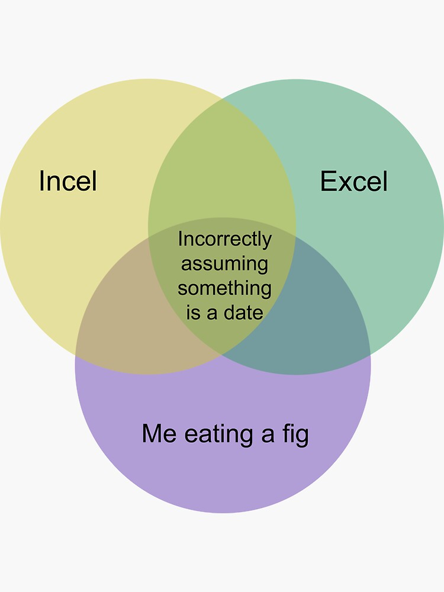
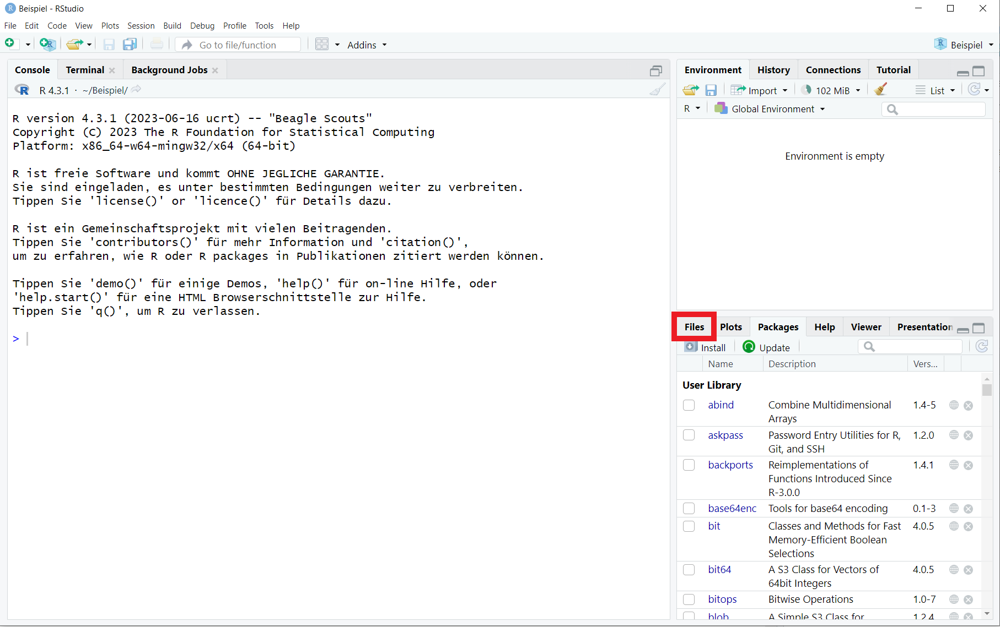

```{r setup, include=FALSE}
library(learnr)
library(haven)
library(car)
library(mice)
library(psych)
knitr::opts_chunk$set(echo = FALSE)

# data
publictr <- rtutorials::publictr

```

## Wissenschaftlicher Prozess

Heute gehen wir einmal *full circle* - den kompletten Wissenschaftlichen Prozess entlag. 
Dabei erhälst du einen Überblick der wichtigesten Funktionen für jeden Schritt, 
so dass du auch selbstständig deine Forschung mit *R* bewerkstelligen kannst.
{width="85%"}

Um es einfach zu halten, sind im Fließtext nur die groben
Orientierungspunkte, weitere Infos gibt es in den ausklappbaren Menüs.

::: gelb
Da wir euch quantitative Verfahren beibringen, bezieht sich die Roadmap
speziell auf quantitative Verfahren. Solltet ihr qualitativ Forschen
wollen, ändern sich die Schritte inhaltlich und ggf. auch deren Abfolge
teilweise.
:::

## I) Vorarbeit

Ja, ein Großteil des wissenschaftlichen Arbeitens geschieht vor dem, was
wir uns darunter Vorstellen: Die folgenden Punkte geben dir dafür einen 
kleinen Überblick:

**1. Einarbeiten**

Jede gute (wissenschaftliche) Arbeit braucht eine gute Vorarbeit: Ein
Einlesen in die Matrie, sich mit dem Feld vertraut und neue Gedanken
machen: was gibt es schon? was braucht es noch? Was kann/ möchte ich
beitragen? Das geschiet meist in Form einer Literaturanalyse.

**2. Fragestellung**

Wenn mensch einen guten Überblick über das interessierende
Forschungsfeld hat wird im nächsten Schritt eine konkrete Fragestellung
entwickelt: *Was möchte ich untersuchen?*

**3. Operationalisierung der Variablen**

Und WIE genau möchte bzw. kann ich das untersuchen?\
Ganz konkret: *Wie kann ich das, was mich interessiert, in Zahlen oder
Kategorien bringen?*

**4. Konkrete, testbare Hypothesen aufstellen**

Du fragst dich: *Welchen Sachverhalt/Effekt möchte ich untersuchen?* Du formulierst 
für deine Forschungsfrage eine Null(H0)- und Alternativhypothese(H1):

H0: Der Sachverhalt den ich unteruschen möchte existiert nicht
H1: Der Sachverhalt existiert. (eventuell auch bereits die Richtung des Effekts, 
wenn aus der Literatur bekannt)

**(5. Ethikantrag & Datenschutzerklärung)**

Wenn du als Forschungsgegenstand mit Menschen zu tun hast solltest du vorher 
abklären ob du einen Ethikantrag bei der Ethikkommission deiner Universität oder 
auch eine Datenschutzerklärung mit der Datenschutzbeauftragten Person.  

**(6. Präregistrierung)**

Es ist gute wissenschaftliche Praxis deine Studie vor der Durchführung auf einem 
*open science portal* wie dem Open Science Framework (OSF) für eine Präregistrierung
anzumelden. Mehr dazu erfährst du [hier](https://www.cos.io/initiatives/prereg).

## II) Messen / Generieren von Daten


**1. Erhebung**

Der Teil, bei dem euch auf dem Campus Süßigkeiten für Studienteilnahmen
angeboten werden (als teilnehmende Person).\
Für die Forschenden Personen ist dieses der Teil, in dem sie Umfragen
durchführen, Einheiten (bspw. Fahrräder am Campus) zählen oder messen,
wie lange eine Person für eine bestimmten braucht. 


**2. Digitalisieren**

Hast du die Daten analog gesammelt (Umfrage, Zählungen auswerten, etc.), 
müssen diese erstmal in eine für den Computer lesbare Form gebracht werden: 
Sie werden digitalisiert!\
Es gibt Möglichkeiten, sie direkt in *R* zu schreiben, das bringt aber
wenig Spaß. Die eleganteste Version ist, sie in Excel oder Open Office
in eine Tabelle zu schreiben und diese dann zu importieren.

<details>

<summary><a>▼ \* Hilfreiche Aspekte vor der Digitalisierung
</a></summary>

::: infobox
Damit *R* später gut mit den Daten umgehen kann und keine Fehler oder
fehlenden Werte liest, ist es ratsam, auf ein paar zentrale Punkte zu
achten:

1.  **tidy data**: Du sparst dir jede Menge mühe, wenn du die folgenden 
Prinzipien beachtest:

- Jede Spalte ist eine Variable, 
- jede Zeile eine Beobachtungseinheit, 
- jede Zelle ein Wert!

2.  **Datenformatierung**: Stelle sicher, dass die Daten korrekt
    formatiert sind. Dies bedeutet, dass numerische Werte als Zahlen zu
    formatieren (achte auch auf Dezimaltrennzeichen), Datumsangaben als
    Datumswerte usw. Bleibe dabei so grundlegend wie möglich und
    vermeide spezielle Zeichen oder Formatierungen, die zu Problemen
    führen könnten.
    
3.  **Spaltenüberschriften**: Verwende klare, kurze (am besten 1 Wort)
    und aussagekräftige Spaltenüberschriften. Diese werden als
    *Variable-Namen* verwendet, wenn die Daten in R eingelesen werden.
    Vermeide dabei Sonderzeichen, Leerzeichen und andere Zeichen, die in
    R nicht als gültige Variablennamen verwendet werden können. Wenn du
    die Datei als CSV (s.u.) speichern möchtest (du möchtest sie als CSV
    speichern!), achte darauf, dass die Spaltenüberschriften in der 1.
    Zeile sind und NUR in der ersten Zeile.´
    
4.  **Leere Zellen und fehlende Werte**: Beachte, wie du leere Zellen
    und fehlende Werte behandeln möchtest. In R werden fehlende Werte
    oft mit "`NA`" repräsentiert. Achte darauf, *konsistent* mit
    fehlenden Werten umzugehen, um spätere Analysen nicht zu
    beeinträchtigen.
    
5.  **Textkodierung**: Wenn die Daten Text enthalten (z.B. bei
    kategorischen Variablen), achte darauf, die richtige Textkodierung
    zu verwenden. `UTF-8` ist eine gängige Textkodierung, die sowohl in
    *Excel* als auch in *R* unterstützt wird. 

6.  **Speicherort**: Merke dir den den Speicherort der Datei, in der du
    die Daten gespeichert hast. Du benötigen diesen Pfad, um die Daten
    in R einzulesen. Noch besser: lege in deinem R-Projekt einen Ordner
    namens "`data`" an. Dort kannst du alle Datensätze für das Projekt
    speichern und dann ist der Pfad zu den daten immer
    `"data\datensatz.csv"`
    
7. **Datumsformate**: Stelle sicher, dass Datumsangaben im richtigen
    Format erfasst werden. In Excel könnten Datumsangaben je nach Region
    unterschiedlich formatiert sein (z. B. `MM/DD/YYYY` oder
    `DD.MM.YYYY`). 

{width="25%" style="display:block; margin:auto;"}
:::

</details>

### 2. Datenimport

Als nächstes liest du deine Daten in *R* ein. Jetzt kommt es darauf an, in welcher
Form diese Daten vorliegen, dementsprechend brauchen wir verschiedene Funktionen:

1.  CSV: `daten <- read.csv("data/datensatz.csv")`
2. Ecxel: `daten <- openxlsx::read.xlsx("data/datensatz.xlsx)`

Beachte das für manche Funktionen zuerst das entsprechende Paket (vor dem `::`) 
installiert werden muss (`install.packages("openxlsx")`).

<details>

<summary><a>▼ \* Was macht der Code? </a></summary>
::: gelb
-   `data`: Zuerst erstellen wir ein Objekt, dass wir in diesem Fall
    `data` nennen. Bis jetzt ist es wie eine leere Box.
-   `<-`: Dann sagen wir *R*, das es was in die Box tun soll. Das ist eine
    sehr einfache Funktion.
-   `load()`: Auch das ist eine Funktion, es läd einen `rda` Datensatz.
-   `"data/publictr.rda"`: Der Datensatz (`"publictr.rda"`) und wo er
    liegt (`"data/"`)

Also nochmal in langsam und zum mitschreiben. Wir sagen zu *R*: Gehe bitte
diesen Weg (`"data/"`) und nimm diesen spezifischen, dort gespeicherten
Datensatz (`"publictr.rda"`) und lade ihn ein (`load()`). Dann speichere
ihn im Arbeitsspeicher (`<-`) unter diesem Namen (`data`).
:::
</details>

</br>

<details>

<summary><a>▼ \* Daten über die grafische Oberfläche einlesen </a></summary>
::: gelb
1) Steuere wieder das Fenster unten rechts in der R Studio Oberfläche an.
{width="100%"}


2) Navigiere dort zum Reiter "Files", falls dieser nicht schon ausgewählt ist.
{width="100%"}

3) Wähle dort die Datei in deinem `working directory` aus, die du in R importieren 
möchtest (hier CSV) und klicke auf "Import Dataset".
{width="50%"}


{width="40%"}
4) Ein Fenster öffnet sich in dem du eine Vorschau der Daten siehtst. 
- Unten bei "Import Options" kannst du die Einstellungen ändern, 
- Rechts (*blau*) kannst du den Code zum Import mit diesen Einstellungen in die 
Zwischenablage speichern 
- und ganz unten rechts (*rot*) den Import durchführen.

{width="100%"}

5) Nutze die Zwischenablage, um diesen Code deinem Skript zuzufügen, damit du 
diese Schritte für das nächste Öffnen deines Datenasatzes nicht mehr benötigst.
:::
</details>

Ausführliche Anleitungen findest du im Tutorial `3a_import`.

### 3. Datenaufbereitung / Cleaning

Jetzt kommt der Teil, der meistens lange dauert, in der Lehre häufig
übersprungen wird: Die Daten müssen aufbereitet werden. Wer sich hier Zeit lässt
und sauber arbeitet, hat später keine oder zumindest kaum Probleme bei
der Analyse. Wenn dieser wichtige Schritt abgeschlossen ist, kann der
Spaß losgehen.

Um einen Eindruck zu bekommen, wie sowas aussehen kann, kannst du dir
das
[Skript](https://github.com/statistik-lehre/rtutorials/blob/main/data-raw/publictr.R)
ansehen, in dem der `publictr` Datensatz aufgeräumt wird.

Wichtig für dich **Check your Data**:

*Gibt es Ausreißer in deinen Daten?* 
<details>
<summary><a>▼ \* Bei Verdacht auf Ausreißern: </a></summary>
::: gelb
Gründe für Ausreißer:

-   Mess- oder ggf. Tippfehler
-   echter Ausreißer (Daten gehören nicht zur Population)

Ein Beispiel: Im Falle eines Fragebogens kann es z.B.
passieren, dass die Probanden eine Frage falsch verstanden haben. Wird
nach dem Geburtsjahr gefragt und du hast einige Antworten die
offensichtilich die Anzahl an Jahren sind (z.B: `61`) handelt es sich um
einen *Mess- bzw. Tippfehler*. Ist die Antwort hingegen `3050` können wir auch
davon ausgehen, dass der *Wert nicht zu unserer Population* gehört, da dies als 
Geburtsjahr nicht möglich ist. Haben wir als Antwort jedoch den Wert `1920` ist 
dies zwar ein extremer Wert, aber möglich wäre es durchaus.

Mehr und ausführlichere Infos zum Thema Ausreißer und Methoden wie du damit
verfahren solltest findest du 
[hier.](https://statistikguru.de/r/ungepaarter-t-test-r/umgang-mit-ausreissern-2.html)

Eine der Methoden (Ausschluss von Ausreißern, die weiter als der 1.5fache *IQR* von 50% unserer
Daten entfernt liegt) würdest du wie folgt umsetzen:

```{r ausreisser1, exercise = TRUE, exercise.cap = "Ausreißer beseitigen"}
# zuerst berechnen wir die Grenzwerte Q1 & Q3, sowie die Länge der IQR
Q1 <- quantile(einkaufen$weg, .25, na.rm=T)
Q3 <- quantile(einkaufen$weg, .75, na.rm=T)
IQR <- IQR(einkaufen$weg, na.rm=T)

# dann können wir diese benutzen, um ein Subset aus einkaufen zu filtern, bei dem diese Werte ausgeschlossen werden
no_outliers <- einkaufen |> 
  filter(weg > (Q1 - 1.5*IQR) & weg < (Q3 + 1.5*IQR))

# mit `nrow` können wir feststellen, wie viele Zeilen von einkaufen in no_outliers rausgefiltert wurden 
nrow(einkaufen) - nrow(no_outliers)
```
:::
</details>

</br>


*Gibt es Beobachtungen mit vielen NA Einträgen?*
<details>
<summary><a>▼ \* Bei großen Mengen an NAs im Datensatz </a></summary>
::: gelb
**NAs ausschließen**

Besonders in Fragebögen kommt es oftmals dazu, dass Personen den
Fragebogen nach einer bestimmten Zeit abbrechen und somit viele `NA`s in unserem 
Datensatz entstehen. Da diese Fälle für eine Analyse meist unbrauchbar sind, 
gibt es auch hier eine Möglichkeit unseren Datensatz davon zu "reinigen".

```{r narm, exercise = TRUE}
# nur rows mit weniger oder genau 50% NA Werten werden beibehalten
einkaufen[rowMeans(is.na(einkaufen)) <= .5,]
```

Doch auch hier ist Vorsicht geboten. Der Schwellenwert (hier 50%) sollte im 
Vorhinein gut überlegt sein und der **Auschluss der Daten gut dokumentiert 
und berichtet** werden!
:::
</details>
</br>


*Sind deine Daten im richtigen Format vorhanden?* 

Das Paket `dyplr` aus dem `Tidyverse` hat einige nützliche Funktionen dafür:

-   `rename()` lässt dich deine Variablen umbenennen.
-   `select()` ermöglicht es dir, Variablen anhand ihrer Namen
    auszuwählen.
-   `filter()`, um Fälle basierend auf ihren Werten auszuwählen.
-   `summarise()`, fasst mehrere Werte zu einer einzigen Zusammenfassung
    zusammen.
-   `arrange()`, um die Reihenfolge der Zeilen zu ändern.
-   `group_by()`, um Funktionen gruppenweise durchzuführen.

Ausführliche Anleitungen findest du im Tutorial `4d_datawrangling`.

## IV) Orientierung in den Daten

Jetzt, wo du deine Daten in *R* eingelesen und aufgeräumt hast,
wollen wir uns einen Eindruck verschaffen: Was haben wir da eigentlich
erhoben?

**1. Numerische Orientierung**

**a) kompletter Datensatz**

::: gelb
Nützliche Befehle, um sich einen Überblick über den Datensatz zu verschaffen:

    
| Funktion               | Beschreibung                                                                      |
|------------------------|-----------------------------------------------------------------------------------|
| `data`                 | Zeigt den Datensatz in der Konsole. Bietet eine Übersicht über den gesamten Datensatz, kann jedoch unübersichtlich werden.            |
| `view(data)`           | Öffnet den kompletten Datensatz als klassische Tabelle in einem neuen Tab im Skript-Fenster. Gut geeignet, um den Datensatz detailliert zu erkunden.  |
| `head(data)`           | Zeigt die ersten paar Zeilen des Datensatzes an. Nützlich, um einen schnellen Überblick zu erhalten.                                     |
| `car::some(data)`      | Zeigt einige zufällige Zeilen des Datensatzes. Hilfreich, um eine Stichprobe der Daten anzuzeigen.                                        |
| `names(data)`          | Gibt die Variablennamen des Datensatzes zurück.                                                                                            |
| `ncol(data)`           | Gibt die Anzahl der Spalten (Variablen) im Datensatz an.                                                                                     |
| `nrow(data)`           | Gibt die Anzahl der Zeilen (Beobachtungseinheiten) im Datensatz an.                                                                         |
:::

</br>

**b) Einzelne Variablen**

::: gelb
Aber auch inhaltlich interessieren uns die einzelnen
Variablen.

Viele der unten aufgeführten Funktionen funktionieren nur, wenn keine
Daten fehlen. Wenn du dich bereits mit den fehlenden Werten auseinandergesetzt
hast oder du nur einen ersten Eindruck bekommen wollt, kannst du in vielen
der jeweiligen Funktionen das Argument `na.rm = T` setzen (`na` = NA/ not
available; `rm` = remove; `T` = TRUE/ ja, genau das will ich). Das könnte
dann so aussehen: `mean(data$variable, na.rm = T)`.


| Funktion                       | Beschreibung                                                                                               |
|--------------------------------|-----------------------------------------------------------------------------------------------------------|
| `sum(is.na(data$variable))`    | Zählt, wie viele fehlende Werte in einer bestimmten Variable vorhanden sind.                                 |
| `sum(is.na(data))`             | Zählt, wie viele fehlende Werte im gesamten Datensatz vorhanden sind.                                        |
| `mean(data$variable)`          | Berechnet den Mittelwert (Durchschnitt) einer bestimmten Variable.                                           |
| `sd(data$variable)`            | Berechnet die Standardabweichung einer Variable.                                                           |
| `range(data$variable)`         | Ermittelt die Spannweite (Differenz zwischen Maximum und Minimum) einer Variable.                           |
| `min(data$variable)`           | Gibt den kleinsten Wert in einer Variable an.                                                               |
| `max(data$variable)`           | Gibt den größten Wert in einer Variable an.                                                                |
| `table(data$variable)`         | Zeigt alle eindeutigen Werte in einer Variable und ihre absolute Häufigkeit an. Besonders nützlich für nominale oder ordinal skalierte Daten. |
| `psych::describe(data)`        | Wendet viele der oben genannten Funktionen auf den gesamten Datensatz an und bietet eine umfassende Übersicht.                                           |
| `summary(data)`                | Ähnlich wie `describe()`, zeigt jedoch zusätzlich fehlende Werte und einige andere Verteilungsparameter wie Schiefe und Kurtosis.                        |
| `class(data$variable)`         | Gibt die Klasse oder den Datentyp einer bestimmten Variable an.                                                |
| `typeof(data$variable)`        | Gibt den internen Datentyp einer Variable an.                                                                |

:::

</br>

**2. Grafische Orientierung**

Die Breitbandverbindung in unser Gehirn sind und bleiben unsere Augen.
Deswegen ist an diesem Punkt des Prozesses eine grafische
Auseinandersetzung mit den Daten zwar nicht notwendig, aber doch sinnvoll. 
Dafür kannst du die simplen Standardfunktionen von R verwenden oder auch ein ggplot
erstellen.

**Base R Funktionen:**

| Code                   | Beschreibung       |
|------------------------|--------------------|
| `bar()`                | Balkendiagramm     |
| `hist()`               | Histogramm         |
| `boxplot()`            | Boxplot            |
| `plot()`               | Punktdiagramm      |
| `plot()`               | Linienplot         |

Beachte `plot()` reagiert dabei spezifisch auf das, was du als Argument eingibst. 
Es ist auch in der Lage Vorannahmen für dein Modell zu visualisieren, wenn du 
entsprechend das Modell als Input verwendest. Ziemlich beeindruckend.

**GGplot:**

| Code                                         | Beschreibung                                          |
|------------------------|-----------------------------------------------|
| `ggplot()`                                   | Erstellt die Grundebene für einen Plot                |
| `geom_bar()`                                 | Balkendiagramm                                        |
| `geom_histogram()`                           | Histogramm                                            |
| `geom_boxplot()`                             | Boxplot                                               |
| `geom_point()`                               | Punktdiagramm                                         |
| `geom_line()`                                | Linienplot                                            |
| `aes(x, y, color, fill, shape, size, alpha)` | Ästhetisches Mapping von Variablen                    |
| `facet_grid()` und `facet_wrap()`            | Aufteilung von Diagrammen in Raster                   |
| `labs(title, subtitle, x, y, caption)`       | Anpassung von Diagrammtiteln und Achsenbeschriftungen |
| `scale_color_viridis()`                      | Anpassung der Farbskala mit Viridis-Farben            |


### 3. Voraussetzungen prüfen (bisschen langweilig & absolut unerlässlich)

Alle Statistiken, die wir später berechnen wollen haben spezifische Voraussetzungen, 
die deine Daten erfüllen müssen. Diese lassen sich selbstverständlich auch statistisch testen.

| Funktion                     | Nutzen/Beschreibung |
|------------------------------|---------------------|
| `boxplot(variable1)`         | Erstellt ein Boxplot zur Überprüfung der Variable auf **Ausreißer**.|
| `hist(variable)`             | Erzeugt ein Histogramm, das zur Überprüfung der **Normalverteilung einer Variable** genutzt wird. |
| `shapiro.test(variable1)`    | Führt den Shapiro-Wilk-Test zur Überprüfung der **Normalverteilung der Variablen** durch. |
| `car::leveneTest()`          | Durchführung des Levene-Tests zur Überprüfung der **Varianzhomogenität** |
| `plot(variable1, variable2)` | Erstellt ein Streudiagramm zur Überprüfung der **Linearität** und der Beziehung zwischen zwei Variablen. |
| `qqnorm(residuen); qqline(residuen, col="red")` | Erstellt einen **Q-Q-Plot** zur Überprüfung der Normalverteilung von Residuen in einem Regressionsmodell. |
| `plot(model, which = 2)`     | Erzeugt einen **Q-Q-Plot** der Residuen zur Überprüfung der Normalverteilung in einem Regressionsmodell. |
| `var.test(variable1, variable2)` | Führt einen F-Test auf Gleichheit der Varianzen durch, nützlich zur Überprüfung der **Varianzhomogenität**, beispielsweise vor einem T-Test. |
| `plot(model, which = 1)`     | Zeigt einen Plot der Residuen gegen die gefitteten Werte, nützlich zur Überprüfung der **Homoskedastizität.** |
| `lmtest::bptest(model)`      | Führt den Breusch-Pagan-Test zur Überprüfung der **Homoskedastizität** der Residuen in einem Regressionsmodell durch. |
| `car::durbinWatsonTest(model)` | Verwendet den Durbin-Watson-Test zur Überprüfung der **Autokorrelation** der Residuen in einem Regressionsmodell. |
| `shapiro.test(resid(model))` | Führt den Shapiro-Wilk-Test zur Überprüfung der **Normalverteilung der Residuen** in einem Regressionsmodell durch. |


## V) Auswertung / Statistik

Hier kommt das Herzstück. Die Analyse, auf die du dich später beziehen wirst.

Um einen Überblick der möglichen statistischen Analysen zu bekommen kannst du dich 
durch diesen Entscheidungsbaum klicken.

@Lukas - wie war nochmal die Internetseite?

Für einen **$t$-Test** sind folgende Funktionen relevant:

+--------------------+-----------------------------------------------------------------+
| Funktion in R      | Beschreibung                                                    |
+====================+=================================================================+
| `t.test()`         | Durchführung eines *t*-Tests, einschließlich aller Varianten    |
+--------------------+-----------------------------------------------------------------+

**Korrelation:**

+---------------------------------------------+-----------------------------------------------------------------+
| Funktion in R                               | Beschreibung                                                    |
+=============================================+=================================================================+
| `correlation::correlation()`                | zur Berchenung von Korrelationen                                |
+---------------------------------------------+-----------------------------------------------------------------+
| `GGally::ggscatmat(data, colums = "x","y")` | Erstellt eine Zusammenhangsvisualisierung für metrische Daten   |
+---------------------------------------------+-----------------------------------------------------------------+

**Regression:**

+---------------------------------------------+-------------------------------------------------------------------------------------------------------------------------------------+
| Funktion in R                               | Beschreibung                                                                                                                        |
+=============================================+=====================================================================================================================================+
| `lm(outcome ~ predictor, data)`             | Berechnet ein lineares Regressionsmodell.                                                                                           |
| `summary(model)`                            | Gibt eine detaillierte Zusammenfassung des Regressionsmodells aus, einschließlich Koeffizienten, Signifikanzniveaus und Modellgüte. |
+---------------------------------------------+-------------------------------------------------------------------------------------------------------------------------------------+

Und zur Berechnung der **Effektstärke**:

+---------------------------------------------+-----------------------------------------------------------------+
| Funktion in R                               | Beschreibung                                                    |
+=============================================+=================================================================+
| `effectsize::cohens_d()`                    | Berechnung der **Effektstärke** (Cohens *d*).                   |
+---------------------------------------------+-----------------------------------------------------------------+

## VI) Schöne Visualisierungen

Erstelle ansprechende und übersichtliche Grafiken, um deine Ergebnisse zu 
visualisieren, die kommen später auch ins Paper.

Siehe hierfür das [ggplot Cheat Sheet](https://rstudio.github.io/cheatsheets/data-visualization.pdf) 
sowie die [R Graph Gallery](https://r-graph-gallery.com/), um deine eigenen 
Plots zu erstellen.🚀 Möchtest du die Grundlagen zuvor erst wiederholen
klicke dich durch das Tutorial `4b_vis`.

## VII) Report

Jetzt will das ganze noch in eine schöne Form gebracht werden. Hier werden die 
Forschungsergebnisse dokumentiert und ein Bericht je nach Anforderungen 
(Paper, Bachelorarbeit, Studienleistung etc. erstellt). 


## Credit

Dieses Tutorial wurde von Gesa Graf, Lukas Bruelheide sowie Marie Klosterkamp geschrieben. 

