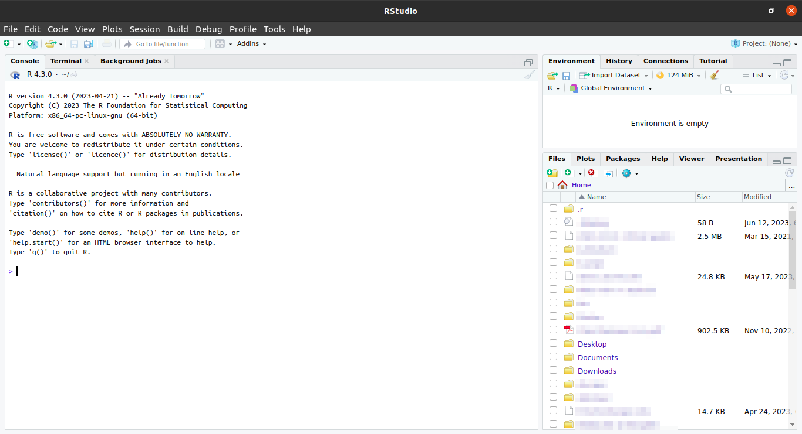
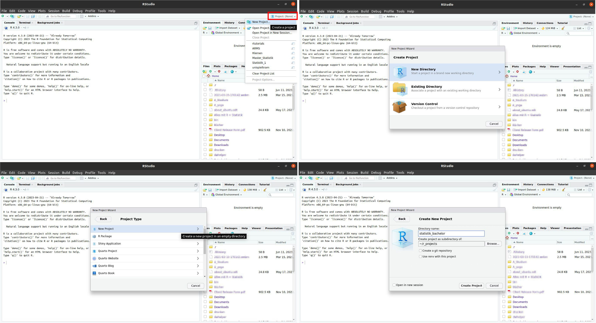
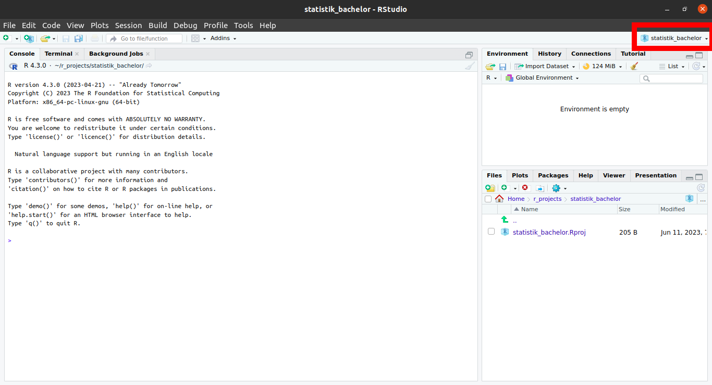
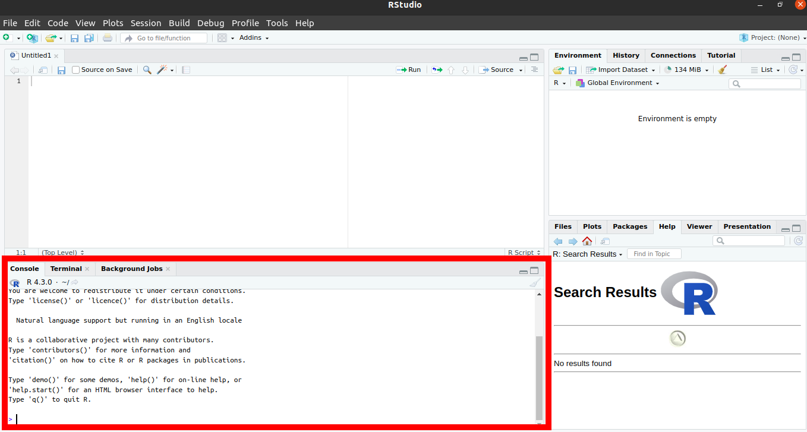
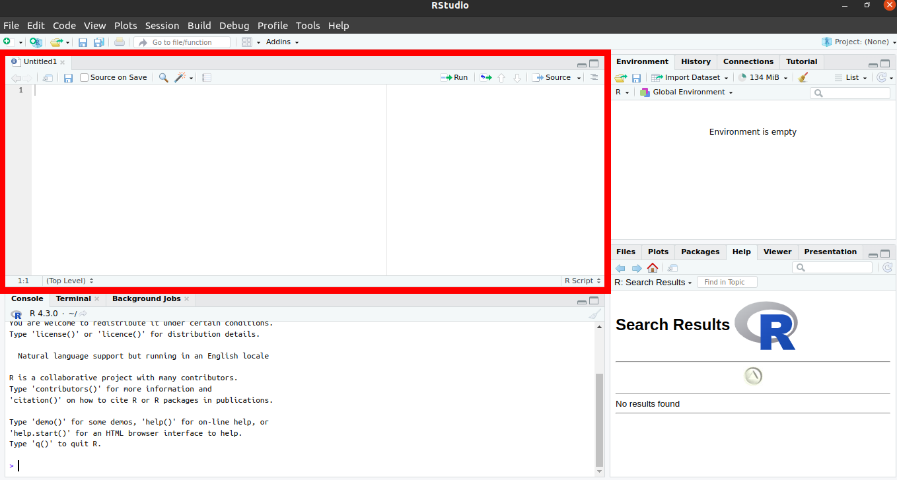
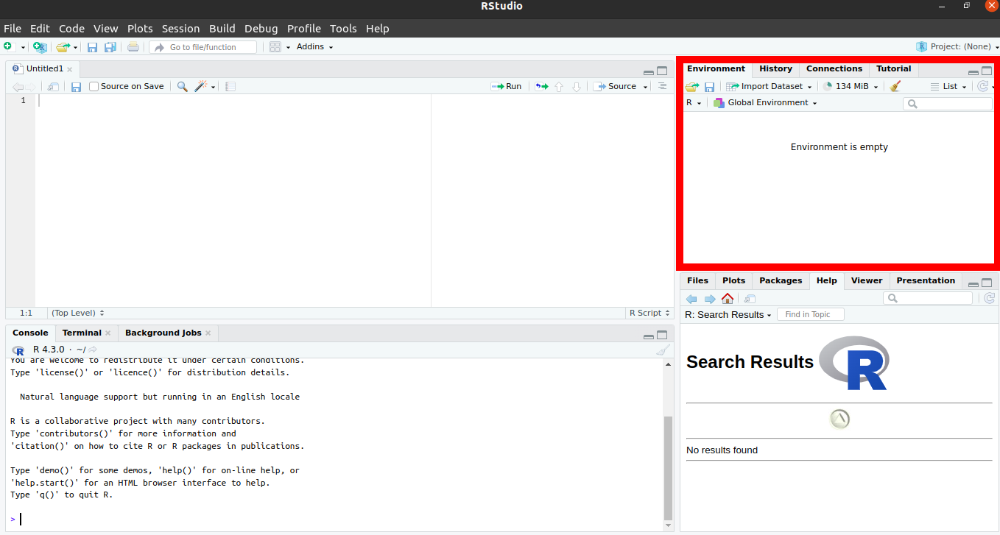
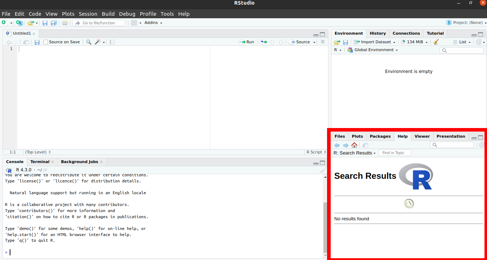

```{r setup, include=FALSE}
library(learnr)
knitr::opts_chunk$set(echo = FALSE)
```

## Lernziele

-   <input type="checkbox" unchecked> bereits geleistetes feiern </input>
-   <input type="checkbox" unchecked> Überbblick über den Aufbau dieses Kurses </input>
-   <input type="checkbox" unchecked> Überbblick über R Tutorials </input>
-   <input type="checkbox" unchecked> Überblick über R und R Studio bekommen </input>

## Inhalt

### Herzlich Wilkommen

Moin!

Wunderbar, dass Du hierher gefunden hast! Das bedeutet, dass Du die Anfangsschwierigkeiten bereits hervorragend gemeistert hast:

-   <input type="checkbox" checked> R installieren </input>
-   <input type="checkbox" checked> R Studio installieren </input>
-   <input type="checkbox" checked> R Studio öffnen </input>
-   <input type="checkbox" checked> wichtige Pakete installieren </input>
-   <input type="checkbox" checked> dieses Tutorial finden UND öffnen </input>


### Aufbau dieses Kurses

Wir freuen uns total, euch R in diesem Format beibringen zu können, da wir es für einen übersichtlichen und eleganten Weg halten. Ihr könnt in eurem Tempo lernen und die Inhalte sind auch als stand-alone für euch später zum nachschauen und auch für andere Menschen nutzbar.

Wir haben uns folgendes Format überlegt:\
Zu jeder Vorlesung gibt es eins oder mehrere kurze Tutorials, die wir euch im Moodle verlinken. Diese arbeitet Ihr in eurem Tempo im Laufe der folgenden Woche Durch. Alle zwei Wochen gibt es eine Abgabe im Moodle, in der ihr das bereits gelernte der letzten zwei Wochen anwenden könnt. Wenn Du 50% der Aufgaben richtig hast, gilt die Abgabe als bestanden. Es gibt eine Joker-Übung, falls es dir mal gar nicht in den Kram passt oder Du bei einer Übung weniger als 50% schaffen solltest.

Mehr zu den konkreten Anforderungen schreiben wir euch ins Moodle bei der jeweiligen Abgabe.

Die Tutorials sind alle gleich aufgebaut:

-   **Lernziele**: Damit ihr wisst, worauf ihr beim bearbeiten dieses Tutorials besonders achten könnt
-   **Inhalte**: Die eigentlichen Inhalte
-   **Abschlussquiz**: Was von dem, was wir wichtig finden ist hängen geblieben?
-   **Leranings**: Knappe Zusammenfassung des Kapitels

Innerhalb der Tutorials wird es interaktive Code-Blöcke geben. So könnt ihr mit neu gelernten Konzepten direkt experimentieren.

Schreib Deinen Code hinein und führe ihn aus mit `Strg + Enter` oder dem Knopf `▶ Code ausführen`.\
Es gibt zu jeder Aufgabe auch Tipps oder Lösungen. Klicke dafür auf den Button 💡`Tipp` oder `Lösung`.

::: aufgabe
**Aufgabe:**\
Ändere die Rechnung in 2 + 3
:::

```{r template, exercise = TRUE}
1 + 1
```

```{r template-solution}
2 + 3
```

Die meisten Aufgaben in diesem Kurs sind direkt im jeweiligen Tutorial in den entsprechenden Code-Chunks zu lösen. Du findest sie in den **<span style="color: #957dad;">fliederfarbenen Kästen</span>** (s.o.).

Es wird auch einige wenige Aufgaben geben, für die Du bitte in R wechselst. Diese Aufgaben findest Du in den **<span style="color: #95AD7D;">hellgrünen Kästen</span>** (s.u.).

### R Tutorials

Da Du dieses Tutorial schon gefunden hast, brauche ich gar nicht mehr so viel zu erklären:

Wir schreiben jede Woche die Befehle zu den jeweiligen Tutorials ins Moodle. Diese kannst Du einfach Zeile für Zeile in Deine Konsole kopieren (s.u.) und Durcharbeiten.

Alternativ gibt es in R Studio, im Fenster oben rechts, ganz rechts einen Reiter der "Tutotial" heißt. Hier kannst Du dich Durchscrollen bis zu rtutorials:<name des tutorials>. Eine Liste aller Tutorials findest Du HIER

Nun kommen wir zur Magie


### R

R ist im Grunde ein sehr potenter Taschenrechner, der große Mengen an Daten verarbeiten und simulieren kann, schöne Grafiken und sogar diese Tutorials erstellen kann. Über das, was Dein Schultaschenrechner kann (selbst wenn es einer von denen mit grafischer Funktion ist), kann R also nur müde lächeln. Und hier, im echten Leben, haben wir es eben mit großen Datenmengen zu tun.

Das Problem: R ist von Nerds für Nerds geschrieben, läuft ganz unauffällig in der Konsohle und sieht in seiner roh-Fassung ungefähr so aus:


Und das wird spätestens wenn Dein Bildschirm voll ist unübersichtlich.

Und hier kommt R Studio ins Spiel. R Studio ist für die Menschen, die gerne die Power von R nutzen möchten und ihre Programme gerne mit grafischer Oberfläche arbeiten. Wir werden nur in R Studio arbeiten.

### R Studio

Wenn Du R-Studio öffnest sieht das ungefähr so aus:



Das sieht erstmal viel und unübersichtlich aus. Aber wir brauchen (erstmal) nur einen ganz kleinen Teil davon. Und den erkläre ich dir jetzt Schritt für Schritt.


#### Einmalig am Anfang: Projekte

In R gibt es die Möglichkeit, `Projekte` zu erstellen. Das ist dann (wie) ein Ordner, in dem Du alles, was Du für dieses Prjekt benötigst (Daten, Skripte, Plots, Tabellen, Bilder etc. [unten mehr dazu]) speichern und sammeln kannst.

Im Unialltag empfinde ich es als sehr hilfreich, für jedes entsprechende Modul ein eigenes Projekt anzulegen (also: Statistik im Bachelor, Statistik im Master, Vertiefte Statistik im Master etc.). Solltest Du in die Forschung gehen wollen oder bereits Forschungsprojekte im Studium umsetzen empfiehlt es sich, auch hierfür jeweils eigene Projekte anzulegen. Wichtig ist dann, dass du schaust, immer im richtigen Projekt zu arbeiten.

Ein Projekt erstellst du: Project: (None) > New Project... > New Directory > New Project > *Directory name:* > Create Project



::: aufgaberstudio
**Aufgabe:**\
Erstellen in R Studio ein Projekt mit dem Namen `statistik_bachelor`
:::

Wenn du erfolgreich warst steht nun ganz oben rechts Dein Projektname:




#### (Fast) immer am Anfang: Skripte

Glückwunsch, Du hast nun ein Projekt eingerichtet. (Sicherheitscheck: steht oben rechts `statistik_bachelor`?)

Jetzt brauchen wir nur noch ein `Skript`.

Das öffnest Du: oben, ganz links (New File) > R Skript


Skripte sind wie einzelne Blätter/ Unterlagen in einer Sammelmappe (= "Projekt").

So, jetzt ist alles da, was wir für die nächsten Schritte brauchen. Und nun erkläre ich Dir erstmal, was du da im Einzelnen siehst. (Und ich beschränke mich dabei auf die Aspekte, die Du in nächster Zeit brauchen wirst.)

#### Konsole

**Unten links** findest Du die `Konsole`:



Dieses Fenster entspricht der Konsole / Terminal beim Rechner (so.). Dies ist der "Taschenrechner", hier findet das *Rechnen* statt.

::: aufgaberstudio
**Aufgabe:**\
Gib in deiner Konsole verschiedene Rechnungen ein (Addition, Subtraktion etc.) und drücke auf `Enter`. Mache dich auf diese Art mit der Funktionsweise und Optik der Konsole vertraut.
:::

::: infobox
**Sytax-basics:**\

-   Das Dezimaltrennzeichen ist ein Punkt `.`
-   Für Aufzählungen (von Argumenten, anderes Tutorial) wird ein Komma `,` genutzt

:::

#### Datein

**Oben links** findest Du Deine `Dateien` / `Files` / `Skripte`:



Diese Dateien sind schlichte Textdatein - wie ein Open Office oder Word Dokument. Hier passiert erstmal nichts. Erst wenn Du auf `Strg + Enter` drückst wird die Zeile für dich in die Konsole kopiert, hier ausgeführt und das Ergebnis angezeigt.

Diese Aufteilung ist total sinnvoll, da sie es ermöglicht, in der Textdatei oben die Übersicht zu behalten. Du kannst hier àuch Kommentare einfügen. So kannst Du auch später noch nachvollziehen, was Du wann in welchem Schritt gemacht hast. Zeitgleich können unten in der Konsole die Berechnungen stattfinden. Im Gegensatz zur reinen Konsole lässt sich die Textdatei speichern und es bleibt nachvollziehbar und für weitere Arbeitsschritte nutzbar.

::: aufgaberstudio
**Aufgabe:**\
gib die gleichen Rechenoperationen wie in der Konsole oben in dem Skript ein. Drücke in jeder Zeile `Strg` + `Enter`. Schau dann unten in die Konsole. Mach dich mit den Gleichheiten und Unterschiedlichkeiten vertraut, die Skript und Konsole haben.
:::

Da du das Skript speicherst, es also später wieder öfnnen und weiternutzen und daran sogar mit anderen teilen / co-worken kannst, empfiehlt es sich sehr (**!!!**), auf einen *guten Stil* (s.u.) zu achten und deine Arbeitsschritte zu *kommentieren*.

::: infobox
**Guter Stil**\
Es gilt als guter Stil:

-   Operatoren wie `+`, `-`, `=` auf beiden Seiten mit Leerzeichen zu umgeben odereswirdanstrengendzulesen.
    -   z.B. `5 + 5`
    
-   Kommata haben gerne, (wie in der gewohnten Schriftsprache) ein Leerzeichen
:::

::: infobox
**Kommentare:**\
-   Für die inhaltliche Verständlichkeit ist es hilfreich, den geschriebenen Code zu kommentieren. Dies geschieht mit einem `#`

    -   z.B. `5 + 5     # Addition`
    -   oder:\
        `# Addition`\
        `5 + 5`
:::

::: aufgaberstudio
**Aufgaben:**\

1.    Gib deinem Dokument einen Titel (`#### Titel ####`)
2.    Kommentiere deine Rechenoperationen (`#`)
3.    Speichere Dein Skript (`Strg` + `s`)
:::

Und ein letztes zu den Skripten und warum sie wunderbar sind: Sie lassen sich inkl. Ergebnisse in `Reports` bringen: Hier sind die Einzelnen Befehle, Kommentare UND Ergebnisse (inkl. Plots) zusammengefasst. Das macht es schön und übersichtlich. Meine Empfehlung ist, wenn ein Skript fertig ist, immer auch einen Report zu kreiern. Da schaust du später lieber rein. Trust me in that.

**ganz oben, ganz links** > File > Compile Report... (> File Name: )> Report output format *MS Word*

::: aufgaberstudio
**Aufgabe:**\
Kompiliere dein Skript.
:::

Das sind dann auch schon die Formate, in denen wir gerne die Studienleistung wollen: Ein Analyseskript `.R` und das gleiche nochmal in kommentiert und kompiliert als `.pdf` oder `.docx`. Das Analyseskript soll durchlaufen. Da geht es um den technischen Aspekt. Wenn es durchläuft schauen wir uns die kommentierte Version an und bewerten den inhaltlichen Aspekt, in dem ihr teilw. Interpretationen vornehmt.\
Extrapunkte gibt es für einen guten Stil in den Skripten und wenn der Code übersichtlich und verständlich kommentiert ist.

#### Skript, Konsole ud diese Tutorials

Dieses Zusammenspiel von Textdatei und Kosole imitieren wir in den oben bereits erwähnten Code-Blöcken:\
Du schreibst etwas in den Block, drückst `Strg` + `Enter` und weiter unten spuckt R dir ein Ergebnis aus. Probier es doch gleich mal aus:

Nutze den `Tipp`-Knopf für Informationen und achte dabei auch auf guten Stil.

::: aufgabe
**Aufgabe:**\
Schreibe / berechne und kommentiere jew. eine:

-   Addition
-   Subtraktion
-   Multiplikation
-   Division
-   Potentierung
-   Quadratwurzel
:::

::: {#first-hint}
**Tipp**\
Die Programmiersprache R kann wie ein Taschenrechner benutzt werden.

-   `*` Multiplikation
-   `/` Division
-   `+` Addition
-   `-` Subtraktion
-   `^` Potention
-   `sqrt()` Quadratwurzel

(... und es gibt noch mehr)

**Kommentare**\
machst Du mit einem `#`. Dann weiß R, das alles dahinterstehende Menschensprache ist

**Syntax**\
Als Dezimaltrennzeichen akzeptiert R nur den Punkt `.`\
:::

```{r first, exercise = TRUE}

```

#### Environment

**Oben rechts** findest Du Deine `Umwelt` bzw. `Objekte`.



Unter dem Reiter **Environment** siehst Du Deine gespeicherten Objekte: Datensätze und Vektorn. Als im Grunde das womit wir arbeiten. Zu Datensätzen gibt es ein eigenes Tutorial.

Den Zusammenhang des bereits vorgestellten kannst Du dir in etwa so vorstellen:

-   **Oben links** (`Skripte`) bestimmst Du eine *Choreografie*. Die steht erstmal nur so auf einem Blatt Papier. Um sie auszuführen brauchst Du:

-   *Tänzer\*innen*: Leute, die das, was Du dir so ausdenkst auch wirklich ausführen. Das sind die `Daten` ("`Objekte`") **oben rechts**. Diese wiederum brauchen zum tanzen einen

-   *Tanzboden*. Diesen Part übernimmt die `Konsole` **unten links**

Der zweite spannende Reiter in diesem Fenster ist **Tutorial**. Hier findest Du unsere und andere Tutorials - auch dieses hier.

#### Viewer

Fehlt nur noch das Fenster **unten rechts**. Ich präsentiere feierlich: Alles was wichtig ist!



Hier sind ziemlich wichtige und hilfreiche Funktionen zusammengefasst, die bisher noch kein anderes zu Hause gefunden haben:

-   Im Reiter `Files` kannst Du nach verschiedenen Dateien suchen und öffnen. Das werden vor allem andere `Skripte` sein. Diese öffnen sich dann im Fenster **oben links**
-   Im Reiter `Plots` werden dir die Grafiken ("`Plots`") angezeigt (späteres Tutorial). Du kannst zwischen den in dieser Sitzung generierten Plots über die Pfeiltasten navigieren
-   Im Reiter `Packages` werden dir Deine installierten Pakete (s.u.) angezeigt. Hier gibt es auch die Möglichkeit, neue zu installieren oder vorhandene zu updaten.
-   Unter `Help` findest Du Erklärungen und Hilfestellungen zu eigentlich jeder Funktion, die Du in R benutzt. Wenn Du zu einer bestimmten Funktion eine Hilfestellung benötigst tippe einfach `?funktion` in die Konsole und drücke `Enter`, schon wird dir die entsprechende Hilfeseite im Viewer angezeigt
-   Im `Viewer`werden bei manchen Funktionen schöne Tabellen und Übersichten ausgegeben.

## Abschlussquiz

## Learnings
