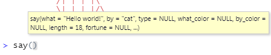

```{r setup, include=FALSE}
library(learnr)
knitr::opts_chunk$set(echo = FALSE)
```

## Was Sie in diesem Tutorial lernen:

-   Pakete installieren und in die aktive Sitzung laden

-   Der typische Aufbau von Funktionen und Argumenten in R

-   Die Benutzung der Hilfe-Seiten

-   Arbeiten im Skript

## Pakete

Pakete können Daten und Funktionen enthalten. Erfahrene R-NutzerInnen veröffentlichen Pakete, um ihre Problemlösungen für andere verfügbar zu machen. 
Alle Menschen können Pakete veröffentlichen, die Daten und Funktionen enthalten. Wir nutzen heute ein solches Paket, um spielerisch den typischen Umgang mit Funktionen in R zu erlernen. 

Zunächst installieren wir das Paket. Es heißt `cowsay` und enthält lediglich eine einzige Funktion, mit der wir lustige Tiere lustige Dinge sagen lassen können. 

#### Ein Paket installieren

Der Befehl zum Installieren lautet:
``` r
install.packages("cowsay")
```

Achten Sie dabei auf die Anführungszeichen um den Paketnamen! 

(Eine der häufigsten Fehlerquellen beim Installieren von Paketen sind vergessene Anführungszeichen).

Um den Code auszuführen, schicken Sie ihn über die Konsole ab.

(Normalerweise das untere linke Fenster in RStudio). 

::: blau-nb
Sie können auch die grafische Benutzeroberfläche von RStudio benutzen - dafür auf den Reiter "Packages" im Fenster unten rechts gehen und über den Install-Knopf den Dialog aufrufen.\
Sie werden sehen, dass auch das grafische Menü Code über die Konsole sendet, um ihn auszuführen.
:::

::: grau-nb
Tipp: Dass eine Funktion fertig ausgeführt ist, erkennen Sie daran, dass das rote Stoppzeichen oben rechts in der Konsole erlischt. 
:::

#### Das Paket nutzen

R lädt zu Beginn einer neuen Sitzung nur eine handvoll essentieller Pakete. Diese automatisch geladenen Pakete werden unter dem Namen "base R" zusammengefasst und enthalten alles, was notwendig ist, damit R funktioniert. 

Alle anderen installierten Pakete sind nicht automatisch aktiv und müssen erst aufgerufen werden, um sie zu verwenden. 

Das tun Sie mit der Funktion `library()`. Damit rufen Sie aus der "Bibliothek" aller installierten Pakete eines auf, um es in die aktive Sitzung zu laden. 

`library()` funktioniert im Gegensatz zu `install.packages()` ohne Anführungszeichen um den Paketnamen. 

Laden Sie das Paket `cowsay` in die aktive Sitzung, um es im nächsten Schritt zu benutzen!

```{r lib, exercise = TRUE}

```

```{r lib-hint}
library(cowsay)
```

Von außen ist nicht erkennbar, ob etwas passiert ist, aber die Abwesenheit einer Fehlermeldung ist ein gutes Zeichen dafür, dass das Paket nun in die aktive Sitzung geladen ist. 

## Funktionen und Argumente

```{r say, message=FALSE, warning=FALSE}
library(cowsay)
```

Hier sehen Sie, was das Paket `cowsay` kann:\
Es stellt die Funktion `say()` zur Verfügung, mit der wir kleine Text-Tiere Sätze sagen lassen können.\
Lassen Sie das Huhn einen anderen Satz sagen, in dem Sie einen anderen Text beim Argument `what` eingeben!

```{r func, exercise = TRUE, exercise.eval = TRUE, exercise.setup = "say"}
say(what = "R is fun!", by = "chicken")
```

#### Was ist ein Argument?

Eine Funktion folgt typischerweise der Form

``` grau-nb
funktion(Argument1 = Wert, Argument2 = Wert, …)

say(what = "R is fun!", by = "chicken")
```

Die Argumente einer Funktion stehen in den Klammern.

Sie spezifizieren, was die Funktion genau tun wird.\
Das erste Argument ist gewöhnlicherweise der Datensatz, mit dem die Funktion etwas tun soll.\
In unserem Fall erwartet es Text als Daten.\
Dass es sich um Text handelt, wird mit den Anführungszeichen `"` signalisiert.\

::: blau-nb
##### Guter Stil

Achten Sie darauf, die `=` mit Leerzeichen zu umgeben, und nach den trennenden Kommata ebenfalls Leerzeichen zu verwenden!
:::

## Die Hilfefunktion

Die brennende Frage im Moment ist: Was gibt es denn noch alles für Tiere außer `chicken`?\
Das erfahren wir über die Hilfeseite der Funktion `say()`.

Alle Funktionen in öffentlichen Paketn müssen auf einer Hilfeseite dokumentiert sein.\
Auf der Hilfeseite werden alle möglichen Argumente aufgelistet, die eine Funktion entgegennehmen kann, und die möglichen Werte dieser Argumente. Also auch das Argument `by` und alle Tiere, die zur Verfügung stehen.

::: blau-nb
Um die Hilfe aufzurufen, gehen Sie mit dem Cursor in den Namen der Funktion (z.B. `say`) und drücken F1. (das funktioniert nicht im interaktiven Codeblock).\
\
Eine andere Option ist, `?say`, oder `help(say)`.\
\


**Tipp für das Lesen der Hilfe:**\
Die Hilfeseiten sind oft eher an Vollständigkeit als Anfängerfreundlichkeit orientiert und versuchen, auf alle Spezialfälle einzugehen, die überhaupt vorkommen können. Deswegen wirkt die Hilfe anfangs unübersichtlich und technisch. 

Versuchen Sie zu lernen, aktiv auszublenden, was Sie nicht verstehen, und sich nur die Informationen herauszukramen, die für Sie Sinn machen.

Hilfeseiten sind immer gleich aufgebaut:\

- Description\
- Usage\
- Arguments\
- Details\
- Examples
:::

```{r rms, exercise = TRUE, exercise.setup = "say", exercise.cap = "Probieren Sie andere Argumente aus!" }

```

```{r rms-hint}
say(what = "catfact", by = "cat")
say(what = "fortune", by = "rms")
```

(Nach dem Lesen der Dokumentation fragen Sie sich vielleicht: wer oder was ist ein `rms`? Antwort [hier](https://de.wikipedia.org/wiki/Richard_Stallman "Richard Matthew Stallman"))

## Default-Werte

```{r default, exercise = TRUE, exercise.setup = "say", exercise.eval = TRUE, exercise.cap = "Default"}
say()
```

`say()` gibt auch ohne jegliche Argumente etwas aus.

Die meisten Funktionen haben Default-Werte für alle Argumente. Das heißt, Argumente, die nicht spezifiziert werden, nehmen ihren Standardwert an.\
Diese Default-Werte finden Sie in den Hilfeseiten unter dem Abschnitt **Usage**, und sie werden Ihnen angezeigt in einem kleinen gelben Kästchen, sobald Sie die Klammer hinter dem Funktionsnamen tippen.



## Reihenfolge der Argumente

``` {.r .grau-nb}
say("Hello!", "chicken")
```

gibt genau das gleiche aus wie

``` {.r .grau-nb}
say(what = "Hello!", by = "chicken")
```

Die Argumentnamen können weggelassen werden, wenn die Argumente in genau der Standardabfolge eingegeben werden, wie Sie auch in den Hilfeseiten angegeben ist.

Ein häufiger Stil ist, das Datenargument (das erste) nicht zu bennenen, weil es einfach so häufig ist, und die anderen Argumente dann zu bennennen.

``` {.r .grau-nb}
say("Hello!", by = "chicken")
```

Verkehrte Reihenfolgen wie

``` {.r .grau-nb}
say(by = "chicken", what = "hello")
```

würden ebenfalls funktionieren, so lange die Argumente benannt sind. Guter Stil ist es allerdings nicht, da es das Lesen von Code anstrengender macht, wenn eine gewohnte Reihenfolge auf einmal durcheinandergebracht wird.

## Eine Geschichte erzählen

Wir möchten einen Dialog erzählen mit verschiedenen Charakteren. Beispielsweise so hier:

```{r dialog, echo=TRUE, eval=FALSE}
say("Hi", by = "egret")
say("Na wie gehts?", by = "chicken")
say("Ganz gut, und dir?", by = "egret")
```

     ----- 
    Hi 
     ------ 
        \   
         \  
          \
           \   _,
          -==<' `
              ) /
             / (_.
            |  ,-,`\
             \\   \ \
              `\,  \ \
               ||\  \`|,
     jgs      _|| `=`-'
             ~~`~`


     ----- 
    Na wie gehts? 
     ------ 
        \   
         \
             _
           _/ }
          `>' \
          `|   \
           |   /'-.     .-.
            \'     ';`--' .'
             \'.    `'-./
              '.`-..-;`
                `;-..'
                _| _|
                /` /` [nosig]
      

     ----- 
    Ganz gut, und dir? 
     ------ 
        \   
         \  
          \
           \   _,
          -==<' `
              ) /
             / (_.
            |  ,-,`\
             \\   \ \
              `\,  \ \
               ||\  \`|,
     jgs      _|| `=`-'
             ~~`~`

Ihre Geschichte weist vielleicht mehr Kreativität auf, aber die Idee ist klar und die Möglichkeiten sehr vielfältig.

Ihnen wird auffallen, dass es sehr unpraktisch ist, drei oder mehr `say()`-Befehle hintereinander in der Konsole einzugeben. Vielleicht merken wir nach dem Ausführen, dass wir nur einen der drei Befehle veränden wollen, damit die Geschichte anders verläuft. Trotzdem müssten wir noch mal die ganze Geschichte neu eingeben.\
\
Die Konsole ist zum Ausführen einzelner Anweisungen gut, aber um eine zusammenhängende Geschichte zu erzählen und auch speichern zu können, eignet sich das **Skript** viel besser.\
Genau wie beim Theater oder Film ist ein Skript ein Drehbuch für R-Code. Es enthält eine Abfolge von Anweisungen, die von oben nach unten gelesen wird.\
Technisch gesehen ist es einfach ein Textdokument mit Befehlen.\
Der einzige Unterschied ist, dass es auf die Endung `.R` endet und nicht auf `.txt`.\
Das signalisiert, dass es sich beim Inhalt um ausführbaren Code handelt.

## Ein neues Skript anlegen

Legen Sie ein neues Skript an, um Ihre eigene Geschichte zu schreiben!

`Ctr + Shift + N` erzeugt ein neues R-Skript.\
Alternativ gehen Sie auf das kleine Symbol  ganz oben links und wählen "R-Skript" aus.

Ein viertes Fenster, der Editor, öffnet sich.

#### Replizierbarkeit

Das Gute an Skripten ist, dass wir sie immer wieder ausführen können, und so den Output auch immer wieder replizieren können. Unser Ziel ist Replizierbarkeit.

Ihre Rechnungen sollten immer für alle anderen nachvollziehbar sein, um die Ergebnisse überprüfbar zu machen, und bei Bedarf auch die Rechnungen zu wiederholen.

::: blau-nb
\
Es ist ein grundsätzliches Prinzip beim Programmieren, dass Ergebnisse immer wieder neu generiert werden können, solange der Quellcode vollständig und verfügbar ist.
:::

\
Das heißt, wir speichern in unserem Skript beispielsweise nur die `say()`-Befehle, und nicht den generierten Output. Output lässt sich aus dem Quellcode jederzeit mühelos neu erzeugen, der Code lässt sich aber nur schwer aus dem Output rekonstruieren.

#### Das Skript beginnen

Um die Nachvollziehbarkeit zu erhöhen, beginnen Sie deshalb Ihr Skript immer mit dem Laden aller Pakete, die Sie benötigen werden.\
(Wie ging das nochmal? mit `library()`)

#### Workflow

Wenn Sie einen Befehl im Skript ausführen möchten, können Sie `Strg + Enter` benutzen.\
Wie Sie sehen, wird der Befehl über die Konsole an R gesendet, und Output erscheint auch nur in der Konsole, niemals im Skript.\

Beim Arbeiten im Skript wird durch Enter lediglich eine neue Zeile erzeugt, und nichts weiter passiert.\
Beim Arbeiten in der Konsole hingegen sendet `Enter` direkt eine Eingabe ab.\
\
Um das gesamte Skript auf einmal an die Konsole zu senden, benutzen sie `Strg + Shift + Enter`.

Skripte werden immer von oben nach unten ausgeführt, eine Zeile nach der anderen.

Ihre Hausaufgabe wird sein, Ihrer Fantasie freien Lauf zu lassen und im Skript eine Geschichte mit `say()`-Befehlen zu erzählen. In den folgenden Abschnitten finden Sie noch einige wichtige Hinweise.

## Kommentare

Nun möchten Sie Ihrer Geschichte vielleicht eine Überschrift verleihen, oder sonstige Bemerkungen einfügen, die nicht als Befehl ausgeführt werden sollen, sonden lediglich der Orientierung im Skript dienen. Für Menschen erhöht das die Lesbarkeit eines Skripts. R hingegen kann Überschriften oder Bemerkungen nicht als solche erkennen und gibt Fehlermeldungen aus, beim Versuch sie zu interpretieren - deswegen müssen wir sie kennzeichnen.

Mit der Raute `#` signalisieren wir R, dass der nachfolgende Text nicht ausgeführt werden muss, sondern ein Kommentar ist.\
Die Raute wirkt lediglich für eine Zeile. Möchten Sie mehrere Zeilen auskommentieren, gibt es die Tastenkombination `Strg + Shift + C` (C wie Comment).

```{r eval=FALSE, echo=TRUE}
#Eine Begegnung
say("Hi", "egret")
say("Na wie gehts?", "chicken")
say("Ganz gut, und dir?", "egret") #auch hier lässt es sich kommentieren

#---
```

## Speichern

Ordnung ist wichtig, gerade wenn sich über Jahre viele verschiedene Skripte ansammeln, wäre es gut, wenn Sie sich am selben Ort befinden.\
Erstellen Sie deshalb auf Ihrem PC einen Ordner, in dem Sie alles sammeln, was mit R zu tun hat. Geben Sie dann diesen Ordner in den Einstellungen an (Unter Tools -> Global Options):


Das hat den Vorteil, dass nun in neuen R-Sitzungen auch dieser Ordner automatisch als Arbeitsverzeichnis gesetzt wird und im File-Browser (unteres rechtes Fenster) erscheint.

Speichern Sie Ihr Skript dann in diesem Ordner.

(Menü: File => Save… oder `Strg` + `S`)


## Hausaufgabe

Schreiben Sie eine kleine Geschichte mithilfe des Pakets `cowsay` und speichern Sie alles als Skript. \
Achten Sie dabei auf Lesbarkeit und korrekte Syntax.\

### Lesbarkeits-Kriterien

-   Leerzeichen nach Kommata

-   Leerzeichen links und rechts von `=`

### Syntax-Learnings

-   Text wird von `"` umgeben.

-   Die Argumente einer Funktion sind durch Kommata getrennt

-   Die Argumente stehen in Klammern nach dem Namen der Funktion


(Wenn Ihnen die Inspiration fehlt, stellen Sie eine bekannte Geschichte nach).\
Der Umfang liegt in Ihrem Ermessen.\
Laden Sie Ihr R-Skript oder Notebook im Geschichten-Forum auf Moodle hoch!\
Sie entscheiden, ob sie anonym veröffentlich werden sollte oder nicht.\
Um das Skript hochzuladen, erstellen Sie einen neuen Beitrag und hängen die Datei als Anhang an.

Sie dürfen die Hausaufgabe auch als R Notebook hochladen, wenn Sie eine zusätzliche Herausforderung suchen - Infos dazu siehe Ende des Tutorials. 

### Tipps zum Formatieren

#### Zeilenumbrüche

Um einen Zeilenumbruch in der Sprechblase einzufügen, können Sie nicht `Enter` verwenden, da das von R nicht interpretiert wird.\
Tippen Sie stattdessen `\n` (n wie "newline").

Beispiel aus den Hilfeseiten:

```{r shark, exercise = TRUE, exercise.setup = "say"}
# Shark
say('Q: What do you call a solitary shark\nA: A lone shark', by = 'shark')
```

#### Advanced: verschachtelte Befehle

Beachten Sie diesen Abschnitt nur, wenn Ihnen nach dem Tutorial immer noch langweilig ist.\
Sie können ein Tier von einem anderen Tier erzählen lassen, indem Sie beim Argument `what` eine neue `say()`-Funktion eröffnen. Das heißt auch Verschachtelung.\
Damit das funktioniert, müssen die inneren `say()`-Funktionen aber zusätzlich das Argument `type = "string"` enthalten, damit sie von der äußeren Funktion richtig ausgewertet werden können.

```{r schachtel, exercise = TRUE, exercise.setup = "say", exercise.cap = "Verschachtelung"}
  say(
    say("Hi", by = "cow", type = "string"),
    by = "cat"
    )
```


## Ergänzung: R Notebooks

Bei  lassen sich zahlreiche andere Formate außer dem klassischen R-Skript auswählen. Eins davon möchte ich hier genauer vorstellen: R Notebooks.\
Zentrales Kriterium beim wissenschaftlichen Programmieren ist Nachvollziehbarkeit und damit Überprüfbarkeit. Ein Skript ist, selbst wenn es gut kommentiert ist, immer noch schwer genug zu lesen.

[R Notebooks](https://garrettgman.github.io/rmarkdown/r_notebooks#overview) ermöglichen, Code-Schnipsel gemeinsam mit ihren Outputs in ein schön formatiertes Textdokument einzubetten und so eine bessere Lesbarkeit herzustellen.\
\
Auch für Sie kann ein R Notebook eine sinnvolle Idee sein, im Sinne eines Notizheftes, wo Sie gelernte Konzepte gemeinsam mit dem Code in einer visuell ansprechenden Form notieren können.\

Um R Notebook zu verwenden, sollten Sie anfänglich den [Visual Editor](https://rstudio.github.io/visual-markdown-editing/) einschalten. Das geht mit `Strg + Shift + F4` oder der einer Schaltfläche in der Leiste des Editors.

Der Visual Editor verwandelt den rohen Quelltext in ein visuell ansprechenderes Dokument, und ermöglicht Ihnen die Bearbeitung ohne etwas über die dahinterliegende Formatierung nachzudenken.

#### Markup Languages

R Notebooks verwenden zur Formatierung des Textes `Markdown`. Das ist eine Sprache, um Strukturierungen des Texts zu kennzeichnen. (Zum Beispiel ist ein später \*\***fettgeschriebenes Wort**\*\* mit doppelten Sternchen umgeben.)\
Derartige Sprachen heißen **markup languages** (Auszeichnungssprachen). Die bekannteste ist `HTML` (Hypertext Markup Language). Eine nicht nur unter Mathematikern beliebte Auszeichnungssprache, deren Stärke unter anderem ist, Formeln schön darzustellen, heißt $\LaTeX$ (sprich "Latech").\
Auch Textprogramme wie Word verwenden eine markup language, um Formatierungen zu speichern, aber nur intern.

Markdown ist sehr unkompliziert. Sie müssen es allerdings nicht lernen, um R Notebooks zu benutzen, sondern können einfach den Visual Editor verwenden.

Beim Preview-Knopf können Sie eine Vorschau des gerenderten Notizbuchs sehen. \
\
R Notebooks werden auf die Endung `.Rmd` gespeichert, was für R Markdown steht.

Sie erscheinen in Ihrem System aber automatisch ein zweites Mal unter der Endung `.nb.html` in fertig gerenderter Form und können mit jedem Webbrowser angezeigt werden, auch ohne RStudio.

::: blau-nb
Was sind eigentlich Dateiendungen?

Die Endung einer Datei kennzeichnet die Art der Datei. Ihr Betriebssystem kann anhand der Endungen bestimmen, welches Programm geeignet ist, um die Datei zu öffnen. \
So sind z.B. `.R` und `.Rmd` mit RStudio assoziiert, während `.html` vom Webbrowser geöffnet wird. \
Manche Computer zeigen standardmäßig gar keine Endungen an. Innerhalb des Dateibrowsers von RStudio werden aber Endungen gezeigt.
:::
