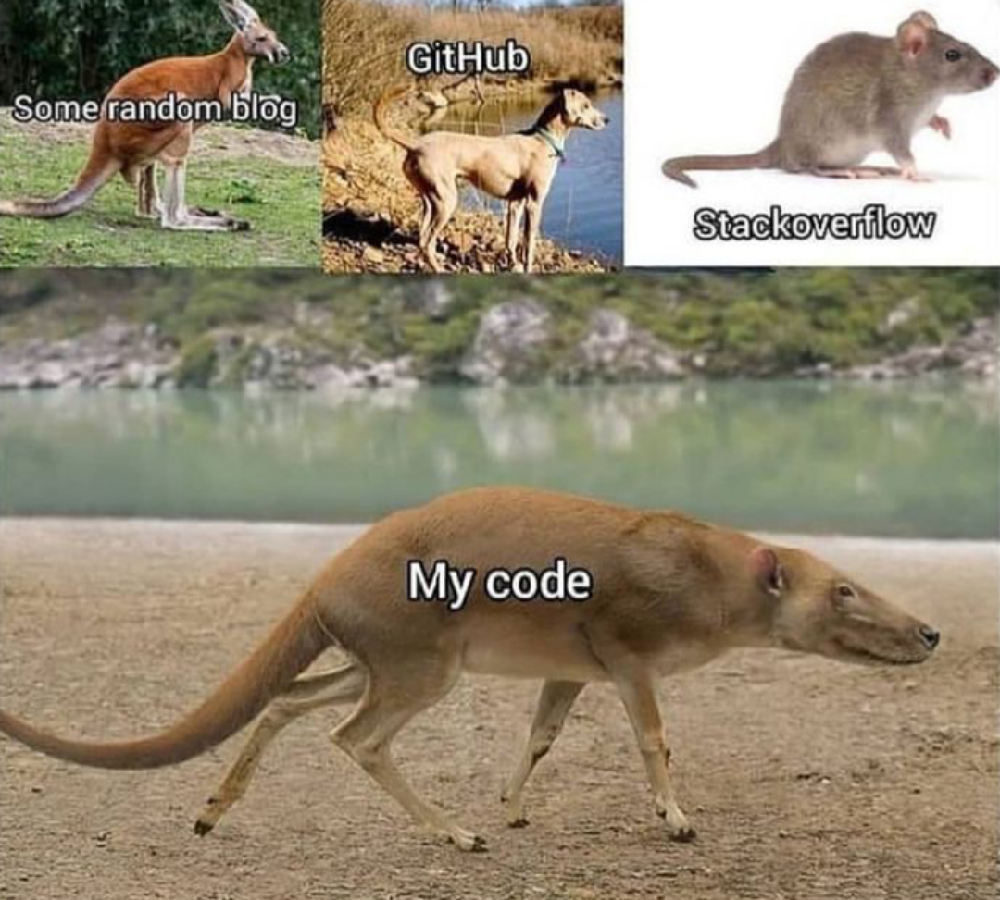

```{r setup, include=FALSE}
library(learnr)
knitr::opts_chunk$set(echo = FALSE)
```

## Inhalt

kurze Beschreibung des Inhalts

Verortung auf der Roadmap

## Lernziele

kleine Checkliste mit abhakbaren Checkboxen:

-   <input type="checkbox" unchecked> Wie verschiedene Überschriften
    gerendert werden </input>
-   <input type="checkbox" unchecked> farbige HTML-Boxen </input>
-   <input type="checkbox" unchecked> HTML-Tag für Absätze </input>
-   <input type="checkbox" unchecked> ausklappbare Abschnitte </input>
-   <input type="checkbox" unchecked> LaTex </input>

## Kapitelüberschrift

Normalerweise steht hier im Tutorial dann der Inhalt, in beliebig viele
##-Level-2-Header unterteilt. Jede ##-Überschrift entspricht einem
Kapitel in learnr.

Level 1 Header verhalten sich nicht so gut, deswegen bitte nicht
verwenden.

### Level 3 Überschrift

#### Level 4 Header

##### Level 5 Header

###### Level 6 Header

## HTML-Stuff

Im ganzen .Rmd-Dokument können rohe HTML-Tags verwendet werden, und es
gibt CSS in einer extra Datei. Hier eine Auswahl:

### Absätze

RMarkdown ermöglicht keine vertikalen freien Flächen, die die länger als
eine Zeile sind

Hier drüber ist also 1 Absatz. Will man mehr Platz, kann man `</br>`
verwenden um Absätze zu generieren.

</br> </br>

voila

### momentan mögliche CSS-Klassen für farbige Boxen:

`::: klasse` ist ein shortcut für `<div, class=klasse>`

::: aufgabe
Für Aufgabenbeschreibungen
:::

</br>

::: aufgaberstudio
Für Aufgaben, die nicht im Tutorial, sondern in Rstudio gelöst werden
sollen
:::

</br>

::: infobox
hellblaue Box für advanced content (zusatzwissen, oft mit einem \*
gekennzeichnet)
:::

</br>

::: blau-nb
Infobox ohne blauen Rand
:::

</br>

::: gelb
hellgelbe Box im sinne von "Achtung!"
:::

</br>

::: vorteile
grüne Box
:::

</br>

::: nachteile
rote Box
:::

</br>

::: grau
graue Box
:::

</br>

::: grau-nb
graue Box ohne dunklen Rand, fast nicht sichtbar auf weiß
:::

### ausklappbare Abschnitte

verwende ich oft in Kombination mit einer Infobox für advanced Themen
mit Sternchen.

<details>

<summary><a>▼ \* Überschrift</a></summary>

::: infobox
Abgefahrene Formel:

$$
\infty + \infty = \infty
$$
:::

</details>

</br>

Achtung! der Pfeil nach unten ▼ muss manuell immer neben der Überschrift
eingefügt werden.

## LaTex

Im ganzen Dokument können rohe LaTex-Tags verwendet werden. Hier die
wichtigsten:

### Inline Math

Hier ist ein Summenzeichen: $\sum_{n=1}^i$

### Display Math

Hier ist ein Summenzeichen: $$\sum_{n=1}^i$$

### Align

```{=tex}
\begin{align*}
1 &= 1 \\
1 &= 1 + 0 + 0
\end{align*}
```
## Bilder

### `width`-Attribut

```         
{width=100%}
```

Der wichtige Teil ist das \`{width=100%}. Dabei steht der Prozentwert
für "% des Browserfensters" und kann jede beliebige Zahl von 1-100 sein.
Das heißt, wenn das Fenster vergrößert oder verkleinert wird durch
Nutzende ändert sich auch die Größe des Bilds. Das heißt, es wird z.B.
auch auf Mobilgeräten richtig angezeigt.

Ohne dieses kleine HTML-Attribut in `{}` wird das Bild je nach Auflösung
manchmal riesig angezeigt und passt nicht auf die Seite.

Die `{}` müssen ohne Leerzeichen direkt nach dem Bild folgen.

{width="80%"} Das
obige Bild hat 80% Breite, was manchmal ein netter Wert ist.

Bei 100% kann man den unteren Teil nicht mehr sehen, weil es dann
vertikal zu lang ist.

Bei 50% wird es zu winzig um es auf einem Handy zu erkennen (halbe
Bildschirmbreite).

### Ordner

Der `images` Ordner muss immer genau so heißen und sich auf der gleichen
Ebene wie die `.Rmd`-Datei des Tutorials und dem `css`-Ordner des
Tutorials befinden. Alle Bilder befinden sich im `images` Ordner.

### Gifs

Es funktionieren auch GIFs:


Hier ist die Auflösung so gering, dass es nicht Gefahr läuft, die ganze
Seite zu blockieren.

## Code Chunks

Da die Code Chunk-Sache etwas tricky ist, ist hier eine Ergänzung zur
`learnr`-Dokumentation.

### Exercises

Es gibt Exercise-Code-Chunks und "normale" Code Chunks.

Exercises werden gekennzeichnet durch die Chunk-Option
`exercise = TRUE`. Zusätzlich können noch viele weitere Optionen
spezifiziert werden:

-   `exercise.setup` (Siehe Exercise-Setup-Chunks)
-   `exercise.cap` Einen Titel für die Exercise
-   `exercise.lines` Die Fenstergröße der Exercise

Alle Exercise-Code-Chunks haben ihr eigenes Environment und sind somit
unabhängig vom normalen Environment. Der einzige Punkt, wo Code für das
normale Environment und alle Code Chunks gleichzeitig gilt, ist der
globale Setup-Chunk ganz zu Beginn eines Tutorials.

### Tipps und Lösungen

```{r ex0, exercise = TRUE, exercise.cap = "Übung 0"}

```

```{r ex0-hint-1}
# Tipp 1
```

```{r ex0-hint-2}
# Tipp 2
```

```{r ex0-solution}
# Lösung
```

Leider wird die Lösung nicht als solche gekennzeichnet oder von den
Tipps differenziert, wenn sowohl Tipps als auch Lösung da sind.

#### Markdown Hints

Es ist auch möglich, Tipps als Markdown zu formatieren. Dafür werden sie
in ein `<div>` gepackt mit `id=...-hint`, wie bei den Code-Chunk-Hints.

Aber Achtung! Stand jetzt wird dann ein möglicher "-solution"-Chunk
nicht mehr angezeigt, sondern nur noch der Markdown Hint. Und es kann
nur einen Hint geben, nicht mehrere.

Diese Funktion wird eventuell in Zukunft entfernt, und Markdown Hints
werden in `-hint`-Codeblöcken möglich sein. Deswegen sollten wir diese
Markdown-Hints vielleicht eher weniger verwenden.

```{r ex0_5, exercise = TRUE, exercise.cap = "Markdown Hints"}

```

```{r ex0_5-solution}
# Diese Lösung wird nie angezeigt
```

::: {#ex0_5-hint}
**Tipp**

-   a
-   b
-   c
:::

### Globaler Setup-Chunk

Ist immer daran zu erkennen, dass er einfach nur "setup" heißt. Siehe
ganz oben in diesem Tutorial.

Dort können Pakete geladen werden und Default-Werte für Chunk-Optionen
spezifiziert werden. Zum Beispiel setzt
`knitr::opts_chunk$set(echo = FALSE)` als Default-Wert `echo = FALSE`
für alle Chunks.

Die Pakete die dort geladen werden, werden dann auch als Abhängigkeiten
für das Tutorial aufgefasst und User werden aufgefordert, diese
installieren zu lassen, wenn sie das Tutorial starten.

### Tutorial-Setup-Chunks

Da die Exercise-Chunks alle ihr eigenes Environment haben, und lediglich
vom globalen Setup-Chunk erben, ist es oft nötig eigene Setup-Chunks für
die Exercises zu erstellen.

#### Setup-Chunk über "-setup" Suffix

Es ist hilfreich, sich diese Sektion sowohl im Quellcode als auch im
Tutorial gerendert anzusehen.

```{r ex1-setup}
x <- 5
```

```{r ex1, exercise = TRUE, exercise.caption = "Übung 1"}
x
```

Der Exercise-Code-Chunk heißt "ex1", und wenn ein anderer Code-Chunk
diesen Namen plus den Suffix "-setup" verwendet, wird er automatisch als
Setup-Code-Chunk für den Exercise Chunk ausgewertet und *erscheint
dadurch auch nicht im globalen Environment*.

Das heißt, wenn Sie `x` in einen normalen Code Chunk ohne
`exercise = TRUE` aufrufen möchten, müssten Sie es vorher noch mal
definieren. Das ist nicht intuitiv, weil "ex1-setup" kein
`exercise = TRUE` enthält, und trotzdem auch nicht im normalen
Environment erscheint.

```{r, echo = TRUE}
try(x)
```

Hier wird ein Fehler erzeugt, da `x` nicht im normalen Environment
definiert wurde. (Ich verwende `try()`, damit das Tutorial-Rendering
nicht wegen der Fehlermeldung angehalten wird.)

Auch ein neuer Code Chunk ohne weiter Setup-Optionen würde `x`
logischerweise nicht finden.

```{r ex2, exercise = TRUE, exercise.caption = "Übung 2"}
x
```

#### Setup-Chunk über Namen

Ein Weg, einen geteilten Setup-Chunk zu erstellen für mehrere Exercises,
ist die Chunk-Option `exercise.setup`.

Bei `exercise.setup` kann jeder namentlich benannte Code-Chunk angegeben
werden, egal ob es ein "-setup"-Chunk für andere Tutorials ist oder
nicht. Es gilt wieder das Gleiche wie vorher: *Ergebnisse des
Setup-Chunks sind nicht im normalen Environment verfügbar.*

```{r ex3, exercise = TRUE, exercise.caption = "Übung 3", exercise.setup = "ex1-setup"}
x
```

```{r ex3-solution}
y <- 1
```

Eine Besonderheit gibt es aber: ein "-solution"-Chunk kann nicht
gleichzeitig Setup-Chunk und Lösung sein. Dieser Chunk (3.5) verwendet
die Lösung von Übung 3 als Setup, und dadurch wird bei Übung 3 kein
Lösungsknopf mehr angezeigt. Deswegen sollten Lösungs-Chunks nicht als
Setup-Chunks verwendet werden.

```{r ex3_5, exercise = TRUE, exercise.caption = "Übung 3.5", exercise.setup = "ex3-solution"}
y
```

#### Verkettete Setup-Chunks

Es gibt die Möglichkeit, in Setup-Chunks einen vorherigen Setup-Chunk
mit einzubeziehen über die Chunk-Option `exercise.setup`. Also
`exercise.setup` kann nicht nur in Exercise-Chunks verwendet werden,
sondern auch in Setup-Chunks!

```{r a}
x <- 5
```

```{r b, exercise.setup = "a"}
z <- 1
```

```{r ex4, exercise = TRUE, exercise.setup = "b", exercise.caption = "Übung 4: Chained Setup Chunks"}
z # Aus Setup-Chunk "b"
x # Aus Setup-Chunk "a"

c <- x + z # neuer Code
c
```

Auch Exercise-Chunks können in die Setup-Chain eingebunden werden, aber
es gilt dann nur das, was schon vorausgefüllt als Code drin steht, nicht
das, was User hineinschreiben.

```{r ex5, exercise = TRUE, exercise.setup = "ex4", exercise.caption = "Übung 5: Chained Setup mit Übung 4"}
c # Aus Übung 4
z # Aus Setup-Chunk "b"
x # Aus Setup-Chunk "a"
```

(Das ist meist nur dann nützlich, wenn die Lösung bereits in der
Exercise vorausgefüllt ist wie im Fall von "Übung 4", es also eigentlich
nur Demo ist und keine Aufgabe für die User). In den meisten Fällen
möchte man die Lösung ja nicht hineinschreiben.

Dafür ist Stand jetzt die einzige Option, für aufeinander aufbauende
Übungen die Lösung sowohl in einem "-solution"-Chunk unterzubringen, als
auch in einem verketteten Setup-Chunk.

```{r ex6, exercise = TRUE, exercise.setup = "ex4", exercise.caption = "Übung 6"}
# Aufgabe: Definiere d als c + 1

```

```{r ex6-solution}
d <- c + 1
# Lösung zum Anzeigen lassen durch User
```

```{r d, exercise.setup = "ex4"}
d <- c + 1
# Lösung als Setup Chunk für "ex7".
```

```{r ex7, exercise = TRUE, exercise.setup = "d", exercise.caption = "Übung 7: Enthält die korrekte Lösung von Übung 6"}
d
```

Obwohl `d` nicht gegegen ist in Übung 5, kennt Übung 7 `d`, da wir einen
extra Setup-Chunk dafür in die Kette eingefügt haben. Um für Übung 5
auch den Lösungsknopf anzuzeigen, ist es nötig, noch einen Extra
Lösungs-Chunk zu haben, der nicht Setup-Chunk sein darf. Da gibt es also
eine Dopplung, die sich Stand jetzt aber nicht elegant vermeiden lässt.
Es wird anscheinend als Bug anerkannt und daran gearbeitet, siehe
[learnr Issue #548](https://github.com/rstudio/learnr/issues/548).

Für mehr Infos für Hintergründe der Entstehung von Chained Setup Chunks:
[learnr Issue #72](https://github.com/rstudio/learnr/issues/72).

## Abschlussquiz

**Wichtig:** Argument setzen: `allow_retry = TRUE`


```{r Abschlussquizz}
quiz(caption = "Teste dein Wissen!",

learnr::question_checkbox("Was hast du über die Maße der zentralen Tendenz gelernt?",
         answer("Der Median ist das Zentrum einer sortierten Datenmenge und weniger anfällig für Ausreißer.", 
                 correct = TRUE,
                 message = "Richtig! Der Median ist robust gegenüber Ausreißern."),
         answer("Der Median ist der Wert, der am häufigsten in einer Datenmenge vorkommt.",
                 message = "Der Modus nicht der Median repräsentiert den am häufigsten auftretenden Wert."),
         answer("Das artihmetische Mittel ist die Summe aller Werte geteilt durch die Anzahl der Werte.",
                 correct = TRUE,
                 message = "Genau, der Mittelwert wird durch die Summe der Werte geteilt durch ihre",
                 "Anzahl errechnet."),
         allow_retry = TRUE,
         random_answer_order = TRUE
         ),

learnr::question_radio("Welches Maß der zentralen Tendenz eignet sich für eine metrisch skalierte Variable mit großen Ausreißerwerten?",
         answer("Der Modus.",
              message = "Du könntest auch den Modus für diese Variable bestimmen,",
              "aber du möchtest ja die eine Zahl finden, die deine Daten mit den geringsten Abweichungen",
              "beschreibt. Dafür die lediglich häufigste Ausprägung zu verwenden wäre also nicht zielführend."),
         answer("Der Median.",
              correct = TRUE,
              message = "Richtig, der Median eignet sich gut dafür ein Maß der zentralen Tendenz zu bestimmen,",
              "dass gegen Ausreißer robust ist."),
         answer("Das artihmetische Mittel.",
              message = "Das arithmetische Mittel gibt uns für Variablen OHNE Ausreißer eine gute",
              "Zusammenfassung unserer Daten, aber bei großen Ausreißern ist es anfällig für Verzerrungen."),
         allow_retry = TRUE,
         random_answer_order = TRUE
         ))
```


## Learnings

So hast du heute abgeschnitten:

```{r context="server"}
# Shiny App um die Anzahl richtig beantworteter Fragen anzuzeigen. 
# Funktioniert in jedem Tutorial

shiny::observeEvent(
  input$get_score, 
  {
    objs2 = learnr:::get_tutorial_state()
    
    # Number of correct questions
    
    n_correct <- 
      # Access the $correct sublist item in each list item
        lapply(objs2, purrr::pluck, "correct") |>
           # make it a vector containing: TRUE and FALSE and NAs
           # NA is appearing for list items which don't have
           # a $correct subitem
                unlist() |> 
           # Taking the sum of a logical Vector returns the number of TRUEs
                sum(na.rm=TRUE)
    
    # Number of total questions
    
    total_questions <- 
      # 1. Access $type in each list item and make it a vector of types
      lapply(objs2, purrr::pluck, "type") |> unlist()
    
    # 2. Count the number of "question" in that vector
    total_questions <- total_questions[total_questions == "question"] |> 
      length()
      
      
    output$score = shiny::renderText(
      paste0(n_correct, " von ", total_questions,
        " im gesamten Tutorial beantworteten Fragen waren richtig.")
)
    invisible()
  }
)
```

```{r score, echo=FALSE}
shiny::br()
shiny::actionButton("get_score", "Auswertung!")
shiny::br()
shiny::br()
shiny::textOutput("score")
shiny::br()
```


### Zusammenfassung

Hier ein kleiner Text, was gelernt wurde und vlt. auch warum das wichtig ist.

### Diese neuen Konzepte kennst du nun:
-     Stichpunktartige Beschreibung

### Neue Funktionen
eine Tabelle mit den wichtigesten Codes des Tutorials
| Code           | Beschreibung                           |
|----------------|----------------------------------------|
| `[ ]`          | Indizierung                            |
| `&`            | UND-Operator für logische Indizierung  |

## Credit
<!-- vielleicht in diese Richtung? -->
Dieses Tutorial wurde (größtenteils) von Lukas Bruelheide sowie in Teilen von Marie Klosterkamp geschrieben. 

ggf.: Bei der Erstellung (u.a. der Beispiele, Aufgaben und Zusammenfassung) wurde teilweise von ChatGPT gebrauch gemacht.
