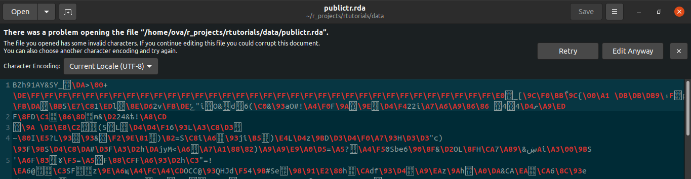

```{r setup, include=FALSE}
library(learnr)
knitr::opts_chunk$set(echo = FALSE)

# data
publictr <- rtutorials::publictr

```

## Inhalt

In diesem Tutorial stellen wir euch die Roadmap des wissenschaftlichen
Prozesses vor, an der wir alle weiteren Tutorials orientieren.

::: aufgaberstudio
**Aufgabe:**\
Kopiere bitte folgenden Code in deine Konsole und drücke `Enter`:

```{r pakete_installieren, message=FALSE, echo = TRUE}
if (!require("haven")) 
install.packages("haven")

if (!require("car")) 
install.packages("car")

if (!require("psych")) 
install.packages("psych")

if (!require("mice")) 
install.packages("mice")
```

(Hiermit werden automatisch Pakete installiert, die für dieses und die
nächsten Tutorials gebraucht werden. Wenn ihr sie schon installiert
habt, passiert gar nichts.)
:::

## Lernziele

-   <input type="checkbox" unchecked> Ich kenne die Roadmap des
    wissenschaftlichen Prozesses und kann mich auf ihr orientieren
    </input>

## Wissenschaftlicher Prozess

Wir lieben Bilder, ihr liebt Bilder, hier gibt es Bilder:

{width="95%"}

Die gesamten Tutorials orientieren sich an der "Roadmap des
wissenschaftlichen Arbeitens". Sie soll euch zur Orientierung dienen und
für zukünftige eigene Projekte einen strukturierten Ablauf vorgeben.

Um es einfach zu halten, sind im Fließtext nur die allergröbsten
Orientierungspunkte. Da wir es sinnvoll fanden, euch an dieser Stelle
auch schon weitere Infos und Aufgaben zum Verständnis zu geben, gibt es
dafür die ausklappbaren Menüs. Diejenigen, die mit einem `*`
gekennzeichnet sind, sind wie in den anderen Tutorials vertiefendes
Extrawissen. Die anderen Ausklappmenüs halten wir für sehr sinnvoll.

::: gelb
Da wir euch quantitative Verfahren beibringen, bezieht sich die Roadmap
speziell auf quantitative Verfahren. Solltet ihr qualitativ Forschen
wollen, ändern sich die Schritte inhaltlich und ggf auch deren Abfolge
teilweise.
:::

### I) Vorarbeit

Ja, ein Großteil des wissenschaftlichen Arbeitens geschieht vor dem, was
wir uns darunter Vorstellen: Mit Laborkittel und Lupe im Labor stehen
und bunte Flüssigkeiten ineinander mixen...

Die Überschriften in Klammern sind zwar zentrale Bestandteile dieses
Prozesses, doch sie sind weder Teil der Vorlesung, noch eurer kleinen
Forschungsarbeit in diesem Modul, deswegen gehen wir nicht weiter darauf
ein. Nichtsdestotrotz wollen wir ihren elementaren Stellenwert in diesem
Prozess berücksichtigen.

#### 1. Einarbeiten

Jede gute (wissenschaftliche) Arbeit braucht eine gute Vorarbeit: Ein
Einlesen in die Matrie, sich mit dem Feld vertraut und neue Gedanken
machen: was gibt es schon? was braucht es noch? Was kann/ möchte ich
beitragen?

#### 2. Fragestellung

Wenn mensch einen guten Überblick über das interessierende
Forschungsfeld hat wird im nächsten Schritt eine konkrete Fragestellung
entwickelt: Was GANZ GENAU möchte ich untersuchen?

#### 3. Operationalisierung der Variablen

Und WIE genau möchte bzw. kann ich das untersuchen?\
Ganz konkret: Wie kann ich das, was mich interessiert, in Zahlen oder
Kategorien bringen?

Hier wird auch das Abbruchkriterium festgelegt: Nach wie vielen
Beobachtungen/ Zeiteinheiten etc. wird die Datenerhebung abgebrochen?
(Meist nach Personenanzahl berechnet.)

#### 4. Konkrete, testbare Hypothesen aufstellen

Was genau möchte ich untersuchen?

#### (5. Ethikantrag)

#### (6. Aquirierung von Geldern)

#### (7. Präregistrierung)

### II) Messen / Generieren von Daten

#### 1. Vorbereitung

Hier werden, je nach dem Forschungsdesign vorbereitungen getroffen:

-   Online-Fragebögen werden ins Netz gestellt und verschickt
-   Pen & Paper Fragebögen werden designed und ausgedruckt
-   Die Aquirierung von Teilnehmenden
-   etc.

#### 2. Erhebung

Der Teil, bei dem euch auf dem Campus Süßigkeiten für Studienteilnahmen
angeboten werden (als Teilnehmende Person).\
Für die Forschenden Personen ist dieses der Teil, in dem sie Umfrage
durchführen, Einheiten (bspw. Fahrräder am Campus) zählen oder messen,
wie lange eine Person für eine bestimmten braucht. Das wird so lange
gemacht, bis das Abbruchkriterium (eine bestimmte Personenanzahl)
erreicht ist.

### III) Datenaufbereitung

Um ehrlich zu sein: Der ätzenste und gleichzeitig wichtigste Schritt des
ganzen Prozesses. Hier bringt ihr die Daten aus der vorhandenen in eine
verarbeitbare Form. Das konkrete Vorgehen hängt stark von den
vorliegenden Daten ab. Deswegen treffen nicht alle der folgenden
Schritte auf jedes Projekt zu.

#### 1. Digitalisieren

Wenn ihr die Daten analog gesammelt habt (Pen & Paper Umfrage, zählen
von Fahrrädern auf dem Campus etc.) müssen diese erstmal in eine für den
Computer lesbare Form gebracht werden: Sie werden digitalisiert!\
Es gibt Möglichkeiten, sie direkt in R zu schreiben, das bringt aber
keinen Spaß. Die eleganteste Version ist, sie in Excel oder Open Office
in eine Tabelle zu schreiben und diese dann zu speichern.

<details>

<summary><a>▼ \* Hilfreiche Aspekte bei der Digitalisierung in Excel
</a></summary>

::: infobox
Damit R später gut mit den Daten umgehen kann und keine Fehler oder
fehlenden Werte liest, ist es ratsam, auf ein paar zentrale Punkte zu
achten:

1.  **Sortierung**: Jede Spalte ist eine Variable, jede Zeile eine
    Beobachtungseinheit, jede Zelle ein Wert!
2.  **Datenformatierung**: Stelle sicher, dass die Daten korrekt
    formatiert sind. Dies bedeutet, dass numerische Werte als Zahlen zu
    formatieren (achte auch auf Dezimaltrennzeichen), Datumsangaben als
    Datumswerte usw. Bleibe dabei so grundlegend wie möglich und
    vermeide spezielle Zeichen oder Formatierungen, die zu Problemen
    führen könnten.
3.  **Spaltenüberschriften**: Verwende klare, kurze (am besten 1 Wort)
    und aussagekräftige Spaltenüberschriften. Diese werden als
    *Variable-Namen* verwendet, wenn die Daten in R eingelesen werden.
    Vermeide dabei Sonderzeichen, Leerzeichen und andere Zeichen, die in
    R nicht als gültige Variablennamen verwendet werden können. Wenn du
    die Datei als CSV (s.u.) speichern möchtest (du möchtest sie als CSV
    speichern!), achte darauf, dass die Spaltenüberschriften in der 1.
    Zeile sind und NUR in der ersten Zeile.
4.  **Inhalte**: Auf das Datenblatt kommen *NUR* die Variablen. (Jede
    Spalte ist eine Variable, Jede Zeile eine Beobachtung/ Person!) Für
    die genauere Beschreibung der einzelnen Variablen (z.B. die
    konkreten Fragen etc.) nutze eine *eigene Datei*.
5.  **Leere Zellen und fehlende Werte**: Beachte, wie du leere Zellen
    und fehlende Werte behandeln möchtest. In R werden fehlende Werte
    oft mit "`NA`" repräsentiert. Achte darauf, *konsistent* mit
    fehlenden Werten umzugehen, um spätere Analysen nicht zu
    beeinträchtigen.
6.  **Textkodierung**: Wenn die Daten Text enthalten (z.B. bei
    kategorischen Variablen), achte darauf, die richtige Textkodierung
    zu verwenden. `UTF-8` ist eine gängige Textkodierung, die sowohl in
    Excel als auch in R unterstützt wird. (Hier kann es noch Probleme
    mit den verschiedenen Betriebssystemen geben. Für eine Vertiefte
    Betrachtung bitte unter [Wikipedia])
7.  **Speichern / CSV-Format**: Speichere die Daten am besten im `.csv`
    (Comma-Separated Values) Format. CSV ist ein einfaches Textformat,
    das von R problemlos eingelesen werden kann.
8.  **Spaltennamen in der ersten Zeile**: Nochmal, denn es ist wirklich
    wichtig: Wenn Du das CSV-Format verwendest, stelle sicher, dass die
    erste Zeile die Spaltenüberschriften enthält. Dies erleichtert das
    Einlesen der Daten in R.
9.  **Speicherort**: Merke dir den den Speicherort der Datei, in der du
    die Daten gespeichert hast. Du benötigen diesen Pfad, um die Daten
    in R einzulesen. Noch besser: lege in deinem R-Projekt einen Ordner
    namens "`data`" an. Dort kannst du alle Datensätze für das Projekt
    speichern und dann ist der Pfad zu den daten immer
    `"data\datensatz.csv"`
10. **Datumsformate**: *Spoiler*: In jedem Fall / jedem Programm sind
    Datumsangaben pain in the ass. Um es handhabbar zu halten achte
    dabei auf Folgendes: Stelle sicher, dass Datumsangaben im richtigen
    Format erfasst werden. In Excel könnten Datumsangaben je nach Region
    unterschiedlich formatiert sein (z. B. `MM/DD/YYYY` oder
    `DD.MM.YYYY`). Stelle sicher, dass Du das richtige Format
    verwendest, das später in R interpretiert werden kann.

{width="25%" style="display:block; margin:auto;"}
:::

</details>

#### 2. Datenimport

Als nächstes wird der (digitalisierte) Datensatz in R eingelesen.

<details>

<summary><a>▼ \* Übersicht über Datenformate </a></summary>

Zuerst brauchen wir ein grundlegendes Verständnis davon, wie Daten für R
aussehen:

{width="95%" style="display:block; margin:auto;"}
{width="95%" style="display:block; margin:auto;"}
{width="95%" style="display:block; margin:auto;"}

Oben seht ihr ein und denselben Datensatz in drei verschiedenen Formaten
und wie er aussieht, wenn er nicht in R eingelesen ist.

1.  **CSV (Excel)**: Ergibt einigermaßen Sinn für unser menschliches
    Auge.
2.  **RDA (R)**: Viele nicht lesbare Zeichen. Ist binär und enthält
    spezifische Informationen für R.
3.  **SAV (SPSS)**: Hier wirds richtig crazy für uns: Das ist eine
    Mischung aus binär-Code und Metainformationen, die nur SPSS
    entschlüsseln kann.

Zum Glück müssen wir uns damit nicht weiter auseinander setzen. Es
reicht, dass ihr das einmal gesehen habt.

Wie ein und der selbe Code je nach Sprache schon für uns Menschen
unterschiedlich aussieht, geht es auch R. Um Daten in R einzulesen,
brauchen wir verschiedene Befehle. Quasi um R zu sagen, welche
Übersetzungsprozesse R machen muss, um die Daten lesen und für uns
Menschen verständlich anzeigen zu können.

</details>

<details>

<summary><a>▼  Und deren Import **(mit Aufgabe)**</a></summary>

Alle Datensätze, die wir in dieser gesamten Veranstaltung verwenden, hat
Lukas netterweise direkt ins Paket eingebunden, das heißt, ihr müsst für
die Tutorials und Abgaben gar nichts tun, da die Daten bereits
eingelesen sind. Um R eine Orientierung zu geben, welchen Datensatz ihr
verwenden wollt tippt folgendes: `rtutorials::datensatz`\
Sobald ihr das warme Nest dieses Tutoriums verlasst, werdet ihr
allerdings mit anderen Datenformaten konfrontiert sein. Desewgen wollen
wir euch die drei wichtigsten Befehle mit auf den Weg geben:

1.  CSV: `daten <- read.csv("data/datensatz.csv")`
2.  RDA: `daten <- load("data/datensatz.rda")`
3.  SAV: `daten <- haven::read_sav("data/datensatz.csv")`

::: aufgaberstudio
**Aufgabe:**\
Lies den Datensatz `publictr.rda` aus dem Ordner `data` in dein Skript
zu dieser Veranstaltung ein.\
(Du könntest auch einfach `rtutorials::publictr` nutzen. Für
Übungszwecke gehen wir aber hier den längeren Weg.)
:::

</details>

<details>

<summary><a>▼ \* Was passiert in dem Code? </a></summary>

-   `data`: Zuerst erstellen wir ein Objekt, dass wir in diesem Fall
    `data` nennen. Bis jetzt ist es wie eine leere Box.
-   `<-`: Dann sagen wir R, das es was in die Box tun soll. Das ist eine
    sehr einfache Funktion.
-   `load()`: Auch das ist eine Funktion, es läd einen `rda` Datensatz.
-   `"data/publictr.rda"`: Der Datensatz (`"publictr.rda"`) und wo er
    liegt (`"data/"`)

Also nochmal in langsam und zum mitschreiben. Wir sagen zu R: Gehe bitte
diesen Weg (`"data/"`) und nimm diesen spezifischen, dort gespeicherten
Datensatz (`"publictr.rda"`) und lade ihn ein (`load()`). Dann speichere
ihn im Arbeitsspeicher (`<-`) unter diesem Namen (`data`).

</details>

<details>

<summary><a>▼ \* Bennenung von Datensätzen </a></summary>

Im Grunde ist es echt egal, wie ihr eure Datensätze in R nennt.

Es gibt klassischerweise zwei Heransgehensweisen: sehr allgemein `data`
oder sehr spezifisch den Namen, also `publictr`.

**Verwendung von "data":** - Vorteile: - *Allgemeiner Begriff:* Der Name
"data" ist ein allgemeiner Begriff, der leicht zu merken (und tippen)
ist. - *Einfachheit:* Die Verwendung von "data" kann den Code einfach
halten, da der Name kurz und prägnant ist. - *Wiederverwendbarkeit:* Da
"data" so allgemein ist, könnte der Name für verschiedene Arten von
Datensätzen verwendet werden.

-   Nachteile:
    -   *Verwechslungsgefahr:* Da "data" ein häufig verwendetes Wort
        ist, könnten Verwechslungen oder Konflikte mit anderen
        Variablennamen und Argumenten in Funktionen auftreten.
    -   *Mangelnde Beschreibung:* Der Name "data" gibt keine Hinweise
        auf den Inhalt oder Zweck des Datensatzes, was zu Verwirrung
        führen könnte.
    -   *Kollisionen:* Wenn mehrere Datensätze "data" heißen, könnte es
        zu unerwarteten Konflikten führen.

**Verwendung von "publictr":** - Vorteile: - *Spezifizität:* Der Name
"publictr" ist spezifisch und weist auf den Inhalt des Datensatzes
hin. - *Vermeidung von Verwechslungen:* Ein spezifischer Name wie
"publictr" kann Verwechslungen mit anderen Variablennamen reduzieren. -
*Kontextbetonung:* Der Name kann den Fokus auf den Kontext des
Datensatzes legen.

-   Nachteile:
    -   *Mögliche Überkomplexität:* Sehr spezifische Namen könnten zu
        lang oder komplex werden und das Schreiben von Code erschweren.
    -   *Mögliche Vergessenheit*: Ein komplexer Name wie "publictr"
        könnte schwer zu merken sein, insbesondere wenn er selten
        verwendet wird.
    -   *Eingeschränkte Wiederverwendbarkeit:* Ein sehr spezifischer
        Name macht das kopieren von Code fürs nächste Projekt
        anstrengender.

</details>

#### 3. Datenaufbereitung / Cleaning

Jetzt kommt der Teil, der meistens lange dauert, in der Lehre häufig
übersprungen wird und ganz objektiv am wenigsten Spaß macht: Die Daten
müssen aufbereitet werden. Und gleichzeitig: wer sich hier Zeit lässt
und sauber arbeitet hat später keine oder zumindest kaum Probleme bei
der Analyse. Wenn dieser wichtige Schritt abgeschlossen ist, kann der
Spaß losgehen.

Um einen Eindruck zu bekommen, wie sowas aussehen kann, kannst du dir
das
[Skript](https://github.com/statistik-lehre/rtutorials/blob/main/data-raw/publictr.R)
ansehen, in dem der `publictr` Datensatz aufgeräumt wird.

<details>

<summary><a>▼  Cleaning für dieses Tutorial </a></summary>

Für das Beispiel in diesem Tutorial brauchen wir auch ein bisschen
cleaning. Das machen wir jetzt zusammen. Für mehr und ausführlicher
schaut gerne im folgenden Tutorial vorbei. Hier machen wir der
einfachehit halber nur das, was wir auch wirklich brauchen.

Wenn wir uns die Daten anschauen wird deutlich, dass die
Erhebungseinheiten sowohl die Einzelnen Verkehrsmittel beinhaltet als
auch deren Zusammenfassung. Das macht Analysen witzlos, da jetzt jede
Einheit doppelt vorkommt. Wir kreieren also einen neuen Datensatz, in
dem die Zeilen rausschmeiß, welche die anderen Einträge zusammenfassen.

```{r cleaning, echo = T, context = "setup"}
# Hier erstellen wir einen Index, in dem die position aller Beobachtungseinheiten
# gespeichert ist, welche NICHT "insgesamt" als Typ angegeben haben
index_to_keep <- which(!grepl("insgesamt", publictr$Typ))

# Jetzt erstellen wir einen neuen Datensatz, welcher nur die
# Einträge aus dem alten Datensatz OHNE "insgesamt" enthält
filtered_data <- publictr[index_to_keep, ]
```

<\details\>

### IV) Orientierung in den Daten

Jetzt, wo wir alle unsere Daten in R eingelesen und aufgeräumt haben,
wollen wir uns einen Eindruck verschaffen: Was haben wir da eigentlich
erhoben?

#### 1. Numerisch

##### a) Kompletter Datensatz

<details>

<summary><a>▼  Ein paar sehr nützliche Befehle, um sich einen Überblick
über den Datensatz als ganzes zu verschaffen **(mit Aufgabe)**
</a></summary>

-   `data`: Zeigt den Datensatz in der Konsole. Je mehr Variablen und
    Beobachtungseinheiten dieser Datensatz hat, desto unübersichtlicher
    wird die Geschichte. Zudem haben wir das gleiche Problem, wie im
    reinen R: sobald wir was neues rechnen rutschen die Infos für uns
    nach oben und wir scrollen uns dumm und dusselig. Viel praktischer
    wäre doch:
-   `View(data)`: Öffnet den kompletten Datensatz als klassische Tabelle
    in einem neuen Tab im Skript-Fenster. Das eignet sich am besten um
    ein gutes Gespür für den Datensatz zu bekommen und immer wieder
    darauf schauen zu können. Dann gibt es noch:
-   `head(data)`: Zeigt die ersten paar Zeilen eines Datensatzes
-   `car::some(data)`: Zeigt ein paar zufällige Zeilen des Datensatzes.
-   `names(data)`: Variablennamen
-   `ncol(data)`: Gibt die Anzahl der Spalten des Datensatzes an (=
    Anzahl der Variablen)
-   `nrow(data)`: Gibt die Anzahl der Zeilen des Datensatzes an (=
    Anzahl der Beobachtungseinheiten). Diese beiden eignen sich auch
    gut, um heraus zu finden, ob alles mit dem einlesen so geklappt hat,
    wie gewünscht.

::: aufgaberstudio
**Aufgabe:**

1.  Öffne `publictr` in einem neuen Fenster und mach dich mit der
    Tabelle vertraut.
2.  Wie heißen die Variablen?
3.  Finde heraus, wie viele Zeilen und Spalten `publictr` hat.
:::

<\details\>

##### b) Einzelne Variablen

<details>

<summary><a>▼  Aber auch inhaltlich interessieren uns die einzelnen
Variablen. **(mit Aufgabe)** </a></summary>

::: gelb
**Achtung**

**1.**\
Die Funktionen, welche sich mit NAs auseinandersetzen werden z.T. auch
schon für das cleaning gebraucht. Und viele der Funktionen lernt ihr in
ihren Einzelheiten auch in anderen Tutorials kennen, deswegen gehen wir
hier nicht ins Detail drauf ein. Und sonst gibt es ja auch immer die
Möglichkeit das Manual mittels `?funktion()` aufzurufen.

**2.**\
Viele der unten aufgeführten funktionen funktionieren nur, wenn keine
Daten fehlen. Wenn ihr euch bereits mit den Missings auseinandergesetzt
habt oder nur einen ersten Eindruck bekommen wollt, könnt ihr in vielen
der jeweiligen funktionen das argument `na.rm = T` setzen (na = NA/ not
available; rm = remove; T = TRUE/ ja, genau das will ich). Das könnte
dann so aussehen: `mean(data$variable, na.rm = T)`.
:::

-   `$`: Eine Variable in einem Datensatz wird mit einem `$`
    angesprochen. Das sieht dann so aus: `data$variable`
-   `sum(is.na(data$variable))`: Wie viele Werte fehlen in dieser
    Variable?
-   `sum(is.na(data))`: Wie viele Werte fehlen im Datensatz insgesamt?
-   `mice::md.pattern(data)`: Eine ganz zauberhafte Funktion, die etwas
    über die Struktur von fehlenden Daten aussagt. Wenn wir um die
    Systematik der Wissen gibt es unterschieldich komplexe
    Herangehensweisen. Wir brauchen erstmal nur die leichteste: Schau in
    deiner Tabelle (`View()`), ob du das Muster erkennst.
-   `mean(data$variable)`: Gibt den Mittelwert der Variable aus.
-   `sd(data$variable)`: Standardabweichung
-   `range(data$variable)`: Spannweite
-   `min(data$variable)`: Minimaler eingetragener Wert
-   `max(data$variable)`: Maximaler eingetragener Wert
-   `table(data$variable)`: Alle Werte des Vektors inklusive deren
    absolute Häufigkeit. Eignet sich besonders für nominal und ordinal
    (inkl. [Likert](https://de.wikipedia.org/wiki/Likert-Skala)
    skalierten Daten)
-   `psych::describe(data)`: Wendet die meisten der og. Funktionen und
    noch mehr für den kompletten Datensatz an. Feine Funktion, um eine
    schnelle Übersicht zu erhalten. (Variablen, die mit einem Sternchen
    versehen sind, interpretiert R als nominal.)
-   `summary(data)`: Ähnlich wie `describe()`, gibt zusätzlich noch die
    NAs mit an und dafür ein paar andere Verteilungsparameter (Schiefe
    und Wölbung) nicht.
-   `class(data$variable)`: Gibt die Klasse oder den Datentyp des
    R-Objekts an.
-   `typeof(data$variable)`: Gibt den internen Datentyp des Objekts an.
    -   Unterscheidung: `class()` sagt etwas darüber aus, wie R das
        Objekt speichert und liest. `typeof()` sagt etwas darüber, wie
        der Rechner das Objekt speichert und liest, also auf einer
        grundlegenderen Ebene. Darum zu wissen kann essentiell sein, da
        es manchmal der Grund ist, warum Funktionen nicht funktionieren.
        (Für alle, die es gerne ausführlicher und gleichzeitig noch
        verständlich lesen wollen gehts
        [hier](https://r-intro.tadaa-data.de/datentypen.html) entlang)

::: aufgabe
**Aufgabe**\
Schau dir den oben gesäuberten Datensatz `filtered_data` an und
beantworte folgende Fragen:

1.  Wie viele Werte fehlen in dem Datensatz insgesamt?
2.  Haben die fehlenden Werte ein Muster?
3.  Wenn ja, welches? Wie lässt sich das erklären?
4.  Wie viele Personen wurden im Durchschnitt transportiert?
5.  Mit welcher Standardabweichung?
6.  Was ist die minimale Anzahl an Personenkilometern?
7.  Was die maximale?
8.  Welche verschiedenen Typen von Transportmitteln wurden untersucht?
9.  In welchem Zeitraum wurden die Daten erhoben?
10. Welche Variablen sind für R nominal, welche numerisch?
:::

```{r IV1-solution}
sum(is.na(filtered_data))

?mice::md.pattern()
mice::md.pattern(filtered_data, rotate.names = T)

filtered_data
# In R Studio nehmt ihr hier bitte View(), das ist übersichtlicher und schöner

mean(filtered_data$Personen, na.rm = T)

sd(filtered_data$Personen, na.rm = T)

min(filtered_data$Personenkilometer, na.rm = T)

max(filtered_data$Personenkilometer, na.rm = T)

table(filtered_data$Typ)

table(filtered_data$Jahr)

psych::describe(filtered_data)
```

```{r IV1, exercise = TRUE}

```

<\details\>

Jetzt wo wir (über `View()`) die Ahnung haben, dass die NAs einem bestimmten Muster folgen, wollen wir uns das nochmal etwas genauer ansehen

```{r IV1_NAs}
# filtered_data zeigt einfach unseren Datensatz an
# durch die eckigen Klammern direkt dahinter sagen wir R, welche Daten wir genau aus dem Datensatz sehen wollen
# Das ansteuern geht so: daten[Zeilen, Spalten]
# wir sagen also: Nimm von unseren filtered_data folgende Zeilen mit allen Spalten (deswegen steht hinter dem Komma nichts mehr)
# cmplete.cases zeigt alle kompletten Fälle an, also alle Zeilen, die KEINE NAs beinhalten
# ! (Ausrufezeichen) ist eine VERNEINUNG, also werden uns alle NICHT VOLLSTÄNDIGEN Zeilen angezeigt
# das filtered_date IN dem complete.cases() Argument brauchen wir, weil R manchmal mehr Input braucht, als unser logischer Verstand das nachvollziehen kann.
filtered_data[!complete.cases(filtered_data), ]
```

Wir sehen, dass es zwei Gründe für die NAs gibt:
  
  1. Alle `Linienfernverkehr mit Omnibussen` Einträge in den Jahren 2013-2015 fehlen. Das kann ganz unterschiedliche Gründe haben. Hier gibt es verschiedene und valide Möglichkeiten, mit umzugehen. Wichtig ist nur, wie immer, die Entscheidung gut zu dokumentieren und begründen.
  2. ALLE Daten ab Quartal 2022/2 fehlen. Das deutet darauf hin, dass diese Zeilen schon erstellt aber noch nicht ausgefüllt wurden bzw. der Datensatz veröffentlicht wurde, bevor die bereits erstellten Zeilen ausgefüllt wurden. Das können wir getrost einfach rauslöschen.
  
In unserem Fall nutzen wir den Holzhammer: wir löschen alle Zeilen, in denen ein NA vorhanden ist. Das geht in diesem Fall, weil wir genau nachvollziehen können, warum welche Daten fehlen und wir verlieren dadurch auch keine Daten, weil ja alle interessanten Variablen leer sind. Wenn das NA Muster komplexer ist, bedarf es begründete Entscheidungen. 

```{r IV1_cleaning}
# wir speichern unsere Daten im selben Objekt wie vorher, bedeutet wir überschreiben die bereits vorhandenen Daten
# na.omit() schmeißt alle Zeilen raus, in denen ein einziges NA ist. Das ist nicht immer wünschenswert!
filtered_data <- na.omit(filtered_data)
```


#### 2. Grafisch (quick & dirty)

Die Breitbandverbindung in unser Gehirn sind und bleiben unsere Augen.
Deswegen ist an diesem Punkt des Prozesses eine grafische
Auseinandersetzung mit den Daten zwar nicht notwendig, aber sehr
hilfreich.

Dafür, wie für alle Grafiken brauchen wir `ggplot2`

**Disclaimer:** `%>%` kommt aus dem Paket `dplyr`, heißt ausgesprochen "Pipe" und gibt einen vorher benannten Datensatz innerhalb einer Funktion weiter. Das macht es häufig schöner und übersichtlicher

```{r IV2}
library(ggplot2)
library(dplyr)

# ZB. der Zusammenhang zwischen Quartal und beförderten Personen könnte uns interessieren
# dafür brauchen wir eine neue Variable, die Quartal als Zahl enthält. Ich erspare euch die Einzelheiten, führt die untenstehende Zeile einfach aus
filtered_data$quartal_dbl <- as.integer(substr(filtered_data$Quartal, start = nchar(filtered_data$Quartal), stop = nchar(filtered_data$Quartal)))

filtered_data %>% ggplot(aes(x = as.character(quartal_dbl), y = Personen)) +
  geom_boxplot()
# Es wird deutlich, dass die Menschen im 3. Quartal weniger Öffis fahren, als in den anderen Quartalen. Das ergibt total Sinn: Wahrscheinlich sind viele im Urlaub bzw. nutzen das Rad. Da wäre doch mal spannend zu schauen, ob sich das innerhalb der Beförderungsmitel unterscheidet:
filtered_data %>% ggplot(aes(x = as.character(quartal_dbl), y = Personen, color = Typ)) +
  geom_boxplot()

# Und tadaa: der Fernverkehr wird im dritten Quartal als einziges mehr.
# Das können wir noch deutlicher machen, indem wir einen neuen Vektor erstellen, der nur noch zwischen Nah- und Fernverkehr unterscheidet:
filtered_data$nah_fern <- ifelse(grepl("nahverkehr", filtered_data$Typ), "nah", ifelse(grepl("fernverkehr", filtered_data$Typ), "fern"))
filtered_data %>% ggplot(aes(x = as.character(quartal_dbl), y = Personen, color = nah_fern)) +
  geom_boxplot()
# Das ist was, was später in der Analyse spannend und wichtig sein könnte

# Des weiteren könnte uns der Verlauf über die Jahre interessieren
filtered_data %>%
  group_by(Jahr) %>%
  summarise(Summe_Personenkilometer = sum(Personenkilometer)) %>% 
  ggplot(aes(x = Jahr, y = Summe_Personenkilometer)) +
  geom_col()

# Huch? Was ist denn 2020 passiert??! Achja, Corona!
# Und dann noch mal nach Fortbewegungsmittel
filtered_data %>%
  group_by(Jahr, Typ) %>%
  summarise(Summe_Personenkilometer = sum(Personenkilometer)) %>% 
  ggplot(aes(x = Jahr, y = Summe_Personenkilometer, fill = Typ)) +
  geom_col(position = "dodge") +
  scale_fill_discrete()
# Hier sind sehr schön die fehlenden Werte bei den Omnisbussen 2013-2015 zu sehen. Das könnte auch eine Erklärung sein für den Sprunghaften Anstieg an Gesamtkilometern zwischen 2015 und 2016 - der Sprung sieht sehr viel größer aus, als in den anderen Jahren

# was uns noch interessieren könnte wäre der Zusammenhang zwischen der Anzahl der ausgewerteten Unternehmen und der Typ der Fortbewegung
filtered_data %>% 
  ggplot(aes(x = Typ, y = ausgewertete_Unternehmen)) +
  geom_boxplot() +
  scale_x_discrete(labels = function(x) gsub(" ", "\n", x))
# sehr schön zu sehen: für den nahverkehr mit omnibussen gibt es mit abstand die meisten erhobenen Unternehmen

```


#### 3. Numerisch (bisschen ausgiebiger)

#### 4. Voraussetzungen prüfen (langweilig & unerlässlich)

### V) Auswertung / Statistik

\###) VI) Schöne Visualisierungen

\###) VII) Report

## Abschlussquiz

## Learnings
